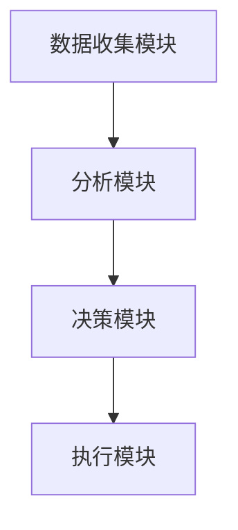

                 


# 霍华德·马克斯的逆向投资哲学：从理论到实践

> 关键词：逆向投资，霍华德·马克斯，价值投资，市场波动，安全边际

> 摘要：霍华德·马克斯的逆向投资哲学是一种独特且深刻的投资理念，它强调在市场低谷时买入，在市场高点时卖出，与市场情绪逆向而行。本文将从逆向投资的哲学基础、策略与方法、风险管理与组合优化、系统架构与实施，以及实际案例分析等多个角度，全面解析霍华德·马克斯的逆向投资哲学，并结合技术语言和系统架构的方式，深入探讨其背后的逻辑与实现。

---

## 第一部分：逆向投资的哲学基础

### 第1章：逆向投资的概述

#### 1.1 逆向投资的定义与背景

逆向投资是一种不同于传统投资的策略，它强调在市场情绪高涨时保持冷静，在市场恐慌时寻找机会。霍华德·马克斯作为逆向投资的代表人物，他的哲学基于以下几个核心观点：

1. **市场非理性**：市场情绪往往偏离理性，投资者容易受到市场波动的影响，产生过度乐观或悲观的情绪。
2. **价值与价格分离**：市场的价格波动与资产的内在价值并不总是同步，逆向投资者通过寻找价格低于内在价值的资产来获利。
3. **时间的重要性**：逆向投资强调长期持有，等待市场回归理性或资产价值被市场重新发现。

#### 1.2 霍华德·马克斯的投资理念

霍华德·马克斯的投资理念可以总结为以下几点：

1. **价值投资的核心**：寻找那些被市场低估的资产，尤其是那些在市场恐慌时被过度抛售的资产。
2. **逆市场情绪而行**：当市场情绪高涨时，马克斯倾向于卖出；当市场情绪低落时，他倾向于买入。
3. **长期视角**：逆向投资需要耐心等待，市场往往需要较长时间才能反映资产的真正价值。

---

## 第二部分：逆向投资的策略与方法

### 第2章：逆向投资的策略

#### 2.1 寻找低估的机会

逆向投资的核心在于寻找市场价格低于内在价值的资产。为了实现这一点，投资者需要：

1. **分析内在价值**：通过基本面分析，计算资产的内在价值，判断其是否被市场低估。
2. **识别市场恐慌**：通过观察市场情绪和资产价格的偏离程度，识别市场恐慌的时刻。

#### 2.2 评估安全边际

安全边际是逆向投资中一个重要的概念，它指的是市场价格与内在价值之间的差距。通过计算安全边际，投资者可以判断资产的投资价值。

安全边际的计算公式如下：

$$ \text{安全边际} = \text{内在价值} - \text{市场价格} $$

如果安全边际为正，说明资产被市场低估，具有投资价值。

---

### 第3章：逆向投资的执行策略

#### 3.1 动态调整投资组合

逆向投资并不意味着一成不变的投资策略。投资者需要根据市场变化动态调整投资组合。

1. **资产配置**：根据市场情绪和资产价值的变化，动态调整资产配置比例。
2. **仓位管理**：在市场恐慌时增加仓位，在市场高涨时减少仓位。

#### 3.2 风险管理

逆向投资虽然强调逆市场情绪而行，但并不意味着不考虑风险。投资者需要在逆向投资的过程中，注重风险管理。

1. **分散投资**：通过分散投资降低单一资产的风险。
2. **止损策略**：设定止损点，避免重大损失。

---

## 第三部分：逆向投资的系统架构与实施

### 第4章：逆向投资的系统架构

#### 4.1 系统功能设计

逆向投资的系统架构可以分为以下几个模块：

1. **数据收集模块**：收集市场数据，包括资产价格、市场情绪等。
2. **分析模块**：对数据进行分析，计算内在价值和安全边际。
3. **决策模块**：根据分析结果，生成投资决策。
4. **执行模块**：执行投资决策，调整投资组合。

#### 4.2 系统架构设计

以下是逆向投资系统的架构图：



---

## 第四部分：逆向投资的项目实战

### 第5章：项目实战

#### 5.1 环境安装

为了实现逆向投资策略，我们需要安装以下工具和库：

1. **数据源**：使用Yahoo Finance获取市场数据。
2. **数据分析工具**：使用Python的Pandas库进行数据分析。
3. **可视化工具**：使用Matplotlib进行数据可视化。

#### 5.2 核心实现

以下是Python代码示例：

```python
import pandas as pd
import numpy as np
import matplotlib.pyplot as plt

# 获取市场数据
data = pd.read_csv('market_data.csv')

# 计算内在价值
def calculate_intrinsic_value(data):
    # 示例：假设内在价值为资产价格的80%
    return data['Price'] * 0.8

# 计算安全边际
def calculate_margin_of_safety(data):
    intrinsic_value = calculate_intrinsic_value(data)
    return intrinsic_value - data['Price']

# 分析市场情绪
def analyze_market_sentiment(data):
    # 示例：通过价格波动率判断市场情绪
    volatility = data['Price'].std()
    if volatility < data['Price'].mean():
        return 'Bearish'
    else:
        return 'Bullish'

# 生成投资决策
def generate_investment_decision(data):
    sentiment = analyze_market_sentiment(data)
    margin_of_safety = calculate_margin_of_safety(data)
    if sentiment == 'Bearish' and margin_of_safety > 0:
        return 'Buy'
    elif sentiment == 'Bullish':
        return 'Sell'
    else:
        return 'Hold'

# 执行投资策略
def execute_investment_strategy(data):
    decision = generate_investment_decision(data)
    print(f"Investment Decision: {decision}")
```

#### 5.3 案例分析

以下是一个实际案例分析：

假设我们有一个资产的市场数据如下：

| Date   | Price | Intrinsic Value |
|--------|-------|----------------|
| 2023-01| 100   | 80             |
| 2023-02| 90    | 80             |
| 2023-03| 85    | 80             |

根据我们的模型，当市场情绪为熊市（`sentiment`为Bearish），且安全边际为正时，我们选择买入。

计算安全边际：

$$ \text{安全边际} = 80 - 85 = -5 $$

由于安全边际为负，我们选择持有（`Hold`）。

---

## 第五部分：总结与展望

### 第6章：总结与展望

霍华德·马克斯的逆向投资哲学是一种独特且深刻的投资理念。通过逆向思考，投资者可以在市场波动中找到机会，实现长期稳定的收益。然而，逆向投资也是一项挑战性的工作，需要投资者具备强大的心理素质和长期的耐心。

未来，随着市场环境的变化和技术的进步，逆向投资的策略和方法也将不断发展。投资者需要不断学习和适应，才能在复杂的市场环境中取得成功。

---

通过本文的系统分析与实践，我们希望读者能够更好地理解霍华德·马克斯的逆向投资哲学，并在实际投资中灵活运用这些策略，实现稳健的投资回报。

