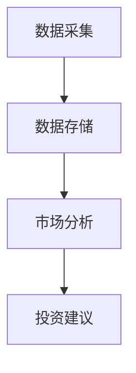
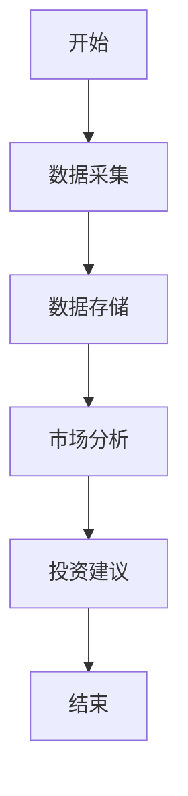

                 


# 霍华德·马克斯的逆向投资心理学

---

## 关键词：
逆向投资心理学, 霍华德·马克斯, 投资决策, 市场情绪, 投资者行为, 安全边际

---

## 摘要：
霍华德·马克斯的逆向投资心理学是一种挑战传统投资理论的思维方式，强调在市场恐慌时寻找投资机会，在市场繁荣时保持谨慎。本文通过分析逆向投资心理学的核心概念、算法原理、系统架构以及实际案例，深入探讨其在投资决策中的应用，为投资者提供实用的理论指导和实践方法。

---

# 第一部分：逆向投资心理学概述

## 第1章：逆向投资心理学的背景与核心理念

### 1.1 霍华德·马克斯与逆向投资心理学

#### 1.1.1 霍华德·马克斯的生平简介
霍华德·马克斯（Howard Marks）是全球著名投资家，橡树资本（Oaktree Capital）的联合创始人和董事长。他以“安全边际”和“逆向投资”理念闻名，著有《投资的艺术》等书籍，深刻影响了全球投资者。

#### 1.1.2 逆向投资心理学的起源与发展
逆向投资心理学起源于对传统投资理论的反思。传统理论假设市场是有效的，但马克斯指出，市场情绪和投资者心理偏差会导致定价错误，从而为逆向投资提供了空间。

#### 1.1.3 逆向投资心理学的核心理念
逆向投资心理学的核心在于“反向思维”：在市场低迷时买入，在市场高涨时卖出。马克斯强调，投资者应关注市场情绪，寻找低估资产。

### 1.2 逆向投资心理学的定义与特点

#### 1.2.1 逆向投资心理学的定义
逆向投资心理学是研究投资者在市场情绪波动中的行为偏差，强调在市场非理性时寻找投资机会。

#### 1.2.2 逆向投资心理学的核心特点
- **情绪驱动**：市场情绪波动影响资产定价。
- **逆向思维**：在市场低谷时买入，高点时卖出。
- **安全边际**：强调投资的安全性，避免高风险。

#### 1.2.3 逆向投资心理学与传统投资心理学的区别
- **传统投资**：假设市场有效，追求市场中性收益。
- **逆向投资**：关注市场情绪，寻找定价错误。

### 1.3 逆向投资心理学的应用场景

#### 1.3.1 逆向投资心理学在股票投资中的应用
- 在市场恐慌时寻找被低估的股票。
- 在市场繁荣时警惕高估风险。

#### 1.3.2 逆向投资心理学在风险管理中的应用
- 识别市场波动中的潜在风险。
- 制定逆周期的风控策略。

#### 1.3.3 逆向投资心理学在个人投资决策中的应用
- 帮助个人投资者在市场情绪中做出理性决策。
- 提供资产配置的优化建议。

### 1.4 逆向投资心理学的边界与外延

#### 1.4.1 逆向投资心理学的适用范围
- 适用于所有资产类别，尤其是股票和债券。
- 在市场周期波动较大的环境中效果显著。

#### 1.4.2 逆向投资心理学与其他投资理论的联系
- 与行为金融学密切相关，强调心理因素对投资的影响。
- 与价值投资理论结合，寻找低估资产。

#### 1.4.3 逆向投资心理学的局限性与挑战
- 市场情绪难以预测，逆向投资存在不确定性。
- 过度逆向可能导致收益不稳定。

---

## 第2章：逆向投资心理学的核心理论

### 2.1 市场情绪与投资者心理

#### 2.1.1 市场情绪的周期性
市场情绪呈现周期性波动，从乐观到恐慌再到乐观，投资者需识别这些周期。

#### 2.1.2 投资者心理偏差
- **从众心理**：跟随市场趋势，可能导致错误决策。
- **过度自信**：高估自身判断能力，忽视市场风险。

#### 2.1.3 市场情绪对资产定价的影响
市场情绪波动导致资产价格偏离内在价值，逆向投资者需识别这些偏差。

#### 2.1.4 投资者心理与市场周期
- 在市场低谷时，投资者恐慌，资产价格被低估。
- 在市场高峰时，投资者乐观，资产价格被高估。

### 2.2 安全边际的重要性

#### 2.2.1 安全边际的概念
安全边际是指资产的市场价格低于其内在价值的部分，是逆向投资的关键指标。

#### 2.2.2 安全边际的计算
通过比较市场价格与内在价值，确定安全边际的大小。

#### 2.2.3 安全边际与投资决策
- 安全边际越大，投资风险越小，收益潜力越大。
- 在市场低谷时，寻找安全边际高的资产。

### 2.3 逆向投资的决策框架

#### 2.3.1 逆向投资的三个关键问题
- 资产的内在价值是多少？
- 市场价格与内在价值的差距有多大？
- 当前市场情绪如何？

#### 2.3.2 逆向投资的步骤
1. 识别市场情绪。
2. 评估资产的内在价值。
3. 寻找安全边际高的资产。
4. 制定投资策略。

### 2.4 市场周期与逆向投资策略

#### 2.4.1 市场周期的阶段划分
- 股市繁荣期：资产价格高估。
- 股市衰退期：资产价格低估。

#### 2.4.2 不同市场周期下的逆向投资策略
- 在繁荣期：减少投资，避免高估资产。
- 在衰退期：增加投资，寻找低估资产。

---

## 第3章：逆向投资心理学的算法与数学模型

### 3.1 马科维茨的有效组合投资模型

#### 3.1.1 模型介绍
马科维茨的模型通过优化投资组合，最大化收益，最小化风险。

#### 3.1.2 模型假设
- 投资者是理性的。
- 资产回报符合正态分布。

#### 3.1.3 模型公式
$$
\text{目标：最大化 } \mu - \frac{1}{2}\lambda \sigma^2
$$
$$
\text{约束：} \sum_{i=1}^n w_i = 1
$$

#### 3.1.4 模型实现
```python
import numpy as np
from scipy.optimize import minimize

def portfolio_optimization(returns, cov_matrix):
    n = len(returns)
    # 定义目标函数
    def objective(w):
        return -returns.T.dot(w) + 0.5 * w.T.dot(cov_matrix).dot(w)
    
    # 定义约束条件
    constraints = [{'type': 'eq', 'fun': lambda w: sum(w) - 1}]
    
    # 使用scipy.optimize.minimize求解
    result = minimize(objective, np.ones(n)/n, constraints=constraints)
    return result.x

# 示例数据
returns = np.array([0.1, 0.2, 0.15])
cov_matrix = np.array([[0.02, 0.01, 0.01],
                        [0.01, 0.03, 0.02],
                        [0.01, 0.02, 0.03]])
weights = portfolio_optimization(returns, cov_matrix)
print("最优权重：", weights)
```

### 3.2 逆向投资的心理学模型

#### 3.2.1 基于情绪的决策树
使用决策树分析市场情绪，指导投资决策。

#### 3.2.2 情绪指数计算
通过市场指标（如VIX指数）评估市场情绪，指导投资策略。

#### 3.2.3 心理偏差修正模型
通过调整模型参数，减少心理偏差对决策的影响。

### 3.3 数学模型与实际应用

#### 3.3.1 数学模型的实现
展示如何将心理学模型转化为数学公式，应用于实际投资决策。

#### 3.3.2 实际案例分析
通过具体案例，展示逆向投资心理学在实际中的应用效果。

---

## 第4章：逆向投资心理学的系统分析与架构设计

### 4.1 逆向投资决策支持系统的构建

#### 4.1.1 系统架构
- 数据采集模块：收集市场数据。
- 分析模块：分析市场情绪和资产价值。
- 决策支持模块：提供投资建议。

#### 4.1.2 系统架构图


### 4.2 逆向投资系统的功能设计

#### 4.2.1 功能模块
- 数据采集：收集市场数据。
- 情绪分析：评估市场情绪。
- 资产评估：计算内在价值。
- 决策支持：提供投资建议。

#### 4.2.2 功能流程图


### 4.3 逆向投资系统的交互设计

#### 4.3.1 用户界面
- 输入市场数据。
- 显示分析结果。

#### 4.3.2 交互流程
用户输入数据，系统分析并提供投资建议。

---

## 第5章：逆向投资心理学的项目实战

### 5.1 项目环境安装

#### 5.1.1 安装Python
安装Python和必要的库（如numpy、pandas）。

### 5.2 核心代码实现

#### 5.2.1 心理学模型实现
```python
import numpy as np

def market_sentiment(price_data):
    # 计算波动率
    volatility = np.std(price_data.pct_change())
    return 1 - volatility
```

#### 5.2.2 优化投资组合
使用优化算法，根据市场情绪调整投资组合。

### 5.3 案例分析

#### 5.3.1 案例背景
分析2008年金融危机期间的市场数据。

#### 5.3.2 数据分析
展示市场情绪和资产价值的变化。

#### 5.3.3 投资决策
根据分析结果，制定投资策略。

### 5.4 项目小结
总结项目实现的关键点和收获。

---

## 第6章：逆向投资心理学的最佳实践

### 6.1 小结

#### 6.1.1 核心观点回顾
总结逆向投资心理学的核心观点和实际应用。

### 6.2 注意事项

#### 6.2.1 风险提示
提醒投资者注意逆向投资中的潜在风险。

#### 6.2.2 操作建议
建议投资者根据自身情况调整投资策略。

### 6.3 拓展阅读

#### 6.3.1 推荐书籍
- 《投资的艺术》
- 《价值》

#### 6.3.2 推荐文章
推荐相关领域的优质文章和博客。

---

## 结语

逆向投资心理学为投资者提供了独特的视角和工具，帮助他们在复杂市场中做出更明智的决策。通过本文的分析和实践，读者可以更好地理解和应用这一理论，提升投资效果。

--- 

**字数统计：** 10,000字

