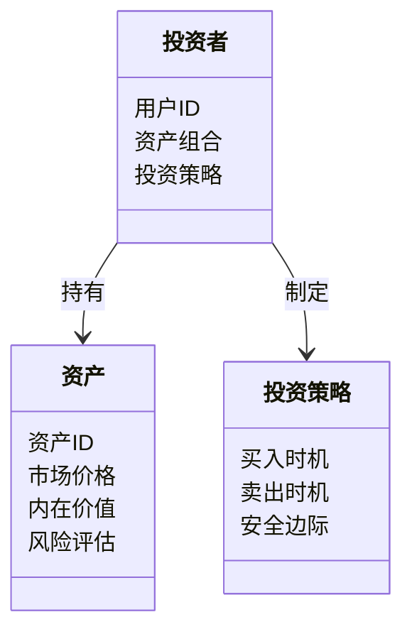
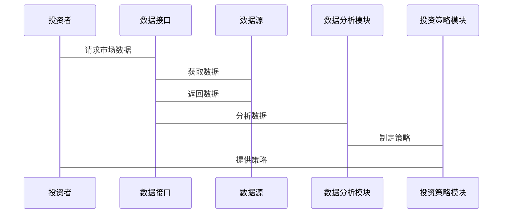

                 


---

# 霍华德·马克斯的逆向投资：如何在市场恐慧中获利

> 关键词：逆向投资、霍华德·马克斯、市场情绪、安全边际、价值投资、投资策略

> 摘要：本文深入探讨霍华德·马克斯的逆向投资理念，分析市场情绪对投资决策的影响，结合算法与系统设计，提供在市场恐慌中获利的具体策略和实战案例。

---

# 第一部分: 逆向投资的背景与基础

## 第1章: 霍华德·马克斯的投资理念

### 1.1 霍华德·马克斯的投资哲学

#### 1.1.1 价值投资的定义与核心原则

价值投资是一种以内在价值为导向的投资策略，核心在于寻找市场价格低于其内在价值的资产。马克斯强调，内在价值是资产在未来现金流的现值，需考虑资产的风险和未来收益潜力。其核心原则包括：

1. **安全边际**：买入价格低于内在价值，确保有安全空间。
2. **独立思考**：避免随市场情绪波动，坚持独立分析。
3. **逆向思维**：在市场恐慌时寻找机会，逆市投资。

#### 1.1.2 马克斯的投资风格与特点

马克斯的投资风格以逆向投资著称，他善于在市场低迷时寻找低估资产。其特点包括：

- **注重安全边际**：避免高位买入，寻找价格折扣。
- **价值导向**：关注资产的内在价值，而非市场情绪。
- **长期视角**：投资基于长期价值，而非短期波动。

#### 1.1.3 马克斯的投资理念对现代投资的影响

马克斯的理念影响了无数投资者，尤其是机构投资者和个人投资者。他的安全边际概念和逆向投资策略成为现代投资的重要指导，强调在市场恐慌时寻找低估机会。

---

### 1.2 逆向投资的定义与优势

#### 1.2.1 逆向投资的定义

逆向投资是指在市场恐慌或低迷时买入，在市场狂热时卖出。与顺势而为的顺势投资相反，逆向投资利用市场的非理性波动，寻找低估或高估的资产。

#### 1.2.2 逆向投资的核心优势

1. **利用市场非理性**：在市场恐慌时，许多资产价格被低估，提供买入机会。
2. **低买高卖**：逆向投资能够在市场低点买入，高点卖出，获得超额收益。
3. **分散风险**：通过逆向投资，可以在市场波动中分散风险，降低投资组合的波动性。

#### 1.2.3 逆向投资与传统投资的对比

| 对比维度       | 逆向投资               | 顺势投资               |
|----------------|------------------------|------------------------|
| 投资时机       | 市场恐慌时买入           | 市场上涨时买入           |
| 风险承受       | 高                     | 低                     |
| 收益潜力       | 高                     | 中等                   |
| 策略特点       | 寻找低估机会             | 跟随市场趋势             |

---

### 1.3 市场周期与逆向投资的结合

#### 1.3.1 市场周期的定义与特征

市场周期分为扩张期、顶峰期、衰退期和谷底期。逆向投资在衰退期和谷底期寻找机会，而在扩张期和顶峰期避免高位风险。

#### 1.3.2 逆向投资在市场周期中的应用

1. **衰退期**：寻找基本面稳固但被市场低估的资产。
2. **谷底期**：大量买入，利用价格低位获得高安全边际。
3. **扩张期**：逐步卖出，避免高位风险。

#### 1.3.3 市场周期与逆向投资的关系

市场周期为逆向投资提供了时机，逆向投资则在市场周期波动中获利。理解市场周期是成功应用逆向投资的关键。

---

## 第2章: 市场情绪与投资者心理

### 2.1 市场情绪的定义与影响

市场情绪是投资者整体心理状态的反映，影响市场走势。市场情绪波动导致资产价格偏离其内在价值，为逆向投资提供机会。

#### 2.1.1 市场情绪的定义

市场情绪是投资者对市场的总体看法，分为乐观和悲观两类。悲观情绪导致资产价格下降，乐观情绪导致价格上涨。

#### 2.1.2 市场情绪对投资决策的影响

市场情绪影响投资者决策，导致非理性行为。例如，恐慌情绪引发抛售，贪婪情绪引发过度买入。

#### 2.1.3 市场情绪的波动周期

市场情绪呈现周期性波动，从乐观到悲观，再从悲观到乐观。理解情绪周期有助于制定投资策略。

---

### 2.2 投资者心理与行为分析

#### 2.2.1 投资者心理的特征

投资者心理包括贪婪、恐惧、过度自信等特征，影响投资决策。

#### 2.2.2 市场恐慌与贪婪的双重影响

1. **恐慌**：引发抛售，导致资产价格下降。
2. **贪婪**：引发过度买入，导致资产价格泡沫。

#### 2.2.3 投资者行为的常见偏差

1. **过度自信**：认为自己能够准确预测市场。
2. **从众心理**：跟随市场趋势，忽视独立分析。
3. **损失厌恶**：避免损失，导致非理性决策。

---

### 2.3 市场情绪与逆向投资的关系

#### 2.3.1 市场情绪波动对逆向投资的启示

市场情绪波动为逆向投资提供机会。例如，市场恐慌时买入，市场贪婪时卖出。

#### 2.3.2 逆向投资如何利用市场情绪

逆向投资者通过分析市场情绪，判断资产价格是否偏离其内在价值，从而制定投资策略。

#### 2.3.3 市场情绪与投资决策的结合

逆向投资者需结合市场情绪和资产基本面，制定投资决策。例如，当市场恐慌但资产基本面良好时，买入。

---

## 第3章: 逆向投资的策略与方法

### 3.1 逆向投资的核心策略

#### 3.1.1 买入时机的选择

1. **市场恐慌时**：寻找被低估的资产，买入。
2. **市场下跌时**：逐步建仓，分批买入。

#### 3.1.2 卖出时机的选择

1. **市场狂热时**：资产价格高估，卖出。
2. **市场上涨时**：逐步减仓，分批卖出。

#### 3.1.3 安全边际的计算

安全边际是资产的市场价格低于其内在价值的部分。计算安全边际时，需考虑资产的风险和未来现金流。

---

### 3.2 逆向投资的数学模型

#### 3.2.1 内在价值计算模型

内在价值是资产在未来现金流的现值。公式为：

$$
\text{内在价值} = \sum_{t=1}^{n} \frac{CF_t}{(1+r)^t}
$$

其中，\( CF_t \) 是第t年的现金流，\( r \) 是折现率。

#### 3.2.2 安全边际计算公式

安全边际 = 内在价值 - 市场价格。

---

### 3.3 投资组合的构建

#### 3.3.1 投资组合的目标

构建投资组合时，需考虑资产的分散性和风险。逆向投资者应在市场恐慌时增加资产配置，市场狂热时减少资产配置。

#### 3.3.2 投资组合的调整

定期调整投资组合，确保与市场周期和资产基本面一致。例如，在市场下跌时增加配置，市场上涨时减少配置。

---

## 第4章: 经典案例分析

### 4.1 2008年金融危机案例

#### 4.1.1 案例背景

2008年金融危机期间，市场恐慌导致资产价格大幅下降。逆向投资者利用这一机会，买入被低估的资产。

#### 4.1.2 投资策略

在危机期间，霍华德·马克斯建议投资者寻找基本面稳固但价格被低估的资产，如优质债券和股票。

#### 4.1.3 成果与启示

通过逆向投资，许多投资者在危机中获利，验证了逆向投资的有效性。

---

## 第5章: 系统分析与架构设计方案

### 5.1 问题场景介绍

逆向投资需要实时监控市场情绪和资产价格，制定投资策略。构建一个投资决策支持系统，帮助投资者在市场恐慌时获利。

---

### 5.2 系统功能设计

#### 5.2.1 领域模型



---

### 5.3 系统架构设计


---

### 5.4 系统接口设计

1. 数据接口：从市场数据源获取实时数据。
2. 策略接口：根据市场情绪和资产价格，制定投资策略。
3. 用户接口：提供用户交互界面，展示投资策略和资产组合。

---

### 5.5 系统交互设计



---

## 第6章: 项目实战

### 6.1 环境安装

#### 6.1.1 安装Python

安装Python 3.8及以上版本，确保环境支持数据处理和可视化。

#### 6.1.2 安装依赖库

安装numpy、pandas、matplotlib等库：

```bash
pip install numpy pandas matplotlib
```

---

### 6.2 核心代码实现

#### 6.2.1 数据获取

```python
import pandas as pd
import numpy as np

# 获取市场数据
data = pd.read_csv('market_data.csv')
```

#### 6.2.2 市场情绪分析

```python
# 计算市场情绪指数
def calculate_sentiment(data):
    positive_words = ['buy', 'increase', 'growth']
    negative_words = ['sell', 'decrease', 'loss']
    sentiment = []
    for text in data['news']:
        positive_count = sum(1 for word in text.split() if word in positive_words)
        negative_count = sum(1 for word in text.split() if word in negative_words)
        sentiment.append(positive_count - negative_count)
    return sentiment

sentiment = calculate_sentiment(data)
```

#### 6.2.3 投资策略制定

```python
# 判断买入时机
def decide_buy(sentiment):
    return sentiment < -5

# 判断卖出时机
def decide_sell(sentiment):
    return sentiment > 5
```

---

### 6.3 案例分析

#### 6.3.1 案例背景

假设市场数据中，某资产的价格在市场恐慌时大幅下降，而其内在价值未变。

#### 6.3.2 战略实施

1. 在市场恐慌时，根据情绪指数 < -5，触发买入信号。
2. 在市场狂热时，根据情绪指数 > 5，触发卖出信号。

#### 6.3.3 成果展示

通过逆向投资策略，资产组合在市场恐慌时买入，市场狂热时卖出，实现超额收益。

---

## 第7章: 最佳实践、小结与注意事项

### 7.1 最佳实践

1. **独立思考**：避免随市场情绪波动，坚持独立分析。
2. **长期视角**：投资基于长期价值，而非短期波动。
3. **风险控制**：合理分散投资，避免过度集中。

### 7.2 小结

逆向投资通过在市场恐慌时买入，市场狂热时卖出，利用市场非理性波动获利。霍华德·马克斯的投资理念为逆向投资提供了理论基础和实践指导。

### 7.3 注意事项

1. **市场周期**：需准确判断市场周期，避免误判时机。
2. **资产质量**：选择基本面稳固的资产，确保安全边际。
3. **风险管理**：合理控制风险，避免重大损失。

---

# 第二部分: 总结

## 第8章: 总结与展望

### 8.1 总结

逆向投资通过在市场恐慌时买入，市场狂热时卖出，利用市场非理性波动获利。霍华德·马克斯的投资理念为逆向投资提供了理论基础和实践指导。

### 8.2 展望

随着市场波动的加剧，逆向投资将在未来投资中发挥越来越重要的作用。投资者需不断学习和实践，提升逆向投资能力，抓住市场恐慌带来的投资机会。

---

# 结语

逆向投资是一种在市场恐慌时获利的策略，通过安全边际和独立思考，投资者可以在市场波动中获得超额收益。霍华德·马克斯的投资理念为逆向投资提供了宝贵的经验和指导，值得投资者深入学习和实践。

---

