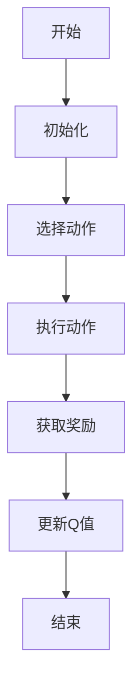
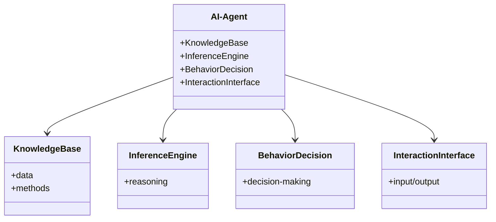
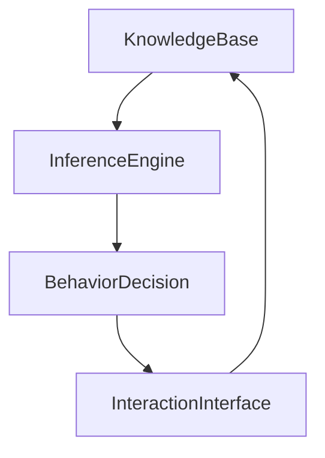

                 


# 预测2025年AI Agent技术的发展方向

## 关键词：AI Agent、人工智能、机器学习、强化学习、生成式模型、系统架构、多模态交互

## 摘要：  
AI Agent作为人工智能领域的重要技术，正逐步从理论研究走向实际应用。本文将分析AI Agent的核心概念、算法原理、系统架构以及未来的发展趋势，预测2025年AI Agent技术的主要发展方向。通过对技术细节的深入探讨和实际案例的分析，为读者提供全面的视角，帮助更好地理解和应用AI Agent技术。

---

# 第一部分: AI Agent技术的发展背景与核心概念

## 第1章: AI Agent技术的背景与现状

### 1.1 AI Agent的基本概念

#### 1.1.1 AI Agent的定义与核心特征  
AI Agent（人工智能代理）是一种能够感知环境、自主决策并执行任务的智能体。它具备以下核心特征：  
- **自主性**：能够在没有外部干预的情况下独立运作。  
- **反应性**：能够实时感知环境并做出反应。  
- **目标导向**：具有明确的目标，通过行为选择来实现目标。  
- **学习能力**：能够通过经验或数据优化自身的决策能力。  

#### 1.1.2 AI Agent与传统AI的区别  
AI Agent与传统AI的主要区别在于其自主性和目标导向性。传统AI更多是基于规则或预设任务完成特定任务，而AI Agent具备更强的自主性和适应性，能够在动态环境中灵活调整策略。

#### 1.1.3 当前AI Agent技术的发展现状  
目前，AI Agent技术已在多个领域取得显著进展，例如智能助手（如Siri、Alexa）、自动驾驶中的路径规划、机器人控制等。然而，现有技术仍存在一些局限性，如处理复杂环境的能力有限、多模态交互不够成熟等。

---

## 第2章: AI Agent的核心概念与原理

### 2.1 AI Agent的组成与结构

#### 2.1.1 知识库与推理引擎  
AI Agent的核心组成部分之一是知识库，用于存储任务相关的知识和数据。推理引擎则负责根据知识库中的信息进行逻辑推理，为决策提供支持。

#### 2.1.2 行为决策模块  
行为决策模块是AI Agent的关键部分，负责根据当前状态和目标生成最优行为策略。这通常涉及强化学习、生成式模型等技术。

#### 2.1.3 交互界面与反馈机制  
交互界面是AI Agent与用户或环境进行信息交换的通道，反馈机制则用于调整AI Agent的行为以适应环境变化。

---

### 2.2 AI Agent的工作流程

#### 2.2.1 信息获取与处理  
AI Agent首先通过传感器或API获取环境中的信息，例如文本、图像或语音数据。

#### 2.2.2 知识推理与决策  
基于获取的信息，AI Agent通过推理引擎进行逻辑推理，并结合目标生成决策。

#### 2.2.3 行为执行与反馈  
AI Agent根据决策执行行为，并通过反馈机制调整后续的行为策略。

---

### 2.3 AI Agent的核心技术对比

#### 2.3.1 不同AI Agent技术的优劣势对比  
| **技术**          | **优点**                          | **缺点**                          |
|--------------------|-----------------------------------|-----------------------------------|
| 基于规则的AI Agent | 简单易实现，适用于规则明确的场景  | 灵活性差，难以应对复杂场景        |
| 基于模型的AI Agent | 适应性强，能够处理复杂问题       | 实现复杂，需要大量数据和计算资源  |
| 基于强化学习的AI Agent | 自适应性强，能够优化决策策略     | 需要大量训练数据，收敛速度慢      |

#### 2.3.2 基于规则与基于模型的AI Agent对比  
- **基于规则的AI Agent**：适用于规则明确的场景，例如简单的流程自动化。  
- **基于模型的AI Agent**：适用于复杂场景，能够通过学习优化决策策略。

#### 2.3.3 基于强化学习与基于生成式模型的AI Agent对比  
- **基于强化学习的AI Agent**：通过与环境互动，逐步优化行为策略。  
- **基于生成式模型的AI Agent**：能够生成多样化的解决方案，适用于需要创造性思维的任务。

---

## 第3章: AI Agent的算法原理与数学模型

### 3.1 强化学习算法

#### 3.1.1 Q-learning算法  
Q-learning是一种经典的强化学习算法，适用于离散动作空间的环境。其核心公式为：  
$$ Q(s, a) = Q(s, a) + \alpha [r + \max_{a'} Q(s', a') - Q(s, a)] $$  
其中，$s$ 是状态，$a$ 是动作，$r$ 是奖励，$\alpha$ 是学习率。

#### 3.1.2 Deep Q-Network (DQN)算法  
DQN算法通过深度神经网络近似Q值函数，能够处理高维状态空间。其网络结构通常包括一个输入层、多个隐藏层和一个输出层。

#### 3.1.3 算法流程图（Mermaid）  


---

### 3.2 生成式模型

#### 3.2.1 GAN（生成对抗网络）  
GAN由生成器和判别器组成，通过对抗训练生成逼真的数据。其损失函数为：  
$$ \mathcal{L} = \mathbb{E}[\log(D(x))] + \mathbb{E}[\log(1 - D(G(z)))] $$  

#### 3.2.2 Diffusion模型  
Diffusion模型通过逐步生成数据，具有稳定性和高质量的特点。其核心步骤包括正向扩散和反向采样。

---

## 第4章: AI Agent的系统架构与设计

### 4.1 系统功能设计

#### 4.1.1 领域模型设计（Mermaid类图）  


#### 4.1.2 系统功能模块划分  
- **知识库模块**：负责存储和管理知识。  
- **推理引擎模块**：负责逻辑推理。  
- **行为决策模块**：负责生成行为策略。  
- **交互界面模块**：负责与用户或环境交互。

#### 4.1.3 功能模块之间的交互关系  


---

### 4.2 系统架构设计

#### 4.2.1 分层架构设计（Mermaid架构图）  


#### 4.2.2 微服务架构设计  
微服务架构适合复杂的AI Agent系统，每个服务负责特定功能，例如知识管理服务、推理服务等。

---

## 第5章: AI Agent的系统接口与交互设计

### 5.1 系统接口设计

#### 5.1.1 API接口定义  
AI Agent可以通过RESTful API提供服务，例如：  
- `GET /api/state`：获取当前状态。  
- `POST /api/action`：执行特定动作。  

#### 5.1.2 接口调用流程  
```mermaid
sequenceDiagram
    User -> AI-Agent: 请求动作
    AI-Agent -> KnowledgeBase: 查询知识
    KnowledgeBase --> InferenceEngine: 推理
    InferenceEngine --> BehaviorDecision: 决策
    BehaviorDecision --> InteractionInterface: 返回结果
    User <-- InteractionInterface: 响应
```

---

## 第6章: AI Agent的项目实战与案例分析

### 6.1 环境安装与配置

#### 6.1.1 开发环境搭建  
- 安装Python和必要的开发工具（如Jupyter Notebook）。  
- 安装深度学习框架（如TensorFlow、PyTorch）。  

#### 6.1.2 依赖库安装  
使用pip安装所需的库，例如：  
```bash
pip install numpy matplotlib tensorflow
```

---

### 6.2 核心功能实现

#### 6.2.1 知识库构建与管理  
可以使用爬虫或API获取数据，并存储在数据库中。例如，使用MySQL或MongoDB。

#### 6.2.2 行为决策模块实现  
基于强化学习算法实现行为决策模块，例如使用Keras框架。

#### 6.2.3 交互界面开发  
开发一个简单的Web界面，用户可以通过输入框与AI Agent交互。

---

### 6.3 代码实现与解读

#### 6.3.1 Python核心代码实现  
```python
import numpy as np
import tensorflow as tf

# 定义神经网络模型
model = tf.keras.Sequential([
    tf.keras.layers.Dense(64, activation='relu'),
    tf.keras.layers.Dense(1, activation='sigmoid')
])

# 编译模型
model.compile(optimizer='adam', loss='binary_crossentropy', metrics=['accuracy'])

# 训练模型
model.fit(X_train, y_train, epochs=10, batch_size=32)
```

#### 6.3.2 算法实现  
```python
# Q-learning算法实现
class QLearning:
    def __init__(self, state_space, action_space):
        self.state_space = state_space
        self.action_space = action_space
        self.q_table = np.zeros((state_space, action_space))

    def choose_action(self, state):
        # 使用epsilon-greedy策略选择动作
        epsilon = 0.1
        if np.random.random() < epsilon:
            return np.random.randint(self.action_space)
        else:
            return np.argmax(self.q_table[state])

    def update_q_table(self, state, action, reward, next_state):
        learning_rate = 0.1
        gamma = 0.9
        self.q_table[state, action] = self.q_table[state, action] + learning_rate * (reward + gamma * np.max(self.q_table[next_state, :]))
```

---

## 第7章: 未来发展趋势与挑战

### 7.1 未来发展趋势

#### 7.1.1 算法优化  
强化学习和生成式模型的结合将推动AI Agent的决策能力和创造力进一步提升。

#### 7.1.2 系统架构升级  
随着应用场景的扩展，AI Agent的系统架构将更加复杂，可能采用分布式架构来提高效率。

#### 7.1.3 多模态交互  
未来的AI Agent将支持更多形式的交互方式，例如语音、图像和情感交互，提供更丰富的用户体验。

#### 7.1.4 企业级应用  
AI Agent将在企业级应用中发挥更大作用，例如自动化客服、供应链管理等。

#### 7.1.5 垂直行业应用  
在医疗、金融等垂直行业中，AI Agent将结合行业知识，提供更专业的服务。

---

### 7.2 挑战与解决方案

#### 7.2.1 伦理与安全问题  
数据隐私和算法偏见是AI Agent技术发展中的主要挑战。解决方案包括制定相关法规和加强技术伦理研究。

#### 7.2.2 技术瓶颈  
现有算法在处理复杂环境和多模态交互方面仍有局限性。解决方案包括开发更高效的算法和提升计算能力。

#### 7.2.3 应用场景限制  
AI Agent在某些场景下的应用效果有限，例如在极端环境中的决策能力不足。解决方案包括结合边缘计算和分布式架构。

---

## 第8章: 结论与展望

### 8.1 结论  
AI Agent技术的发展将推动人工智能技术的进一步突破，未来几年将是其快速发展和广泛应用的关键时期。

### 8.2 展望  
2025年，AI Agent技术将在算法、架构、交互等方面取得显著进展，应用场景将更加丰富，为人类社会带来更多的便利和价值。

---

## 第9章: 最佳实践与小结

### 9.1 最佳实践  
- **算法选择**：根据具体场景选择合适的算法。  
- **系统设计**：采用模块化设计，便于维护和扩展。  
- **交互优化**：提供多样化的交互方式，提升用户体验。  

### 9.2 小结  
AI Agent技术的发展需要技术与应用的双重推动，未来几年将是其走向成熟的重要时期。

---

## 第10章: 注意事项与拓展阅读

### 10.1 注意事项  
- 在实际应用中，需注意数据隐私和算法安全问题。  
- 强化学习算法的训练时间较长，需做好资源规划。  

### 10.2 拓展阅读  
- 《Deep Learning》——Ian Goodfellow  
- 《Reinforcement Learning: Theory and Algorithms》——Richard S. Sutton  

---

以上是《预测2025年AI Agent技术的发展方向》的完整大纲和内容。希望本文能够为读者提供对AI Agent技术的全面理解，并为未来的实践和研究提供参考。

