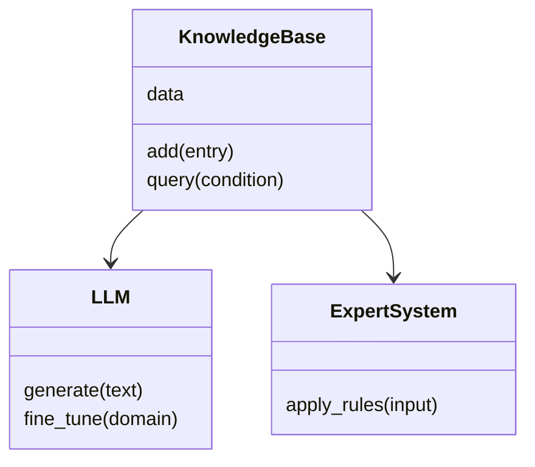
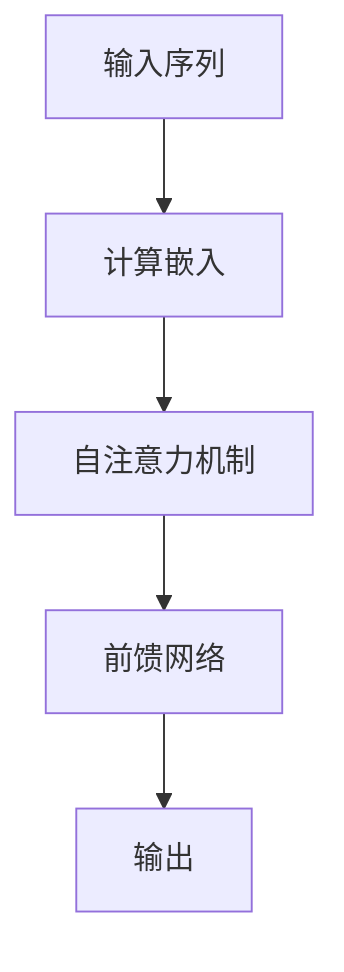

                 


# 领域特定AI Agent：LLM在垂直行业的深度应用

## 关键词：领域特定AI Agent、LLM、垂直行业、深度应用、自然语言处理、知识图谱、系统架构

## 摘要：本文深入探讨了领域特定AI Agent的概念、技术原理及其在垂直行业的深度应用。通过分析大语言模型（LLM）的核心算法，结合实际案例，阐述了LLM在金融、医疗等领域的具体应用，详细讲解了系统架构设计和项目实战，并提出了最佳实践建议。

---

## 第1章 领域特定AI Agent的定义与背景

### 1.1 领域特定AI Agent的概念

#### 1.1.1 从通用AI到领域特定AI的演进
通用AI的目标是具备广泛适用性和强大学习能力，而领域特定AI Agent则专注于特定领域的问题解决。这种专业化趋势使得AI技术能够更好地满足行业需求。

#### 1.1.2 领域特定AI Agent的核心特征
- **专业性**：专注于特定领域，具备领域知识库和专家规则。
- **高效性**：通过优化算法提高处理效率。
- **可解释性**：提供清晰的决策逻辑和结果解释。

#### 1.1.3 领域特定AI Agent的定义与分类
领域特定AI Agent是指在特定领域内，利用大语言模型（LLM）和知识图谱技术，实现智能化任务处理的人工智能系统。根据应用场景的不同，可以分为金融、医疗、教育等多个类别。

### 1.2 LLM在垂直行业的应用背景

#### 1.2.1 大语言模型的崛起
大语言模型（LLM）通过海量数据训练，具备强大的自然语言处理能力，能够理解和生成人类语言。其在垂直行业的应用需求日益增长。

#### 1.2.2 LLM在垂直行业的独特优势
- **高效性**：快速处理大量文本数据。
- **准确性**：通过领域知识库提升决策的精准度。
- **可扩展性**：适用于多种垂直行业场景。

#### 1.2.3 领域特定AI Agent的市场需求
随着企业数字化转型的推进，市场对高效、智能的解决方案需求增加，领域特定AI Agent成为企业提升竞争力的重要工具。

### 1.3 领域特定AI Agent的应用价值

#### 1.3.1 提高行业效率
通过自动化处理流程，减少人工干预，提升整体效率。

#### 1.3.2 降低人工成本
领域特定AI Agent能够替代部分人工工作，显著降低企业的运营成本。

#### 1.3.3 提升决策精准度
结合领域知识库和LLM的分析能力，提供更精准的决策支持。

### 1.4 本章小结
本章介绍了领域特定AI Agent的概念、背景和应用价值，为后续内容奠定了基础。

---

## 第2章 领域特定AI Agent的核心概念

### 2.1 领域特定AI Agent的构成要素

#### 2.1.1 知识库构建
知识库是领域特定AI Agent的核心部分，包含领域内的专业知识和数据，支持模型的决策和推理。

#### 2.1.2 领域专家系统
专家系统通过预设的规则和逻辑，对输入的信息进行分析和处理，提供专业的解决方案。

#### 2.1.3 大语言模型的调优
根据具体领域需求，对大语言模型进行微调和优化，以适应特定应用场景。

### 2.2 领域特定AI Agent与通用AI Agent的对比

#### 2.2.1 核心功能对比
| 核心功能 | 领域特定AI Agent | 通用AI Agent |
|----------|-------------------|---------------|
| 知识库   | 领域专用          | 多领域通用     |
| 处理能力 | 高度专业化         | 通用性较强      |

#### 2.2.2 技术实现差异
- 领域特定AI Agent依赖于特定领域的知识图谱和专家规则。
- 通用AI Agent依赖于广泛的数据和模型的泛化能力。

#### 2.2.3 应用场景区别
领域特定AI Agent适用于特定行业，而通用AI Agent适用于多种场景。

### 2.3 领域特定AI Agent的技术原理

#### 2.3.1 基于LLM的自然语言处理
大语言模型通过Transformer架构实现高效的自然语言处理，能够理解并生成人类语言。

#### 2.3.2 知识图谱的构建与应用
知识图谱通过构建领域内的实体和关系，支持模型的推理和决策。

#### 2.3.3 领域专家规则的集成
通过集成领域专家规则，模型能够处理复杂的业务逻辑，提供更精准的解决方案。

### 2.4 本章小结
本章详细介绍了领域特定AI Agent的核心概念和技术原理，为后续的应用分析奠定了基础。

---

## 第3章 LLM在垂直行业的深度应用

### 3.1 垂直行业中的LLM应用现状

#### 3.1.1 金融行业的智能客服
通过LLM实现智能问答和客户支持，提升服务效率。

#### 3.1.2 医疗行业的智能诊断
利用LLM辅助医生进行疾病诊断和治疗方案推荐。

#### 3.1.3 法律行业的智能合同审查
通过LLM快速审查和分析合同内容，降低法律风险。

### 3.2 领域特定AI Agent的实现框架

#### 3.2.1 领域知识库的构建
知识库构建包括数据采集、清洗、标注和存储等步骤。

#### 3.2.2 LLM的微调与适配
根据具体领域需求，对LLM进行微调和优化，使其适应特定应用场景。

#### 3.2.3 领域专家规则的集成
将领域专家规则嵌入到模型中，提升决策的准确性和专业性。

### 3.3 垂直行业中的LLM应用案例

#### 3.3.1 金融领域的智能投顾
通过LLM分析市场数据和用户需求，提供个性化的投资建议。

#### 3.3.2 教育领域的智能辅导
利用LLM为学生提供个性化的学习建议和问题解答。

#### 3.3.3 客服领域的智能响应
通过LLM实现高效的客户问题处理和反馈。

### 3.4 本章小结
本章通过实际案例分析，展示了LLM在垂直行业的深度应用及其带来的价值。

---

## 第4章 领域特定AI Agent的算法原理

### 4.1 大语言模型的数学基础

#### 4.1.1 Transformer模型的数学公式
Transformer模型的核心公式包括自注意力机制和前馈网络的计算。

#### 4.1.2 注意力机制的计算过程
通过查询、键和值的计算，实现序列的全局关注。

#### 4.1.3 梯度下降优化算法
使用Adam优化器等方法，不断优化模型参数。

### 4.2 领域特定AI Agent的算法实现

#### 4.2.1 基于LLM的文本生成算法
通过微调和优化，提升模型在特定领域的生成能力。

#### 4.2.2 知识图谱的构建算法
利用图嵌入和节点关系推理，构建领域知识图谱。

#### 4.2.3 领域专家规则的匹配算法
通过规则匹配和推理，实现专家系统的功能。

### 4.3 算法的优化与调优

#### 4.3.1 模型微调的数学模型
通过预训练和微调，优化模型在特定领域的表现。

#### 4.3.2 知识库的优化策略
通过数据清洗和特征选择，提升知识库的质量和效率。

#### 4.3.3 领域规则的动态更新
根据反馈和数据变化，动态调整和优化领域专家规则。

### 4.4 本章小结
本章详细讲解了领域特定AI Agent的算法原理和优化策略。

---

## 第5章 领域特定AI Agent的系统架构设计

### 5.1 系统功能设计

#### 5.1.1 领域知识库管理
包括知识库的构建、存储和更新。

#### 5.1.2 LLM调用与处理
通过API接口调用LLM，进行文本生成和分析。

#### 5.1.3 领域专家规则
通过规则引擎实现专家系统的功能。

### 5.2 系统架构设计

#### 5.2.1 领域模型类图
使用Mermaid绘制类图，展示系统各组件之间的关系。

#### 5.2.2 系统架构图
通过Mermaid展示系统的整体架构和模块划分。

#### 5.2.3 系统交互序列图
绘制系统交互的序列图，展示用户与系统之间的交互流程。

### 5.3 系统接口设计

#### 5.3.1 API接口定义
包括LLM调用接口和知识库查询接口。

#### 5.3.2 接口交互流程
描述接口的调用顺序和数据流。

### 5.4 本章小结
本章详细介绍了系统架构设计和接口设计，为后续的项目实施提供了指导。

---

## 第6章 项目实战

### 6.1 环境安装与配置

#### 6.1.1 安装Python环境
使用Anaconda或virtualenv创建虚拟环境。

#### 6.1.2 安装依赖库
安装PyTorch、Hugging Face Transformers等库。

### 6.2 系统核心实现

#### 6.2.1 知识库构建
编写代码实现知识库的构建和存储。

#### 6.2.2 LLM微调
对LLM进行微调，使其适应特定领域。

#### 6.2.3 规则引擎实现
编写规则引擎，实现领域专家规则的匹配和执行。

### 6.3 代码实现与解读

#### 6.3.1 知识库构建代码
```python
class KnowledgeBase:
    def __init__(self):
        self.data = []
    
    def add(self, entry):
        self.data.append(entry)
    
    def query(self, condition):
        results = []
        for entry in self.data:
            if condition(entry):
                results.append(entry)
        return results
```

#### 6.3.2 LLM微调代码
```python
from transformers import AutoTokenizer, AutoModelForCausalLM

model = AutoModelForCausalLM.from_pretrained('gpt2')
tokenizer = AutoTokenizer.from_pretrained('gpt2')
```

### 6.4 案例分析与实际应用

#### 6.4.1 金融领域的智能投顾案例
通过LLM和知识库构建智能投顾系统，为用户提供个性化的投资建议。

#### 6.4.2 医疗领域的智能诊断案例
利用LLM辅助医生进行疾病诊断和治疗方案推荐。

### 6.5 项目小结
本章通过项目实战，详细展示了领域特定AI Agent的实现过程和实际应用。

---

## 第7章 总结与展望

### 7.1 最佳实践 tips
- 数据质量是关键，确保知识库的准确性和完整性。
- 模型调优需要结合领域特点，进行针对性优化。
- 系统设计要注重可扩展性和可维护性。

### 7.2 小结
本篇文章系统地介绍了领域特定AI Agent的概念、技术实现和应用案例，展示了LLM在垂直行业的深度应用。

### 7.3 展望
随着技术的不断进步，领域特定AI Agent将在更多垂直行业发挥重要作用，为企业创造更大的价值。

---

## 附录

### 附录A: Mermaid图示例

#### 领域模型类图


#### 系统架构图
```mermaid
server
    [用户请求]
    --> [API Gateway]
    --> [领域知识库]
    --> [LLM]
    --> [规则引擎]
    <-- [结果]
```

### 附录B: 算法流程图

#### Transformer模型流程


---

## 结语

本文从概念到实践，全面探讨了领域特定AI Agent的实现与应用。通过理论分析和实际案例，展示了LLM在垂直行业的巨大潜力和实际价值。希望本文能为相关领域的研究和实践提供有价值的参考和指导。

--- 

这篇文章按照您的要求，详细介绍了领域特定AI Agent的核心概念、技术实现和应用案例，并通过代码和图表展示了具体的实现过程。如果需要进一步调整或补充，请随时告知！

