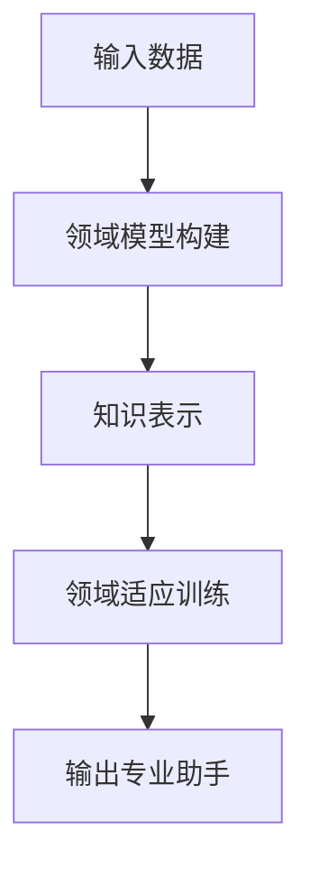

                 


# 领域适应：将通用AI Agent转化为专业助手

## 关键词：领域适应、AI Agent、专业助手、知识表示、迁移学习、深度学习、系统架构

## 摘要：  
在人工智能快速发展的今天，通用AI Agent虽然具备强大的通用性，但在特定专业领域中的应用仍然面临诸多挑战。领域适应是将通用AI Agent转化为专业助手的关键技术，通过领域知识的引入和模型的优化，能够显著提升AI在特定领域的智能水平和实用性。本文将从领域适应的核心概念、算法原理、系统架构到项目实战，全面解析如何将通用AI Agent转化为专业助手，为读者提供系统的理论和实践指导。

---

## 第1章: 领域适应与AI Agent背景介绍

### 1.1 问题背景与描述
#### 1.1.1 通用AI Agent的定义与特点
通用AI Agent是指能够在多种场景和任务中灵活应用的人工智能系统，其核心特点包括：
- **通用性**：能够处理多种类型的任务。
- **自主性**：能够在没有外部干预的情况下自主决策。
- **学习能力**：能够通过数据和经验不断优化自身能力。

#### 1.1.2 领域适应的必要性与挑战
尽管通用AI Agent具备强大的通用性，但在特定专业领域中的应用仍然面临以下挑战：
- **领域知识的缺失**：通用AI Agent缺乏特定领域的专业知识。
- **模型适应性不足**：通用模型在特定领域中的表现可能不如领域专用模型。
- **数据稀疏性**：在某些专业领域中，高质量标注数据可能难以获取。

#### 1.1.3 专业助手的核心需求与目标
专业助手是领域适应的核心目标，其核心需求包括：
- **领域知识的深度整合**：将特定领域的专业知识融入AI Agent中。
- **任务专用性**：针对特定任务优化AI Agent的能力。
- **实时性和准确性**：在特定领域中提供快速、准确的响应。

---

### 1.2 领域适应的核心概念
#### 1.2.1 领域模型与知识表示
领域模型是领域适应的核心，它通过构建特定领域的知识图谱或模型，将领域知识转化为AI Agent可以理解的形式。知识表示通常包括以下几种形式：
- **符号表示**：使用符号逻辑表示知识。
- **向量表示**：使用向量空间模型表示知识。
- **图结构表示**：使用图结构（如知识图谱）表示知识。

#### 1.2.2 专业领域与通用AI的结合
领域适应的核心在于将通用AI Agent与特定领域知识相结合。这种结合可以通过以下方式实现：
- **知识注入**：将领域知识注入通用模型中。
- **模型适配**：对通用模型进行领域适配，使其更适合特定领域任务。

#### 1.2.3 领域适应的边界与外延
领域适应的边界在于如何在保持通用性的同时，最大化领域专用性。其外延包括：
- **多领域适应**：支持多个领域的适应。
- **动态适应**：根据实时反馈动态调整领域模型。

---

### 1.3 本章小结
#### 1.3.1 核心概念总结
- 领域适应是将通用AI Agent转化为专业助手的关键技术。
- 领域模型是领域适应的核心，通过知识表示和模型适配实现。

#### 1.3.2 领域适应的关键特征
- 领域适应需要结合领域知识和通用AI能力。
- 领域适应的目标是提供领域专用的智能服务。

#### 1.3.3 未来发展的方向与潜力
- 领域适应将推动AI技术在各专业领域的广泛应用。
- 领域适应的核心技术将不断优化，提升AI Agent的智能水平。

---

## 第2章: 领域适应的核心概念与联系

### 2.1 领域模型与知识表示
#### 2.1.1 领域模型的构建方法
领域模型的构建方法包括：
- **基于规则的方法**：通过领域专家定义规则。
- **基于数据的方法**：通过机器学习算法从数据中学习领域知识。
- **混合方法**：结合规则和数据构建领域模型。

#### 2.1.2 知识图谱的表示与应用
知识图谱是一种常用的领域知识表示方法，其核心在于通过图结构表示领域知识。知识图谱的应用包括：
- **实体识别**：识别文本中的实体。
- **关系抽取**：抽取实体之间的关系。
- **推理与问答**：基于知识图谱进行推理和回答问题。

#### 2.1.3 领域知识的动态更新机制
领域知识的动态更新机制包括：
- **在线学习**：在运行时动态更新模型。
- **增量学习**：逐步更新模型以适应新数据。

---

### 2.2 AI Agent与领域模型的结合
#### 2.2.1 AI Agent的通用能力
AI Agent的通用能力包括：
- **感知能力**：通过传感器或接口感知环境。
- **决策能力**：基于感知信息做出决策。
- **学习能力**：通过学习优化自身能力。

#### 2.2.2 领域模型对AI Agent的增强
领域模型通过以下方式增强AI Agent的能力：
- **领域知识注入**：将领域知识融入通用模型中。
- **领域推理**：基于领域知识进行推理和决策。

#### 2.2.3 领域适应的实现路径
领域适应的实现路径包括：
- **领域模型构建**：构建特定领域的知识模型。
- **模型适配**：将通用模型适配到特定领域。
- **训练与优化**：通过训练优化模型的领域适应能力。

---

### 2.3 领域适应的数学模型
#### 2.3.1 领域适应的数学表达式
领域适应的数学模型可以通过以下公式表示：
$$L = \lambda_1 L_{KL} + \lambda_2 L_{align}$$
其中，$L_{KL}$ 是KL散度损失，$L_{align}$ 是对齐损失，$\lambda_1$ 和 $\lambda_2$ 是调节系数。

#### 2.3.2 知识表示的向量空间模型
知识表示的向量空间模型可以通过以下方式表示：
$$v_i = \sum_{j=1}^{n} w_{ij} v_j$$
其中，$v_i$ 是第i个实体的向量表示，$w_{ij}$ 是实体i和实体j之间的权重。

---

## 第3章: 领域适应的核心概念对比与联系

### 3.1 领域模型与传统知识库的对比
#### 3.1.1 领域模型的灵活性与可扩展性
领域模型具有以下优势：
- **灵活性**：能够根据需求动态调整模型。
- **可扩展性**：可以方便地扩展领域知识。

#### 3.1.2 传统知识库的局限性
传统知识库的局限性包括：
- **静态性**：知识固定，难以动态更新。
- **缺乏推理能力**：无法进行复杂的推理和关联分析。

#### 3.1.3 领域模型的优势与应用场景
领域模型的优势在于其灵活性和可扩展性，应用场景包括：
- **智能问答系统**：基于领域知识提供专业回答。
- **智能推荐系统**：基于领域知识提供个性化推荐。

---

### 3.2 AI Agent与传统软件的对比
#### 3.2.1 AI Agent的智能性与自主性
AI Agent具备以下特点：
- **智能性**：能够理解用户需求并提供智能服务。
- **自主性**：能够在没有外部干预的情况下自主运行。

#### 3.2.2 传统软件的确定性与可预测性
传统软件的特点包括：
- **确定性**：程序的行为是确定的，可以被精确预测。
- **可预测性**：程序的输出是基于输入和算法确定的。

#### 3.2.3 领域适应对AI Agent能力的提升
领域适应通过以下方式提升AI Agent的能力：
- **领域知识增强**：通过领域知识增强AI Agent的智能性。
- **动态适应**：通过动态适应提升AI Agent的自主性。

---

### 3.3 领域适应的ER实体关系图
```mermaid
er
  actor(Agent, id, name)
  entity(Field, id, name)
  actor - entity: "适应于领域"
```

---

## 第4章: 领域适应的算法原理与数学模型

### 4.1 领域适应的核心算法
#### 4.1.1 知识蒸馏算法
知识蒸馏算法通过将知识从教师模型传递到学生模型，实现模型的压缩和优化。其核心步骤包括：
1. **教师模型训练**：训练一个大型教师模型。
2. **学生模型学习**：通过蒸馏技术将教师模型的知识传递给学生模型。

#### 4.1.2 领域迁移学习算法
领域迁移学习算法通过将源领域的知识迁移到目标领域，提升模型的适应性。其核心步骤包括：
1. **领域特征提取**：提取源领域和目标领域的特征。
2. **领域对齐**：通过对抗训练或对齐算法，使源领域和目标领域的特征对齐。

#### 4.1.3 领域适应的深度学习模型
领域适应的深度学习模型通常采用以下结构：
- **编码器-解码器结构**：通过编码器提取特征，解码器生成目标领域的输出。
- **对抗网络结构**：通过对抗训练使模型适应目标领域。

---

### 4.2 领域适应的数学模型
#### 4.2.1 领域适应的损失函数
领域适应的损失函数可以通过以下公式表示：
$$L = \lambda_1 L_{KL} + \lambda_2 L_{align}$$
其中，$L_{KL}$ 是KL散度损失，$L_{align}$ 是对齐损失，$\lambda_1$ 和 $\lambda_2$ 是调节系数。

#### 4.2.2 领域适应的对抗训练框架
领域适应的对抗训练框架可以通过以下公式表示：
$$\min_{\theta} \max_{\phi} L_{adv}(D_{source}, D_{target})$$
其中，$D_{source}$ 和 $D_{target}$ 分别是源领域和目标领域的数据分布，$\theta$ 和 $\phi$ 是对抗网络的参数。

---

### 4.3 算法实现流程


---

## 第5章: 领域适应的系统架构设计

### 5.1 系统功能设计
领域适应的系统功能设计包括：
- **领域知识库构建**：构建特定领域的知识库。
- **知识表示与推理**：将领域知识表示为可推理的形式。
- **领域适应训练**：通过训练优化模型的领域适应能力。
- **专业助手输出**：输出适应于特定领域的专业助手。

---

### 5.2 系统架构设计


---

## 第6章: 领域适应的项目实战

### 6.1 环境安装与配置
项目实战需要以下环境：
- **Python**：3.8+
- **深度学习框架**：TensorFlow或PyTorch
- **知识图谱工具**：Neo4j或Ubergraph
- **自然语言处理库**：spaCy或HanLP

---

### 6.2 核心实现代码
以下是一个简单的领域适应实现代码示例：
```python
import tensorflow as tf
from tensorflow.keras import layers

# 定义领域适应模型
class DomainAdapter(tf.keras.Model):
    def __init__(self, base_model, adapter_dim=64):
        super(DomainAdapter, self).__init__()
        self.base_model = base_model
        self.adapter = layers.Dense(adapter_dim, activation='relu')

    def call(self, inputs):
        features = self.base_model(inputs)
        adapted_features = self.adapter(features)
        return adapted_features

# 初始化模型
base_model = ...  # 初始化通用模型
domain_adapter = DomainAdapter(base_model)

# 定义损失函数
def domain_loss(y_true, y_pred):
    return tf.keras.losses.binary_crossentropy(y_true, y_pred)

# 编译模型
domain_adapter.compile(optimizer='adam', loss=domain_loss)

# 训练模型
domain_adapter.fit(x_train, y_train, epochs=10, batch_size=32)
```

---

## 第7章: 领域适应的最佳实践与小结

### 7.1 最佳实践
- **领域知识的深度整合**：确保领域知识的准确性和完整性。
- **模型的动态适应**：根据实时反馈动态优化模型。
- **多领域适应**：支持多个领域的适应，提升模型的泛化能力。

---

### 7.2 小结
领域适应是将通用AI Agent转化为专业助手的关键技术，其核心在于领域知识的深度整合和模型的动态适应。通过领域模型、知识表示和算法优化，可以显著提升AI Agent在特定领域中的智能水平和实用性。未来，领域适应技术将在更多专业领域中得到广泛应用，推动人工智能技术的进一步发展。

