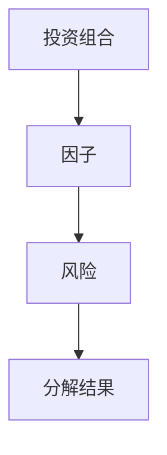

                 


# 风险因子分解：深入理解投资组合风险来源

> 关键词：风险因子分解，投资组合风险，风险来源，因子模型，投资组合优化

> 摘要：本文深入探讨风险因子分解的核心概念、算法原理、系统设计及项目实战，帮助读者理解投资组合风险的来源，并掌握如何通过因子分解优化投资组合。

---

## 第一部分: 风险因子分解基础

### 第1章: 风险因子分解概述

#### 1.1 风险因子分解的定义与背景

投资组合风险是投资者关注的核心问题之一。通过风险因子分解，可以将投资组合的风险来源分解为多个可解释的因子，从而更好地理解和管理风险。本文将从定义、背景和实际应用三个方面介绍风险因子分解。

##### 1.1.1 投资组合风险的定义
投资组合风险是指在一定时间段内，投资组合收益的波动性。风险因子分解通过量化这些波动，帮助投资者识别和管理风险。

##### 1.1.2 风险因子分解的背景与意义
随着金融市场的发展，投资者需要更精细的方法来管理风险。风险因子分解提供了一种系统的方法，将复杂的市场风险分解为几个关键因子，便于分析和优化。

##### 1.1.3 风险因子分解的实际应用案例
例如，投资经理可以通过风险因子分解识别市场波动的主要驱动因素，从而调整投资组合以降低风险。

#### 1.2 投资组合风险的来源

##### 1.2.1 市场风险
市场风险是投资组合中不可 diversifiable 的风险，如市场波动、经济周期等。

##### 1.2.2 信用风险
信用风险是指债券发行人违约的风险，主要影响固定收益类资产。

##### 1.2.3 流动性风险
流动性风险是指资产在短时间内无法以合理价格变现的风险。

##### 1.2.4 操作风险
操作风险是指由于内部流程、人员或系统缺陷导致的损失风险。

#### 1.3 风险因子分解的核心概念

##### 1.3.1 风险因子的定义与分类
风险因子是对投资组合收益变化有显著影响的因素，如市场指数、行业因子、风格因子等。

##### 1.3.2 风险因子分解的目标与方法
目标是将投资组合收益分解为多个因子的贡献，方法包括线性回归、主成分分析（PCA）等。

##### 1.3.3 风险因子分解的边界与外延
明确因子分解的范围和适用场景，避免过度分解导致的模型过拟合。

---

### 第2章: 风险因子分解的核心概念与联系

#### 2.1 风险因子分解的原理

##### 2.1.1 风险因子分解的数学模型
风险因子分解通常采用多因子模型，如Fama-French三因子模型。模型公式为：
$$
R_i = \alpha_i + \beta_{i1}F_1 + \beta_{i2}F_2 + \cdots + \beta_{ik}F_k + \epsilon_i
$$
其中，$R_i$为资产i的收益，$F_j$为因子j，$\beta_{ij}$为因子暴露，$\epsilon_i$为残差。

##### 2.1.2 风险因子分解的算法流程
1. 收集数据：获取投资组合的历史收益和因子数据。
2. 数据预处理：标准化、去异常值。
3. 因子选择：基于相关性或显著性筛选因子。
4. 模型构建：使用回归模型分解因子贡献。
5. 结果分析：解读因子对收益的贡献。

##### 2.1.3 风险因子分解的实现步骤
- 数据清洗：处理缺失值和异常值。
- 因子选择：使用相关性分析选择因子。
- 模型构建：采用线性回归或PCA进行因子分解。

#### 2.2 风险因子分解的核心要素

##### 2.2.1 风险因子的特征与属性
- 相关性：因子间的相关性影响分解效果。
- 显著性：因子对收益的显著性影响。

##### 2.2.2 风险因子之间的关系
通过因子相关矩阵，可以分析因子之间的关系，避免多重共线性问题。

##### 2.2.3 风险因子分解的实体关系图



---

### 第3章: 风险因子分解的算法原理

#### 3.1 主成分分析（PCA）

##### 3.1.1 PCA的原理
PCA是一种无监督学习方法，用于降维。通过特征值分解协方差矩阵，提取主要成分。

##### 3.1.2 PCA的实现步骤

1. 标准化数据：确保各变量具有相同的尺度。
2. 计算协方差矩阵：
   $$
   \Sigma = \frac{1}{n-1}\sum_{i=1}^{n}(x_i - \bar{x})(x_i - \bar{x})^T
   $$
3. 特征值分解：求解特征值和特征向量。
4. 选择主成分：选取前k个主成分。

##### 3.1.3 PCA的代码实现

```python
import numpy as np
from sklearn.decomposition import PCA

# 示例数据
X = np.array([[2.5, 2.4],
              [4.7, 7.3],
              [3.6, 3.8],
              [3.0, 4.0],
              [2.6, 5.2]])

# 标准化数据
X_normalized = (X - X.mean(axis=0)) / X.std(axis=0)

# PCA分解
pca = PCA(n_components=2)
principal_components = pca.fit_transform(X_normalized)

print("主成分矩阵：\n", pca.components_)
print("特征值：\n", pca.explained_variance_ratio_)
```

---

## 总结

本文详细介绍了风险因子分解的核心概念、算法原理和系统设计，通过实际案例展示了如何应用因子分解优化投资组合。接下来，将进一步探讨系统架构设计和项目实战，确保读者能够全面掌握风险因子分解的应用方法。

