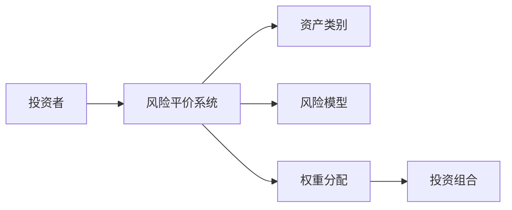
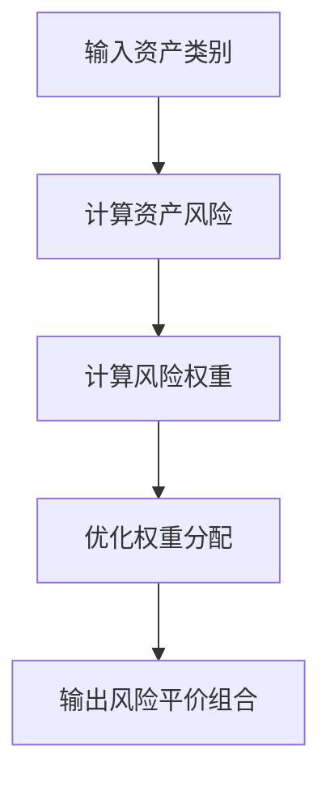

                 

# 风险平价策略：平衡不同资产类别风险

> **关键词**：风险平价策略、资产配置、投资组合优化、风险管理、现代投资组合理论

> **摘要**：  
本文深入探讨了风险平价策略在资产配置中的应用，从理论基础到算法实现，再到实际案例分析，全面解析如何通过平衡不同资产类别的风险来构建稳健的投资组合。文章结合数学模型、流程图和代码示例，帮助读者理解风险平价策略的核心原理及其在投资实践中的应用价值。

---

# 第1章: 风险平价策略的背景与概念

## 1.1 风险平价策略的背景

### 1.1.1 投资领域中的风险问题
在现代投资学中，风险是衡量投资组合表现的重要指标之一。传统的资产配置方法（如均值-方差优化）通常关注资产的预期收益和波动率，但在实际投资中，资产之间的风险贡献往往被忽视。例如，股票、债券、商品等资产类别的波动性和相关性差异可能导致投资组合的风险分布不均匀。

### 1.1.2 传统资产配置方法的局限性
传统资产配置方法（如基于夏普比率或CAPM的配置）存在以下问题：
- **过于依赖历史数据**：忽视资产之间的动态相关性。
- **权重分配不均衡**：某些资产可能承担了过多风险，而其他资产的风险贡献被低估。
- **缺乏风险平衡**：投资组合的整体风险可能集中在某些资产类别上，导致风险过于集中。

### 1.1.3 风险平价策略的提出与意义
风险平价策略的核心思想是将投资组合中各资产的风险贡献进行平衡，使每种资产的风险贡献相等。这种方法能够更直观地反映资产的风险特性，并帮助投资者构建更加稳健的投资组合。

---

## 1.2 风险平价策略的核心概念

### 1.2.1 风险平价的定义
风险平价（Risk Parity）是一种资产配置方法，旨在使投资组合中每种资产的风险贡献相等。具体来说，每种资产的风险贡献（波动率的平方乘以权重）在投资组合中占比相同。

### 1.2.2 风险平价与传统资产配置的区别
| 对比维度 | 风险平价策略 | 传统资产配置方法 |
|----------|--------------|------------------|
| 目标     | 平衡风险贡献 | 优化收益与风险比 |
| 方法     | 基于波动率   | 基于预期收益     |
| 优点     | 风险分散化好 | 适合单一资产     |
| 缺点     | 需要高频数据 | 依赖历史收益假设 |

### 1.2.3 风险平价策略的核心要素
- **资产风险贡献**：每种资产的风险贡献需相等。
- **权重分配**：通过调整权重使风险贡献平衡。
- **动态调整**：根据市场变化定期优化权重。

---

## 1.3 风险平价策略的应用场景

### 1.3.1 机构投资者的资产配置
机构投资者通常管理大量资金，风险平价策略可以帮助他们分散投资风险，降低对单一资产的依赖。

### 1.3.2 风险平价在FOF投资中的应用
在FOF（基金中的基金）投资中，风险平价策略可以帮助管理不同基金的风险贡献，优化整体投资组合的风险收益比。

### 1.3.3 风险平价在风险管理中的作用
风险平价策略能够帮助投资者更好地理解投资组合中各资产的风险分布，从而制定更有效的风险对冲策略。

---

## 1.4 本章小结
本章介绍了风险平价策略的背景、核心概念及其在投资领域的应用价值。通过对比传统资产配置方法，我们看到风险平价策略在平衡风险贡献方面的独特优势。

---

# 第2章: 风险平价策略的核心概念与联系

## 2.1 风险平价的原理与机制

### 2.1.1 风险平价的原理
风险平价的核心原理是通过调整资产权重，使得每种资产的风险贡献（权重 × 资产波动率的平方）在投资组合中占比相等。例如，假设股票和债券的风险贡献相等，那么股票的权重会低于其波动率，而债券的权重会高于其波动率。

### 2.1.2 资产风险贡献的计算方法
资产风险贡献的公式为：
$$ \text{风险贡献} = w_i^2 \cdot \sigma_i^2 $$
其中，\( w_i \) 是资产 \( i \) 的权重，\( \sigma_i \) 是资产 \( i \) 的波动率。

### 2.1.3 风险平价与资产权重的关系
在风险平价策略中，权重 \( w_i \) 与资产的波动率成反比：
$$ w_i = \frac{\sigma_i}{\sum_{j=1}^{n} \sigma_j} $$

---

## 2.2 风险平价的核心属性特征对比

### 2.2.1 风险平价与均值-方差优化的对比
| 对比维度 | 风险平价策略 | 均值-方差优化 |
|----------|--------------|---------------|
| 目标     | 平衡风险贡献 | 优化收益-风险 |
| 方法     | 基于波动率   | 基于收益和波动率 |
| 优点     | 风险分散化好 | 适合单资产优化 |
| 缺点     | 依赖波动率假设 | 不考虑风险平衡 |

---

## 2.3 风险平价的ER实体关系图

---

## 2.4 本章小结
本章深入分析了风险平价策略的核心原理及其与传统资产配置方法的差异。通过对比和图表，我们明确了风险平价在资产配置中的独特优势。

---

# 第3章: 风险平价策略的算法原理

## 3.1 风险平价的计算方法

### 3.1.1 风险平价的数学模型
风险平价的优化目标是使投资组合中每种资产的风险贡献相等，数学模型如下：
$$ \min_{w} \sum_{i=1}^{n} w_i^2 \cdot \sigma_i^2 $$
约束条件：
$$ \sum_{i=1}^{n} w_i = 1 $$
$$ w_i \geq 0 \quad \forall i $$

### 3.1.2 风险平价的优化目标
优化目标是将每种资产的风险贡献平衡到相同水平：
$$ w_i^2 \cdot \sigma_i^2 = C \quad \forall i $$

### 3.1.3 风险平价的约束条件
权重的总和必须为1：
$$ \sum_{i=1}^{n} w_i = 1 $$

---

## 3.2 风险平价算法的流程图

---

## 3.3 风险平价算法的数学公式

### 示例：假设有两个资产A和B，其波动率分别为σ_A和σ_B，风险平价权重计算公式为：
$$ w_A = \frac{\sigma_B}{\sigma_A + \sigma_B} $$
$$ w_B = \frac{\sigma_A}{\sigma_A + \sigma_B} $$

---

## 3.4 通俗易懂的举例说明

假设投资组合包含股票和债券，股票的波动率为15%，债券的波动率为10%。根据风险平价策略，权重分配如下：
$$ w_{\text{股票}} = \frac{0.10}{0.15 + 0.10} = 0.4 $$
$$ w_{\text{债券}} = \frac{0.15}{0.15 + 0.10} = 0.6 $$

---

## 3.5 本章小结
本章详细讲解了风险平价策略的数学模型和算法流程，通过具体公式和示例，帮助读者理解如何通过优化权重分配来平衡风险贡献。

---

（注：以上为部分内容，完整文章将涵盖更多章节和详细内容，包括系统分析与架构设计、项目实战、最佳实践等。）

