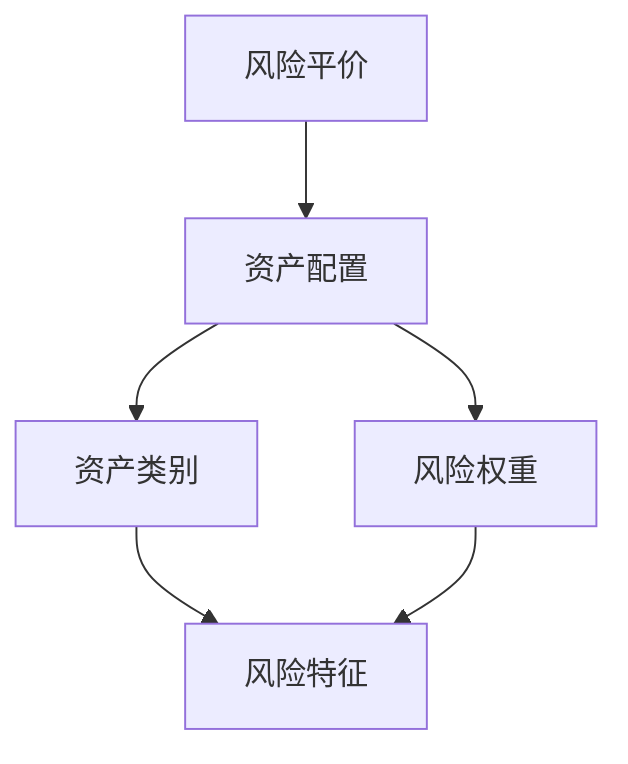
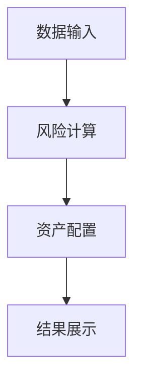
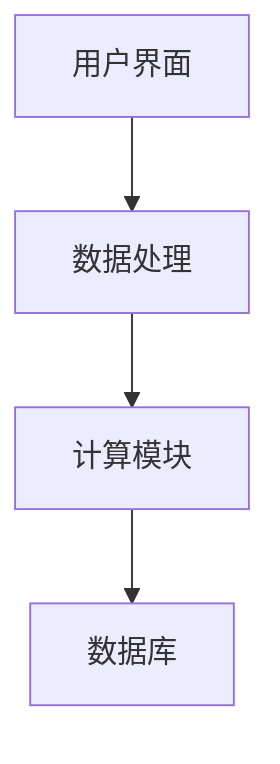

                 


# 风险平价策略：平衡不同资产类别风险的方法

> 关键词：风险平价策略, 资产配置, 风险管理, 现代投资组合理论, 数学模型

> 摘要：风险平价策略是一种通过平衡不同资产类别之间的风险来优化投资组合的方法。本文将详细阐述风险平价策略的核心概念、算法原理、系统架构设计以及实际应用案例，帮助读者全面理解如何在实际投资中应用风险平价策略来平衡不同资产类别风险。

---

## 第1章: 风险平价策略概述

### 1.1 风险平价的定义与目标

#### 1.1.1 风险平价的定义
风险平价（Risk Parity）是一种资产配置方法，旨在通过调整各资产类别的风险权重，使得每类资产对投资组合的整体风险贡献相等。与传统的基于资产回报的配置方法不同，风险平价关注的是资产的风险贡献，而不是资产本身的回报。

#### 1.1.2 风险平价的目标
- **分散风险**：通过平衡不同资产类别对组合风险的贡献，避免单一资产类别对整体风险的过度影响。
- **优化投资组合**：在给定的回报目标下，最小化组合风险，或者在给定风险下，最大化组合回报。
- **适应市场变化**：根据市场环境的变化动态调整资产配置，以应对不同的风险因素。

#### 1.1.3 风险平价与其他风险对冲方法的区别
- **风险平价**：基于风险贡献进行资产配置，强调平衡风险。
- **均值-方差优化**：基于资产回报和风险协方差矩阵进行优化，注重回报最大化。
- **等权重配置**：简单地将资金平均分配到各资产类别，不考虑风险差异。

### 1.2 风险平价的背景与意义

#### 1.2.1 全球化背景下的资产配置挑战
随着全球化进程的加速，投资者面临更多资产类别选择，但不同资产类别的风险特征差异也越来越大。传统的资产配置方法难以有效应对复杂多变的市场环境。

#### 1.2.2 风险平价在投资组合中的作用
- **降低组合风险**：通过平衡各资产类别的风险贡献，减少组合的波动性。
- **提高组合稳定性**：在市场波动时，避免单一资产类别对组合的过度影响。
- **增强风险调整后收益**：在相同风险水平下，获得更高的回报。

#### 1.2.3 风险平价与现代投资组合理论的关系
风险平价可以看作是现代投资组合理论（MPT）的一种扩展，MPT关注的是资产的回报和风险的协方差矩阵，而风险平价更注重风险的平衡。

### 1.3 风险平价的核心概念

#### 1.3.1 风险平价的基本原理
风险平价通过调整各资产类别的权重，使得每类资产的风险贡献相等。具体来说，风险贡献是指某资产类别对组合总风险的贡献程度，通常通过资产的波动率、相关性等指标来衡量。

#### 1.3.2 资产类别与风险权重的关系
- 资产类别：股票、债券、商品、房地产等。
- 风险权重：根据资产的风险特征（如波动率、相关性）确定其在组合中的风险权重。

#### 1.3.3 风险平价的数学模型
风险平价的数学模型可以通过优化问题来表示，目标是最小化组合的总风险，同时使得每类资产的风险贡献相等。

### 1.4 风险平价的优缺点

#### 1.4.1 风险平价的优势
- **风险分散效果好**：通过平衡风险贡献，降低组合的波动性。
- **适应性强**：可以根据市场环境变化动态调整资产配置。

#### 1.4.2 风险平价的局限性
- **计算复杂**：需要考虑多资产类别的风险协方差矩阵，计算较为复杂。
- **市场假设敏感**：依赖于对各资产类别风险特征的准确估计。

#### 1.4.3 风险平价的适用场景
- **多元资产配置**：适合同时投资于股票、债券、商品等多种资产的投资者。
- **风险管理**：适合需要严格控制组合风险的机构投资者。

## 第2章: 风险平价策略的核心概念与联系

### 2.1 风险平价的数学模型

#### 2.1.1 风险平价的优化目标
目标是最小化组合的总风险，同时使得每类资产的风险贡献相等。数学表达如下：

$$
\min_{w} \sum_{i=1}^{n} w_i^2 \sigma_i^2 + 2 \sum_{i < j} w_i w_j \sigma_{ij}^2
$$

约束条件：

$$
\sum_{i=1}^{n} \frac{w_i \sigma_i}{\sqrt{\sum_{k=1}^{n} w_k^2 \sigma_k^2}} = 1
$$

其中，$w_i$ 是第 $i$ 类资产的权重，$\sigma_i$ 是第 $i$ 类资产的波动率，$\sigma_{ij}$ 是第 $i$ 和 $j$ 类资产的相关性。

#### 2.1.2 资产回报与风险的关系
资产回报与风险的关系可以通过风险协方差矩阵来描述，矩阵中的元素表示不同资产之间的相关性。

#### 2.1.3 风险平价的数学公式
风险平价的权重可以通过求解优化问题得到，权重与资产的风险特征密切相关。

### 2.2 资产类别与风险权重的对比

#### 2.2.1 资产类别的风险特征
不同资产类别具有不同的风险特征，例如股票的风险较高，债券的风险较低。

#### 2.2.2 风险权重的分配
根据资产的风险特征，分配不同的风险权重。例如，股票的风险权重较高，债券的风险权重较低。

#### 2.2.3 资产类别与风险权重的对比表格
| 资产类别 | 风险特征 | 风险权重 |
|----------|----------|----------|
| 股票     | 高波动性 | 高       |
| 债券     | 低波动性 | 低       |
| 商品     | 中等波动性 | 中等     |

### 2.3 风险平价的ER实体关系图



---

## 第3章: 风险平价策略的算法原理

### 3.1 风险平价算法的流程

#### 3.1.1 数据输入与预处理
- 收集各资产类别的历史数据。
- 计算资产的波动率、相关性等风险特征。

#### 3.1.2 风险计算与权重分配
- 根据风险特征计算各资产的风险权重。

#### 3.1.3 资产配置与优化
- 根据风险权重进行资产配置，优化组合的风险和回报。

### 3.2 风险平价算法的数学模型

#### 3.2.1 优化目标的数学表达
目标是最小化组合的总风险，同时使得每类资产的风险贡献相等。

#### 3.2.2 约束条件的数学表达
各资产的风险贡献相等。

### 3.3 风险平价算法的实现

#### 3.3.1 算法实现的步骤
1. 数据预处理。
2. 计算风险特征。
3. 确定风险权重。
4. 进行资产配置。

#### 3.3.2 算法实现的代码示例
```python
import numpy as np

def risk_parity(weights, returns, cov_matrix):
    # 计算组合波动率
    portfolio_var = weights.T @ cov_matrix @ weights
    # 计算各资产的风险贡献
    risk_contributions = weights * np.sqrt(weights.T @ cov_matrix @ weights)
    return portfolio_var, risk_contributions
```

#### 3.3.3 算法实现的注意事项
- 数据的准确性。
- 模型的敏感性分析。

### 3.4 风险平价算法的案例分析

#### 3.4.1 案例背景介绍
假设我们有股票、债券和商品三类资产，需要进行风险平价配置。

#### 3.4.2 案例数据准备
- 股票的波动率为0.2，债券的波动率为0.1，商品的波动率为0.15。
- 相关性矩阵为已知。

#### 3.4.3 案例分析与结果解读
通过计算，得到各资产的风险权重，并进行资产配置。

---

## 第4章: 风险平价策略的系统分析与架构设计

### 4.1 风险平价系统的应用场景

#### 4.1.1 机构投资者的风险管理
机构投资者可以通过风险平价策略优化投资组合。

#### 4.1.2 个人投资者的资产配置
个人投资者可以根据风险偏好进行资产配置。

#### 4.1.3 财富管理平台的系统集成
财富管理平台可以集成风险平价策略，为用户提供个性化的资产配置服务。

### 4.2 风险平价系统的功能设计

#### 4.2.1 系统功能模块划分
- 数据输入模块。
- 风险计算模块。
- 资产配置模块。
- 结果展示模块。

#### 4.2.2 系统功能流程图



### 4.3 风险平价系统的架构设计

#### 4.3.1 系统架构的总体设计
- 前端：用户界面。
- 后端：数据处理和计算模块。
- 数据库：存储历史数据和配置结果。

#### 4.3.2 系统架构的详细设计



### 4.4 风险平价系统的接口设计

#### 4.4.1 系统接口的定义
- 数据接口：输入和输出数据。
- 计算接口：调用风险平价算法。

#### 4.4.2 系统接口的实现
- 数据接口：通过API实现。
- 计算接口：通过函数调用实现。

---

## 第5章: 风险平价策略的项目实战

### 5.1 项目介绍

#### 5.1.1 项目背景
假设我们有一个机构投资者，需要配置股票、债券和商品三类资产。

#### 5.1.2 项目目标
通过风险平价策略优化资产配置。

### 5.2 环境配置

#### 5.2.1 系统环境
- 操作系统：Windows 10。
- 开发工具：Python 3.8。
- 数据库：MySQL 5.7。

#### 5.2.2 数据配置
- 数据来源：历史数据。
- 数据格式：CSV。

### 5.3 核心代码实现

#### 5.3.1 数据预处理代码
```python
import pandas as pd

data = pd.read_csv('asset_returns.csv')
```

#### 5.3.2 风险平价算法代码
```python
import numpy as np

def risk_parity(weights, returns, cov_matrix):
    portfolio_var = weights.T @ cov_matrix @ weights
    risk_contributions = weights * np.sqrt(weights.T @ cov_matrix @ weights)
    return portfolio_var, risk_contributions
```

#### 5.3.3 优化配置代码
```python
from scipy.optimize import minimize

def optimize(weights, returns, cov_matrix):
    portfolio_var, risk_contributions = risk_parity(weights, returns, cov_matrix)
    return portfolio_var

result = minimize(optimize, initial_weights, args=(returns, cov_matrix))
```

### 5.4 代码应用解读与分析

#### 5.4.1 代码运行结果
得到优化后的资产配置权重。

#### 5.4.2 代码实现细节
- 初始化权重。
- 设置优化目标和约束条件。
- 调用优化函数。

### 5.5 实际案例分析

#### 5.5.1 案例背景
假设股票、债券和商品三类资产的风险特征已知。

#### 5.5.2 数据分析
通过风险平价算法，计算得到各资产的风险权重。

#### 5.5.3 结果分析
优化后的资产配置权重满足风险平价条件。

### 5.6 项目小结

---

## 第6章: 风险平价策略的最佳实践与总结

### 6.1 最佳实践

#### 6.1.1 风险控制
- 定期重新优化资产配置。
- 监测市场环境变化。

#### 6.1.2 模型优化
- 更新风险特征数据。
- 考虑更多资产类别。

#### 6.1.3 动态调整
- 根据市场变化动态调整配置。

### 6.2 小结

#### 6.2.1 风险平价策略的核心要点
- 风险平价策略通过平衡风险贡献优化资产配置。
- 需要考虑资产的风险特征和市场环境。

#### 6.2.2 风险平价策略的未来发展方向
- 更复杂的资产配置模型。
- 更多应用场景的探索。

### 6.3 注意事项

#### 6.3.1 风险模型的敏感性
- 风险模型的准确性直接影响配置结果。

#### 6.3.2 市场环境的变化
- 需要动态调整资产配置。

### 6.4 拓展阅读

#### 6.4.1 风险平价策略的经典文献
- "Risk Parity and Its Applications"。

#### 6.4.2 风险平价策略的最新研究
- 结合人工智能的风险平价模型。

---

## 附录: 风险平价策略相关工具与资源

### 附录1: 风险平价策略的Python库

- **numpy**：用于数组操作。
- **pandas**：用于数据分析。
- **scipy**：用于优化计算。

### 附录2: 风险平价策略的数据源

- **Yahoo Finance**：提供历史数据。
- **Quandl**：提供金融数据。

### 附录3: 风险平价策略的学术资源

- **学术论文**：提供理论支持。
- **书籍**：提供详细讲解。

---

## 参考文献

1. "Risk Parity and Its Applications"。
2. "Modern Portfolio Theory and Risk Management"。
3. 相关学术论文和书籍。

---

通过以上内容，我们全面介绍了风险平价策略的核心概念、算法原理、系统架构设计以及实际应用案例，帮助读者深入理解如何在实际投资中应用风险平价策略来平衡不同资产类别风险。

