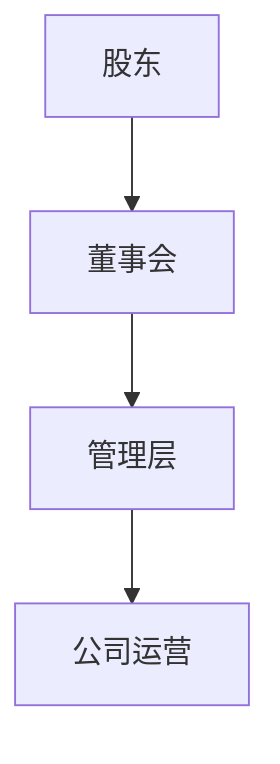
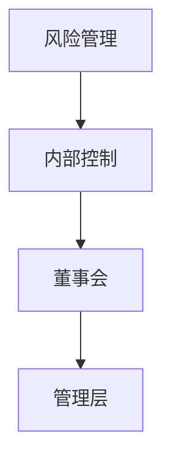

                 

# 马丁·惠特曼的公司治理价值投资：推动管理改善

**关键词：** 公司治理，价值投资，管理改善，财务分析，投资策略

**摘要：** 本文深入探讨了马丁·惠特曼的公司治理价值投资理念，结合理论与实践，分析了其如何通过优化公司治理结构和价值投资策略推动企业管理和绩效的改善。文章从公司治理的基本概念、价值投资的数学模型、系统架构设计到实际案例分析，层层展开，为企业管理者和投资者提供实用的指导和启示。

---

# 第1章 公司治理与价值投资概述

## 1.1 公司治理的定义与重要性

### 1.1.1 公司治理的基本概念
公司治理是确保公司有效运作和股东利益得到保护的制度和机制。它涵盖了董事会、管理层、股东和其他利益相关者之间的关系和责任。有效的公司治理能够提高公司的透明度、责任感和长期稳定性，从而为投资者创造价值。

### 1.1.2 公司治理的核心要素
公司治理的核心要素包括：
1. **董事会结构**：董事会是公司治理的核心，负责监督和指导公司战略、财务和风险管理。
2. **管理层责任**：管理层负责日常运营，确保公司战略的执行和目标的实现。
3. **股东权利**：股东作为公司的所有者，有权参与公司重大决策和收益分配。
4. **内部控制**：通过内部审计、风险管理等机制，确保公司运营的合规性和效率。

### 1.1.3 公司治理的演变与现状
随着全球经济的快速发展和市场环境的变化，公司治理的内涵和实践也在不断演变。现代公司治理更加注重透明度、问责制和利益相关者的平衡，尤其是在数字化和全球化背景下，公司治理的重要性更加凸显。

---

## 1.2 价值投资的基本原理

### 1.2.1 价值投资的定义
价值投资是一种投资策略，强调以低于内在价值的价格购买优质资产。其核心理念是寻找市场上被低估的公司，长期持有，等待其价值回归。

### 1.2.2 价值投资的核心理念
1. **安全边际**：买入价格低于内在价值，以降低投资风险。
2. **长期视角**：关注公司的基本面，而非短期市场波动。
3. **深度分析**：通过财务分析、行业分析等方法，评估公司的竞争优势和未来前景。

### 1.2.3 价值投资与公司治理的关系
价值投资不仅关注公司的财务表现，还注重其治理结构。良好的公司治理是公司长期稳定发展的基础，也是价值投资者选择投资标的的重要考量因素。

---

## 1.3 马丁·惠特曼的投资哲学

### 1.3.1 马丁·惠特曼的生平简介
马丁·惠特曼是一位著名的价值投资者，以其严谨的投资方法和长期的投资业绩著称。他强调对公司基本面的深入研究和对公司治理的关注。

### 1.3.2 马丁·惠特曼的投资策略
惠特曼的投资策略包括：
1. **寻找低估的公司**：重点关注那些市场价格低于内在价值的公司。
2. **注重公司治理**：选择治理结构良好、管理层透明和负责任的公司。
3. **长期持有**：避免频繁交易，降低交易成本，追求长期稳定的收益。

### 1.3.3 马丁·惠特曼的公司治理观点
惠特曼认为，良好的公司治理是公司长期成功的关键。他特别关注董事会的独立性、管理层的问责制以及股东的权益保护。

---

## 1.4 本章小结
本章介绍了公司治理的基本概念和重要性，阐述了价值投资的核心原理，并重点分析了马丁·惠特曼的投资哲学及其对公司治理的重视。下一章将深入探讨公司治理的理论基础，包括股东与管理层的关系、公司治理框架等。

---

# 第2章 公司治理的理论基础

## 2.1 股东与管理层的关系

### 2.1.1 股东的权力与责任
股东作为公司的所有者，享有投票权、分红权和剩余资产分配权。同时，股东也有责任遵守公司章程，支持公司的发展。

### 2.1.2 管理层的职责与义务
管理层负责公司的日常运营，确保公司战略的实施和财务目标的达成。他们需要对股东和董事会负责，履行诚信和勤勉的义务。

### 2.1.3 股东与管理层的利益平衡
股东和管理层的利益有时可能冲突，例如管理层可能追求短期绩效而忽视长期发展。公司治理机制（如股权激励、董事会监督）有助于平衡双方的利益。

---

## 2.2 公司治理的框架与结构

### 2.2.1 股东大会的作用
股东大会是公司最高权力机构，负责选举董事会、审议重大事项等。股东大会的运作需要透明和公正，确保股东的合法权益。

### 2.2.2 董事会的构成与职责
董事会负责指导公司战略、监督管理层和评估公司绩效。董事会应由独立董事和执行董事组成，确保决策的独立性和专业性。

### 2.2.3 监察机制与内部控制
公司需要建立有效的内部控制和监察机制，如内部审计、风险管理等，以确保公司运营的合规性和效率。

---

## 2.3 现代公司治理的挑战

### 2.3.1 全球化背景下的公司治理
全球化使得公司面临更多的跨国监管和文化差异，对公司治理提出了更高的要求。

### 2.3.2 数字化对企业治理的影响
数字化转型改变了企业的运营模式，也对治理结构和决策流程提出了新的挑战。

### 2.3.3 环境、社会与治理（ESG）因素
随着可持续发展理念的兴起，环境、社会和治理因素越来越受到投资者的关注，成为公司治理的重要组成部分。

---

## 2.4 本章小结
本章详细探讨了公司治理的理论基础，包括股东与管理层的关系、公司治理的框架和现代公司治理的挑战。下一章将介绍价值投资的数学模型与分析方法，帮助读者更好地理解和应用这些理论。

---

# 第3章 价值投资的数学模型与分析方法

## 3.1 价值投资的核心数学模型

### 3.1.1 股票内在价值的计算公式
股票的内在价值可以通过现金流折现模型（DCF）计算：

$$
\text{内在价值} = \frac{\text{自由现金流}}{(1 + r)^n}
$$

其中，\( r \) 是折现率，\( n \) 是现金流的期限。

### 3.1.2 现金流折现模型（DCF）
DCF模型通过预测公司未来现金流，并将其折现为现值，评估公司的内在价值。以下是DCF模型的步骤：

1. **预测未来现金流**：基于公司的财务状况和行业趋势，预测未来几年的自由现金流。
2. **确定折现率**：通常使用加权平均资本成本（WACC）作为折现率。
3. **计算现值**：将未来现金流折现为现值。
4. **计算终值**：假设公司在某个时间点后以稳定增长率增长，计算终值。
5. **总价值**：将现值和终值相加，得到公司股票的内在价值。

### 3.1.3 市盈率与市净率的分析
市盈率（P/E）和市净率（P/B）是常用的估值指标：

- 市盈率 = 股价 / 每股收益
- 市净率 = 股价 / 每股净资产

---

## 3.2 股票估值的步骤与方法

### 3.2.1 确定公司的财务状况
分析公司的财务报表，重点关注收入、利润、现金流和资产负债情况。

### 3.2.2 评估公司的竞争优势
分析公司的行业地位、竞争优势和市场前景。

### 3.2.3 考虑宏观经济因素的影响
宏观经济环境（如利率、通货膨胀）对公司估值有重要影响。

---

## 3.3 风险评估与投资组合管理

### 3.3.1 风险的定义与分类
风险是指投资回报的不确定性。常见的风险类型包括市场风险、流动性风险和信用风险。

### 3.3.2 风险调整后的收益模型
通过调整风险溢价，计算风险调整后的收益：

$$
\text{预期收益} = r_f + \beta \times (r_m - r_f)
$$

其中，\( r_f \) 是无风险利率，\( \beta \) 是股票的贝塔系数，\( r_m \) 是市场预期收益。

### 3.3.3 投资组合的优化策略
通过分散投资降低风险，优化投资组合的收益与风险比。

---

## 3.4 本章小结
本章介绍了价值投资的核心数学模型和分析方法，包括内在价值的计算、市盈率和市净率的分析，以及风险评估与投资组合管理。这些方法为投资者提供了科学的估值工具和决策依据。

---

# 第4章 公司治理与价值投资的系统分析

## 4.1 系统分析的基本框架

### 4.1.1 系统分析的概念
系统分析是通过系统的方法，对问题进行分解、分析和综合，以找到最优解决方案。

### 4.1.2 系统分析的步骤
1. **明确目标**：确定分析的目标和范围。
2. **分解问题**：将问题分解为若干子问题。
3. **建立模型**：构建数学模型或流程图。
4. **分析与优化**：通过模型分析，寻找最优解决方案。
5. **实施与验证**：实施解决方案并验证效果。

---

## 4.2 公司治理的系统架构

### 4.2.1 股东、董事会与管理层的关系
通过系统架构图可以看出，股东是公司治理的核心，董事会是治理的关键，管理层是执行的主体。

### 4.2.2 内部控制与风险管理
内部控制是公司治理的重要组成部分，通过建立有效的风险管理机制，降低公司运营风险。

### 4.2.3 信息披露与透明度
透明的信息披露是公司治理的重要保障，通过公开财务信息和公司治理情况，增强投资者信心。

---

## 4.3 价值投资的系统架构

### 4.3.1 财务分析框架
财务分析是价值投资的核心，通过分析公司的财务报表，评估公司的财务健康状况。

### 4.3.2 行业分析框架
行业分析帮助投资者了解公司的行业地位和竞争优势。

### 4.3.3 宏观经济分析框架
宏观经济分析帮助投资者把握整体经济环境对投资的影响。

---

## 4.4 本章小结
本章从系统分析的角度，探讨了公司治理和价值投资的系统架构，强调了各部分之间的相互关系和整体优化的重要性。下一章将通过实际案例分析，展示如何将公司治理与价值投资相结合，推动管理改善。

---

# 第5章 项目实战——价值投资与公司治理的结合

## 5.1 项目背景与目标

### 5.1.1 项目背景
选择一家上市公司作为案例，分析其公司治理结构和财务状况，评估其投资价值。

### 5.1.2 项目目标
通过案例分析，验证马丁·惠特曼的投资理念，评估公司治理对公司价值的影响。

---

## 5.2 系统核心实现

### 5.2.1 数据收集与处理
收集公司的财务报表、治理结构和行业信息，进行数据清洗和整理。

### 5.2.2 财务分析与估值
使用DCF模型计算公司股票的内在价值，并与市场价格进行比较。

### 5.2.3 投资决策支持
基于分析结果，提出投资建议和风险管理策略。

---

## 5.3 项目案例分析

### 5.3.1 案例背景
选择某公司作为案例，分析其公司治理结构和财务状况。

### 5.3.2 案例分析过程
1. **财务分析**：计算公司的内在价值。
2. **治理评估**：评估公司治理结构的优缺点。
3. **投资决策**：基于分析结果，提出投资建议。

### 5.3.3 案例结果
通过分析，得出该公司是否具备投资价值，并提出相应的投资策略。

---

## 5.4 本章小结
本章通过实际案例分析，展示了如何将公司治理与价值投资相结合，推动管理改善。案例分析验证了马丁·惠特曼的投资理念，并为企业管理者和投资者提供了实用的指导。

---

# 第6章 最佳实践与小结

## 6.1 最佳实践 tips
- **持续学习**：不断更新对公司治理和价值投资的理解。
- **注重细节**：深入分析公司的财务状况和治理结构。
- **长期视角**：坚持价值投资理念，避免短期波动的干扰。

## 6.2 小结
本文深入探讨了马丁·惠特曼的公司治理价值投资理念，结合理论与实践，分析了其如何通过优化公司治理结构和价值投资策略推动企业管理和绩效的改善。通过实际案例分析，验证了该理念的有效性，并为企业管理者和投资者提供了实用的指导。

## 6.3 注意事项
- 投资有风险，需谨慎决策。
- 公司治理和价值投资需要结合具体情况进行分析。

## 6.4 拓展阅读
- 《价值投资入门》
- 《公司治理与企业绩效》

---

通过以上内容，读者可以全面了解马丁·惠特曼的公司治理价值投资理念，并将其应用于实际投资和管理实践中。

