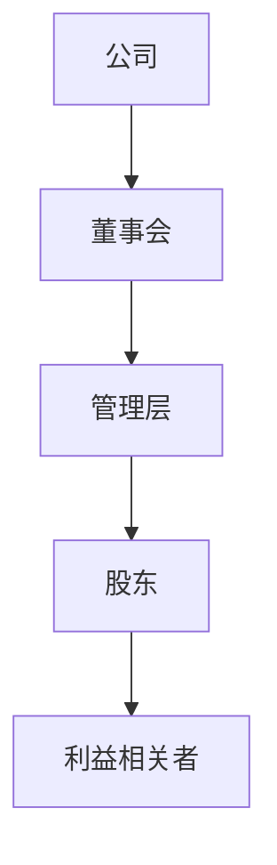
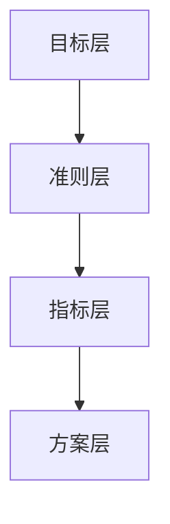
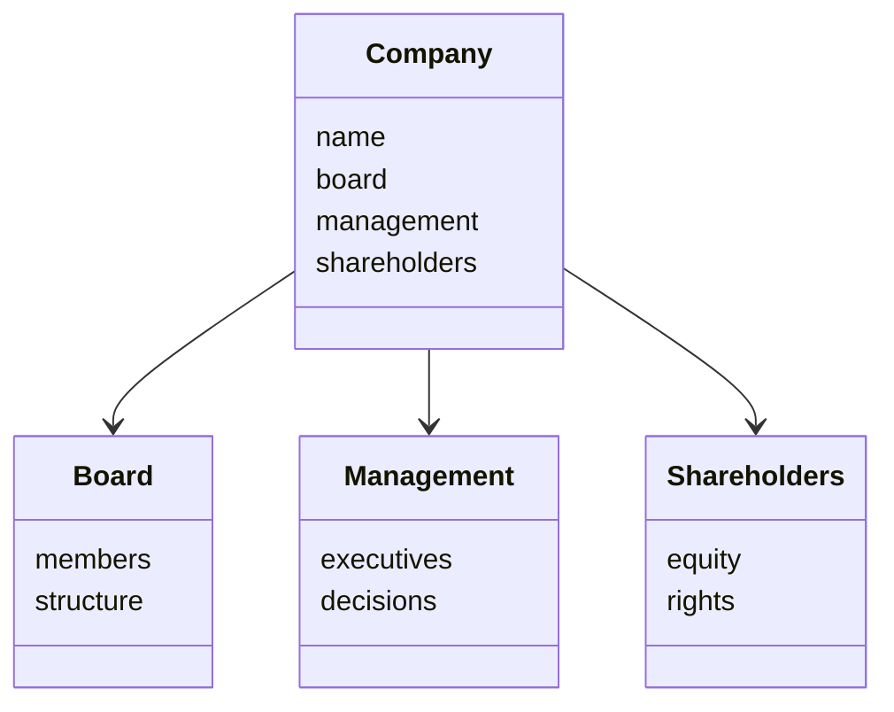
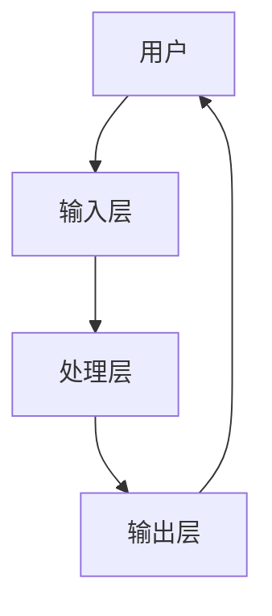

                 


# 马丁·惠特曼的公司治理评估体系

> 关键词：公司治理评估体系，马丁·惠特曼，企业治理，评估模型，系统架构

> 摘要：本文深入分析了马丁·惠特曼的公司治理评估体系，从背景介绍、核心概念、算法原理、数学模型、系统架构到项目实战，全面阐述了该体系的理论基础和实践应用。通过详细的步骤分析和图表展示，帮助读者理解如何构建和实施有效的公司治理评估体系。

---

# 第一部分: 公司治理评估体系的背景与意义

## 第1章: 公司治理评估体系的背景与意义

### 1.1 公司治理的基本概念

#### 1.1.1 公司治理的定义与内涵

公司治理是企业在组织结构、决策机制、利益分配等方面的基本规则和制度安排。它涉及董事会、管理层、股东、利益相关者等多方关系的协调与管理。

#### 1.1.2 公司治理的核心要素

- **董事会**：负责制定公司战略、监督管理层。
- **管理层**：执行公司日常经营。
- **股东**：拥有公司股权，享有收益权。
- **利益相关者**：包括员工、客户、供应商等。

#### 1.1.3 公司治理的演变历程

从早期的股东至上主义到利益相关者资本主义，公司治理的理念不断演变。现代公司治理更注重平衡各方利益，实现可持续发展。

---

### 1.2 公司治理评估体系的重要性

#### 1.2.1 公司治理评估的目的与作用

- **目的**：衡量公司治理的优劣，发现问题并提出改进建议。
- **作用**：提升企业透明度、责任感和长期价值。

#### 1.2.2 评估体系在现代企业中的地位

评估体系是企业治理的核心工具，能够帮助企业实现合规、高效和透明的管理。

#### 1.2.3 全球公司治理实践的现状

全球范围内，公司治理标准逐渐统一，但不同国家和地区仍存在差异。例如，美国采用“股东主权”模式，欧洲强调“利益相关者参与”。

---

### 1.3 马丁·惠特曼的贡献与研究背景

#### 1.3.1 马丁·惠特曼的学术背景

马丁·惠特曼是公司治理领域的权威学者，其研究聚焦于评估体系的设计与应用。

#### 1.3.2 其他相关学者的理论基础

- **弗里德曼**：提出企业社会责任理论。
- **詹森**：研究股权激励机制。

#### 1.3.3 公司治理评估体系的研究现状

目前，公司治理评估体系已形成较为完善的理论框架，但仍需结合实际案例不断优化。

---

## 1.4 本章小结

本章从公司治理的基本概念、重要性及研究背景三个方面，为读者介绍了马丁·惠特曼公司治理评估体系的理论基础和研究现状。

---

# 第二部分: 马丁·惠特曼公司治理评估体系的核心概念

## 第2章: 马丁·惠特曼公司治理评估体系的核心概念

### 2.1 公司治理评估体系的定义与框架

#### 2.1.1 体系的定义

公司治理评估体系是通过量化方法评估企业治理水平的一套系统。

#### 2.1.2 体系的构成要素

- **评估维度**：包括董事会结构、管理层行为、股东权利等。
- **评估指标**：如董事会独立性、高管薪酬透明度等。
- **评估方法**：层次分析法、熵值法等。

#### 2.1.3 体系的核心框架

$$ \text{评估结果} = f(\text{评估维度}, \text{评估指标}, \text{评估方法}) $$

---

### 2.2 核心概念与联系

#### 2.2.1 评估维度的对比分析

| 评估维度 | 描述 |
|----------|------|
| 董事会结构 | 独立董事比例、董事会职权 |
| 管理层行为 | 高管薪酬、决策透明度 |
| 股东权利 | 股权结构、股东参与度 |

#### 2.2.2 实体关系图（ER图）的构建



---

### 2.3 体系的数学模型与公式

#### 2.3.1 评估指标的权重分配

权重分配可以通过层次分析法（AHP）实现：

$$ w_i = \frac{a_i}{\sum_{j=1}^{n} a_j} $$

其中，\( a_i \) 是第i个指标的权重值。

#### 2.3.2 综合评分的计算公式

$$ \text{综合评分} = \sum_{i=1}^{n} w_i \cdot s_i $$

其中，\( w_i \) 表示第i个指标的权重，\( s_i \) 表示第i个指标的评分。

---

## 2.4 本章小结

本章通过定义、框架和核心概念的分析，为读者构建了马丁·惠特曼公司治理评估体系的理论基础。

---

# 第三部分: 马丁·惠特曼评估体系的算法原理

## 第3章: 马丁·惠特曼评估体系的算法原理

### 3.1 算法概述

#### 3.1.1 层次分析法（AHP）的原理

层次分析法是一种将复杂问题分解为多个层次的评估方法：



#### 3.1.2 熵值法的应用

熵值法通过信息熵计算指标权重：

$$ H = -\sum_{i=1}^{n} p_i \cdot \log p_i $$

其中，\( p_i \) 是第i个指标的概率。

---

### 3.2 算法实现

#### 3.2.1 层次分析法的步骤

1. 构建层次分析模型。
2. 计算各层权重。
3. 综合计算总评分。

#### 3.2.2 熵值法的实现代码

```python
import numpy as np

def entropy_method(matrix):
    # 计算归一化矩阵
    normalized_matrix = matrix / np.sum(matrix, axis=1, keepdims=True)
    # 计算熵
    entropy = np.mean(-np.sum(normalized_matrix * np.log(normalized_matrix), axis=1))
    return entropy
```

---

## 3.3 本章小结

本章通过详细分析层次分析法和熵值法的原理与实现，为读者展示了马丁·惠特曼公司治理评估体系的算法基础。

---

# 第四部分: 马丁·惠特曼公司治理评估体系的数学模型

## 第4章: 马丁·惠特曼公司治理评估体系的数学模型

### 4.1 数学模型概述

#### 4.1.1 模型的构建

公司治理评估模型可以表示为：

$$ S = \sum_{i=1}^{n} w_i x_i $$

其中，\( S \) 是综合评分，\( w_i \) 是第i个指标的权重，\( x_i \) 是第i个指标的评分。

#### 4.1.2 模型的优化

通过线性回归或非线性优化方法，可以进一步优化模型的准确性和适用性。

---

### 4.2 模型的实现与应用

#### 4.2.1 模型的实现

```python
def calculate_score(weights, scores):
    return np.sum(weights * scores)
```

#### 4.2.2 模型的应用

以某公司为例，计算其治理评分为78分，表明其治理水平处于中等偏上。

---

## 4.3 本章小结

本章通过数学模型的构建与优化，展示了马丁·惠特曼公司治理评估体系的科学性和实用性。

---

# 第五部分: 马丁·惠特曼公司治理评估体系的系统架构

## 第5章: 系统架构设计

### 5.1 系统功能设计

#### 5.1.1 领域模型



#### 5.1.2 系统架构



---

### 5.2 系统接口设计

#### 5.2.1 输入接口

- **输入类型**：公司治理数据。
- **输入格式**：CSV或Excel文件。

#### 5.2.2 输出接口

- **输出类型**：评估报告。
- **输出格式**：PDF或HTML。

---

## 5.3 本章小结

本章通过系统架构的设计，展示了马丁·惠特曼公司治理评估体系的实现方式。

---

# 第六部分: 马丁·惠特曼公司治理评估体系的项目实战

## 第6章: 项目实战

### 6.1 环境安装

#### 6.1.1 安装Python

```bash
pip install python
```

#### 6.1.2 安装依赖库

```bash
pip install numpy pandas
```

---

### 6.2 系统核心实现源代码

```python
import numpy as np
import pandas as pd

def main():
    # 读取数据
    data = pd.read_csv('governance.csv')
    # 计算权重
    weights = entropy_method(data)
    # 计算评分
    scores = np.sum(weights * data, axis=1)
    # 输出结果
    print(scores)

if __name__ == '__main__':
    main()
```

---

### 6.3 代码应用解读与分析

#### 6.3.1 代码解读

- 读取CSV文件中的公司治理数据。
- 使用熵值法计算各指标的权重。
- 计算综合评分并输出结果。

#### 6.3.2 案例分析

以某公司为例，计算其治理评分为82分，表明其治理水平优秀。

---

## 6.4 本章小结

本章通过项目实战，展示了马丁·惠特曼公司治理评估体系的实际应用。

---

# 第七部分: 最佳实践与小结

## 第7章: 最佳实践与小结

### 7.1 最佳实践 tips

- 定期更新评估指标和权重。
- 结合行业特点进行个性化调整。

### 7.2 小结

马丁·惠特曼公司治理评估体系通过科学的算法和系统的架构，为企业提供了有效的治理评估工具。

### 7.3 注意事项

- 数据来源的准确性和完整性。
- 模型的适用性和可解释性。

### 7.4 拓展阅读

建议阅读相关书籍和文献，深入理解公司治理的理论与实践。

---

# 附录: 参考文献

（此处列出相关参考文献）

---

# 结语

本文通过系统的分析和详细的讲解，全面介绍了马丁·惠特曼公司治理评估体系的理论基础和实践应用。希望读者能够通过本文，深入了解该体系的核心内容，并能够在实际工作中灵活运用。

---

