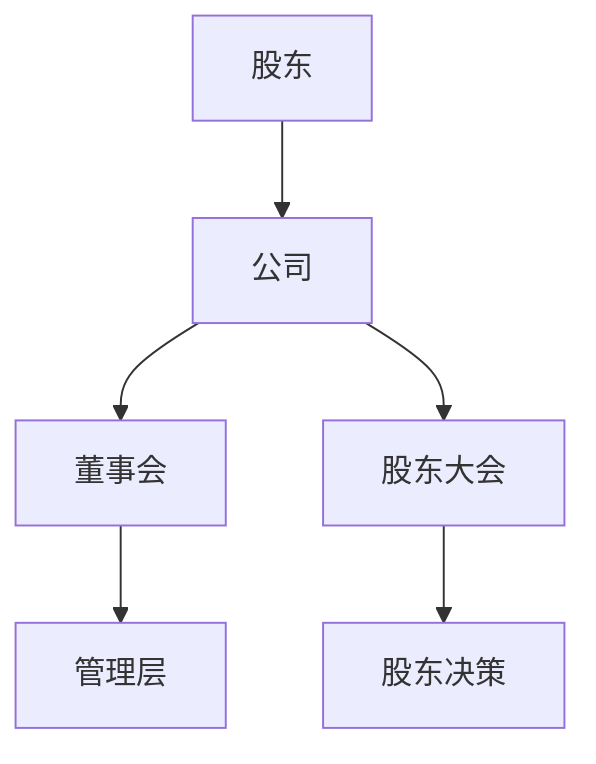

                 

# 积极股东主义投资策略与实践

---

## 关键词：
- 积极股东主义
- 投资策略
- 公司治理
- 股东价值最大化
- 风险管理

---

## 摘要：
积极股东主义是一种投资策略，强调投资者通过持有公司股份，积极参与公司治理，以实现长期的股东价值最大化。本文从积极股东主义的背景、核心概念、策略方法、风险管理到实际案例分析，系统阐述了这一投资理念的理论基础和实践应用。通过对比分析和案例研究，探讨了积极股东主义在不同类型企业中的应用策略，并总结了其在投资实践中的优缺点及未来发展趋势。

---

## 目录

---

### 第一章：积极股东主义的背景与核心理念

#### 1.1 积极股东主义的定义与核心理念
- 1.1.1 积极股东主义的定义
- 1.1.2 积极股东主义的核心理念
- 1.1.3 积极股东主义与传统投资理念的区别

#### 1.2 积极股东主义的历史发展
- 1.2.1 积极股东主义的起源
- 1.2.2 20世纪70年代至90年代的发展
- 1.2.3 21世纪以来的演变

#### 1.3 积极股东主义的理论基础
- 1.3.1 股权投资理论
- 1.3.2 公司治理理论
- 1.3.3 股东价值最大化理论

#### 1.4 本章小结

---

### 第二章：积极股东主义的核心概念与联系

#### 2.1 股东权利与义务
- 2.1.1 股东的基本权利
  - 表决权
  - 监督权
  - 利润分配权
- 2.1.2 股东的义务与责任
  - 遵守公司章程
  - 支持公司决策
- 2.1.3 股东权利的实现方式
  - 表决权的行使
  - 监督权的实施

#### 2.2 公司治理结构与股东角色
- 2.2.1 公司治理的基本架构
  - 股东大会
  - 董事会
  - 管理层
- 2.2.2 股东在公司治理中的地位
  - 股东是公司治理的核心主体
  - 股东通过董事会和管理层实现对公司控制
- 2.2.3 股东与管理层的关系
  - 股东对管理层的监督与激励

#### 2.3 股东价值与公司价值的关系
- 2.3.1 股东价值的定义
  - 股东价值是指股东通过持有公司股份所能获得的经济利益
- 2.3.2 公司价值的衡量标准
  - 市场价值
  - 资产价值
  - 股东权益
- 2.3.3 股东价值与公司价值的动态平衡
  - 长期股东价值最大化是公司治理的目标

#### 2.4 核心概念对比分析
- 2.4.1 股东权利与公司治理的对比
  - 股东权利是公司治理的基础
  - 公司治理是股东权利的实现机制
- 2.4.2 股东价值与公司价值的对比
  - 股东价值是公司价值的一部分
  - 公司价值是股东价值实现的前提
- 2.4.3 积极股东主义与消极股东主义的对比
  - 积极股东主义强调主动参与公司治理
  - 消极股东主义强调被动接受市场波动

#### 2.5 实体关系图（ER图）

#### 2.6 本章小结

---

### 第三章：积极股东主义的策略与方法

#### 3.1 积极股东主义的基本策略
- 3.1.1 股权收购策略
  - 收购目标公司的股权
  - 成为公司的大股东
- 3.1.2 股权增持策略
  - 增持现有股权
  - 提升在股东大会中的影响力
- 3.1.3 股权减持策略
  - 在必要时减持股权
  - 避免过度风险

#### 3.2 不同类型企业的投资策略
- 3.2.1 成熟企业的投资策略
  - 重点参与公司治理
  - 优化公司运营效率
- 3.2.2 成长型企业的投资策略
  - 支持公司扩张
  - 促进技术创新
- 3.2.3 困难企业的投资策略
  - 参与债务重组
  - 优化公司结构

#### 3.3 积极股东主义的风险管理
- 3.3.1 风险评估与识别
  - 市场风险
  - 操作风险
  - 法律风险
- 3.3.2 风险控制策略
  - 分散投资
  - 建立风险预警机制
- 3.3.3 风险应对措施
  - 制定应急预案
  - 寻求专业咨询

#### 3.4 本章小结

---

### 第四章：积极股东主义的案例分析

#### 4.1 经典案例分析
- 4.1.1 IBM的股东维权案例
  - 股东推动管理层变革
  - 提升公司运营效率
- 4.1.2 西门子的股东 activism 案例
  - 参与公司治理
  - 优化公司结构
- 4.1.3 零售业巨头沃尔玛的股东策略
  - 支持公司扩张
  - 促进技术创新

#### 4.2 案例分析的启示
- 4.2.1 成功经验总结
  - 积极参与公司治理
  - 优化公司运营效率
- 4.2.2 教训与反思
  - 风险控制的重要性
  - 长期投资的必要性
- 4.2.3 对未来投资的启示
  - 继续优化公司治理
  - 加强风险控制

#### 4.3 本章小结

---

### 第五章：积极股东主义的未来展望

#### 5.1 未来发展趋势
- 5.1.1 技术驱动的投资策略
  - 利用大数据和人工智能优化投资决策
  - 提高投资效率
- 5.1.2 全球化背景下的投资策略
  - 跨国投资
  - 应对全球经济波动
- 5.1.3 可持续发展与社会责任投资
  - 绿色投资
  - 社会责任投资

#### 5.2 挑战与应对策略
- 5.2.1 挑战
  - 全球经济波动
  - 技术变革的不确定性
- 5.2.2 应对策略
  - 加强风险管理
  - 优化投资组合
  - 提高投资决策的科学性

#### 5.3 本章小结

---

### 附录：积极股东主义投资工具与资源

#### 1. 投资分析工具
- 1.1 股权评估工具
  - 现金流折现法
  - 市盈率法
- 1.2 风险评估工具
  - 风险矩阵
  - 风险地图

#### 2. 资源推荐
- 2.1 经典书籍
  - 《积极股东主义的投资策略》
  - 《公司治理与股东价值最大化》
- 2.2 在线资源
  - 股票市场分析网站
  - 公司治理研究机构

---

### 作者简介

作者马丁·惠特曼是世界级的投资专家，拥有丰富的投资经验，专注于积极股东主义的研究与实践。他通过多年的投资实践，总结出一套系统的积极股东主义投资策略，帮助投资者实现长期的财富增长。

---

### 结语

积极股东主义是一种高效的投资策略，通过积极参与公司治理，优化公司运营，实现股东价值的最大化。本文通过系统的理论分析和实际案例，为投资者提供了宝贵的经验和启示，帮助他们在复杂的市场环境中做出明智的投资决策。

