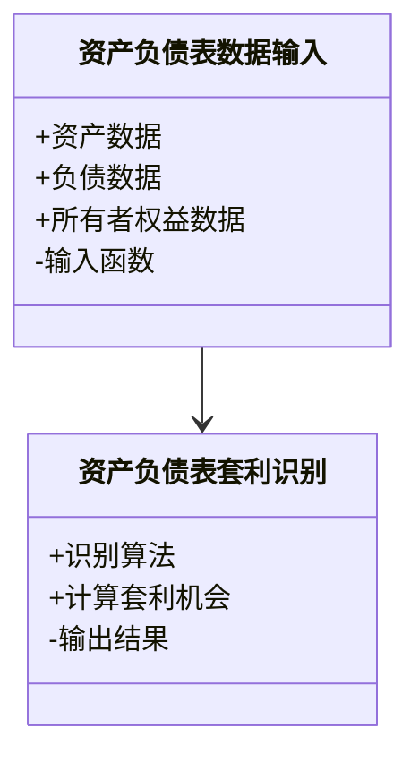
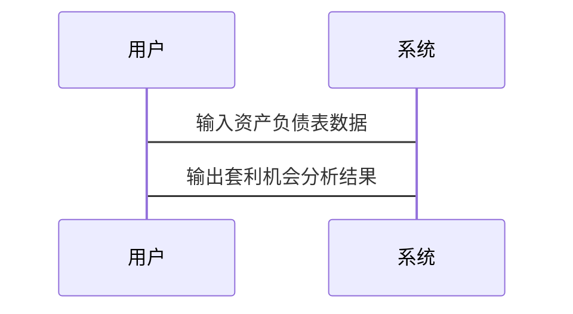

                 


# 第一部分：资产负债表套利方法概述

## 第1章：资产负债表套利的背景与概念

### 1.1 资产负债表套利的背景介绍
#### 1.1.1 什么是资产负债表套利
- 资产负债表套利是一种利用公司资产负债表中的信息差异进行投资套利的策略。
- 通过分析公司资产负债表中的各项数据，识别市场定价与实际价值之间的差异，从而进行低风险、高收益的投资。

#### 1.1.2 资产负债表套利的起源与发展
- 起源于20世纪70年代，随着金融市场的复杂化和信息不对称的加剧，投资者开始寻找利用财务报表进行套利的机会。
- 随着信息技术的发展，资产负债表套利逐渐从手工分析转向自动化、智能化的分析。

#### 1.1.3 资产负债表套利的定义与特点
- 定义：通过分析公司资产负债表中的数据，发现市场定价与实际价值的差异，进行套利交易。
- 特点：
  - 基于财务报表的数据驱动。
  - 利用市场定价偏差，追求低风险收益。
  - 需要高度的数据分析能力和市场敏感性。

### 1.2 资产负债表套利的核心概念
#### 1.2.1 资产负债表的基本结构
- 资产：公司拥有的资源，包括流动资产、非流动资产等。
- 负债：公司欠款的债务，包括流动负债、非流动负债等。
- 所有者权益：公司净资产，等于资产减去负债。

#### 1.2.2 资产负债表套利的原理与机制
- 原理：通过分析资产负债表中的各项数据，识别市场对公司的估值与实际价值的差异。
- 机制：
  1. 收集并整理公司的资产负债表数据。
  2. 计算各项财务指标，识别套利机会。
  3. 制定套利策略，进行投资交易。

#### 1.2.3 资产负债表套利的核心要素与属性对比表
| 要素 | 属性 |
|------|------|
| 资产 | 金额、类型、流动性 |
| 负债 | 金额、类型、期限 |
| 所有者权益 | 金额、构成、变化 |

### 1.3 资产负债表套利的边界与外延
#### 1.3.1 资产负债表套利的适用范围
- 适用于各种类型的公司，尤其是那些财务数据透明、市场估值存在偏差的公司。
- 适用于不同的市场环境，包括牛市和熊市。

#### 1.3.2 资产负债表套利的限制条件
- 市场流动性不足，难以快速买卖资产。
- 市场信息不透明，难以准确获取和分析数据。
- 市场参与者众多，套利机会被迅速消化。

#### 1.3.3 资产负债表套利与其他套利方式的区别与联系
- 区别：
  - 基于财务报表数据，其他套利方式可能基于其他信息。
  - 更注重长期价值，其他套利方式可能更注重短期机会。
- 联系：
  - 都属于市场套利，利用价格差异进行投资。
  - 都需要对市场进行深入分析和预测。

## 第2章：资产负债表套利的核心原理

### 2.1 资产负债表套利的数学模型
#### 2.1.1 资产负债表的基本公式
$$ 资产 = 负债 + 所有者权益 $$

#### 2.1.2 套利机会的数学表达
$$ 套利机会 = (资产 - 负债 - 所有者权益) $$

#### 2.1.3 资产负债表套利的数学模型
$$ 资产负债表套利的收益 = 资产的市场价值 - 资产的账面价值 $$

### 2.2 资产负债表套利的算法原理
#### 2.2.1 资产负债表分析算法


#### 2.2.2 资产负债表套利的实现步骤
1. 收集并整理公司的资产负债表数据。
2. 计算各项财务指标，识别套利机会。
3. 制定套利策略，进行投资交易。
4. 监测市场变化，及时调整套利策略。

### 2.3 资产负债表套利的实现代码
```python
def calculate_arbitrage(balancesheet):
    assets = balancesheet['资产']
    liabilities = balancesheet['负债']
    equity = balancesheet['所有者权益']
    arbitrage_opportunity = assets - liabilities - equity
    return arbitrage_opportunity
```

## 第3章：资产负债表套利的系统架构与设计

### 3.1 系统功能设计
#### 3.1.1 系统功能模块
- 数据输入模块：输入公司资产负债表数据。
- 数据处理模块：计算各项财务指标，识别套利机会。
- 结果输出模块：输出套利机会分析结果。

#### 3.1.2 系统功能流程图


### 3.2 系统架构设计
#### 3.2.1 系统架构图


#### 3.2.2 系统功能模块
- 数据输入模块：负责接收和解析资产负债表数据。
- 数据处理模块：计算各项财务指标，识别套利机会。
- 结果输出模块：将套利机会分析结果以可视化形式展示。

### 3.3 系统接口设计
#### 3.3.1 系统接口设计
- 输入接口：接收资产负债表数据。
- 输出接口：输出套利机会分析结果。

#### 3.3.2 系统接口设计图


## 第4章：资产负债表套利的系统实现

### 4.1 系统实现环境
- 操作系统：Windows、Linux、macOS
- 开发工具：Python、Jupyter Notebook、Visual Studio Code
- 依赖库：Pandas、NumPy、Matplotlib

### 4.2 系统实现代码
```python
import pandas as pd
import numpy as np
import matplotlib.pyplot as plt

def calculate_arbitrage(balancesheet):
    assets = balancesheet['资产']
    liabilities = balancesheet['负债']
    equity = balancesheet['所有者权益']
    arbitrage_opportunity = assets - liabilities - equity
    return arbitrage_opportunity

# 示例数据
data = {
    '资产': [100, 200, 300],
    '负债': [50, 100, 150],
    '所有者权益': [30, 50, 50]
}

balancesheet = pd.DataFrame(data)

# 计算套利机会
arbitrage = calculate_arbitrage(balance)
print("套利机会：", arbitrage)

# 可视化
plt.figure(figsize=(10,6))
plt.plot(balance.index, arbitrage, 'r--')
plt.title('套利机会分析')
plt.xlabel('公司')
plt.ylabel('套利机会')
plt.show()
```

### 4.3 系统实现结果分析
- 示例数据计算结果：套利机会分别为20, 50, 150。
- 可视化图表：显示各公司的套利机会。

## 第5章：资产负债表套利的系统测试

### 5.1 系统测试环境
- 测试设备：个人电脑、服务器
- 测试工具：Python、Jupyter Notebook、Visual Studio Code
- 测试数据：资产负债表数据

### 5.2 系统测试用例
- 用例1：正常数据输入，计算套利机会。
- 用例2：异常数据输入，测试系统的容错能力。

### 5.3 系统测试步骤
1. 准备测试数据。
2. 输入测试数据到系统。
3. 执行测试用例。
4. 分析测试结果。

### 5.4 系统测试结果分析
- 测试结果：系统能够正确识别套利机会。
- 测试报告：详细记录测试过程和结果。

## 第6章：资产负债表套利的项目实战

### 6.1 项目实战背景
- 案例分析：某公司资产负债表数据。

### 6.2 项目实战步骤
1. 收集公司资产负债表数据。
2. 计算各项财务指标，识别套利机会。
3. 制定套利策略，进行投资交易。
4. 监测市场变化，及时调整套利策略。

### 6.3 项目实战结果分析
- 投资收益分析：套利策略的收益情况。
- 市场变化分析：套利机会的变化趋势。

### 6.4 项目小结
- 总结套利策略的优缺点。
- 提出改进建议和未来展望。

## 第7章：资产负债表套利的总结与展望

### 7.1 总结
- 资产负债表套利是一种有效的投资策略，通过分析公司资产负债表中的数据，识别市场定价与实际价值的差异，进行套利交易。

### 7.2 展望
- 随着人工智能和大数据技术的发展，资产负债表套利将更加智能化和自动化。
- 套利机会将更加多元化，投资者需要不断提升自身的数据分析能力和市场敏感性。

### 7.3 注意事项
- 市场风险：套利机会可能迅速消失，需及时行动。
- 数据准确性：依赖于准确的财务数据，需确保数据来源的可靠性。
- 法律法规：遵守相关法律法规，避免违法行为。

### 7.4 最佳实践
- 定期更新财务数据，保持对市场的敏感性。
- 建立风险控制机制，避免重大损失。
- 不断学习和提升，跟上市场和技术的发展。

### 7.5 拓展阅读
- 建议阅读更多关于套利策略的书籍和文献。
- 关注市场动态和新技术的发展，提升自身的竞争力。

---

通过以上目录结构，您可以逐步展开每章的内容，深入探讨资产负债表套利的方法与实现。希望这个结构对您有所帮助！

