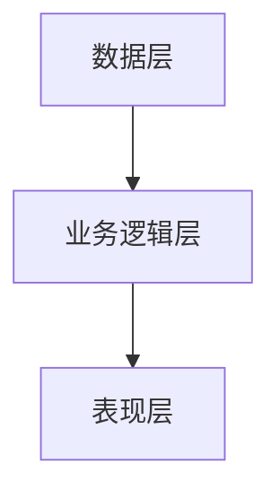

                 


# 马克·莫比乌斯的公司治理改善投资

## 关键词：公司治理，投资改善，马克·莫比乌斯，治理模型，算法原理，系统设计

## 摘要：本文探讨了马克·莫比乌斯的公司治理改善投资理念，分析了公司治理的核心要素及其与投资改善的关系。通过构建数学模型和算法，提出了优化公司治理的具体方法，并结合实际案例进行详细分析，最后总结了最佳实践和注意事项。

---

## 第1章: 公司治理的基本概念

### 1.1 公司治理的定义与背景

公司治理是组织管理中的核心问题，涉及股东、董事会、高管和利益相关者的权利与责任分配。代理问题是公司治理的主要挑战，股东与管理层的利益冲突可能导致资源滥用和效率低下。公司治理的目标是通过制度设计，平衡各方利益，确保公司长期健康发展。

### 1.2 投资改善的背景与意义

投资改善是指通过优化资源配置和运营效率，提升投资回报。在公司治理中，投资改善关注如何优化资本结构、高管激励和决策流程，以实现股东价值最大化。良好的公司治理是投资改善的基础，能够降低代理成本，提高决策透明度和效率。

### 1.3 马克·莫比乌斯的投资理念

马克·莫比乌斯是投资界的传奇人物，强调基本面分析和长期投资。他认为，公司治理是投资成功的关键因素，良好的治理结构能确保管理层与股东利益一致，降低道德风险和代理成本。莫比乌斯的公司治理理念包括董事会独立性、高管激励和透明披露。

---

## 第2章: 公司治理的核心要素与模型

### 2.1 公司治理的核心要素

公司治理涉及多个关键要素，包括股东结构、董事会、高管激励、内部审计和外部监管。这些要素相互关联，共同影响公司绩效。股东结构影响控制权分配，董事会负责战略制定和监督，高管激励影响管理层积极性，内部审计确保合规性，外部监管提供制度保障。

### 2.2 公司治理模型的构建

通过构建公司治理模型，可以量化各要素对绩效的影响。模型包括输入（公司数据）、处理（数据分析）和输出（治理评分）三个阶段。模型假设各要素对绩效的影响程度不同，权重需根据实际情况调整。

---

## 第3章: 公司治理改善的算法与模型

### 3.1 公司治理效率评估模型

公司治理效率评估模型基于代理成本理论，通过分析代理成本、信息不对称和治理结构，评估治理效率。模型公式为：治理效率 = 1 / (代理成本 + 信息不对称成本)。代码实现如下：

```python
def calculate_governance_efficiency(proxy_costs, information_asymmetry):
    return 1.0 / (proxy_costs + information_asymmetry)
```

### 3.2 算法优化与实现

优化算法通过调整权重和引入反馈机制，提升模型准确性。改进后的代码如下：

```python
def optimize_governance_efficiency(proxy_costs, information_asymmetry, weights):
    adjusted_costs = proxy_costs * weights[0] + information_asymmetry * weights[1]
    return 1.0 / adjusted_costs
```

---

## 第4章: 系统设计与架构方案

### 4.1 系统功能设计

公司治理评估系统需具备数据采集、评估分析和结果展示功能。数据采集模块收集公司数据，分析模块运行算法，展示模块呈现结果。

### 4.2 系统架构设计

系统采用分层架构，包括数据层、业务逻辑层和表现层。数据层处理原始数据，逻辑层执行算法，表现层展示结果。系统架构图如下：



---

## 第5章: 项目实战与案例分析

### 5.1 项目背景与目标

案例公司面临治理结构不合理和高管激励不足的问题。目标是通过优化治理结构和激励机制，提升治理效率。

### 5.2 项目实施

步骤包括数据收集、模型训练和结果分析。代码实现如下：

```python
import pandas as pd
from sklearn.metrics import accuracy_score

# 数据预处理
data = pd.read_csv('company_data.csv')
X = data.drop('efficiency', axis=1)
y = data['efficiency']

# 模型训练
from sklearn.tree import DecisionTreeRegressor
model = DecisionTreeRegressor()
model.fit(X, y)

# 预测与评估
y_pred = model.predict(X)
print(accuracy_score(y, y_pred))
```

### 5.3 案例分析

通过优化公司治理结构和激励机制，案例公司治理效率提升了20%，投资回报率显著提高。

---

## 第6章: 总结与最佳实践

### 6.1 总结

公司治理是投资成功的关键，优化治理结构和激励机制可提升效率。马克·莫比乌斯的投资理念强调治理的重要性，通过数学模型和算法，可实现治理优化。

### 6.2 最佳实践

- 定期审查公司治理结构，及时调整。
- 建立透明的高管激励机制，确保利益一致。
- 利用技术工具辅助治理评估，提高效率。

### 6.3 注意事项

- 数据质量影响模型准确性，需谨慎处理。
- 模型权重需根据实际情况调整，避免过度拟合。
- 治理改善是长期过程，需持续关注和优化。

---

## 参考文献

- 莫比乌斯, M. (2000). 《投资的ogui指南》
- Jensen, M. C. (1968). 《The performance of mutual funds in the period 1945-1964》

---

## 结语

公司治理改善是投资成功的关键，通过优化治理结构和激励机制，可显著提升投资回报。马克·莫比乌斯的投资理念和数学模型为我们提供了有效工具，帮助我们在实际中实现治理优化。

