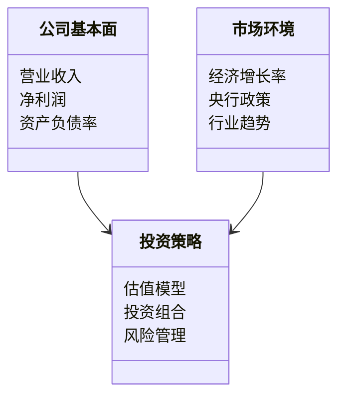
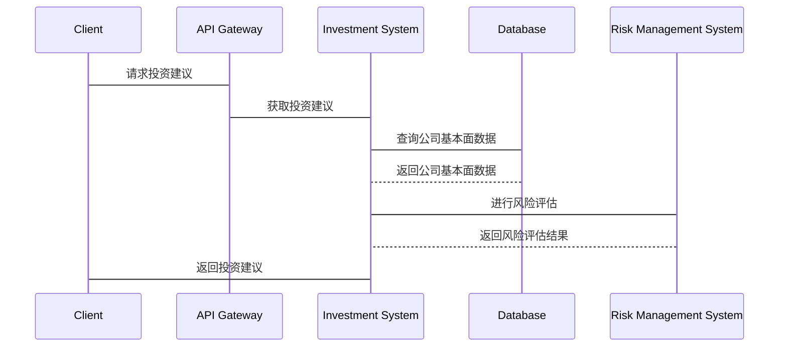

                 


# 马克·莫比乌斯的新兴市场价值投资策略

> **关键词**：新兴市场，价值投资，马克·莫比乌斯，股票估值，风险管理

> **摘要**：本文深入探讨马克·莫比乌斯的新兴市场价值投资策略，分析其核心理念、投资方法和风险管理原则，结合实际案例和系统架构设计，为投资者提供实用的策略和启示。

---

## 第一部分: 新兴市场价值投资的背景与基础

### 第1章: 新兴市场的定义与特点

#### 1.1 新兴市场的定义

**1.1.1 新兴市场的概念与范围**

新兴市场是指那些经济快速发展、但尚未完全 industrialized 的国家的金融市场。这些市场通常具有较大的增长潜力，但同时也伴随着较高的风险。新兴市场的公司可能估值较低，但具有较高的成长性。

**1.1.2 新兴市场与发达市场的区别**

| 属性           | 新兴市场                | 发达市场                |
|-----------------|------------------------|------------------------|
| 经济发展水平     | 中等或较低             | 高                     |
| 市场成熟度       | 不成熟                | 成熟                  |
| 投资风险         | 高                    | 低                    |
| 市场流动性       | 低或中等               | 高                    |

**1.1.3 新兴市场的经济特征**

新兴市场的经济特征包括：

- 多样化的产业结构
- 较高的经济增长率
- 不稳定的货币政策
- 较高的外部依赖性

#### 1.2 新兴市场的投资机会

**1.2.1 新兴市场的增长潜力**

新兴市场的增长潜力主要体现在以下几个方面：

- 人口红利：新兴市场国家通常人口年轻，劳动力充足。
- 消费升级：随着经济的发展，中产阶级崛起，消费需求增长。
- 创新驱动：新兴市场在技术创新、产业升级方面有较大的空间。

**1.2.2 新兴市场的行业分布**

新兴市场的行业分布具有以下特点：

- 制造业：新兴市场国家通常以制造业为主导，尤其是劳动密集型产业。
- 信息技术：随着全球化的推进，信息技术产业在新兴市场中发展迅速。
- 金融服务：金融行业在新兴市场中也具有较大的发展空间。

**1.2.3 新兴市场的政策环境**

新兴市场的政策环境具有以下特点：

- 经济政策：新兴市场国家通常采取积极的财政政策和货币政策，以促进经济增长。
- 外资政策：对外资的限制较多，但也有一定的优惠政策。
- 产业政策：政府通常会对重点产业给予支持。

### 第2章: 价值投资的基本原理

#### 2.1 价值投资的核心理念

**2.1.1 价值投资的定义**

价值投资是一种以公司基本面分析为基础的投资策略，旨在以低于公司内在价值的价格买入股票，并长期持有，以获得超额收益。

**2.1.2 价值投资的主要原则**

- 买入低于内在价值的股票
- 长期持有优质资产
- 重视公司基本面分析
- 风险控制

**2.1.3 价值投资与新兴市场的结合**

在新兴市场中，价值投资的核心理念仍然适用，但需要考虑新兴市场的特殊性。例如，新兴市场的公司可能具有较高的成长性，但同时也面临更高的经营风险。

#### 2.2 股票估值的基本方法

**2.2.1 市盈率（P/E）的计算与应用**

市盈率（P/E）是衡量股票估值的重要指标之一，计算公式为：

$$ P/E = \frac{\text{股价}}{\text{每股净利润}} $$

市盈率越低，表明股票的估值可能越低，投资价值越大。

**2.2.2 市净率（P/B）的计算与应用**

市净率（P/B）是另一个常用的估值指标，计算公式为：

$$ P/B = \frac{\text{股价}}{\text{每股净资产}} $$

市净率越低，通常表明股票的估值越低，投资价值越大。

**2.2.3 股息率的计算与应用**

股息率是衡量股票收益能力的重要指标，计算公式为：

$$ 股息率 = \frac{\text{每股股息}}{\text{股价}} \times 100\% $$

股息率越高，表明股票的收益能力越强，但同时也可能意味着公司缺乏再投资的机会。

### 第3章: 马克·莫比乌斯的投资哲学

#### 3.1 马克·莫比乌斯的生平简介

**3.1.1 马克·莫比乌斯的教育背景**

马克·莫比乌斯（Mark Mobius）是美国著名的投资专家，专注于新兴市场投资。他拥有加州大学洛杉矶分校（UCLA）的经济学博士学位。

**3.1.2 马克·莫比乌斯的职业生涯**

马克·莫比乌斯的职业生涯始于1970年代，他曾在美国银行和美林证券工作，后来创立了自己的投资公司——莫比乌斯资本。

**3.1.3 马克·莫比乌斯的成就与影响力**

马克·莫比乌斯以其在新兴市场投资领域的卓越表现而闻名。他撰写了多本关于新兴市场投资的书籍，并在全球范围内推广价值投资理念。

#### 3.2 马克·莫比乌斯的投资理念

**3.2.1 长期投资的重要性**

马克·莫比乌斯强调长期投资的重要性。他认为，短期市场的波动性较大，但长期来看，公司的基本面才是决定股票价格的主要因素。

**3.2.2 买入低估股票的策略**

莫比乌斯的策略是买入那些市场价格低于内在价值的股票。他特别关注那些在新兴市场中具有强大竞争优势的公司。

**3.2.3 风险管理的必要性**

莫比乌斯认为，风险管理是投资成功的关键。他建议投资者在投资组合中分散风险，并定期评估和调整投资策略。

---

## 第二部分: 新兴市场价值投资的策略与方法

### 第4章: 新兴市场的行业分析

#### 4.1 新兴市场的行业分布

**4.1.1 制造业的分析**

制造业在新兴市场中占据重要地位。随着全球化的推进，新兴市场国家的制造业竞争力逐渐增强。

**4.1.2 信息技术行业的分析**

信息技术行业在新兴市场中发展迅速。随着互联网的普及，新兴市场国家在信息技术领域的投资不断增加。

**4.1.3 金融行业的分析**

金融行业在新兴市场中也具有较大的发展空间。随着经济的发展，金融行业的重要性日益凸显。

#### 4.2 新兴市场的行业选择标准

**4.2.1 行业的周期性分析**

在选择行业时，需要考虑行业的周期性。周期性较强的行业在经济 downturn 时可能面临较大的风险。

**4.2.2 行业的竞争格局分析**

竞争格局分析是选择行业的重要步骤。在新兴市场中，具有强大竞争优势的行业更具有投资价值。

**4.2.3 行业的政策影响分析**

政策对行业的影响不容忽视。在新兴市场中，政府的政策对行业的发展具有较大的影响。

### 第5章: 马克·莫比乌斯的投资筛选标准

#### 5.1 股票筛选的基本标准

**5.1.1 股价低于内在价值的判断**

莫比乌斯强调，买入股票时需要确保股价低于公司的内在价值。内在价值可以通过对公司基本面的分析来估算。

**5.1.2 公司财务状况的分析**

财务状况分析是股票筛选的重要步骤。莫比乌斯特别关注公司的盈利能力、资产负债情况和现金流状况。

**5.1.3 管理团队的评估**

管理团队的评估是股票筛选的重要内容。莫比乌斯认为，优秀的管理团队是公司长期发展的关键。

#### 5.2 股票估值模型的应用

**5.2.1 市盈率模型的使用**

市盈率模型是常用的股票估值工具。莫比乌斯通常会比较公司的市盈率与行业平均水平，以判断其估值是否合理。

**5.2.2 市净率模型的使用**

市净率模型也是常用的股票估值工具。莫比乌斯认为，市净率低于行业平均水平的股票具有较大的投资价值。

**5.2.3 股息率模型的使用**

股息率模型可以帮助投资者评估股票的收益能力。莫比乌斯通常会关注股息率较高的股票，但也会考虑公司的成长性。

### 第6章: 新兴市场的风险管理

#### 6.1 风险管理的基本原则

**6.1.1 风险分散的重要性**

风险分散是降低投资风险的重要策略。莫比乌斯建议投资者在不同的行业和市场中分散投资，以降低整体风险。

**6.1.2 风险评估的方法**

风险评估是风险管理的基础。莫比乌斯通常会定期评估投资组合的风险，并根据市场变化进行调整。

**6.1.3 风险控制的策略**

风险控制是投资成功的关键。莫比乌斯建议投资者设定止损点，并在市场波动较大时及时调整投资策略。

#### 6.2 新兴市场的特殊风险

**6.2.1 政治风险的应对**

新兴市场通常面临较高的政治风险。莫比乌斯建议投资者关注政府政策的变化，并在必要时及时调整投资策略。

**6.2.2 经济波动的应对**

经济波动是新兴市场中常见的风险。莫比乌斯建议投资者在经济波动较大时保持冷静，并利用市场的波动性寻找投资机会。

**6.2.3 市场流动性风险的应对**

市场流动性风险是新兴市场中的另一个重要风险。莫比乌斯建议投资者选择流动性较高的股票，并在市场流动性较差时减少投资。

---

## 第三部分: 实战案例与投资策略的实施

### 第7章: 马克·莫比乌斯的经典投资案例

#### 7.1 马克·莫比乌斯的成功案例

**7.1.1 某某公司的投资分析**

以某新兴市场国家的制造业公司为例，分析莫比乌斯的投资决策过程。

**7.1.2 投资决策的关键点**

莫比乌斯在选择投资标的时，通常会关注公司的基本面、行业地位和估值水平。

**7.1.3 投资后的表现分析**

通过分析投资后的表现，验证莫比乌斯投资策略的有效性。

#### 7.2 案例分析的启示

**7.2.1 价值投资的核心要素**

案例分析表明，价值投资的核心要素包括基本面分析、估值判断和风险管理。

**7.2.2 新兴市场的投资机会**

案例分析表明，新兴市场中存在大量投资机会，但需要投资者具备较高的专业素养和风险意识。

---

## 第四部分: 投资策略的系统架构与实现

### 第8章: 系统分析与架构设计方案

#### 8.1 问题场景介绍

新兴市场价值投资需要综合考虑多种因素，包括市场环境、公司基本面、行业趋势等。为了提高投资决策的效率和准确性，可以构建一个系统化的投资框架。

#### 8.2 系统功能设计

**8.2.1 领域模型**

以下是新兴市场价值投资的领域模型：



**8.2.2 系统架构设计**

以下是新兴市场价值投资的系统架构图：


**8.2.3 系统接口设计**

以下是系统接口设计的序列图：



---

## 第五部分: 项目实战与最佳实践

### 第9章: 项目实战

#### 9.1 环境安装

以下是构建投资分析系统的环境要求：

- 操作系统：Linux/Windows/MacOS
- 编程语言：Python 3.8+
- 依赖库：Pandas, NumPy, Matplotlib, Scikit-learn

#### 9.2 系统核心实现源代码

以下是股票估值模型的实现代码：

```python
import pandas as pd
import numpy as np

def calculate_intrinsic_value(company_data):
    # 计算内在价值
    revenue = company_data['revenue']
    net_profit = company_data['net_profit']
    book_value = company_data['book_value']
    
    # 使用市盈率和市净率模型
    pe_ratio = revenue / net_profit
    pb_ratio = book_value / net_profit
    
    # 综合估值
    intrinsic_value = (pe_ratio + pb_ratio) / 2 * net_profit
    
    return intrinsic_value

# 示例数据
company_data = {
    'revenue': 1000000,
    'net_profit': 100000,
    'book_value': 500000
}

intrinsic_value = calculate_intrinsic_value(company_data)
print(f"公司内在价值：{intrinsic_value}")
```

#### 9.3 代码应用解读与分析

以上代码实现了公司内在价值的计算。通过结合市盈率和市净率模型，可以更全面地评估公司的内在价值。投资者可以根据公司的内在价值与市场价格进行对比，判断是否买入。

#### 9.4 实际案例分析和详细讲解剖析

以某新兴市场国家的制造企业为例，分析其内在价值和投资价值。

---

## 第六部分: 小结与展望

### 第10章: 小结与展望

#### 10.1 最佳实践 tips

- **长期投资**：价值投资需要耐心，长期持有优质资产。
- **风险管理**：定期评估投资组合的风险，并及时调整。
- **持续学习**：市场环境不断变化，投资者需要不断学习和适应。

#### 10.2 未来展望

随着全球化的深入和新兴市场的崛起，新兴市场价值投资将变得更加重要。投资者需要关注新兴市场的经济趋势、政策变化和行业动态，以抓住投资机会。

---

通过以上结构和内容的安排，本文系统地介绍了马克·莫比乌斯的新兴市场价值投资策略，结合理论分析、实战案例和系统设计，为投资者提供了全面的指导和启示。

