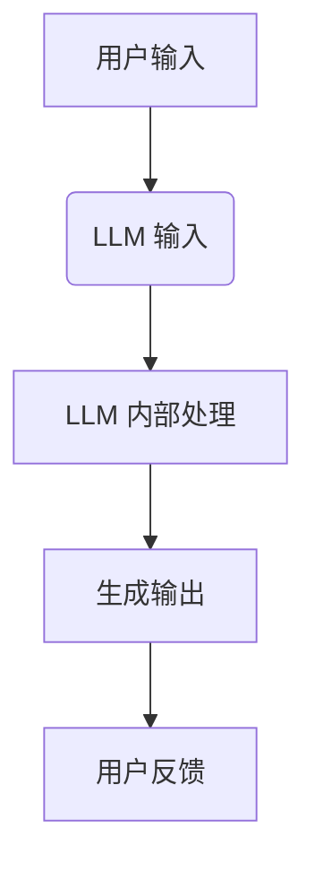
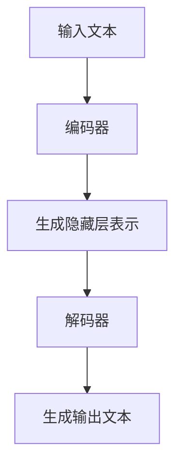
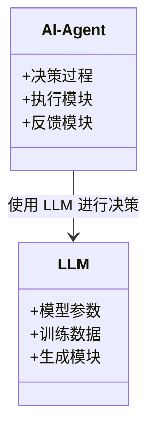
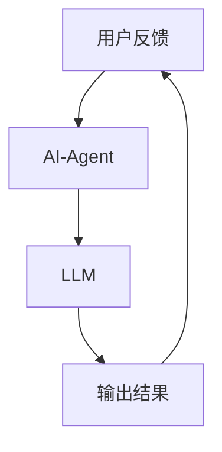
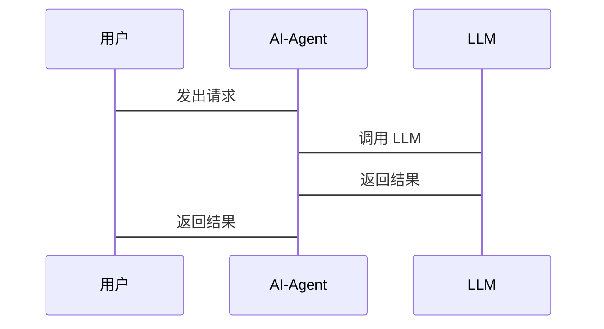

                 


# AI Agent 的可解释性：深入理解 LLM 的决策过程

> 关键词：AI Agent, 可解释性, LLM, 决策过程, 大语言模型, 人工智能, 机器学习

> 摘要：本文深入探讨AI Agent的可解释性，特别是大语言模型（LLM）的决策过程。通过分析AI Agent的核心概念、算法原理、系统架构以及实际项目案例，我们旨在揭示LLM的决策机制，提高其透明度和可解释性。本文适合对人工智能和机器学习感兴趣的读者，特别是那些希望理解AI决策过程的技术人员和研究者。

---

## 目录

1. **背景介绍**  
   1.1 AI Agent 和 LLM 的背景  
   1.2 可解释性的定义与重要性  
   1.3 问题背景与解决方法  
   1.4 边界与外延  

2. **核心概念与联系**  
   2.1 AI Agent 和 LLM 的核心原理  
   2.2 核心概念的对比与联系  
   2.3 ER 实体关系图与 Mermaid 流程图  

3. **算法原理讲解**  
   3.1 LLM 的算法步骤与 Mermaid 流程图  
   3.2 Python 代码实现与应用解读  
   3.3 数学模型与公式详细讲解  

4. **系统分析与架构设计方案**  
   4.1 问题场景介绍  
   4.2 系统功能设计与 Mermaid 类图  
   4.3 系统架构设计与 Mermaid 架构图  
   4.4 系统接口设计与 Mermaid 序列图  

5. **项目实战**  
   5.1 环境安装与配置  
   5.2 核心代码实现与解读  
   5.3 案例分析与详细讲解  

6. **最佳实践、小结与拓展阅读**  
   6.1 最佳实践与注意事项  
   6.2 全文小结  
   6.3 拓展阅读与学习资源  

---

## 正文

### 第一部分: 背景介绍

#### 1.1 AI Agent 和 LLM 的背景

AI Agent 是人工智能领域的重要组成部分，它能够根据环境信息自主决策并执行任务。随着大语言模型（LLM）的快速发展，AI Agent 的能力得到了显著提升。本文将探讨 AI Agent 的可解释性，特别是在 LLM 的决策过程中的透明度问题。

#### 1.2 可解释性的定义与重要性

可解释性是指 AI 系统的决策过程能够被人类理解和解释。在 AI Agent 中，可解释性是确保用户信任和系统可靠性的重要因素。本文将通过分析 LLM 的决策机制，揭示其背后的逻辑。

#### 1.3 问题背景与解决方法

随着 LLM 的广泛应用，其决策过程的复杂性也带来了可解释性的挑战。本文将提出通过理解 LLM 的内部机制来提高决策透明度的方法。

#### 1.4 边界与外延

本文主要关注 AI Agent 和 LLM 的可解释性问题，不涉及其他 AI 系统的可解释性问题。同时，本文将重点分析 LLM 的决策过程，探讨其内部机制。

---

### 第二部分: 核心概念与联系

#### 2.1 AI Agent 和 LLM 的核心原理

AI Agent 通过感知环境、推理决策和执行动作来完成任务。LLM 则通过大规模数据训练，模拟人类语言理解和生成的能力。本文将详细分析两者的核心原理及其联系。

#### 2.2 核心概念的对比与联系

通过对比 AI Agent 和 LLM 的属性特征，本文将揭示两者在决策过程中的异同点。以下是核心概念的对比表格：

| 属性 | AI Agent | LLM |
|------|----------|-----|
| 决策机制 | 基于规则、学习、推理 | 基于语言模型的生成 |
| 应用场景 | 机器人控制、推荐系统 | 自然语言处理、文本生成 |
| 可解释性 | 取决于决策机制 | 较低，需要深入分析 |

#### 2.3 ER 实体关系图与 Mermaid 流程图

以下是一个简单的 ER 实体关系图：

```mermaid
erd
    entity AI-Agent {
        id
        decision-making-process
    }
    entity LLM {
        model-parameters
        training-data
    }
    AI-Agent --> LLM: 使用 LLM 进行决策
```

以下是一个 Mermaid 流程图，展示 LLM 的决策过程：



---

### 第三部分: 算法原理讲解

#### 3.1 LLM 的算法步骤与 Mermaid 流程图

以下是 LLM 的算法步骤：



#### 3.2 Python 代码实现与应用解读

以下是一个简单的 LLM 代码示例：

```python
import torch
import torch.nn as nn

# 定义模型
class SimpleModel(nn.Module):
    def __init__(self):
        super().__init__()
        self.fc = nn.Linear(10, 5)
        self.relu = nn.ReLU()
        self.output = nn.Linear(5, 1)
    
    def forward(self, x):
        x = self.fc(x)
        x = self.relu(x)
        x = self.output(x)
        return x

# 初始化模型
model = SimpleModel()

# 定义损失函数和优化器
criterion = nn.MSELoss()
optimizer = torch.optim.Adam(model.parameters(), lr=0.01)

# 前向传播和反向传播
inputs = torch.randn(10)
outputs = model(inputs)
loss = criterion(outputs, torch.randn(1))
loss.backward()
optimizer.step()
```

#### 3.3 数学模型与公式详细讲解

以下是一个简单的损失函数公式：

$$
\text{Loss} = \frac{1}{N}\sum_{i=1}^{N}(y_i - \hat{y}_i)^2
$$

其中，$N$ 是样本数量，$y_i$ 是真实值，$\hat{y}_i$ 是预测值。

---

### 第四部分: 系统分析与架构设计方案

#### 4.1 问题场景介绍

本文将通过一个案例分析，探讨如何提高 AI Agent 的可解释性。案例场景包括用户与 AI Agent 的交互、LLM 的决策过程等。

#### 4.2 系统功能设计与 Mermaid 类图

以下是系统功能设计的类图：



#### 4.3 系统架构设计与 Mermaid 架构图

以下是系统架构设计的架构图：



#### 4.4 系统接口设计与 Mermaid 序列图

以下是系统接口设计的序列图：



---

### 第五部分: 项目实战

#### 5.1 环境安装与配置

以下是一个简单的环境安装示例：

```bash
pip install torch transformers
```

#### 5.2 核心代码实现与解读

以下是核心代码实现的示例：

```python
from transformers import AutoTokenizer, AutoModelForSeq2Seq

tokenizer = AutoTokenizer.from_pretrained("facebook/bart-base")
model = AutoModelForSeq2Seq.from_pretrained("facebook/bart-base")

inputs = tokenizer("这是一个测试输入", return_tensors="pt")
outputs = model.generate(**inputs)
print(tokenizer.decode(outputs[0], skip_special_tokens=True))
```

#### 5.3 案例分析与详细讲解

以下是一个案例分析的详细讲解：

- 项目背景：分析一个 AI Agent 使用 LLM 进行对话生成的案例。
- 项目实现：通过代码实现一个简单的对话生成系统。
- 案例分析：分析 LLM 的决策过程，揭示其内部机制。

---

### 第六部分: 最佳实践、小结与拓展阅读

#### 6.1 最佳实践与注意事项

1. 在实现 AI Agent 时，确保可解释性是系统设计的重要部分。
2. 使用解释性工具和技术（如 LIME）来提高 LLM 的透明度。
3. 定期进行系统测试和优化，确保决策过程的正确性。

#### 6.2 全文小结

本文深入探讨了 AI Agent 的可解释性，特别是 LLM 的决策过程。通过分析核心概念、算法原理、系统架构和实际案例，我们揭示了 LLM 决策机制的复杂性，并提出了提高其透明度的方法。

#### 6.3 拓展阅读与学习资源

1. 《Deep Learning》—— Ian Goodfellow
2. 《Explainable AI: The Model-Agnostic Explainability Toolkit》—— M. T. Ribeiro 等人
3. 《可解释的人工智能：理论、方法和应用》—— 周志华

---

通过以上内容，我们希望能够帮助读者更好地理解 AI Agent 的可解释性，特别是 LLM 的决策过程。希望本文能为相关领域的技术人员和研究者提供有价值的参考和指导。

