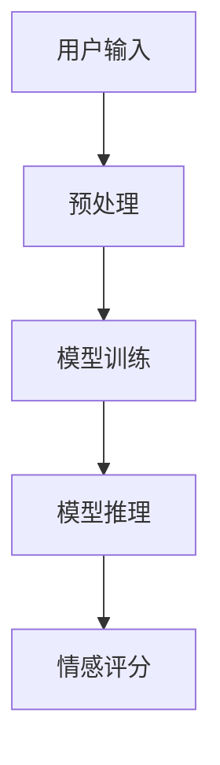
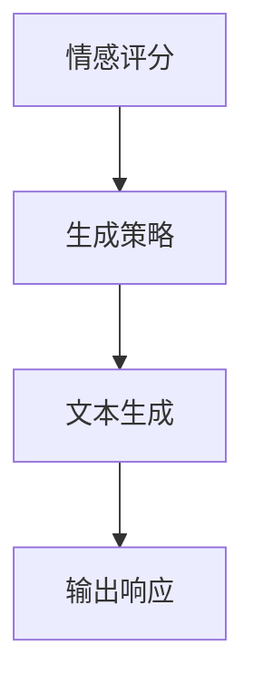
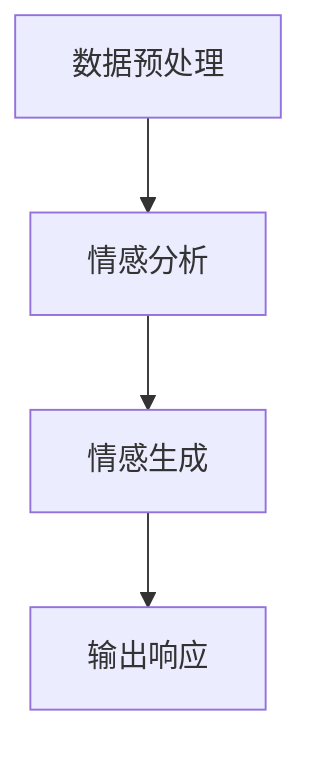
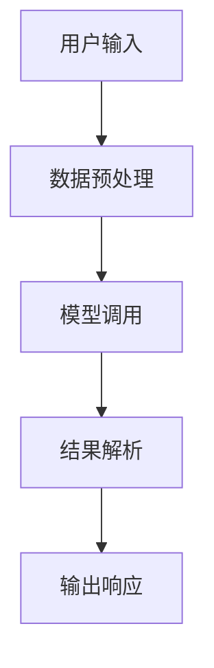
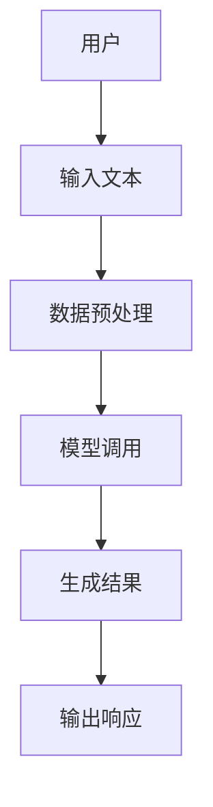

                 


# 第四部分: 情感调节的技术实现与优化

# 第4章: 情感调节的算法实现

## 4.1 情感分析的算法实现

### 4.1.1 情感分析流程


### 4.1.2 情感评分的数学模型
$$ \text{score} = \sum_{i=1}^{n} w_i \cdot x_i $$
其中，$w_i$ 是词的权重，$x_i$ 是词的出现情况。

### 4.1.3 情感生成的算法流程


## 4.2 情感生成的优化策略

### 4.2.1 情感生成的多样性优化
- 使用温度参数（temperature）控制生成的多样性。
- 通过调整top-k采样和核采样（nucleus sampling）来优化生成结果。

### 4.2.2 情感生成的鲁棒性提升
- 使用情感增强数据集进行微调。
- 通过对抗训练提升模型的鲁棒性。

## 4.3 情感调节的模型评估

### 4.3.1 情感调节的评估指标
- 准确率（Accuracy）
- F1值（F1-score）
- 情感一致性（Emotion Consistency）

### 4.3.2 情感调节的对比实验
- 对比不同LLM模型（如GPT-3、GPT-4、PaLM）的情感调节效果。
- 分析不同情感调节策略的优劣。

---

# 第五部分: 情感调节的系统架构与实现

# 第5章: 系统架构设计

## 5.1 系统功能设计

### 5.1.1 系统功能模块
- 数据预处理模块
- 情感分析模块
- 情感生成模块
- 输出响应模块

### 5.1.2 功能模块的交互流程


## 5.2 系统架构设计

### 5.2.1 系统架构图


### 5.2.2 模块划分与职责
- 数据预处理模块：负责对输入文本进行清洗和分词。
- 模型调用模块：负责调用LLM进行情感分析和生成。
- 结果解析模块：负责将模型输出的结果进行解析并生成最终响应。

## 5.3 系统接口设计

### 5.3.1 输入接口
- 用户输入接口：用于接收用户输入的文本。
- 数据预处理接口：用于对输入文本进行处理。

### 5.3.2 输出接口
- 情感分析结果接口：返回情感评分。
- 情感生成结果接口：返回生成的文本。

## 5.4 系统交互流程

### 5.4.1 用户与系统交互流程


---

# 第六部分: 项目实战与案例分析

# 第6章: 项目实战：构建一个基于LLM的AI助手

## 6.1 环境安装与配置

### 6.1.1 安装依赖
```bash
pip install transformers torch
```

### 6.1.2 配置运行环境
- 安装Python 3.8以上版本。
- 安装GPU支持（如NVIDIA显卡驱动和CUDA工具链）。

## 6.2 系统核心实现

### 6.2.1 数据预处理代码
```python
import re
from transformers import AutoTokenizer

def preprocess(text):
    text = re.sub(r'[^\w\s]', '', text)
    text = text.lower()
    return text
```

### 6.2.2 模型调用代码
```python
from transformers import AutoModelForSequenceClassification, AutoTokenizer

model_name = "nlpaueb/distilbert-base-nli-stsb-dist1"
tokenizer = AutoTokenizer.from_pretrained(model_name)
model = AutoModelForSequenceClassification.from_pretrained(model_name)
```

### 6.2.3 情感生成代码
```python
import torch

def generate_response(model, tokenizer, input_text):
    inputs = tokenizer(input_text, return_tensors="pt")
    outputs = model.generate(inputs.input_ids, max_length=50)
    response = tokenizer.decode(outputs[0], skip_special_tokens=True)
    return response
```

## 6.3 代码实现与分析

### 6.3.1 代码实现
```python
import re
from transformers import AutoTokenizer, AutoModelForSequenceClassification

def preprocess(text):
    text = re.sub(r'[^\w\s]', '', text)
    text = text.lower()
    return text

def main():
    model_name = "nlpaueb/distilbert-base-nli-stsb-dist1"
    tokenizer = AutoTokenizer.from_pretrained(model_name)
    model = AutoModelForSequenceClassification.from_pretrained(model_name)
    
    input_text = input("请输入文本：")
    processed_text = preprocess(input_text)
    inputs = tokenizer(processed_text, return_tensors="pt")
    outputs = model.generate(inputs.input_ids, max_length=50)
    response = tokenizer.decode(outputs[0], skip_special_tokens=True)
    print("生成的响应：", response)

if __name__ == "__main__":
    main()
```

### 6.3.2 代码分析
- 预处理函数：对输入文本进行清洗和分词。
- 模型调用函数：使用预训练的模型进行情感分析和生成。
- 生成函数：根据情感评分生成相应的文本响应。

## 6.4 案例分析与效果评估

### 6.4.1 案例分析
- 输入文本：用户输入“我今天非常开心，因为项目完成了！”
- 预处理：文本清洗和分词。
- 情感分析：模型识别出情感为“非常开心”。
- 情感生成：生成相应的积极回应。

### 6.4.2 效果评估
- 情感评分的准确性：通过对比真实情感和模型预测结果进行评估。
- 生成文本的多样性：通过分析生成文本的多样性进行评估。
- 系统运行效率：通过测量系统运行时间进行评估。

---

# 第七部分: 总结与展望

# 第7章: 总结与最佳实践

## 7.1 核心观点回顾
### 7.1.1 情感调节的重要性
### 7.1.2 LLM 在情感调节中的独特优势
### 7.1.3 情感调节技术的未来发展方向

## 7.2 最佳实践
### 7.2.1 情感调节技术的实现建议
### 7.2.2 LLM 模型的选择建议
### 7.2.3 情感调节系统的优化建议

## 7.3 小结
情感调节是人机交互中的重要环节，利用 LLM 进行情感调节具有巨大的潜力。通过本文的探讨，我们深入了解了情感调节的核心概念、实现原理和系统架构，并通过实际案例展示了情感调节技术的应用。未来，随着技术的进步，情感调节将更加智能化和个性化。

## 7.4 展望
随着大语言模型（LLM）的不断发展，情感调节技术将更加精准和自然。未来的挑战在于如何在不同场景下实现情感调节的通用性和个性化，同时确保系统的高效性和稳定性。

---

# 结语

通过本文的详细探讨，我们系统地介绍了 AI Agent 的情感调节技术，从核心概念到实现原理，从系统架构到项目实战，为读者提供了一套完整的解决方案。希望本文能够为相关领域的研究者和开发者提供有价值的参考和启发。

---

**关键词**：AI Agent，情感调节，LLM，大语言模型，人机交互

**摘要**：本文系统探讨了利用大语言模型（LLM）进行 AI Agent 的情感调节技术。从情感调节的背景与意义出发，详细分析了情感调节的核心概念与实现原理，结合具体的算法流程和系统架构设计，展示了如何通过 LLM 实现情感分析与生成。最后，通过实际案例分析和效果评估，总结了情感调节技术的应用价值和未来发展方向。

