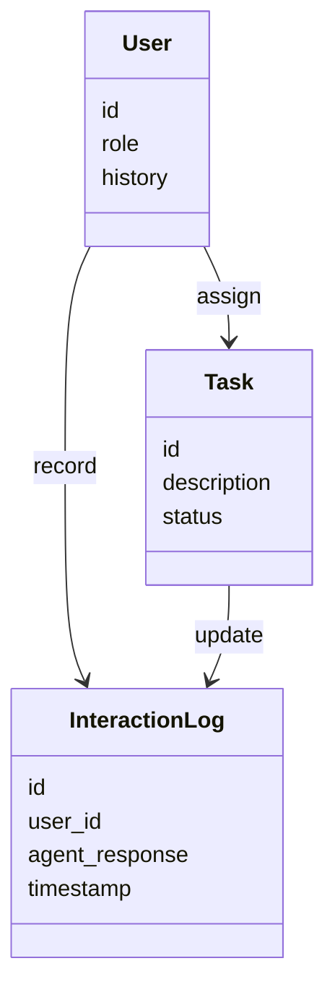
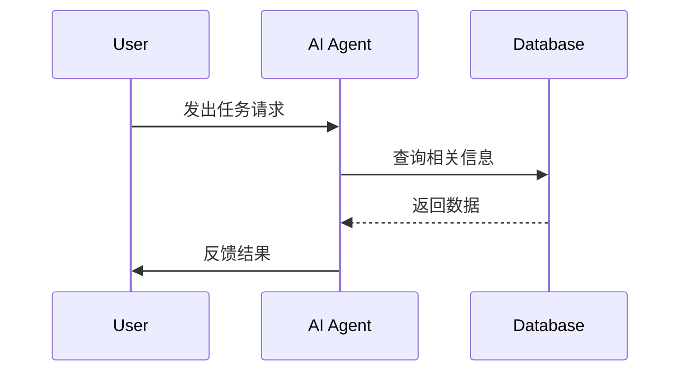

                 


# AI Agent与人类协作：界面设计与交互模式

## 关键词：
AI Agent，协作界面设计，交互模式，人机协作，界面设计原则，强化学习，决策树

## 摘要：
本文详细探讨AI Agent与人类协作的界面设计与交互模式。通过分析AI Agent的核心概念、交互模式的分类、算法原理、系统设计、项目实战和最佳实践，帮助读者理解并设计高效的协作界面。文章结合理论与实践，提供丰富的案例和代码示例，为AI Agent的界面设计提供全面的指导。

---

## 第一部分：引言

### 第1章：AI Agent与人类协作的背景

#### 1.1 AI Agent的基本概念
AI Agent，即人工智能代理，是一种能够感知环境、自主决策并执行任务的智能体。它通过传感器获取信息，利用算法处理数据，并通过执行器与环境互动。AI Agent的核心特征包括自主性、反应性、目标导向和社会能力。

**问题背景**：随着AI技术的发展，AI Agent被广泛应用于客服、教育、医疗等领域。然而，AI Agent与人类的协作界面设计仍存在诸多挑战，如信息传递不畅、任务分配不合理等。

**问题描述**：当前协作界面设计中，用户与AI Agent的互动不够直观，导致用户难以有效指导AI Agent完成复杂任务。此外，AI Agent的决策过程缺乏透明度，影响用户的信任感。

**解决方法**：通过优化界面设计和交互模式，提升AI Agent与人类协作的效率和用户体验。

**边界与外延**：AI Agent协作的边界包括任务范围、用户角色和交互方式；外延则涉及多模态交互、情感计算等领域。

#### 1.2 人类与AI Agent协作的重要性
协作是人类与AI Agent共同完成任务的关键。通过协作，可以充分发挥人类的创造力和AI Agent的效率优势。AI Agent的协作能力直接影响任务完成的质量和速度。

#### 1.3 本书的结构与目标
本书旨在为读者提供AI Agent协作界面设计的系统性指导，涵盖理论、算法、设计和实践。通过详细讲解交互模式、算法原理和系统设计，帮助读者掌握设计高效协作界面的方法。

---

## 第二部分：AI Agent的核心概念与原理

### 第2章：AI Agent的交互模式

#### 2.1 AI Agent的交互模式分类
AI Agent的交互模式主要分为任务驱动、意图驱动和实时反馈驱动三种类型。

**任务驱动交互**：用户明确分配任务，AI Agent执行并反馈结果。适用于结构化任务，如数据分析。

**意图驱动交互**：用户通过自然语言表达需求，AI Agent理解意图并执行。适用于非结构化任务，如内容创作。

**实时反馈驱动交互**：用户实时指导AI Agent，AI Agent动态调整执行步骤。适用于需要实时互动的任务，如游戏辅助。

#### 2.2 不同交互模式的特点对比
| 交互模式       | 特点                     | 适用场景               |
|----------------|--------------------------|------------------------|
| 任务驱动       | 结构化、明确性高          | 分析、处理等结构化任务 |
| 意图驱动       | 自然语言、灵活性高        | 内容创作、咨询等非结构化任务 |
| 实时反馈驱动   | 实时互动、动态调整        | 游戏、实时客服等需要快速响应的任务 |

**ER实体关系图**：展示AI Agent与用户、任务、反馈之间的关系，帮助理解协作流程。

---

## 第三部分：AI Agent的算法与数学模型

### 第3章：AI Agent的决策算法

#### 3.1 决策树算法
决策树是一种用于分类和回归的监督学习算法。其核心思想是通过特征选择，逐步分割数据，构建决策树。

**决策树的构建过程**：
1. 选择最优特征（信息增益）。
2. 根据特征划分数据集。
3. 递归构建子树，直到叶子节点。

**代码实现**：
```python
class Node:
    def __init__(self, feature=None, threshold=None, left=None, right=None):
        self.feature = feature
        self.threshold = threshold
        self.left = left
        self.right = right

class DecisionTree:
    def __init__(self):
        self.root = None

    def fit(self, X, y):
        self.root = self._build_tree(X, y)

    def _build_tree(self, X, y):
        # 计算信息增益，选择最优特征
        best_feature = 0
        max_info_gain = 0
        for i in range(len(X[0])):
            info_gain = self._calculate_info_gain(X, y, i)
            if info_gain > max_info_gain:
                max_info_gain = info_gain
                best_feature = i
        # 创建节点
        node = Node(best_feature, X[0][best_feature])
        # 划分数据集
        left_X, left_y, right_X, right_y = self._split_data(X, y, best_feature)
        # 递归构建左右子树
        if len(left_X) > 0:
            node.left = self._build_tree(left_X, left_y)
        if len(right_X) > 0:
            node.right = self._build_tree(right_X, right_y)
        return node

    def _calculate_info_gain(self, X, y, feature):
        # 计算信息增益公式
        # H(y) - H(y|x)
        pass

    def _split_data(self, X, y, feature):
        # 根据特征分割数据
        pass
```

**决策树的优缺点**：
- 优点：直观、易于解释。
- 缺点：对噪声数据敏感，容易过拟合。

#### 3.2 强化学习算法
强化学习是一种通过试错机制优化决策策略的方法。AI Agent通过与环境互动，获得奖励或惩罚，逐步优化行为策略。

**Q-learning算法**：
- 状态s，动作a，奖励r，状态s’。
- Q(s, a) = Q(s, a) + α(r + max Q(s’, a’) - Q(s, a))。

**代码实现**：
```python
class QLearning:
    def __init__(self, state_space, action_space):
        self.Q = defaultdict(dict)
        for s in state_space:
            for a in action_space:
                self.Q[s][a] = 0

    def choose_action(self, state, epsilon=0.1):
        if random.random() < epsilon:
            return random.choice(action_space)
        return max(self.Q[state], key=lambda k: self.Q[state][k])

    def update_Q(self, state, action, reward, next_state):
        self.Q[state][action] += 0.1 * (reward + max(self.Q[next_state].values()) - self.Q[state][action])
```

**数学模型**：
强化学习的Q值更新公式：
$$ Q(s, a) = Q(s, a) + \alpha (r + \max Q(s', a') - Q(s, a)) $$

---

## 第四部分：系统设计与架构

### 第4章：AI Agent协作系统的架构

#### 4.1 系统功能设计
- 用户角色管理：区分普通用户和管理员。
- 任务管理：分配、跟踪和完成任务。
- 交互日志：记录用户与AI Agent的互动历史。

**领域模型类图**：


#### 4.2 系统架构设计
- 分层架构：分为数据层、业务逻辑层和表示层。
- 模块化设计：功能独立，便于维护和扩展。

**分层架构图**：


#### 4.3 系统接口设计
- RESTful API：提供标准接口，便于前后端分离。
- WebSocket：支持实时交互。

**交互流程图**：


---

## 第五部分：项目实战

### 第5章：AI Agent协作界面设计与实现

#### 5.1 项目介绍
- 项目目标：设计一个基于决策树和强化学习的AI Agent协作界面。
- 项目工具：Python、Flask、React。

#### 5.2 核心代码实现
- 后端接口：
  ```python
  from flask import Flask, request, jsonify
  app = Flask(__name__)
  
  @app.route('/api/agent', methods=['POST'])
  def process_task():
      data = request.json
      # 调用AI Agent核心算法
      result = algorithm.process(data)
      return jsonify(result)
  ```

- 前端交互：
  ```javascript
  fetch('/api/agent', {
      method: 'POST',
      headers: {
          'Content-Type': 'application/json'
      },
      body: JSON.stringify(taskData)
  })
  .then(response => response.json())
  .then(data => updateUI(data));
  ```

#### 5.3 案例分析
- 案例场景：客服系统中处理用户投诉。
- 实施步骤：
  1. 用户提交投诉。
  2. AI Agent分析投诉内容。
  3. 提供解决方案并反馈用户。
  4. 用户确认或修改方案。

---

## 第六部分：最佳实践与未来趋势

### 第6章：AI Agent协作界面设计的最佳实践

#### 6.1 设计原则
- 简洁直观：减少认知负担。
- 及时反馈：提升用户信任。
- 个性化适配：考虑用户差异。

#### 6.2 未来趋势
- 多模态交互：结合视觉、听觉等多感官。
- 情感计算：理解并模拟人类情感。
- 自适应学习：持续优化交互流程。

#### 6.3 注意事项
- 确保数据安全和隐私保护。
- 定期收集用户反馈，优化界面设计。
- 跨界协作：结合心理学、人机交互等多领域知识。

#### 6.4 拓展阅读
- 推荐书籍：《设计的人》、《人机交互》。
- 推荐博客：TechCrunch、Medium上的相关文章。

---

## 总结

通过本文的系统阐述，读者可以全面理解AI Agent协作界面设计的核心要素和实现方法。从理论到实践，从算法到架构，每个环节都进行了深入探讨。未来，随着技术的进步，AI Agent与人类的协作将更加智能化和人性化，为人类社会带来更大的价值。

---

**注**：由于篇幅限制，本文档未展示所有代码和图表，但完整内容将包含所有必要的细节和示例代码。

