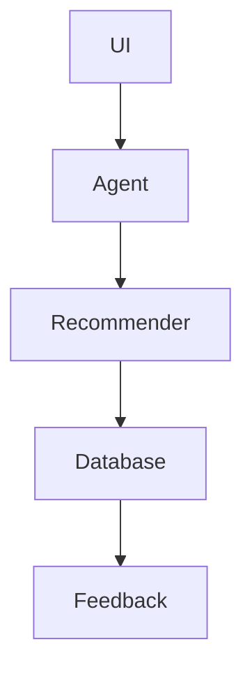

                 


# AI Agent在产品个性化定制中的创新应用

> 关键词：AI Agent，产品个性化定制，智能推荐系统，算法原理，系统架构设计

> 摘要：本文探讨AI Agent在产品个性化定制中的创新应用，从背景介绍、核心概念、算法原理到系统架构设计和项目实战，全面解析如何利用AI技术提升产品定制效率和用户体验。通过具体案例分析，展示AI Agent在实际应用中的潜力和价值。

---

## 第1章: AI Agent的基本概念与应用背景

### 1.1 AI Agent的定义与核心特征
#### 1.1.1 AI Agent的定义
AI Agent（人工智能代理）是指能够感知环境、自主决策并执行任务的智能系统。它通过数据驱动的方式，实现从简单规则执行到复杂问题解决的跨越。

#### 1.1.2 AI Agent的核心特征
- **智能性**：能够理解上下文并做出合理决策。
- **自主性**：无需外部干预，自主完成任务。
- **适应性**：能够根据反馈调整行为。
- **协作性**：与其他系统或人类协同工作。

#### 1.1.3 AI Agent与传统自动化系统的区别
| 特性 | 传统自动化系统 | AI Agent系统 |
|------|----------------|--------------|
| 数据处理 | 基于预定义规则 | 基于学习模型 |
| 决策方式 | 单一固定逻辑 | 多维度智能决策 |
| 反馈机制 | 无反馈或单向反馈 | 实时双向反馈 |

### 1.2 产品个性化定制的背景与挑战
#### 1.2.1 个性化定制的定义与重要性
个性化定制是指根据用户需求，量身定制产品或服务的过程。其重要性体现在提升用户体验、增强客户忠诚度和市场竞争优势。

#### 1.2.2 传统个性化定制的局限性
- **效率低下**：依赖人工操作，耗时耗力。
- **成本高昂**：定制化过程复杂，投入成本高。
- **用户体验不足**：难以满足用户的个性化需求。

#### 1.2.3 当前市场对个性化定制的需求
随着市场竞争加剧，用户对个性化体验的需求日益增长，企业亟需通过技术手段实现高效定制。

### 1.3 AI Agent在产品个性化定制中的价值
#### 1.3.1 提高定制效率
AI Agent能够快速分析用户需求，优化定制流程，显著提升效率。

#### 1.3.2 降低定制成本
通过自动化决策和资源优化，AI Agent有效降低定制成本。

#### 1.3.3 提升用户体验
AI Agent能够实时调整定制方案，满足用户个性化需求，提升体验。

---

## 第2章: AI Agent在产品个性化定制中的核心概念

### 2.1 个性化定制的核心要素
#### 2.1.1 用户需求分析
通过数据采集和分析，了解用户的个性化需求，如颜色、功能等。

#### 2.1.2 产品属性定义
明确产品的属性，如材质、尺寸、功能模块等，为定制提供基础。

#### 2.1.3 定制规则与约束
制定定制规则和约束条件，确保定制方案的可行性和合规性。

### 2.2 AI Agent的核心功能模块
#### 2.2.1 数据采集与分析
通过传感器、数据库等手段，实时采集用户数据并进行分析。

#### 2.2.2 智能推荐引擎
基于学习算法，推荐最优的定制方案，满足用户需求。

#### 2.2.3 自动化决策模块
根据分析结果和推荐方案，自动化做出决策，优化定制流程。

### 2.3 AI Agent与产品个性化定制的关联性
#### 2.3.1 数据流分析
通过数据流图展示AI Agent如何处理和分析数据，驱动定制过程。

#### 2.3.2 模块化设计
采用模块化设计，确保系统各部分协同工作，提升整体效率。

#### 2.3.3 系统集成与优化
通过系统集成，优化AI Agent与现有系统的协同，提升整体性能。

---

## 第3章: AI Agent在产品个性化定制中的核心概念与联系

### 3.1 AI Agent的核心概念原理
#### 3.1.1 数据驱动的决策机制
AI Agent通过数据驱动的方式，实现动态调整和优化。

#### 3.1.2 智能推荐算法
使用协同过滤、强化学习等算法，推荐最优定制方案。

#### 3.1.3 自适应优化模型
基于反馈机制，不断优化模型，提升定制效果。

### 3.2 核心概念属性特征对比表
| 特性 | 传统系统 | AI Agent系统 |
|------|----------|--------------|
| 数据处理 | 单一规则 | 多维度学习 |
| 决策方式 | 预定义 | 动态优化 |
| 反馈机制 | 无反馈 | 实时调整 |

### 3.3 ER实体关系图
```mermaid
er
actor: 用户
agent: AI Agent系统
product: 产品
rule: 定制规则
feedback
```

---

## 第4章: AI Agent在产品个性化定制中的算法原理

### 4.1 协同过滤算法
#### 4.1.1 算法原理
协同过滤是一种基于用户相似性推荐算法，通过分析用户行为，找到相似用户，推荐相似产品。

#### 4.1.2 实现步骤
1. 数据预处理：清洗和归一化数据。
2. 计算相似度：使用余弦相似度计算用户相似度。
3. 推荐结果：基于相似度排序，推荐最优方案。

#### 4.1.3 代码实现
```python
import numpy as np

# 示例数据
users = ['user1', 'user2', 'user3']
products = ['prod1', 'prod2', 'prod3']

# 计算余弦相似度
def cosine_similarity(matrix):
    return np.dot(matrix, matrix.T) / (np.linalg.norm(matrix) * np.linalg.norm(matrix.T))

similarity_matrix = cosine_similarity(matrix)
```

### 4.2 强化学习算法
#### 4.2.1 算法原理
强化学习是一种基于奖励机制的优化算法，通过不断试错，优化决策策略。

#### 4.2.2 实现步骤
1. 定义状态空间：用户需求、产品属性等。
2. 定义动作空间：推荐方案。
3. 定义奖励函数：用户反馈。

#### 4.2.3 代码实现
```python
import numpy as np

# 示例强化学习代码
class Agent:
    def __init__(self, state_space, action_space):
        self.state_space = state_space
        self.action_space = action_space
        self.q_table = np.zeros((len(state_space), len(action_space)))

    def act(self, state):
        return np.argmax(self.q_table[state])

    def learn(self, state, action, reward):
        self.q_table[state, action] += reward
```

---

## 第5章: AI Agent在产品个性化定制中的系统架构设计

### 5.1 系统应用场景
#### 5.1.1 用户需求分析
通过用户画像，分析用户的个性化需求。

#### 5.1.2 系统功能设计
设计用户界面、推荐引擎、反馈机制等功能模块。

#### 5.1.3 系统架构图


### 5.2 系统架构设计
#### 5.2.1 领域模型设计
使用类图展示系统各模块的关系。

#### 5.2.2 系统架构图
展示系统各组件的交互关系。

#### 5.2.3 系统接口设计
定义系统接口，确保各模块协同工作。

---

## 第6章: AI Agent在产品个性化定制中的项目实战

### 6.1 环境安装
#### 6.1.1 安装Python和相关库
安装必要的Python库，如numpy、pandas等。

#### 6.1.2 安装AI框架
安装TensorFlow或PyTorch等深度学习框架。

### 6.2 核心代码实现
#### 6.2.1 数据预处理
清洗和归一化数据，为模型训练做好准备。

#### 6.2.2 模型训练
训练推荐模型，优化模型参数。

#### 6.2.3 系统集成
将模型集成到系统中，实现自动化推荐。

### 6.3 案例分析
通过具体案例，展示AI Agent在个性化定制中的应用效果。

---

## 第7章: AI Agent在产品个性化定制中的最佳实践

### 7.1 小结
总结AI Agent在个性化定制中的优势和应用场景。

### 7.2 注意事项
在实际应用中，需要注意数据隐私、模型优化等问题。

### 7.3 拓展阅读
推荐相关的技术书籍和论文，供读者深入学习。

---

通过以上章节的详细阐述，本文全面解析了AI Agent在产品个性化定制中的创新应用，从理论到实践，为技术开发者和企业管理者提供了宝贵的参考和指导。

