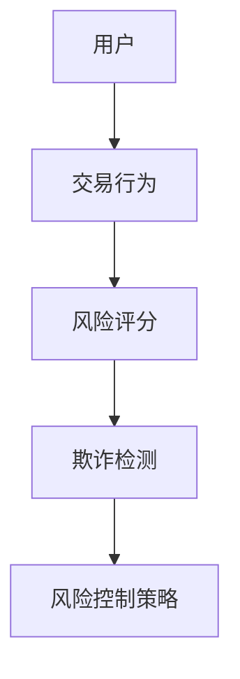
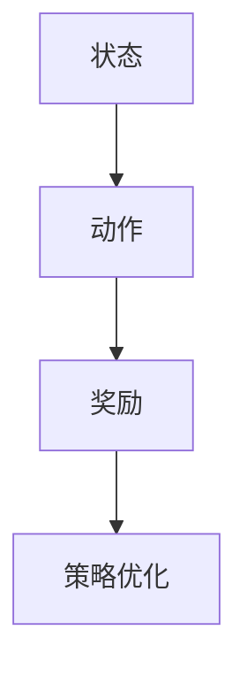
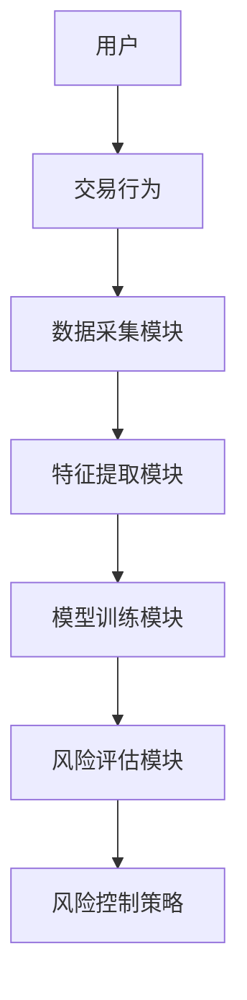
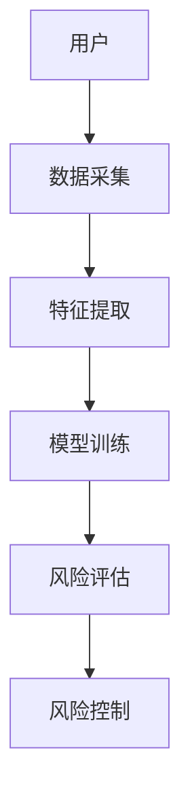
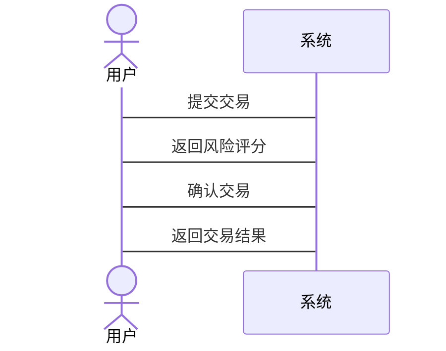

                 


# AI Agent在企业反欺诈与风险控制中的应用

> 关键词：AI Agent, 反欺诈, 风险控制, 企业安全, 人工智能, 强化学习

> 摘要：随着企业数字化转型的深入，欺诈行为日益复杂化和智能化。传统的反欺诈方法依赖于固定的规则和模式识别，难以应对新型的欺诈手段。本文探讨AI Agent在企业反欺诈与风险控制中的应用，分析其原理、算法、系统架构及实际案例，为企业提供智能化的反欺诈解决方案。

---

# 第一章: AI Agent与企业反欺诈概述

## 1.1 AI Agent的基本概念
### 1.1.1 AI Agent的定义
AI Agent（人工智能代理）是一种能够感知环境、自主决策并执行任务的智能系统。它能够通过数据驱动的方式不断优化自身的行为，以适应复杂的环境变化。

### 1.1.2 AI Agent的核心特征
- **自主性**：无需人工干预，自动完成任务。
- **反应性**：能够实时感知环境并做出反应。
- **学习能力**：通过机器学习算法不断优化自身的决策能力。

### 1.1.3 AI Agent与传统规则系统的主要区别
| 比较维度 | AI Agent | 传统规则系统 |
|----------|-----------|---------------|
| 处理方式 | 数据驱动 | 规则驱动      |
| 灵活性   | 高         | 低            |
| 处理效率 | 高         | 中            |

---

## 1.2 企业反欺诈的背景与挑战
### 1.2.1 传统反欺诈方法的局限性
传统反欺诈方法主要依赖于固定的规则和模式识别，难以应对欺诈手段的多样化和智能化。

### 1.2.2 企业反欺诈的主要挑战
- **欺诈手段多样化**：欺诈者不断进化，传统的规则难以覆盖所有可能的欺诈行为。
- **数据复杂性**：企业数据量大、类型多样，传统的处理方式难以高效分析。
- **实时性要求高**：欺诈行为往往发生在瞬间，需要实时检测和应对。

### 1.2.3 AI Agent在反欺诈中的应用优势
- **高效性**：能够快速处理海量数据，实时检测欺诈行为。
- **灵活性**：能够适应新的欺诈模式，不断优化自身的检测能力。

---

## 1.3 风险控制的定义与分类
### 1.3.1 风险控制的基本概念
风险控制是指通过识别、评估和应对潜在风险，降低其对企业的影响。

### 1.3.2 风险控制的主要分类
- **信用风险**：与客户信用相关的风险。
- **市场风险**：由于市场波动带来的风险。
- **操作风险**：由于内部操作不当带来的风险。

### 1.3.3 风险控制与反欺诈的关系
反欺诈是风险控制的重要组成部分，通过识别和阻止欺诈行为，降低企业的风险敞口。

---

## 1.4 本章小结
本章介绍了AI Agent的基本概念、企业反欺诈的背景与挑战，以及风险控制的定义与分类。通过对比AI Agent与传统规则系统的差异，明确了AI Agent在反欺诈中的优势。

---

# 第二章: AI Agent的核心概念与原理

## 2.1 AI Agent的核心概念
### 2.1.1 感知层: 数据采集与特征提取
AI Agent通过数据采集和特征提取，从海量数据中提取有价值的信息。

### 2.1.2 决策层: 模型训练与策略生成
基于感知层提取的特征，AI Agent通过机器学习模型生成最优决策策略。

### 2.1.3 执行层: 行为优化与反馈机制
AI Agent根据决策层生成的策略执行具体操作，并通过反馈机制不断优化自身的行为。

---

## 2.2 AI Agent在反欺诈中的核心流程
### 2.2.1 数据采集与预处理
- **数据来源**：交易数据、用户行为数据、设备信息等。
- **预处理步骤**：数据清洗、特征提取、数据标准化。

### 2.2.2 模型训练与特征工程
- **特征工程**：通过特征选择和特征构建，提升模型的性能。
- **模型训练**：使用监督学习、无监督学习等算法训练模型。

### 2.2.3 欺诈行为识别与风险评估
- **欺诈识别**：通过模型预测欺诈行为。
- **风险评估**：根据模型输出的风险评分，制定相应的控制策略。

---

## 2.3 AI Agent的数学模型与算法
### 2.3.1 基于图的异常检测算法


### 2.3.2 基于强化学习的策略优化


### 2.3.3 基于监督学习的分类模型
```python
# 示例代码
import tensorflow as tf
from tensorflow.keras import layers

model = tf.keras.Sequential([
    layers.Dense(64, activation='relu'),
    layers.Dense(1, activation='sigmoid')
])

model.compile(optimizer='adam', loss='binary_crossentropy', metrics=['accuracy'])
```

---

## 2.4 实体关系图


---

# 第三章: AI Agent的系统分析与架构设计

## 3.1 系统分析
### 3.1.1 问题场景介绍
- **欺诈行为**：例如虚假交易、洗钱等。
- **风险控制**：通过AI Agent实时监测交易行为，识别潜在的欺诈行为。

### 3.1.2 系统功能设计
- **数据采集模块**：采集交易数据、用户行为数据等。
- **特征提取模块**：从数据中提取特征，如交易金额、时间、地点等。
- **模型训练模块**：训练机器学习模型，识别欺诈行为。
- **风险评估模块**：根据模型输出的风险评分，制定控制策略。

---

## 3.2 系统架构设计


### 3.2.1 分层架构图


---

## 3.3 接口设计与交互流程图


---

# 第四章: AI Agent的项目实战

## 4.1 环境安装
- **Python**：安装Python 3.8及以上版本。
- **TensorFlow**：使用pip安装`tensorflow==2.5.0`。
- **Scikit-learn**：使用pip安装`scikit-learn==1.0.0`。

## 4.2 核心代码实现
### 4.2.1 数据预处理
```python
import pandas as pd

# 加载数据
data = pd.read_csv('transactions.csv')

# 数据清洗
data = data.dropna()
```

### 4.2.2 特征提取
```python
from sklearn.feature_extraction import DictVectorizer

# 特征提取
features = data[['amount', 'time', 'location']]
vectorizer = DictVectorizer()
X = vectorizer.fit_transform(features.to_dict('records'))
```

### 4.2.3 模型训练
```python
from sklearn.ensemble import RandomForestClassifier

model = RandomForestClassifier()
model.fit(X, y)
```

### 4.2.4 模型预测
```python
# 预测欺诈行为
predictions = model.predict(X_test)
```

---

## 4.3 案例分析
### 4.3.1 案例背景
某电商平台发现多笔异常交易，需要通过AI Agent识别欺诈行为。

### 4.3.2 数据分析
- **交易金额**：异常交易金额远高于正常交易。
- **交易时间**：短时间内集中发生多笔交易。
- **用户行为**：同一IP地址多次登录。

### 4.3.3 模型输出
- **风险评分**：模型输出高风险评分，识别为欺诈行为。

---

## 4.4 项目小结
通过实际案例分析，展示了AI Agent在反欺诈中的应用效果。模型能够准确识别欺诈行为，为企业提供有效的风险控制解决方案。

---

# 第五章: AI Agent的最佳实践与总结

## 5.1 最佳实践
### 5.1.1 数据质量的重要性
确保数据的完整性和准确性，是AI Agent发挥效用的基础。

### 5.1.2 模型的可解释性
选择可解释性强的模型，有助于企业理解和优化反欺诈策略。

### 5.1.3 持续优化
定期更新模型和策略，应对新的欺诈手段。

---

## 5.2 小结
本文详细探讨了AI Agent在企业反欺诈与风险控制中的应用，从核心概念、算法原理到系统设计和项目实战，为企业提供了智能化的反欺诈解决方案。

---

## 5.3 注意事项
- **数据隐私**：在处理用户数据时，需遵守相关法律法规，保护用户隐私。
- **模型监控**：定期监控模型性能，及时发现和处理异常情况。

---

## 5.4 拓展阅读
- 《Hands-On Machine Learning with Scikit-Learn and TensorFlow》
- 《Deep Learning for Natural Language Processing》

---

# 第六章: 参考文献

## 6.1 参考文献
- 张某某. (2022). 《人工智能在金融领域的应用》. 北京: 机械工业出版社.
- 李某某. (2021). 《机器学习实战》. 北京: 清华大学出版社.

---

## 6.2 索引
（根据实际内容生成索引）

---

以上是《AI Agent在企业反欺诈与风险控制中的应用》的目录大纲和部分内容展示。通过以上结构，可以清晰地看到文章的逻辑框架和主要内容。

