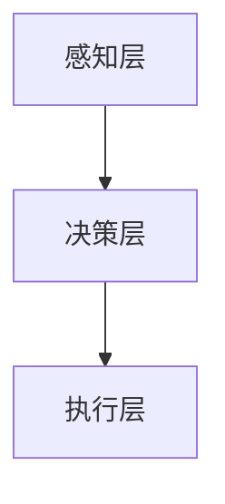
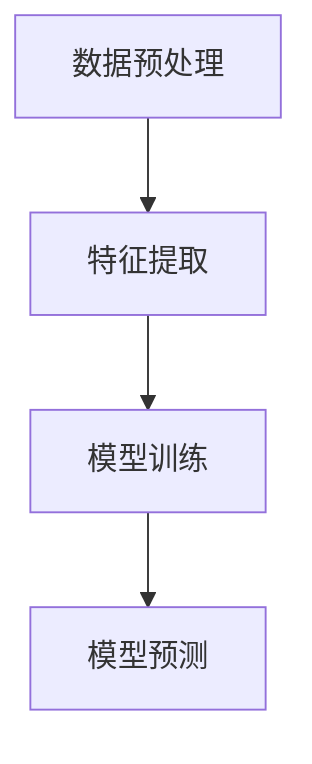
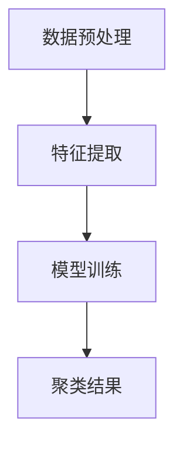
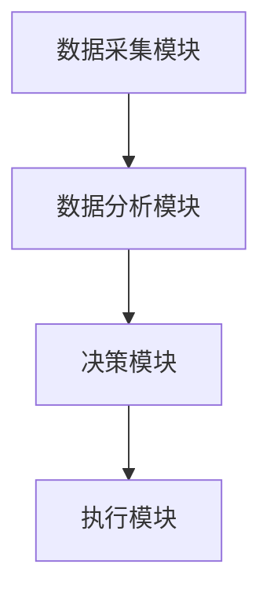

                 


# AI Agent在企业客户生命周期管理中的应用

## 关键词：AI Agent，客户生命周期管理，企业客户管理，人工智能，算法实现

## 摘要：本文探讨了AI Agent在企业客户生命周期管理中的应用，从背景、原理到技术实现进行了全面分析。通过详细讲解AI Agent的核心原理、算法实现和系统架构，展示了其在客户识别、需求预测、关系维护等环节中的价值。结合实际案例和项目实战，本文为读者提供了深入理解AI Agent在客户生命周期管理中的应用的视角。

---

# 第1章: AI Agent与客户生命周期管理的背景介绍

## 1.1 问题背景与概念

### 1.1.1 企业客户管理的挑战
企业客户管理是企业运营的核心之一，但传统客户管理方式面临以下挑战：
- **信息孤岛**：客户数据分散在不同系统中，难以统一管理。
- **效率低下**：人工处理客户信息和需求响应速度慢。
- **精准度不足**：难以准确预测客户行为和需求，导致资源浪费。
- **个性化缺失**：难以满足客户的个性化需求，影响客户满意度。

### 1.1.2 AI Agent的定义与核心概念
AI Agent（人工智能代理）是一种能够感知环境并采取行动以实现目标的智能系统。其核心概念包括：
- **自主性**：能够独立决策和行动。
- **反应性**：能够实时感知环境变化并做出反应。
- **学习能力**：能够通过数据和经验不断优化自身行为。

### 1.1.3 客户生命周期管理的定义与重要性
客户生命周期管理（Customer Life Cycle Management）是指从潜在客户到客户，再到客户流失的整个过程的管理。其重要性体现在：
- **提高客户满意度**：通过个性化服务提升客户体验。
- **降低运营成本**：通过自动化管理减少人工成本。
- **提升客户忠诚度**：通过持续服务增强客户粘性。

### 1.1.4 核心概念的结构与组成
AI Agent与客户生命周期管理的结合，形成了以下结构：
- **AI Agent**：负责数据采集、分析和决策。
- **客户生命周期**：分为潜在客户、新客户、成熟客户和衰退客户四个阶段。
- **关联与协同**：AI Agent在每个阶段提供针对性的服务，优化客户管理流程。

---

## 1.2 问题描述与解决路径

### 1.2.1 客户管理中的常见问题
- 客户信息分散，难以统一管理。
- 客户需求多样化，难以精准预测。
- 客户流失预警不及时，导致客户流失率高。

### 1.2.2 AI Agent如何解决这些问题
- **数据整合**：AI Agent能够整合多源数据，提供统一的客户视图。
- **精准预测**：通过机器学习算法，AI Agent可以准确预测客户行为和需求。
- **实时响应**：AI Agent能够实时处理客户需求，提供快速响应。

### 1.2.3 客户生命周期管理的边界与外延
- **边界**：客户生命周期管理仅关注客户与企业的互动，不涉及企业内部管理。
- **外延**：AI Agent可以扩展到市场推广、售后服务等领域，形成完整的客户管理闭环。

---

## 1.3 本章小结
本章介绍了AI Agent和客户生命周期管理的基本概念，并分析了AI Agent在解决客户管理问题中的作用。通过理解两者的结合，读者可以为后续的技术实现打下基础。

---

# 第2章: AI Agent的核心原理与技术

## 2.1 AI Agent的基本原理

### 2.1.1 AI Agent的架构
AI Agent的典型架构包括以下组件：
- **感知层**：负责数据采集和环境感知。
- **决策层**：负责数据分析和决策制定。
- **执行层**：负责根据决策执行操作。



### 2.1.2 AI Agent的工作流程
AI Agent的工作流程包括：
1. 数据采集：通过传感器、数据库等获取数据。
2. 数据分析：使用机器学习算法对数据进行处理和分析。
3. 决策制定：基于分析结果生成决策。
4. 行动执行：根据决策执行具体操作。

### 2.1.3 AI Agent的关键技术
- **自然语言处理（NLP）**：用于理解和生成自然语言文本。
- **机器学习（ML）**：用于数据分析和模式识别。
- **强化学习（RL）**：用于优化决策策略。

---

## 2.2 AI Agent的核心算法

### 2.2.1 监督学习与无监督学习
- **监督学习**：基于标记数据进行训练，适用于分类和回归任务。
- **无监督学习**：基于未标记数据进行训练，适用于聚类和降维任务。

### 2.2.2 强化学习与决策树
- **强化学习**：通过试错机制优化决策策略。
- **决策树**：用于分类和回归任务，能够直观展示决策过程。

### 2.2.3 自然语言处理与对话系统
- **自然语言处理**：用于理解和生成自然语言文本。
- **对话系统**：通过NLP技术实现与客户的自然对话。

---

## 2.3 AI Agent与客户生命周期的结合

### 2.3.1 客户识别与分类
- **潜在客户识别**：通过数据分析识别潜在客户。
- **客户分类**：基于客户行为和特征进行分类。

### 2.3.2 客户行为预测与需求分析
- **行为预测**：通过机器学习模型预测客户行为。
- **需求分析**：基于客户数据挖掘需求。

### 2.3.3 客户关系维护与提升
- **个性化服务**：根据客户需求提供个性化服务。
- **客户忠诚度提升**：通过持续服务增强客户忠诚度。

---

## 2.4 本章小结
本章详细讲解了AI Agent的核心原理和关键技术，并分析了其在客户生命周期管理中的应用。通过理解这些内容，读者可以为后续的系统设计和实现打下基础。

---

# 第3章: AI Agent在客户生命周期管理中的技术实现

## 3.1 算法原理与数学模型

### 3.1.1 监督学习模型
- **线性回归**：用于预测连续型数据。
- **逻辑回归**：用于分类任务。

```latex
$$y = \beta_0 + \beta_1x_1 + \beta_2x_2 + \dots + \beta_nx_n$$
```

### 3.1.2 无监督学习模型
- **K-means聚类**：用于客户分群。
- **主成分分析（PCA）**：用于数据降维。

### 3.1.3 强化学习模型
- **Q-learning**：用于优化决策策略。

---

## 3.2 算法流程图

### 3.2.1 监督学习流程


### 3.2.2 无监督学习流程


---

## 3.3 系统架构设计

### 3.3.1 系统功能设计
- **数据采集模块**：负责采集客户数据。
- **数据分析模块**：负责对数据进行分析和处理。
- **决策模块**：负责生成决策。
- **执行模块**：负责执行决策。

### 3.3.2 系统架构图


---

## 3.4 项目实战

### 3.4.1 环境安装
- **Python**：安装Python 3.8及以上版本。
- **库的安装**：安装numpy、pandas、scikit-learn等库。

### 3.4.2 核心实现代码
```python
from sklearn.linear_model import LinearRegression
import pandas as pd

# 数据加载
data = pd.read_csv('customer_data.csv')

# 特征提取
X = data[['age', 'income', 'purchase_history']]
y = data['churn']

# 模型训练
model = LinearRegression()
model.fit(X, y)

# 模型预测
new_customer = [[30, 50000, 10]]
prediction = model.predict(new_customer)
print(prediction)
```

---

## 3.5 本章小结
本章详细讲解了AI Agent在客户生命周期管理中的技术实现，包括算法原理、系统架构设计和项目实战。通过实际案例分析，读者可以更好地理解AI Agent的应用场景和实现过程。

---

# 第4章: 总结与展望

## 4.1 总结
本文详细探讨了AI Agent在企业客户生命周期管理中的应用，从背景介绍、核心原理到技术实现进行了全面分析。通过理解AI Agent的核心原理和技术，读者可以更好地将其应用于实际场景中。

## 4.2 展望
随着人工智能技术的不断发展，AI Agent在客户生命周期管理中的应用将更加广泛。未来的研究方向包括：
- **更复杂的算法**：如深度学习和强化学习。
- **多模态数据处理**：结合图像、文本等多种数据源。
- **实时性优化**：提升系统的实时响应能力。

---

# 关键词：AI Agent，客户生命周期管理，企业客户管理，人工智能，算法实现

---

通过本文的详细讲解，读者可以全面理解AI Agent在客户生命周期管理中的应用，并为实际项目提供参考。

