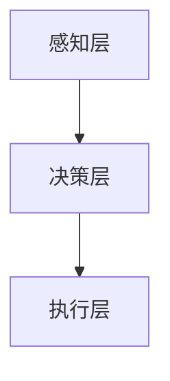
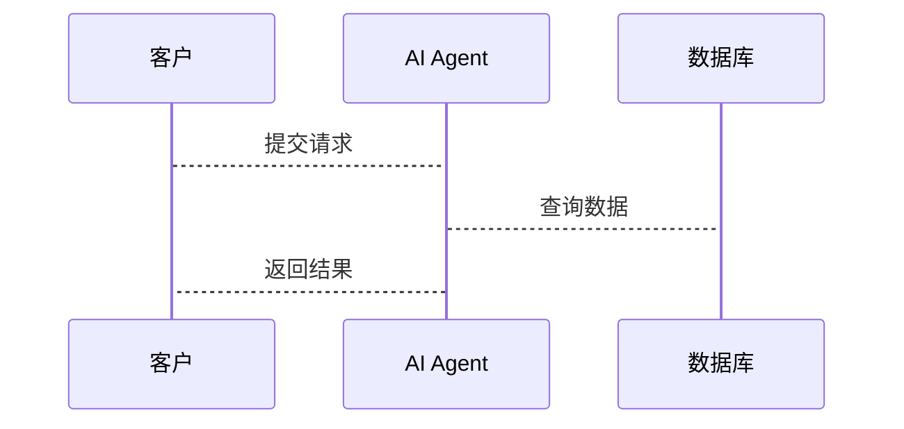

                 


# AI Agent在企业数字化转型中的核心作用

**关键词**：AI Agent, 企业数字化转型, 人工智能, 自动化流程, 数据分析

**摘要**：随着企业数字化转型的深入推进，AI Agent（人工智能代理）逐渐成为不可或缺的核心技术。本文将从AI Agent的基本概念、核心算法、系统架构设计、项目实战等方面详细阐述其在企业数字化转型中的重要作用，并探讨如何通过AI Agent提升企业的智能化水平。

---

## 第1章 AI Agent的核心概念与背景

### 1.1 问题背景与描述

#### 1.1.1 企业数字化转型的现状与挑战

企业数字化转型旨在通过技术手段将传统业务流程转化为数字化、智能化的模式。然而，企业在转型过程中面临诸多挑战，如数据孤岛、流程复杂、决策滞后等。这些问题严重影响了企业的运营效率和市场竞争力。

#### 1.1.2 AI Agent在数字化转型中的定位与作用

AI Agent是一种能够感知环境、自主决策并采取行动的智能体。在企业数字化转型中，AI Agent可以自动化处理大量数据，优化业务流程，提高决策效率，从而帮助企业实现降本增效。

#### 1.1.3 问题解决路径与边界

AI Agent通过感知环境、分析数据、制定决策和执行操作，解决了企业在数字化转型中面临的问题。其边界包括数据处理、决策支持和系统集成等。

### 1.2 核心概念与结构

#### 1.2.1 AI Agent的定义与核心要素

AI Agent是一种智能系统，具备感知、决策和执行能力。其核心要素包括感知模块、决策模块和执行模块。

#### 1.2.2 AI Agent的概念结构与功能模块

- **感知模块**：通过传感器或数据输入获取环境信息。
- **决策模块**：基于感知信息，使用算法做出决策。
- **执行模块**：根据决策结果采取行动。

#### 1.2.3 AI Agent的核心属性与特征对比

| 属性 | 特征 |
|------|------|
| 感知能力 | 高度灵敏，能够实时获取环境信息 |
| 决策能力 | 基于数据和模型进行智能决策 |
| 执行能力 | 快速响应，准确执行决策 |

### 1.3 AI Agent的核心原理

#### 1.3.1 AI Agent的基本原理

AI Agent通过感知环境、分析数据、制定决策和执行操作，实现自动化和智能化的目标。其核心原理包括数据处理、算法选择和系统集成。

#### 1.3.2 AI Agent的核心算法与技术

- **强化学习**：通过试错机制优化决策策略。
- **监督学习**：基于标注数据进行分类或回归分析。
- **无监督学习**：发现数据中的隐藏模式。

#### 1.3.3 AI Agent的工作流程与逻辑

1. **感知环境**：通过传感器或数据输入获取信息。
2. **分析数据**：使用算法对数据进行处理和分析。
3. **制定决策**：基于分析结果做出决策。
4. **执行操作**：根据决策结果采取行动。

### 1.4 本章小结

本章详细介绍了AI Agent的核心概念、结构和工作原理，为后续章节的深入分析奠定了基础。

---

## 第2章 AI Agent的核心算法与数学模型

### 2.1 算法原理概述

#### 2.1.1 强化学习与决策树算法

- **强化学习**：通过试错机制优化决策策略，适用于动态环境。
- **决策树算法**：基于特征的分层决策，适用于分类和回归问题。

#### 2.1.2 监督学习与无监督学习在AI Agent中的应用

- **监督学习**：基于标注数据进行分类或回归分析，适用于已知数据模式的情况。
- **无监督学习**：发现数据中的隐藏模式，适用于未知数据模式的情况。

#### 2.1.3 深度学习与神经网络在AI Agent中的作用

- **深度学习**：通过多层神经网络学习复杂数据模式，适用于图像识别和自然语言处理。

### 2.2 AI Agent的数学模型与公式

#### 2.2.1 强化学习的数学模型

$$ V(s) = \max_{a} [r + V(s') ] $$

其中，\( V(s) \) 是状态 \( s \) 的价值函数，\( r \) 是奖励，\( s' \) 是下一步的状态。

#### 2.2.2 决策树算法的核心公式

$$ Gini Impurity = \sum_{i=1}^{n} p_i (1 - p_i) $$

其中，\( p_i \) 是第 \( i \) 个类别的概率。

#### 2.2.3 神经网络的基本数学原理

$$ y = \sigma(w x + b) $$

其中，\( \sigma \) 是激活函数，\( w \) 是权重，\( b \) 是偏置。

### 2.3 算法实现与代码示例

#### 2.3.1 强化学习算法实现

```python
def reinforce_learning(env):
    # 初始化参数
    # 算法实现代码
    return agent
```

#### 2.3.2 决策树算法实现

```python
from sklearn.tree import DecisionTreeClassifier
model = DecisionTreeClassifier()
model.fit(X, y)
```

### 2.4 本章小结

本章详细介绍了AI Agent的核心算法与数学模型，为后续章节的系统设计奠定了理论基础。

---

## 第3章 AI Agent的系统架构与设计

### 3.1 系统架构概述

#### 3.1.1 系统架构设计

AI Agent的系统架构包括感知层、决策层和执行层。

- **感知层**：负责数据采集和环境感知。
- **决策层**：执行算法进行决策。
- **执行层**：根据决策结果采取行动。

#### 3.1.2 系统功能设计

- **数据处理**：采集、清洗和预处理数据。
- **模型训练**：基于数据训练AI Agent模型。
- **系统集成**：将模型集成到企业系统中。

#### 3.1.3 系统架构图



### 3.2 系统接口设计

- **输入接口**：接收环境数据和用户输入。
- **输出接口**：输出决策结果和执行操作。

### 3.3 系统交互流程



### 3.4 本章小结

本章详细介绍了AI Agent的系统架构与设计，为后续章节的项目实战奠定了基础。

---

## 第4章 AI Agent的项目实战

### 4.1 项目背景与目标

假设我们开发一个智能客服AI Agent，目标是通过自然语言处理技术实现智能客服功能。

### 4.2 项目环境安装

- **安装Python和相关库**：如TensorFlow和scikit-learn。

### 4.3 核心代码实现

#### 4.3.1 数据处理

```python
import pandas as pd
data = pd.read_csv('data.csv')
```

#### 4.3.2 模型训练

```python
from sklearn.tree import DecisionTreeClassifier
model = DecisionTreeClassifier()
model.fit(X, y)
```

#### 4.3.3 系统集成

```python
def handle_customer_request(request):
    # 处理请求并返回结果
    return response
```

### 4.4 项目总结

通过项目实战，我们掌握了AI Agent的核心实现技术，并验证了其在企业数字化转型中的应用价值。

---

## 第5章 最佳实践与小结

### 5.1 最佳实践

- **数据质量**：确保数据的准确性和完整性。
- **模型可解释性**：提高模型的透明度和可解释性。
- **持续优化**：定期监控和优化AI Agent的性能。

### 5.2 小结

AI Agent在企业数字化转型中扮演着核心作用，通过自动化流程、智能决策和数据处理，帮助企业实现降本增效。

### 5.3 注意事项

- **数据隐私**：确保数据的隐私和安全。
- **系统稳定性**：保证系统的稳定性和可靠性。

### 5.4 拓展阅读

- 推荐阅读《人工智能：一种现代方法》和《机器学习实战》。

---

## 总结

通过本文的详细阐述，我们了解了AI Agent在企业数字化转型中的核心作用，掌握了其核心算法与系统设计方法，并通过项目实战验证了其应用价值。未来，随着技术的不断进步，AI Agent将在更多领域发挥其核心作用。

