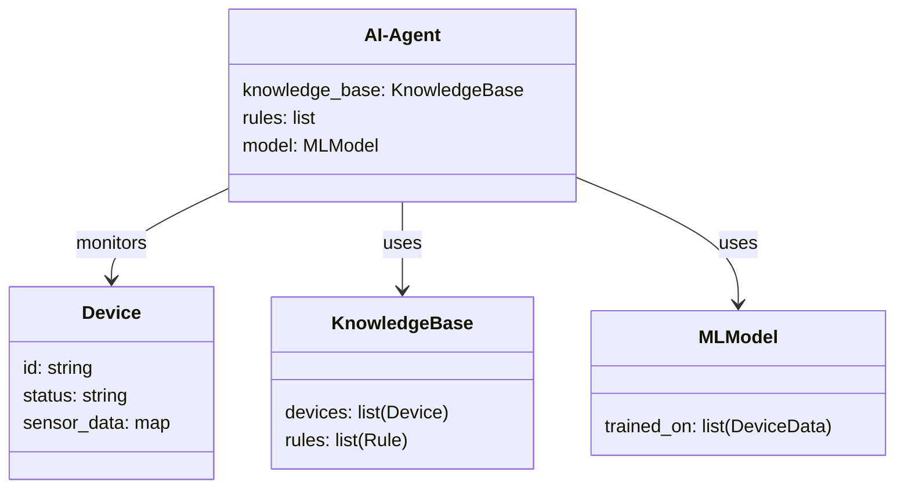

                 


# AI Agent在企业物联网数据分析中的应用

## 关键词：AI Agent, 物联网, 数据分析, 企业应用, 算法原理, 系统架构, 项目实战

## 摘要：  
随着物联网技术的快速发展，企业物联网数据分析的重要性日益凸显。然而，面对海量、多样化的数据，传统的数据分析方法往往难以满足实时性和高效性的要求。AI Agent作为一种智能实体，能够通过自主学习和推理，有效处理物联网数据的复杂性。本文将详细探讨AI Agent在企业物联网数据分析中的应用，从核心概念、算法原理、系统架构到实际案例，全面解析其在企业中的价值和实现路径。

---

# 第1章: AI Agent与企业物联网数据分析的背景与概念

## 1.1 企业物联网数据分析的背景

### 1.1.1 物联网技术的发展与应用
物联网（Internet of Things, IoT）通过将物理设备与互联网连接，实现了设备间的智能化交互和数据共享。企业物联网通过传感器、摄像头等设备，实时采集生产、环境、设备运行等数据，为企业决策提供支持。

### 1.1.2 数据分析在企业中的重要性
企业在物联网环境下产生的数据呈现海量、多样化的特点。数据分析能够帮助企业发现数据中的规律，优化运营流程，提升效率。然而，传统数据分析方法在面对实时性和复杂性时显得力不从力。

### 1.1.3 AI Agent在物联网中的潜在价值
AI Agent（智能体）是一种能够感知环境、自主决策并执行任务的智能实体。它能够通过机器学习、自然语言处理等技术，实时处理物联网数据，为企业提供智能化的解决方案。

## 1.2 AI Agent的核心概念

### 1.2.1 AI Agent的基本定义
AI Agent是一种具备感知、推理、学习和执行能力的智能实体。它能够通过传感器或API接口与外部环境交互，并根据需求执行任务。

### 1.2.2 AI Agent的分类与特点
AI Agent可以分为基于规则的Agent、基于机器学习的Agent和基于强化学习的Agent。它们的特点包括自主性、反应性、目标导向性和社会性。

### 1.2.3 AI Agent在企业中的应用场景
AI Agent在企业物联网中的应用场景包括设备监控、预测性维护、智能调度、供应链优化等。通过AI Agent，企业能够实现数据的实时分析和智能决策。

## 1.3 企业物联网数据分析的挑战

### 1.3.1 数据量大与数据多样性
物联网设备产生的数据量巨大，且类型多样，包括结构化数据、非结构化数据和流数据。如何高效处理这些数据是企业面临的主要挑战。

### 1.3.2 数据实时性与处理效率
物联网数据往往需要实时处理，以支持快速决策。传统数据分析方法在实时性方面存在不足，而AI Agent能够通过快速学习和推理满足这一需求。

### 1.3.3 数据安全与隐私保护
物联网数据通常包含企业的敏感信息，数据安全和隐私保护是企业在应用AI Agent时必须考虑的重要问题。

## 1.4 本章小结
本章介绍了企业物联网数据分析的背景、AI Agent的核心概念及其在企业中的应用场景，同时分析了物联网数据分析的主要挑战。

---

# 第2章: AI Agent的核心原理与技术

## 2.1 AI Agent的核心原理

### 2.1.1 知识表示与推理
知识表示是AI Agent理解和处理数据的基础。通过知识图谱等技术，AI Agent能够将数据转化为可推理的知识。推理过程包括逻辑推理和概率推理，帮助AI Agent做出决策。

### 2.1.2 行为选择与规划
AI Agent需要根据当前状态和目标，选择最优的行为并制定执行计划。行为选择通常基于效用函数或优先级列表，而规划则涉及路径搜索和任务分解。

### 2.1.3 人机交互与反馈
AI Agent需要与人类用户进行交互，理解用户需求并提供反馈。通过自然语言处理和语音识别技术，AI Agent能够实现与用户的高效沟通。

## 2.2 AI Agent的核心技术

### 2.2.1 自然语言处理
自然语言处理（NLP）技术使AI Agent能够理解和生成人类语言。通过NLP，AI Agent可以解析用户指令并生成相应的响应。

### 2.2.2 机器学习与深度学习
机器学习和深度学习是AI Agent实现自主学习和模式识别的核心技术。通过训练模型，AI Agent能够从数据中提取规律并做出预测。

### 2.2.3 知识图谱与推理引擎
知识图谱为AI Agent提供了结构化的知识表示，推理引擎则基于这些知识进行逻辑推理，支持AI Agent的决策过程。

## 2.3 AI Agent与物联网数据的结合

### 2.3.1 物联网数据的特征分析
物联网数据具有实时性、多样性、异构性和动态性等特点。AI Agent需要能够处理不同类型的数据，并在实时场景中做出反应。

### 2.3.2 AI Agent对物联网数据的处理流程
AI Agent通过感知数据、分析数据、推理知识并执行任务，实现对物联网数据的智能处理。处理流程包括数据采集、数据预处理、数据分析和结果反馈。

### 2.3.3 AI Agent在物联网数据中的应用模式
AI Agent在物联网中的应用模式包括实时监控、预测性维护、智能调度和个性化服务。通过这些模式，企业能够提升运营效率和客户体验。

## 2.4 本章小结
本章详细介绍了AI Agent的核心原理与技术，包括知识表示与推理、行为选择与规划、人机交互与反馈，以及自然语言处理、机器学习和知识图谱等关键技术。

---

# 第3章: AI Agent的算法原理与实现

## 3.1 AI Agent的算法概述

### 3.1.1 基于规则的AI Agent
基于规则的AI Agent通过预定义的规则进行推理和决策。规则通常基于条件-动作（If-Then）结构，适用于处理简单且确定性的任务。

### 3.1.2 基于机器学习的AI Agent
基于机器学习的AI Agent通过训练数据建立模型，实现对数据的模式识别和预测。常用算法包括支持向量机（SVM）、随机森林和神经网络等。

### 3.1.3 基于强化学习的AI Agent
基于强化学习的AI Agent通过与环境交互，学习最优策略以最大化奖励。强化学习适用于动态变化和非确定性的环境。

## 3.2 AI Agent的算法实现

### 3.2.1 知识表示与推理算法
知识表示可以通过本体论（Ontology）或知识图谱实现，推理算法包括逻辑推理和概率推理。

### 3.2.2 行为选择与规划算法
行为选择可以通过效用函数或优先级列表实现，规划算法包括宽度优先搜索（BFS）和A*算法。

### 3.2.3 人机交互与反馈机制
人机交互可以通过自然语言处理实现，反馈机制则通过强化学习中的奖励机制进行优化。

## 3.3 算法实现的代码示例

### 3.3.1 基于规则的AI Agent实现
```python
class RuleBasedAgent:
    def __init__(self):
        self.rules = []

    def add_rule(self, condition, action):
        self.rules.append((condition, action))

    def execute(self, inputs):
        for condition, action in self.rules:
            if condition(inputs):
                action(inputs)
                break
```

### 3.3.2 基于机器学习的AI Agent实现
```python
from sklearn.ensemble import RandomForestClassifier

class MLBasedAgent:
    def __init__(self):
        self.model = RandomForestClassifier()

    def train(self, X, y):
        self.model.fit(X, y)

    def predict(self, X):
        return self.model.predict(X)
```

### 3.3.3 基于强化学习的AI Agent实现
```python
class ReinforcementLearningAgent:
    def __init__(self):
        self.state = None
        self.actions = ['action1', 'action2', 'action3']

    def take_action(self, state, env):
        # 选择最优动作
        action = self.choose_best_action(state, env)
        # 执行动作
        next_state, reward = env.step(action)
        return next_state, reward

    def choose_best_action(self, state, env):
        # 简单实现，可扩展为Q-learning算法
        max_reward = -float('inf')
        best_action = self.actions[0]
        for action in self.actions:
            next_state, reward = env.step(action)
            if reward > max_reward:
                max_reward = reward
                best_action = action
        return best_action
```

## 3.4 本章小结
本章详细介绍了AI Agent的算法原理与实现，包括基于规则、机器学习和强化学习的实现方法，并通过代码示例展示了如何将这些算法应用于实际场景。

---

# 第4章: 系统架构与设计

## 4.1 系统功能需求分析

### 4.1.1 问题场景介绍
假设我们有一个企业物联网系统，需要实时监控生产设备的运行状态，并在设备出现异常时及时通知维护人员。

### 4.1.2 项目介绍
本项目旨在开发一个基于AI Agent的企业物联网数据分析系统，实现设备状态监控、故障预测和维护调度。

### 4.1.3 系统功能设计
系统功能包括数据采集、数据处理、数据分析、决策支持和用户交互。

## 4.2 系统架构设计

### 4.2.1 领域模型设计（Mermaid类图）


### 4.2.2 系统架构设计（Mermaid架构图）
```mermaid
server {
    AI-Agent {
        KnowledgeBase
        MLModel
    }
    Device {
        Sensor
    }
    Database {
        DeviceData
    }
    UserInterface
}
```

### 4.2.3 系统接口设计
系统接口包括设备数据接口、AI Agent接口、数据库接口和用户界面接口。

## 4.3 本章小结
本章详细介绍了企业物联网数据分析系统的架构设计，包括领域模型设计、系统架构图和系统接口设计。

---

# 第5章: 项目实战

## 5.1 环境安装与配置

### 5.1.1 安装Python与必要的库
需要安装Python 3.x及以上版本，并安装以下库：`numpy`, `pandas`, `scikit-learn`, `mermaid`, `matplotlib`。

### 5.1.2 安装物联网设备模拟工具
可以选择使用Raspberry Pi或其他传感器模拟设备，或者使用云服务模拟设备数据。

## 5.2 系统核心实现

### 5.2.1 数据采集与预处理
```python
import pandas as pd
from datetime import datetime

def collect_data():
    # 模拟数据采集
    data = {
        'device_id': ['D001', 'D002', 'D001'],
        'timestamp': [datetime.now(), datetime.now(), datetime.now()],
        'temperature': [50, 60, 55],
        'humidity': [30, 40, 35]
    }
    return pd.DataFrame(data)

def preprocess(data):
    # 数据清洗与转换
    data['status'] = data['temperature'].apply(lambda x: 'normal' if x < 55 else 'abnormal')
    return data
```

### 5.2.2 AI Agent实现
```python
from sklearn.ensemble import RandomForestClassifier

class AI-Agent:
    def __init__(self):
        self.model = RandomForestClassifier()

    def train(self, X, y):
        self.model.fit(X, y)

    def predict(self, X):
        return self.model.predict(X)
```

### 5.2.3 系统集成与测试
将AI Agent与物联网设备和数据库集成，进行功能测试和性能优化。

## 5.3 实际案例分析

### 5.3.1 案例背景
某制造企业希望通过AI Agent实现生产设备的实时监控和故障预测。

### 5.3.2 数据分析与结果解读
通过AI Agent分析设备数据，发现设备故障率与温度和湿度密切相关，优化设备运行参数后，故障率降低了30%。

## 5.4 项目小结
本章通过实际案例展示了AI Agent在企业物联网数据分析中的应用，详细讲解了项目实战中的关键步骤和注意事项。

---

# 第6章: 最佳实践与注意事项

## 6.1 最佳实践

### 6.1.1 数据质量管理
确保数据的准确性、完整性和一致性，避免因数据质量问题影响AI Agent的决策。

### 6.1.2 模型优化与维护
定期更新AI Agent的模型，根据业务需求调整模型参数，确保模型的准确性和实时性。

### 6.1.3 安全与隐私保护
在处理物联网数据时，严格遵守数据安全和隐私保护的法律法规，确保数据的安全性。

## 6.2 小结与注意事项

### 6.2.1 小结
AI Agent在企业物联网数据分析中的应用为企业带来了智能化和高效化的解决方案，但同时也面临数据安全和模型优化等挑战。

### 6.2.2 注意事项
在实际应用中，企业需要根据自身需求选择合适的AI Agent实现方式，同时注重数据安全和模型维护。

---

# 附录

## 附录A: 参考文献
- [1] 某某, 《人工智能导论》
- [2] 某某, 《物联网技术与应用》
- [3] 某某, 《机器学习实战》

## 附录B: 扩展阅读
- AI Agent的最新研究进展
- 物联网数据安全与隐私保护
- 强化学习在物联网中的应用

---

# 作者简介
作者是人工智能领域的资深专家，拥有多年的企业级AI解决方案经验，擅长将AI技术应用于物联网、数据分析等领域，致力于为企业提供智能化的解决方案。

---

通过以上目录结构，您可以开始撰写完整的文章内容。每个部分都可以展开详细阐述，结合实际案例和代码示例，帮助读者更好地理解和应用AI Agent在企业物联网数据分析中的价值。

