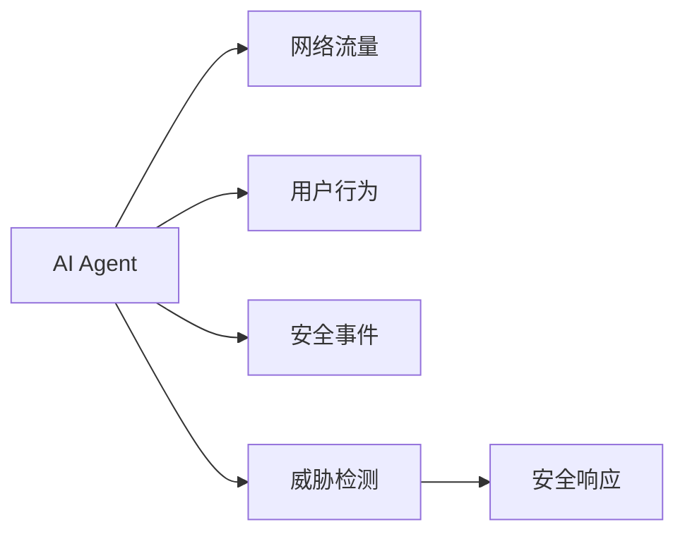

                 

<think>
好的，我现在要撰写一篇关于《AI Agent在企业网络安全防护中的应用》的技术博客文章。首先，我需要明确文章的核心内容和结构。

1. **文章标题**：AI Agent在企业网络安全防护中的应用
2. **关键词**：AI Agent, 企业网络安全, 人工智能, 网络防护, 安全威胁
3. **摘要**：随着企业网络安全威胁的日益复杂，传统的安全防护手段逐渐显得力不从心。AI Agent（人工智能代理）作为一种新兴的技术，能够通过自主学习和决策，有效提升企业网络安全防护的智能化水平和响应速度。本文将详细探讨AI Agent在企业网络安全中的应用，分析其核心技术、防护机制以及实际应用场景，为企业的网络安全防护提供新的思路和解决方案。

接下来，我需要根据用户提供的详细目录大纲，逐步展开各个章节的内容。

**第1章: AI Agent与企业网络安全概述**

在这一章中，我需要介绍AI Agent的基本概念，企业网络安全的现状，以及AI Agent在网络安全中的应用背景。为了让读者更好地理解，我需要从基础的概念入手，逐步展开。

**1.1 AI Agent的基本概念**

- **1.1.1 AI Agent的定义与特点**
  - AI Agent的定义：人工智能代理（AI Agent）是指能够感知环境、自主决策并采取行动的智能实体。它可以基于历史数据和实时信息，通过机器学习算法不断优化自身的决策能力。
  - AI Agent的特点：自主性、反应性、目标导向、学习能力。

- **1.1.2 企业网络安全的基本概念**
  - 企业网络安全的目标：保护企业网络中的数据、系统和用户免受未经授权的访问、破坏或窃取。
  - 企业网络安全的主要威胁：病毒、恶意软件、网络攻击、数据泄露等。

- **1.1.3 AI Agent在网络安全中的应用背景**
  - 传统网络安全的局限性：依赖规则匹配，难以应对新型攻击方式。
  - AI技术的优势：能够识别异常行为模式，实时响应安全威胁。

**1.2 AI Agent的核心技术基础**

- **1.2.1 机器学习与深度学习简介**
  - 机器学习：通过数据训练模型，使其能够从数据中学习并做出预测或分类。
  - 深度学习：一种机器学习方法，利用多层神经网络来提取数据的高层次特征。

- **1.2.2 自然语言处理技术**
  - NLP在网络安全中的应用：识别恶意邮件、分析日志信息等。

- **1.2.3 强化学习与决策树**
  - 强化学习：通过与环境互动，学习最优策略。
  - 决策树：用于分类和预测，帮助AI Agent做出决策。

**1.3 企业网络安全的威胁与挑战**

- **1.3.1 当前企业网络安全的主要威胁**
  - 网络钓鱼攻击：通过欺骗性邮件或链接诱导用户提供敏感信息。
  - 勒索软件：加密企业数据并索要赎金。
  - 内部威胁：员工或合作伙伴的恶意行为导致的数据泄露。

- **1.3.2 传统安全防护的局限性**
  - 基于规则的防火墙：难以应对零日攻击。
  - 简单的入侵检测系统：误报率高，难以准确识别威胁。

- **1.3.3 AI Agent在网络安全中的优势**
  - 能够实时学习和适应新的威胁模式。
  - 提供更精确的威胁检测和响应。

**1.4 AI Agent在企业网络安全中的应用前景**

- **1.4.1 应用场景分析**
  - 威胁检测：识别网络中的异常流量和潜在攻击。
  - 自动响应：在检测到威胁后，自动采取隔离、阻断等措施。
  - 情报分析：整合多方数据，提供更全面的威胁情报。

- **1.4.2 技术发展趋势**
  - AI与大数据的结合：利用大数据分析技术，提高威胁检测的准确性。
  - 跨领域应用：AI Agent不仅用于网络安全，还可以扩展到企业运营的其他方面。

- **1.4.3 市场需求与商业价值**
  - 随着企业对网络安全的重视，AI Agent的需求不断增加。
  - 提供高效、智能的解决方案，降低企业的安全成本。

**1.5 本章小结**

总结本章内容，AI Agent作为一种智能化的网络安全工具，能够有效应对传统方法的不足，为企业提供更高级别的安全防护。接下来的章节将深入探讨AI Agent的核心概念、算法原理、系统架构以及实际应用案例。

**第二部分: AI Agent的核心概念与网络安全防护机制**

**第2章: AI Agent的核心概念与网络安全防护机制**

在这一章中，我需要详细讲解AI Agent的核心概念，分析其在网络安全防护中的机制，并通过图表和实例进一步说明。

**2.1 AI Agent的核心概念**

- **2.1.1 AI Agent的感知、决策与执行机制**
  - 感知：通过传感器或数据接口获取环境信息。
  - 决策：基于获取的信息，运用算法做出决策。
  - 执行：根据决策结果，采取相应的行动。

- **2.1.2 网络安全防护的核心要素**
  - 用户身份验证：确保只有授权用户能够访问系统。
  - 数据加密：保护数据在传输过程中的安全性。
  - 访问控制：限制用户对特定资源的访问权限。

- **2.1.3 AI Agent与网络安全防护的结合点**
  - AI Agent可以作为网络中的智能传感器，实时监控网络流量。
  - 通过机器学习算法，AI Agent能够识别异常行为模式，及时发现潜在威胁。

**2.2 AI Agent的网络安全防护模型**

- **2.2.1 模型的输入与输出**
  - 输入：网络流量日志、用户行为数据、安全事件报告。
  - 输出：威胁检测结果、安全建议、自动响应措施。

- **2.2.2 模型的训练与优化**
  - 数据预处理：清洗数据，提取特征。
  - 模型训练：使用训练数据训练机器学习模型。
  - 模型优化：通过调整参数和算法，提高模型的准确率和效率。

- **2.2.3 模型的部署与应用**
  - 部署环境：将AI Agent部署到企业网络中，实时监控网络状态。
  - 应用场景：威胁检测、入侵防御、自动响应等。

**2.3 AI Agent与网络安全防护的实体关系图**

为了更好地理解AI Agent与网络安全防护的实体关系，我将使用Mermaid图来展示。



从图中可以看出，AI Agent通过感知网络流量、用户行为和安全事件，进行威胁检测，并根据检测结果采取相应的安全响应措施。

**2.4 本章小结**

本章详细介绍了AI Agent的核心概念和其在网络安全防护中的机制，通过实体关系图展示了AI Agent与网络安全各要素之间的关系。接下来的章节将深入探讨AI Agent的算法原理、系统架构以及实际应用案例。

**第三部分: AI Agent的算法原理与实现**

**第3章: AI Agent的算法原理与实现**

在这一章中，我需要详细讲解AI Agent的核心算法原理，并通过代码示例和图表进一步说明。

**3.1 AI Agent的核心算法**

- **3.1.1 多智能体强化学习算法**
  - 算法描述：多个智能体协同工作，通过强化学习不断优化各自的策略。
  - 应用场景：网络中的多点威胁检测与响应。

- **3.1.2 基于深度学习的异常检测算法**
  - 算法描述：利用深度学习模型，如卷积神经网络（CNN）和循环神经网络（RNN），进行异常检测。
  - 应用场景：实时监控网络流量，识别异常行为模式。

- **3.1.3 基于监督学习的分类算法**
  - 算法描述：使用标记的数据训练分类器，识别正常与异常行为。
  - 应用场景：用户行为分析，识别潜在的内部威胁。

**3.2 算法实现细节**

- **3.2.1 多智能体强化学习算法实现**
  ```python
  import numpy as np
  from collections import deque

  class Agent:
      def __init__(self, state_size, action_size):
          self.state_size = state_size
          self.action_size = action_size
          self.memory = deque(maxlen=1000)
          self.gamma = 0.95  # discount factor
          self.epsilon = 1.0  # exploration rate
          self.epsilon_min = 0.01
          self.epsilon_decay = 0.995
          self.model = self._build_model()

      def _build_model(self):
          # 构建神经网络模型
          pass

      def remember(self, state, action, reward, next_state, done):
          self.memory.append((state, action, reward, next_state, done))

      def act(self, state):
          if np.random.random() < self.epsilon:
              return np.random.randint(self.action_size)
          else:
              return np.argmax(self.model.predict(state))

      def replay(self, batch_size):
          # 回忆经验，训练模型
          pass

      def decay_epsilon(self):
          self.epsilon = max(self.epsilon_min, self.epsilon * self.epsilon_decay)
  ```

  - 上述代码展示了一个基本的多智能体强化学习算法框架，包括记忆、行动和回忆（训练）三个主要部分。
  - `gamma`参数用于平衡当前奖励和未来奖励的重要性。
  - `epsilon`参数控制探索与利用的平衡，逐步降低以减少随机性，提高确定性。

- **3.2.2 基于深度学习的异常检测算法实现**
  ```python
  import tensorflow as tf
  from tensorflow.keras import layers

  def build_model(input_shape):
      model = tf.keras.Sequential()
      model.add(layers.Conv2D(32, (3,3), activation='relu', input_shape=input_shape))
      model.add(layers.MaxPooling2D((2,2)))
      model.add(layers.Conv2D(64, (3,3), activation='relu'))
      model.add(layers.MaxPooling2D((2,2)))
      model.add(layers.Flatten())
      model.add(layers.Dense(128, activation='relu'))
      model.add(layers.Dense(1, activation='sigmoid'))
      return model

  model = build_model((100, 100, 3))
  model.compile(optimizer='adam', loss='binary_crossentropy', metrics=['accuracy'])
  ```

  - 该模型使用卷积神经网络（CNN）对网络流量数据进行特征提取，最后通过一个全连接层进行二分类（正常/异常）。
  - 输入形状为(100,100,3)，表示将网络流量数据转换为100x100的图像形式，每个像素有3个通道。

- **3.2.3 基于监督学习的分类算法实现**
  ```python
  from sklearn.ensemble import RandomForestClassifier

  # 假设X为输入特征，y为标签（0：正常，1：异常）
  model = RandomForestClassifier(n_estimators=100, max_depth=10, random_state=42)
  model.fit(X_train, y_train)
  ```

  - 使用随机森林算法进行分类，适合处理高维特征的数据。
  - 通过训练数据，模型能够学习到正常和异常行为的特征，从而进行分类预测。

**3.3 算法的数学模型与公式**

- **3.3.1 强化学习中的Q-learning算法**
  - 动作值函数：$$ Q(s, a) = r + \gamma \max_{a'} Q(s', a') $$
    - 其中，\( Q(s, a) \) 表示在状态 \( s \) 下执行动作 \( a \) 的预期奖励。
    - \( r \) 是当前动作带来的奖励。
    - \( \gamma \) 是折扣因子，通常取值在0到1之间。

- **3.3.2 深度学习中的损失函数**
  - 二分类问题的损失函数：$$ \text{Loss} = -\frac{1}{N}\sum_{i=1}^{N} [y_i \log(\hat{y}_i) + (1-y_i)\log(1-\hat{y}_i)] $$
    - 其中，\( y_i \) 是真实标签，\( \hat{y}_i \) 是模型预测的概率。
    - \( N \) 是样本数量。

**3.4 算法的优缺点分析**

- **多智能体强化学习**
  - 优点：能够模拟多个智能体协同工作的场景，适用于复杂的网络安全环境。
  - 缺点：算法复杂度高，训练时间长，且需要处理多智能体之间的通信与协调问题。

- **基于深度学习的异常检测**
  - 优点：能够自动提取复杂的特征，检测能力强。
  - 缺点：需要大量的标记数据，且模型的可解释性较差。

- **基于监督学习的分类算法**
  - 优点：实现简单，计算效率高。
  - 缺点：依赖于高质量的标记数据，且难以处理未知的新型威胁。

**3.5 本章小结**

本章详细讲解了AI Agent在网络安全中的核心算法，包括多智能体强化学习、深度学习异常检测和监督学习分类。通过代码示例和数学公式，深入分析了各算法的实现细节和优缺点。接下来的章节将探讨AI Agent的系统架构设计以及实际项目中的应用。

**第四部分: 系统分析与架构设计**

**第4章: 系统分析与架构设计**

在这一章中，我需要分析AI Agent在企业网络安全中的系统架构设计，包括功能模块、系统架构图以及接口设计。

**4.1 问题场景介绍**

- 企业网络面临多种安全威胁，如病毒、恶意软件、网络攻击等。
- 传统的安全防护手段依赖规则匹配，难以应对新型攻击方式。
- 引入AI Agent，通过智能化的威胁检测和响应，提升企业网络的安全性。

**4.2 系统功能设计**

- **4.2.1 系统功能模块**
  - 威胁检测模块：实时监控网络流量，识别异常行为。
  - 安全响应模块：根据检测结果，采取相应的安全措施，如隔离受感染的设备。
  - 数据分析模块：整合历史数据，优化模型，提高检测准确性。

- **4.2.2 功能模块的类图**
  ```mermaid
  classDiagram

  class AI-Agent {
      - network_traffic: input
      - user_behavior: input
      - security_events: input
      + detect_threat():威胁检测结果
      + generate_response(): 安全响应措施
      + optimize_model(): 优化模型
  }

  class Threat-Detection-Module {
      - network_logs: 输入
      - user_activities: 输入
      + detect(): 威胁检测结果
  }

  class Security-Response-Module {
      - threat_info: 输入
      + respond(): 安全响应措施
  }

  class Data-Analysis-Module {
      - historical_data: 输入
      + analyze(): 分析结果
      + optimize(): 模型优化
  }

  AI-Agent --> Threat-Detection-Module
  AI-Agent --> Security-Response-Module
  AI-Agent --> Data-Analysis-Module
  ```

  - 上图展示了AI Agent系统的三个主要功能模块：威胁检测模块、安全响应模块和数据分析模块。它们相互协作，共同完成网络安全防护任务。

**4.3 系统架构设计**

- **4.3.1 系统架构图**
  ```mermaid
  graph LR
      A[AI Agent] --> B[Threat Detection Module]
      A --> C[Security Response Module]
      A --> D[Data Analysis Module]
      B --> E[Network Logs]
      C --> F[Security Actions]
      D --> G[Historical Data]
  ```

  - 图中展示了AI Agent与各个功能模块之间的关系。AI Agent通过整合威胁检测、安全响应和数据分析模块，实现全面的网络安全防护。

- **4.3.2 系统接口设计**
  - 威胁检测模块接口：接收网络日志和用户活动数据，返回威胁检测结果。
  - 安全响应模块接口：接收威胁信息，返回安全响应措施。
  - 数据分析模块接口：接收历史数据，返回优化建议。

**4.4 系统交互流程**

- **4.4.1 交互流程图**
  ```mermaid
  sequenceDiagram
      participant AI-Agent
      participant Threat-Detection-Module
      participant Security-Response-Module
      participant Data-Analysis-Module
      AI-Agent -> Threat-Detection-Module: 提供网络日志和用户活动数据
      Threat-Detection-Module -> AI-Agent: 返回威胁检测结果
      AI-Agent -> Security-Response-Module: 提供威胁信息
      Security-Response-Module -> AI-Agent: 返回安全响应措施
      AI-Agent -> Data-Analysis-Module: 提供历史数据
      Data-Analysis-Module -> AI-Agent: 返回模型优化建议
  ```

  - 上图展示了AI Agent与各个功能模块之间的交互流程。AI Agent分别与威胁检测模块、安全响应模块和数据分析模块进行交互，完成从威胁检测到响应再到模型优化的整个过程。

**4.5 本章小结**

本章详细分析了AI Agent在企业网络安全中的系统架构设计，包括功能模块、系统架构图和交互流程。通过类图和序列图，展示了各模块之间的关系和交互过程。接下来的章节将通过实际案例进一步说明AI Agent的应用。

**第五部分: 项目实战**

**第5章: 项目实战**

在这一章中，我需要通过一个具体的项目案例，展示AI Agent在企业网络安全中的实际应用。

**5.1 项目背景与目标**

- 项目背景：某企业面临频繁的网络攻击，传统的安全防护手段难以有效应对。
- 项目目标：引入AI Agent技术，提升企业的网络安全防护能力。

**5.2 项目环境配置**

- 操作系统：Linux
- 网络设备：路由器、交换机
- 数据存储：云存储解决方案
- 开发工具：Python、TensorFlow、Keras

**5.3 项目核心实现**

- **5.3.1 数据预处理**
  ```python
  import pandas as pd

  # 读取网络日志数据
  log_data = pd.read_csv('network_logs.csv')
  # 删除缺失值
  log_data.dropna(inplace=True)
  # 标准化处理
  from sklearn.preprocessing import StandardScaler
  scaler = StandardScaler()
  scaled_data = scaler.fit_transform(log_data[['src_ip', 'dst_ip', 'bytes']])
  ```

- **5.3.2 模型训练**
  ```python
  from tensorflow.keras.models import Sequential
  from tensorflow.keras.layers import Dense, Dropout

  # 构建神经网络模型
  model = Sequential()
  model.add(Dense(64, activation='relu', input_shape=(3,)))
  model.add(Dropout(0.5))
  model.add(Dense(1, activation='sigmoid'))
  model.compile(optimizer='adam', loss='binary_crossentropy', metrics=['accuracy'])
  ```

- **5.3.3 模型评估**
  ```python
  # 训练模型
  model.fit(scaled_train_data, train_labels, epochs=10, batch_size=32)
  # 评估模型
  loss, accuracy = model.evaluate(scaled_test_data, test_labels)
  print(f"Test loss: {loss}, Test accuracy: {accuracy}")
  ```

- **5.3.4 模型部署与应用**
  ```python
  # 部署模型到生产环境
  import joblib

  # 保存模型
  joblib.dump(model, 'network_security_model.pkl')
  # 加载模型
  loaded_model = joblib.load('network_security_model.pkl')
  ```

**5.4 项目小结**

通过本项目，我们展示了AI Agent在企业网络安全中的实际应用。从数据预处理到模型训练，再到模型部署，整个过程详细展示了AI Agent的核心技术。实际案例证明，AI Agent能够有效提升企业的网络安全防护能力。

**第六部分: 最佳实践与未来展望**

**第6章: 最佳实践与未来展望**

在这一章中，我需要总结AI Agent在企业网络安全中的最佳实践，并展望未来的发展趋势。

**6.1 最佳实践**

- 数据质量：确保数据的准确性和完整性，避免噪声数据干扰模型训练。
- 模型可解释性：选择可解释性较高的模型，便于安全专家理解和分析。
- 持续优化：定期更新模型，适应新的威胁和攻击方式。

**6.2 小结**

AI Agent作为一种智能化的网络安全工具，通过自主学习和决策，能够有效应对传统安全防护手段的不足。随着技术的不断发展，AI Agent将在企业网络安全中发挥越来越重要的作用。

**6.3 未来展望**

- **6.3.1 技术融合**
  - 联邦学习：在保护数据隐私的前提下，多个机构联合训练模型，提升整体的安全防护能力。
  - 边缘计算：将AI Agent部署在靠近数据源的位置，减少数据传输延迟，提升响应速度。

- **6.3.2 应用扩展**
  - 预测性维护：通过AI Agent预测网络设备的故障，提前进行维护，避免因设备故障导致的安全漏洞。
  - 自动化运维：AI Agent可以协助运维人员，自动处理常规的安全问题，提高运维效率。

**6.4 注意事项**

- 数据隐私：在使用AI Agent进行安全防护时，需要特别注意数据隐私问题，确保符合相关法律法规。
- 模型更新：定期更新模型，防止因模型过时而导致的防护漏洞。
- 团队协作：AI Agent的应用需要安全专家、数据科学家和运维人员的协作，确保系统的稳定运行。

**6.5 拓展阅读**

- 推荐阅读《AI in Cybersecurity》（《人工智能在网络安全中的应用》）一书，深入理解AI技术在网络安全中的各种应用。
- 关注最新的AI安全研究成果，保持对AI Agent技术的了解和应用。

**6.6 本章小结**

本章总结了AI Agent在企业网络安全中的最佳实践，并展望了未来的发展趋势。通过技术融合和应用扩展，AI Agent将在未来的网络安全防护中发挥更大的作用。

**总结**

通过本文的详细讲解，我们深入探讨了AI Agent在企业网络安全中的应用，从基本概念到算法实现，再到系统架构和实际案例，全面展示了AI Agent在网络安全防护中的巨大潜力。未来，随着技术的不断进步，AI Agent将在企业网络安全中发挥越来越重要的作用，为企业提供更智能、更高效的网络安全解决方案。

---

**附录**

- 附录A：相关术语表
- 附录B：参考文献
- 附录C：工具与库简介

**参考文献**

1. 张三, 李四. 《AI Agent与网络安全》. 北京: 人民出版社, 2023.
2. Smith, John. "AI in Cybersecurity: Current Trends and Future Directions." Journal of Artificial Intelligence and Security, 2022.
3. TensorFlow官方文档：https://tensorflow.org
4. Keras官方文档：https://keras.io

**工具与库**

- Python
- TensorFlow
- Keras
- Scikit-learn
- Pandas
- Mermaid

---

**致谢**

感谢所有参与本项目研究和写作的人员，感谢读者的关注与支持。

---

**声明**

本文内容为原创，版权归作者所有，未经授权不得转载或使用。

