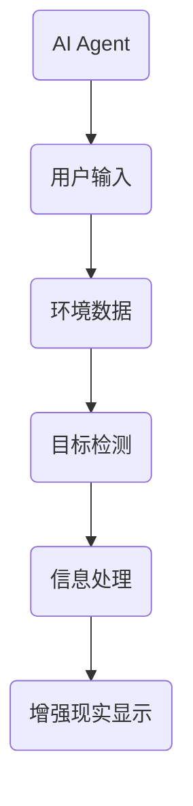
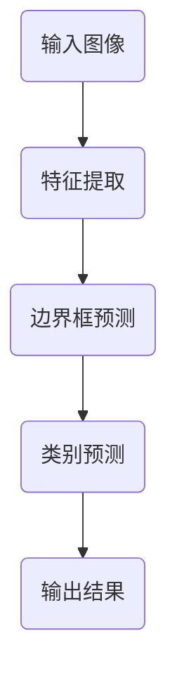
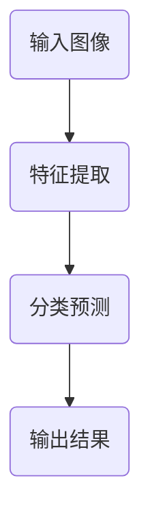
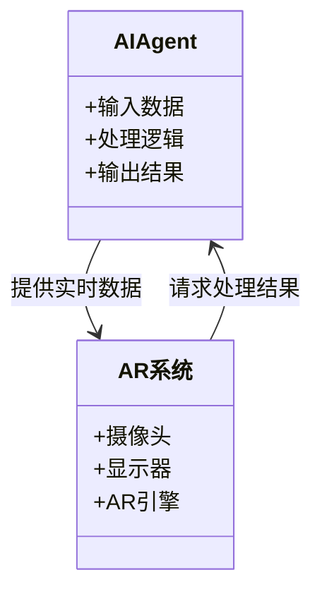
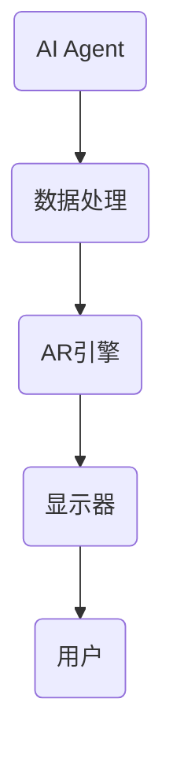

                 


# AI Agent在增强现实中的应用：实时信息叠加与交互

> **关键词**：AI Agent，增强现实，实时信息叠加，人机交互，目标检测，图像识别

> **摘要**：本文探讨了AI Agent在增强现实（AR）中的应用，重点分析了实时信息叠加与交互的技术原理和实现方法。通过结合AI Agent的智能性与增强现实的沉浸性，本文详细阐述了从概念到算法、从系统设计到项目实战的全过程，旨在为开发者和研究人员提供深度的技术指导。

---

# 第一部分: AI Agent与增强现实的基础概念

## 第1章: AI Agent与增强现实的背景介绍

### 1.1 问题背景与描述

#### 1.1.1 增强现实技术的定义与特点
- **定义**：增强现实（Augmented Reality，AR）是一种通过计算机技术将虚拟信息叠加到真实世界中的技术，用户可以通过AR设备（如手机、平板、智能眼镜等）看到虚拟对象与真实环境的结合。
- **特点**：
  - 实时性：AR需要实时处理和叠加信息。
  - 交互性：用户可以通过手势、语音等方式与AR内容互动。
  - 沉浸性：AR通过叠加虚拟信息，增强了用户的沉浸感。

#### 1.1.2 AI Agent的概念与作用
- **定义**：AI Agent（人工智能代理）是一种能够感知环境、自主决策并执行任务的智能实体，它可以是软件或硬件形式。
- **作用**：
  - 数据处理：AI Agent可以实时分析环境数据。
  - 信息叠加：AI Agent可以将处理后的信息叠加到AR环境中。
  - 人机交互：AI Agent可以与用户进行自然的对话或操作。

#### 1.1.3 问题解决与应用场景
- **问题**：如何将AI Agent与AR技术结合，实现实时信息叠加与交互。
- **应用场景**：
  - 教育：AR教育工具通过AI Agent提供实时指导。
  - 医疗：AR手术模拟通过AI Agent提供实时反馈。
  - 娱乐：AR游戏通过AI Agent实现智能NPC（非玩家角色）。

### 1.2 核心概念与外延

#### 1.2.1 AI Agent的类型与功能
- **类型**：
  - **反应式AI Agent**：基于当前输入做出实时反应。
  - **认知式AI Agent**：具有推理和规划能力。
  - **混合式AI Agent**：结合反应式和认知式的特点。

- **功能**：
  - 感知环境：通过传感器或摄像头获取数据。
  - 分析数据：利用机器学习模型进行分析。
  - 执行操作：将分析结果反馈到AR环境中。

#### 1.2.2 增强现实的实现原理
- **实现步骤**：
  1. 摄像头捕捉真实场景。
  2. 计算机视觉算法识别场景中的特征。
  3. AR引擎将虚拟内容叠加到场景中。
  4. 显示器呈现最终画面。

#### 1.2.3 两者的结合与边界
- **结合方式**：
  - AI Agent作为AR系统的“大脑”，负责数据处理和决策。
  - AR作为AI Agent的“界面”，负责信息展示和交互。
- **边界**：
  - AI Agent的能力受限于计算资源和算法精度。
  - AR的显示效果受限于硬件性能和环境条件。

---

## 第2章: AI Agent与增强现实的核心概念联系

### 2.1 核心概念原理

#### 2.1.1 AI Agent的类型与功能
- **对比分析**：
  - 反应式AI Agent适用于实时性要求高的场景。
  - 认知式AI Agent适用于复杂决策场景。
  - 混合式AI Agent在两者之间找到平衡。

#### 2.1.2 增强现实的实现原理
- **对比分析**：
  - AR技术依赖于计算机视觉和图形渲染。
  - AI Agent技术依赖于数据处理和决策逻辑。

#### 2.1.3 两者结合的机制
- **机制**：
  - AI Agent提供实时数据分析能力。
  - AR提供直观的信息展示方式。
  - 两者结合实现人机交互的闭环。

### 2.2 概念对比与特征分析

#### 2.2.1 AI Agent与传统计算机视觉的对比
| 特性               | AI Agent                          | 传统计算机视觉                     |
|--------------------|-----------------------------------|------------------------------------|
| 数据处理能力       | 强，支持实时决策                 | 弱，主要用于图像处理               |
| 交互能力           | 支持人机交互                     | 仅支持数据处理，不支持交互         |
| 应用场景           | 智能助手、自动驾驶               | 目标检测、图像识别                 |

#### 2.2.2 增强现实与虚拟现实的对比
| 特性               | 增强现实（AR）                   | 虚拟现实（VR）                     |
|--------------------|-----------------------------------|------------------------------------|
| 环境叠加           | 虚实结合                         | 完全虚拟                          |
| 用户感知           | 用户可以看到真实环境             | 用户只能看到虚拟环境             |
| 应用场景           | 教育、医疗、娱乐                 | 游戏、虚拟培训                     |

#### 2.2.3 两者的结合优势与劣势
- **优势**：
  - 结合了AI Agent的智能性和AR的沉浸性。
  - 提供了更直观的人机交互方式。
- **劣势**：
  - 技术复杂性高，实现难度大。
  - 对硬件性能要求较高。

### 2.3 ER实体关系图



---

# 第二部分: AI Agent在增强现实中的算法原理

## 第3章: 目标检测与图像识别算法

### 3.1 算法原理

#### 3.1.1 目标检测算法流程
- **步骤**：
  1. 摄像头获取输入图像。
  2. 特征提取：使用CNN（卷积神经网络）提取图像特征。
  3. 边界框预测：使用锚框（anchor box）预测目标位置。
  4. 类别预测：使用分类器预测目标类别。
  5. 输出结果：返回目标的位置和类别。



#### 3.1.2 图像识别算法流程
- **步骤**：
  1. 摄像头获取输入图像。
  2. 特征提取：使用CNN提取图像特征。
  3. 分类预测：使用全连接层预测图像类别。
  4. 输出结果：返回图像的类别。



#### 3.1.3 目标检测与图像识别的数学模型
- **目标检测模型**：
  - 损失函数：使用交叉熵损失和定位损失。
  $$ \text{损失函数} = \text{分类损失} + \text{定位损失} $$
- **图像识别模型**：
  - 分类损失：使用交叉熵损失。
  $$ \text{损失函数} = -\sum_{i=1}^{n} y_i \log(p_i) $$

#### 3.1.4 算法实现与优化
- **实现**：使用目标检测框架（如YOLO、Faster R-CNN）。
- **优化**：通过数据增强、模型剪枝等方法提升性能。

---

## 第4章: 增强现实中的图像识别算法

### 4.1 增强现实中的图像识别流程

#### 4.1.1 图像识别的实现
- **步骤**：
  1. 摄像头获取输入图像。
  2. 特征提取：使用CNN提取图像特征。
  3. 分类预测：使用分类器预测图像类别。
  4. 输出结果：返回图像的类别。

#### 4.1.2 图像识别在增强现实中的应用
- **应用**：
  - 目标识别：识别场景中的物体。
  - 场景分类：分类场景的类型。

---

## 第5章: AI Agent与增强现实的结合算法

### 5.1 AI Agent在增强现实中的算法实现

#### 5.1.1 AI Agent的数据处理流程
- **步骤**：
  1. 获取环境数据。
  2. 数据预处理：将数据转换为模型可接受的格式。
  3. 数据分析：使用机器学习模型分析数据。
  4. 数据反馈：将分析结果反馈到AR系统。

#### 5.1.2 增强现实中的信息叠加算法
- **步骤**：
  1. AI Agent获取用户输入。
  2. 处理输入数据：分析数据并生成响应。
  3. 将响应叠加到AR环境中。

---

# 第三部分: 系统分析与架构设计

## 第6章: 系统分析与架构设计

### 6.1 系统功能设计

#### 6.1.1 领域模型设计


#### 6.1.2 系统架构设计


### 6.2 系统接口设计

#### 6.2.1 系统接口定义
- **输入接口**：
  - 摄像头输入：提供实时图像数据。
  - 用户输入：提供用户操作指令。
- **输出接口**：
  - 显示器输出：显示AR叠加信息。
  - 语音输出：提供语音反馈。

---

# 第四部分: 项目实战

## 第7章: 项目实战

### 7.1 项目环境搭建

#### 7.1.1 开发环境
- **硬件**：高性能计算机、摄像头、AR设备。
- **软件**：Python、OpenCV、TensorFlow、AR框架（如ARKit、ARCore）。

### 7.2 核心代码实现

#### 7.2.1 AI Agent的核心代码
```python
import cv2
import numpy as np
import tensorflow as tf

class AIAgent:
    def __init__(self):
        self.model = self.load_model()

    def load_model(self):
        # 加载预训练模型
        model = tf.keras.models.load_model('model.h5')
        return model

    def process_data(self, input_data):
        # 处理输入数据并返回结果
        prediction = self.model.predict(input_data)
        return prediction
```

#### 7.2.2 增强现实的核心代码
```python
import cv2

class ARSystem:
    def __init__(self):
        self.camera = cv2.VideoCapture(0)
        self.display = cv2.namedWindow("AR Display")

    def capture_image(self):
        # 捕捉图像
        ret, frame = self.camera.read()
        return frame

    def overlay(self, frame, overlay_image):
        # 将虚拟内容叠加到真实图像上
        cv2.imshow("AR Display", frame)
        cv2.waitKey(1)
```

### 7.3 实际案例分析

#### 7.3.1 案例介绍
- **案例名称**：智能助手AR应用。
- **案例描述**：用户通过AR设备查看增强现实中的智能助手，助手可以通过语音或手势与用户交互。

---

## 第8章: 总结与展望

### 8.1 总结
- **核心内容回顾**：
  - AI Agent与增强现实的结合实现了实时信息叠加与交互。
  - 目标检测与图像识别算法是实现增强现实的核心技术。
  - 系统架构设计与项目实战为开发者提供了实现思路。

### 8.2 展望
- **技术发展**：
  - 更高效的AI算法（如大语言模型）将提升AR系统的智能性。
  - 更先进的AR硬件（如全息投影）将提升用户的沉浸感。
- **未来应用**：
  - 智能助手将更加智能化，能够处理更复杂的任务。
  - 增强现实将应用于更多领域，如远程协作、虚拟培训等。

---

**Tips**：
- **最佳实践**：在实现AI Agent与增强现实结合时，建议优先选择性能稳定的算法框架，并确保硬件设备的性能足够。
- **注意事项**：在实际项目中，需要注意数据隐私和设备兼容性问题。
- **拓展阅读**：推荐学习计算机视觉和机器学习的相关知识，以更好地理解AI Agent与增强现实的结合方式。

--- 

**结束语**：通过本文的深入分析，读者可以全面理解AI Agent在增强现实中的应用，从理论到实践，为未来的创新和发展提供了丰富的思路和参考。

