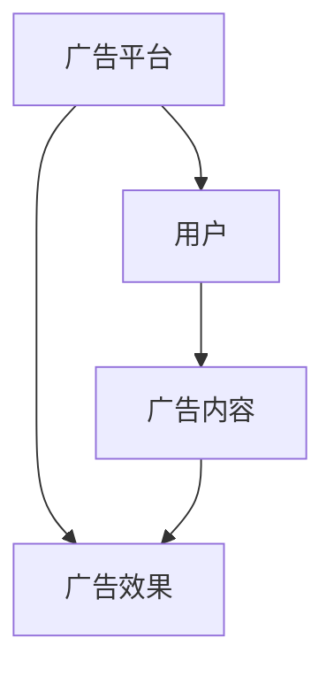
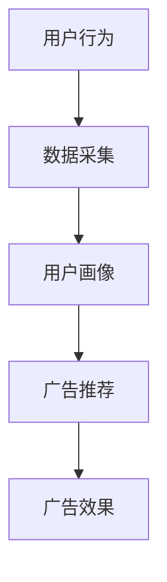
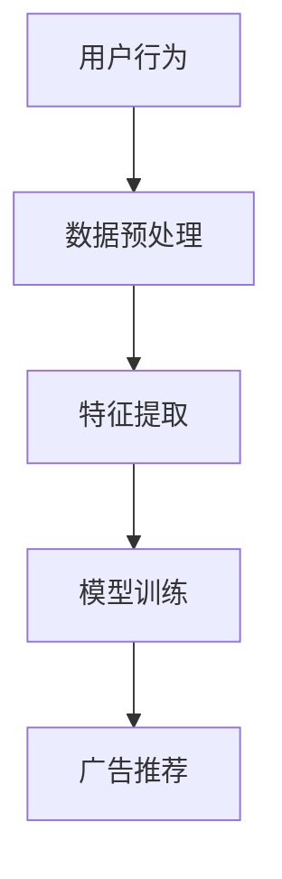
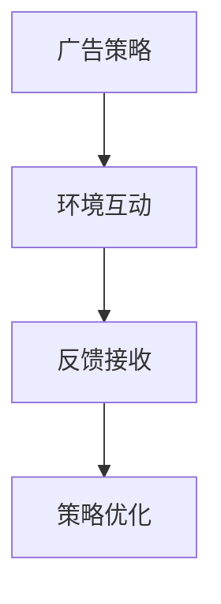
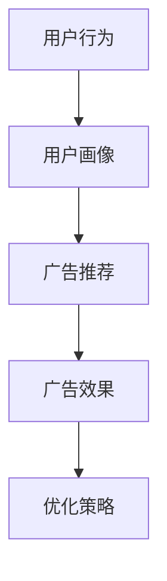

                 


```markdown
# AI Agent在广告投放中的应用：精准定位与效果优化

> 关键词：AI Agent, 广告投放, 精准定位, 效果优化, 机器学习, 数据分析, 系统架构

> 摘要：本文深入探讨了AI Agent在广告投放中的应用，分析其如何通过精准定位和效果优化提升广告投放效率。文章从AI Agent的基本概念、广告投放的现状与挑战入手，详细讲解了AI Agent的核心原理、算法模型、系统架构，并通过实际案例展示了AI Agent在广告投放中的具体应用。最后，本文总结了AI Agent在广告投放中的优势与挑战，并展望了未来的发展方向。

---

# 第一部分: AI Agent在广告投放中的应用概述

# 第1章: AI Agent与广告投放的背景介绍

## 1.1 AI Agent的基本概念

### 1.1.1 AI Agent的定义与特点
AI Agent（人工智能代理）是指能够感知环境、自主决策并执行任务的智能实体。其特点包括：
- **自主性**：能够独立执行任务，无需人工干预。
- **反应性**：能够实时感知环境变化并做出反应。
- **学习能力**：通过数据和反馈不断优化自身行为。
- **社交能力**：能够与其他系统或用户进行交互。

### 1.1.2 AI Agent在广告投放中的作用
AI Agent在广告投放中主要扮演以下几个角色：
1. **用户行为分析**：实时收集和分析用户行为数据，理解用户需求和偏好。
2. **精准定位**：基于用户画像和行为数据，精准匹配广告内容。
3. **动态优化**：根据实时数据和反馈，动态调整广告投放策略。

### 1.1.3 AI Agent与传统广告投放的对比
| 对比维度 | 传统广告投放 | AI Agent广告投放 |
|----------|--------------|------------------|
| 投放策略 | 基于固定规则 | 基于实时数据和反馈动态调整 |
| 精准度   | 较低，依赖人工经验 | 高度精准，基于大数据分析和机器学习 |
| 效率     | 低，依赖人工操作 | 高效，自动化处理和优化 |

## 1.2 广告投放的现状与挑战

### 1.2.1 传统广告投放的局限性
1. **精准度不足**：传统广告投放依赖人工经验，难以实现高度精准的用户匹配。
2. **效率低下**：需要大量人工操作，难以快速响应市场变化。
3. **数据利用率低**：无法充分利用大数据进行分析和优化。

### 1.2.2 数据驱动的广告投放趋势
随着大数据和人工智能技术的发展，广告投放逐渐从经验驱动转向数据驱动。通过分析用户行为数据、广告点击率、转化率等指标，可以更精准地定位目标用户并优化广告效果。

### 1.2.3 AI Agent在广告投放中的优势
1. **精准定位**：基于用户画像和行为数据，AI Agent能够实现精准的广告投放。
2. **动态优化**：根据实时数据和反馈，AI Agent能够动态调整广告策略，提高广告效果。
3. **高效执行**：AI Agent能够自动化处理广告投放过程中的各个环节，显著提高效率。

## 1.3 AI Agent在广告投放中的变革

### 1.3.1 精准定位的核心理念
精准定位是AI Agent广告投放的核心理念。通过分析用户的行为数据、兴趣爱好、地理位置等信息，AI Agent能够准确识别用户的潜在需求，并为其推荐相关广告内容。

### 1.3.2 效果优化的关键技术
效果优化的关键技术包括：
1. **推荐算法**：基于协同过滤、深度学习等技术，推荐用户可能感兴趣的内容。
2. **实时竞价**：通过实时竞价机制，确保广告投放的精准性和经济性。
3. **反馈机制**：根据用户点击、转化等反馈，不断优化广告策略。

### 1.3.3 AI Agent广告投放的未来趋势
未来的广告投放将更加依赖AI Agent技术，实现更加智能化和个性化的广告投放。AI Agent将能够实时感知用户需求，动态调整广告内容和策略，进一步提升广告效果。

## 1.4 广告投放中的关键问题

### 1.4.1 用户行为分析
用户行为分析是广告投放的基础。通过分析用户的点击、浏览、购买等行为，可以了解用户的兴趣和需求，从而实现精准定位。

### 1.4.2 广告效果评估
广告效果评估是广告投放的重要环节。通过评估广告的点击率、转化率、ROI等指标，可以衡量广告投放的效果，并为后续优化提供依据。

### 1.4.3 广告投放策略优化
广告投放策略优化是实现效果提升的关键。通过分析数据和反馈，动态调整广告内容、投放时间和渠道，可以最大化广告效果。

---

# 第2章: AI Agent的核心概念与联系

## 2.1 AI Agent的核心原理

### 2.1.1 AI Agent的工作流程
AI Agent在广告投放中的工作流程如下：
1. **数据采集**：收集用户行为数据、广告点击数据等。
2. **用户画像**：基于数据生成用户画像，识别用户的兴趣和需求。
3. **广告推荐**：根据用户画像推荐适合的广告内容。
4. **效果监控**：实时监控广告效果，根据反馈优化广告策略。

### 2.1.2 AI Agent的决策机制
AI Agent的决策机制基于机器学习模型，通过分析数据和环境反馈，动态调整广告投放策略。

### 2.1.3 AI Agent的学习能力
AI Agent通过监督学习、无监督学习等方法，不断优化自身的推荐算法和投放策略。

## 2.2 AI Agent与广告投放的关系

### 2.2.1 AI Agent在广告投放中的应用场景
1. **精准定位**：通过用户画像和行为分析，精准定位目标用户。
2. **实时优化**：根据实时数据和反馈，动态调整广告策略。
3. **效果提升**：通过优化广告内容和投放时间，提高广告点击率和转化率。

### 2.2.2 AI Agent如何实现精准定位
AI Agent通过分析用户数据，识别用户的兴趣和需求，推荐相关广告内容，实现精准定位。

### 2.2.3 AI Agent如何优化广告效果
AI Agent通过实时分析广告效果数据，动态调整广告策略，优化广告内容和投放时间，从而提高广告效果。

## 2.3 AI Agent与其他技术的对比

### 2.3.1 与传统广告投放的对比
传统广告投放依赖人工经验，精准度和效率较低；AI Agent广告投放基于数据和机器学习，精准度和效率显著提升。

### 2.3.2 与机器学习的对比
机器学习主要用于数据处理和模式识别；AI Agent不仅具备学习能力，还能够自主决策和执行任务。

### 2.3.3 与大数据分析的对比
大数据分析侧重于数据的收集和处理；AI Agent在数据处理的基础上，具备自主决策和执行的能力。

## 2.4 AI Agent的实体关系图



## 2.5 AI Agent的流程图



---

# 第3章: AI Agent的算法原理

## 3.1 推荐算法

### 3.1.1 协同过滤算法
协同过滤是一种基于用户行为数据的推荐算法。其基本原理是找到与当前用户行为相似的其他用户或产品，推荐相似的产品或内容。

公式：$$similarity(u, v) = \frac{\sum_{i} (r_{u,i} - \bar{r}_u)(r_{v,i} - \bar{r}_v)}{\sqrt{\sum_{i} (r_{u,i} - \bar{r}_u)^2} \sqrt{\sum_{i} (r_{v,i} - \bar{r}_v)^2}}}$$

### 3.1.2 基于深度学习的推荐算法
基于深度学习的推荐算法能够捕捉用户行为中的复杂模式，如用户的兴趣变化和需求多样性。

### 3.1.3 算法流程图



## 3.2 广告投放策略优化

### 3.2.1 线性回归模型
线性回归模型可以用于广告效果预测，通过最小化预测值与实际值的平方差，优化广告投放策略。

公式：$$y = \beta_0 + \beta_1x + \epsilon$$

### 3.2.2 基于强化学习的优化策略
强化学习是一种通过试错不断优化策略的方法。在广告投放中，可以通过强化学习优化广告内容和投放时间。

### 3.2.3 算法流程图



---

# 第4章: AI Agent的系统架构设计

## 4.1 系统功能设计

### 4.1.1 用户行为分析模块
用户行为分析模块负责收集和分析用户的点击、浏览、购买等行为数据，生成用户画像。

### 4.1.2 广告推荐模块
广告推荐模块基于用户画像和历史数据，推荐适合的广告内容。

### 4.1.3 广告效果监控模块
广告效果监控模块实时监控广告的点击率、转化率等指标，评估广告效果。

### 4.1.4 数据存储模块
数据存储模块用于存储用户行为数据、广告内容和广告效果数据。

## 4.2 系统架构图



---

# 第5章: AI Agent在广告投放中的项目实战

## 5.1 环境安装

### 5.1.1 安装Python
安装Python 3.8及以上版本，确保支持最新特性。

### 5.1.2 安装机器学习库
安装scikit-learn、TensorFlow等机器学习库。

## 5.2 核心代码实现

### 5.2.1 数据预处理
```python
import pandas as pd
data = pd.read_csv('advertising.csv')
```

### 5.2.2 用户画像构建
```python
from sklearn.preprocessing import StandardScaler
scaler = StandardScaler()
scaled_data = scaler.fit_transform(data)
```

### 5.2.3 广告推荐
```python
from sklearn.neighbors import NearestNeighbors
knn = NearestNeighbors(n_neighbors=5).fit(scaled_data)
distances, indices = knn.kneighbors(scaled_data[0].reshape(1, -1))
```

## 5.3 案例分析

### 5.3.1 数据分析
分析用户点击和购买数据，生成用户画像。

### 5.3.2 广告推荐
根据用户画像推荐适合的广告内容，评估广告效果。

## 5.4 项目小结
通过项目实战，验证了AI Agent在广告投放中的应用价值，进一步掌握了AI Agent的核心技术。

---

# 第6章: AI Agent在广告投放中的最佳实践

## 6.1 最佳实践 tips

### 6.1.1 数据质量的重要性
确保数据的准确性和完整性，提高广告投放的精准度。

### 6.1.2 模型迭代的频率
根据业务需求和数据更新频率，合理安排模型迭代的频率。

### 6.1.3 广告效果的监控
实时监控广告效果，及时调整广告策略。

## 6.2 小结
AI Agent在广告投放中的应用前景广阔，能够显著提升广告精准度和效果。

## 6.3 注意事项
1. 数据隐私保护
2. 模型的可解释性
3. 系统的稳定性

## 6.4 拓展阅读
1. 《机器学习实战》
2. 《深度学习入门》
3. 《广告投放与数据挖掘》

---

# 结语

AI Agent在广告投放中的应用是广告行业的未来趋势。通过精准定位和效果优化，AI Agent能够显著提高广告投放效率和效果。随着技术的不断发展，AI Agent将在广告投放中发挥越来越重要的作用。

--- 

* 感谢您的阅读！如果需要进一步的技术交流或合作，请随时联系。
```

