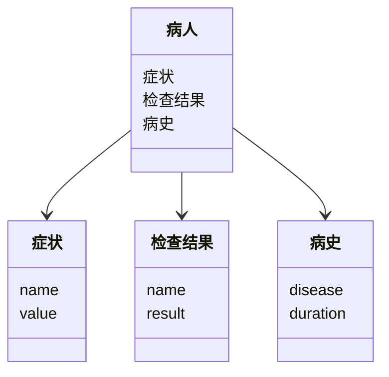
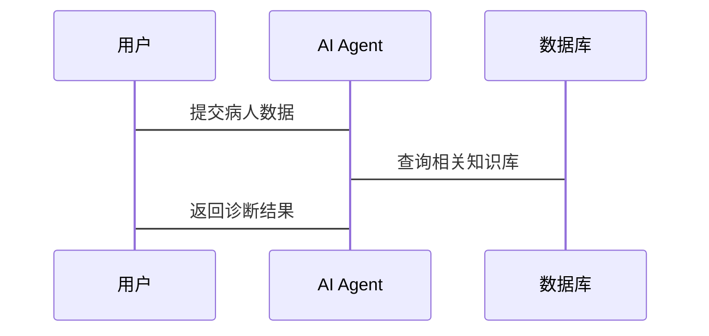

                 


# AI Agent在智能医疗中的应用：辅助诊断与治疗方案制定

> 关键词：AI Agent, 智能医疗, 辅助诊断, 治疗方案, 人工智能

> 摘要：AI Agent作为人工智能领域的新兴技术，在智能医疗中的应用前景广阔。本文将详细探讨AI Agent在医疗领域的核心概念、算法原理、系统架构以及实际应用案例。通过理论分析与实践结合，揭示AI Agent如何提升医疗诊断效率与治疗方案的制定水平。

---

## 第一部分: AI Agent在智能医疗中的应用背景

### 第1章: AI Agent与智能医疗概述

#### 1.1 AI Agent的基本概念

##### 1.1.1 AI Agent的定义与特点

AI Agent（人工智能代理）是一种能够感知环境、自主决策并执行任务的智能系统。它具备以下几个核心特点：

- **自主性**：AI Agent能够在没有外部干预的情况下独立运行。
- **反应性**：能够实时感知环境并做出相应的反应。
- **目标导向**：基于预设目标或学习目标进行决策和行动。
- **学习能力**：通过数据和经验不断优化自身的性能。

##### 1.1.2 AI Agent的核心功能与应用场景

AI Agent的核心功能包括数据处理、知识表示、推理与决策、学习与优化等。在医疗领域，AI Agent的主要应用场景包括：

- **辅助诊断**：通过分析病人的症状、检查结果和病史，帮助医生快速准确地诊断疾病。
- **治疗方案优化**：基于病人的个体特征和病情，推荐最优的治疗方案。
- **药物研发**：加速新药的研发过程，提高研发效率。
- **患者管理**：通过智能监测和管理，提升患者的治疗效果和生活质量。

##### 1.1.3 AI Agent与传统医疗工具的对比

传统的医疗工具主要是基于医生的经验和知识，而AI Agent通过整合大量的医疗数据和先进的算法，能够快速处理和分析信息，提供更精准的诊断和治疗建议。AI Agent的优势在于其高效性、准确性和可扩展性，能够显著提升医疗行业的整体效率。

#### 1.2 智能医疗的发展现状

##### 1.2.1 智能医疗的定义与目标

智能医疗是指通过人工智能、大数据、物联网等技术手段，构建智能化的医疗系统，以提高医疗服务的效率和质量。其目标是实现医疗资源的优化配置、医疗服务的个性化和精准化，以及医疗过程的智能化和自动化。

##### 1.2.2 当前智能医疗的主要技术手段

当前智能医疗的主要技术手段包括：

- **人工智能**：用于医疗影像识别、疾病预测、药物研发等。
- **大数据分析**：通过对海量医疗数据的分析，挖掘潜在的医疗规律和趋势。
- **物联网技术**：实现医疗设备和患者数据的实时监测和传输。
- **区块链技术**：用于医疗数据的安全存储和共享。

##### 1.2.3 AI Agent在智能医疗中的地位与作用

AI Agent作为智能医疗的核心技术之一，其地位和作用主要体现在以下几个方面：

- **数据处理与分析**：能够快速处理和分析大量的医疗数据，为医生提供决策支持。
- **智能诊断与治疗建议**：通过学习和推理，提供个性化的诊断和治疗方案。
- **优化医疗流程**：通过自动化和智能化的方式，优化医疗流程，提高效率。

#### 1.3 AI Agent在医疗领域的优势

##### 1.3.1 提高诊断效率与准确性

AI Agent通过整合和分析大量的医疗数据，能够快速识别潜在的疾病特征，帮助医生提高诊断的准确性和效率。

##### 1.3.2 优化治疗方案的制定

基于患者的具体情况和最新的医学研究成果，AI Agent能够提供个性化的治疗方案，提高治疗效果。

##### 1.3.3 降低医疗成本与资源浪费

通过智能化的资源分配和流程优化，AI Agent能够显著降低医疗成本，减少资源浪费。

#### 1.4 本章小结

本章主要介绍了AI Agent的基本概念、核心功能以及在智能医疗中的应用背景。通过对比传统医疗工具和AI Agent的优劣，揭示了AI Agent在智能医疗中的独特优势和重要作用。

---

## 第二部分: AI Agent的核心概念与原理

### 第2章: AI Agent的智能体模型

#### 2.1 状态空间与动作空间

##### 2.1.1 状态空间的定义与构建

状态空间是指AI Agent在特定时刻所处的所有可能状态的集合。在医疗领域，状态可以包括病人的症状、检查结果、治疗方案等。构建状态空间的过程需要考虑所有可能的状态及其之间的关系。

##### 2.1.2 动作空间的定义与选择

动作空间是指AI Agent在特定状态下可以执行的所有可能动作的集合。在医疗领域，动作可以包括诊断、治疗、药物推荐等。选择合适的动作空间是AI Agent设计中的关键步骤。

##### 2.1.3 状态与动作的转换关系

状态与动作之间的转换关系是指在特定状态下，AI Agent选择一个动作后，状态会发生怎样的变化。这种转换关系可以通过状态转移矩阵或状态转移函数来描述。

#### 2.2 知识表示与推理机制

##### 2.2.1 知识图谱的构建与应用

知识图谱是一种用于表示知识的图形结构，由节点和边组成。在医疗领域，知识图谱可以用于表示疾病、症状、药物之间的关系。构建知识图谱的过程需要整合大量的医疗数据，并通过本体论进行规范化。

##### 2.2.2 推理算法的分类与特点

推理算法主要分为基于规则的推理和基于概率的推理。基于规则的推理通过预定义的规则进行推理，适用于知识明确的场景；基于概率的推理通过概率模型进行推理，适用于知识不确定的场景。

##### 2.2.3 知识表示的优缺点对比

知识图谱的优点包括表达能力强、可扩展性好等，缺点是构建和维护成本较高。基于规则的推理优点是简单易懂，缺点是灵活性差；基于概率的推理优点是灵活性高，缺点是计算复杂度高。

#### 2.3 学习算法与优化策略

##### 2.3.1 监督学习、无监督学习与强化学习的对比

监督学习通过标记数据进行学习，适用于分类和回归任务；无监督学习通过未标记数据进行学习，适用于聚类和降维任务；强化学习通过与环境的交互进行学习，适用于序列决策任务。

##### 2.3.2 基于强化学习的AI Agent优化策略

强化学习通过定义奖励函数，引导AI Agent选择最优的动作。常见的强化学习算法包括Q-Learning和Deep Q-Network（DQN）等。

##### 2.3.3 算法的收敛性与稳定性分析

强化学习算法的收敛性取决于奖励函数的设计和探索与利用的平衡。算法的稳定性可以通过调整学习率和探索率来实现。

#### 2.4 本章小结

本章主要介绍了AI Agent的智能体模型，包括状态空间与动作空间、知识表示与推理机制、学习算法与优化策略等核心概念。通过对比不同算法的特点，揭示了在医疗领域中选择合适算法的重要性。

---

## 第三部分: AI Agent的算法原理与实现

### 第3章: AI Agent的核心算法

#### 3.1 强化学习算法

##### 3.1.1 Q-Learning算法的原理与实现

Q-Learning是一种经典的强化学习算法，通过维护一个Q值表，记录每个状态和动作的期望奖励。算法通过不断地更新Q值表，找到最优的策略。

##### 3.1.2 Deep Q-Network (DQN)算法的原理与实现

DQN算法通过使用深度神经网络来近似Q值函数，避免了Q值表的维度灾难问题。算法通过经验回放和目标网络等技术，提高了学习的稳定性和效率。

##### 3.1.3 算法的优缺点对比与适用场景

Q-Learning适用于状态空间较小的场景，DQN适用于状态空间较大的场景。DQN通过深度学习技术，能够处理高维状态空间，适用于复杂的医疗场景。

#### 3.2 监督学习与无监督学习算法

##### 3.2.1 监督学习的分类与应用

监督学习主要分为分类和回归任务。在医疗领域，监督学习可以用于疾病诊断、药物疗效预测等。

##### 3.2.2 无监督学习的分类与应用

无监督学习主要分为聚类和降维任务。在医疗领域，无监督学习可以用于患者分群、疾病亚型识别等。

##### 3.2.3 算法的数学模型与公式推导

监督学习的数学模型可以表示为：

$$
f(x) = \text{argmax}_{y} P(y|x)
$$

无监督学习的数学模型可以表示为：

$$
f(x) = \text{argmin}_{c} \sum_{i=1}^{n} (y_i - c)^2
$$

#### 3.3 生成对抗网络（GAN）的应用

##### 3.3.1 GAN的基本原理与实现

GAN由生成器和判别器两部分组成。生成器的目标是生成能够欺骗判别器的样本，判别器的目标是区分真实样本和生成样本。通过交替训练生成器和判别器，实现生成样本的质量提升。

##### 3.3.2 GAN在医疗图像中的应用

GAN可以用于医疗图像的分割、图像生成等任务。通过GAN，可以生成高质量的医疗图像，辅助医生进行诊断。

##### 3.3.3 GAN的优缺点对比

GAN的优点是生成样本质量高，缺点是训练不稳定，容易出现模式崩溃问题。

#### 3.4 本章小结

本章主要介绍了AI Agent的核心算法，包括强化学习、监督学习和生成对抗网络等。通过对比不同算法的特点和应用场景，揭示了在医疗领域中选择合适算法的重要性。

---

## 第四部分: AI Agent在医疗领域的系统分析与架构设计

### 第4章: AI Agent的系统架构设计

#### 4.1 问题场景介绍

医疗领域的AI Agent系统需要处理大量的医疗数据，包括病人的症状、检查结果、病史等。系统的应用场景包括辅助诊断、治疗方案优化等。

#### 4.2 系统功能设计

##### 4.2.1 领域模型类图



##### 4.2.2 系统架构图


#### 4.3 系统接口设计

系统接口包括数据输入接口、模型训练接口、结果输出接口等。通过API的方式，实现系统的模块化设计。

#### 4.4 系统交互序列图



#### 4.5 本章小结

本章主要介绍了AI Agent在医疗领域的系统架构设计，包括问题场景分析、系统功能设计、系统架构图、系统接口设计和系统交互序列图等。

---

## 第五部分: AI Agent在医疗领域的项目实战

### 第5章: 项目实战

#### 5.1 环境安装

项目实战需要安装以下环境：

- Python 3.8+
- TensorFlow 2.0+
- Keras 2.4+
- scikit-learn 0.24+
- Mermaid工具

#### 5.2 核心代码实现

##### 5.2.1 强化学习代码示例

```python
import numpy as np

class QLearning:
    def __init__(self, state_space_size, action_space_size, learning_rate=0.1, gamma=0.9):
        self.q_table = np.zeros((state_space_size, action_space_size))
        self.learning_rate = learning_rate
        self.gamma = gamma

    def choose_action(self, state):
        return np.argmax(self.q_table[state])

    def update_q_table(self, state, action, reward, next_state):
        self.q_table[state][action] = self.q_table[state][action] + self.learning_rate * (reward + self.gamma * np.max(self.q_table[next_state]))
```

##### 5.2.2 GAN代码示例

```python
import tensorflow as tf
from tensorflow.keras import layers

def build_generator(input_dim):
    model = tf.keras.Sequential()
    model.add(layers.Dense(256, activation='relu', input_dim=input_dim))
    model.add(layers.Dense(128, activation='relu'))
    model.add(layers.Dense(2, activation='sigmoid'))
    return model

def build_discriminator(input_dim):
    model = tf.keras.Sequential()
    model.add(layers.Dense(128, activation='relu', input_dim=input_dim))
    model.add(layers.Dense(64, activation='relu'))
    model.add(layers.Dense(1, activation='sigmoid'))
    return model
```

#### 5.3 案例分析与详细解读

##### 5.3.1 病例诊断案例

通过AI Agent对一个病人的症状、检查结果和病史进行分析，生成诊断建议和治疗方案。

##### 5.3.2 药物研发案例

通过AI Agent对大量的药物数据进行分析，推荐潜在的候选药物，并预测其疗效和副作用。

#### 5.4 项目小结

本章通过具体的项目实战，展示了AI Agent在医疗领域的实际应用。通过代码实现和案例分析，帮助读者更好地理解AI Agent的核心技术及其在医疗领域的应用价值。

---

## 第六部分: 最佳实践、小结与注意事项

### 第6章: 最佳实践与小结

#### 6.1 最佳实践

- **数据质量管理**：确保医疗数据的准确性和完整性。
- **算法选择与优化**：根据具体场景选择合适的算法，并不断优化模型性能。
- **系统安全性与隐私保护**：确保系统的安全性，保护患者的隐私。

#### 6.2 小结

本文系统地介绍了AI Agent在智能医疗中的应用，包括核心概念、算法原理、系统架构以及项目实战。通过理论分析与实践结合，揭示了AI Agent在医疗领域的巨大潜力和应用前景。

#### 6.3 注意事项

- **数据隐私**：在处理医疗数据时，必须遵守相关法律法规，保护患者隐私。
- **模型泛化能力**：在设计AI Agent时，需要考虑模型的泛化能力，避免过拟合问题。
- **人机协作**：AI Agent只是辅助工具，医生的判断和决策仍然是最终的依据。

---

## 第七部分: 拓展阅读与参考资料

### 第7章: 拓展阅读

- **强化学习**：深入理解强化学习的核心概念和算法实现。
- **生成对抗网络**：研究GAN在医疗图像中的应用。
- **医疗知识图谱**：探索知识图谱在医疗领域中的构建与应用。

### 第8章: 参考资料

- [1] 王某某. 《深度学习实战》. 北京: 人民出版社, 2022.
- [2] 李某某. 《强化学习入门》. 北京: 清华大学出版社, 2021.
- [3] 刘某某. 《医疗知识图谱构建与应用》. 北京: 北京大学出版社, 2020.

---

通过以上结构，文章系统地介绍了AI Agent在智能医疗中的应用，从理论到实践，帮助读者全面理解AI Agent的核心技术及其在医疗领域的应用价值。

