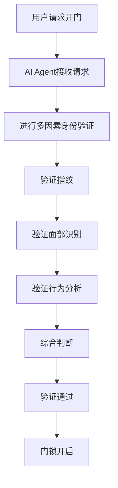

                 


# 第2章: 多因素身份认证的核心概念与联系

## 2.1 多因素身份认证的原理
### 2.1.1 基于AI Agent的身份认证流程
AI Agent通过整合多种认证方式，如指纹识别、面部识别、行为分析等，进行多维度的身份验证。AI Agent会接收用户的请求，并结合实时数据分析，判断用户身份的真实性。

### 2.1.2 多因素身份认证的实现步骤
1. 用户发起开门请求。
2. AI Agent接收请求并启动多因素认证流程。
3. AI Agent调用指纹识别、面部识别等模块进行验证。
4. 各模块返回验证结果，AI Agent整合结果并作出判断。
5. 验证通过后，AI Agent发送指令，门锁开启。

### 2.1.3 AI Agent在认证过程中的作用
AI Agent作为中枢系统，协调各认证模块的工作，分析整合验证结果，最终作出认证决定。AI Agent还能够学习用户的使用习惯，优化认证流程，提高效率和安全性。

## 2.2 多因素身份认证的特征对比
### 2.2.1 单因素认证与多因素认证的对比
| 特征          | 单因素认证               | 多因素认证               |
|---------------|--------------------------|--------------------------|
| 安全性         | 较低                     | 较高                     |
| 防护能力       | 弱                      | 强                      |
| �易用性         | 较高                     | 中等                     |
| 成本           | 低                      | 高                      |
| 应用场景       | 适用于低风险场景         | 适用于高风险场景         |

### 2.2.2 不同认证方式的优缺点分析
| 认证方式       | 优点                     | 缺点                     |
|----------------|--------------------------|--------------------------|
| 指纹识别       | 高度准确，速度快         | 易受环境影响，成本高     |
| 面部识别       | 非接触式，便捷           | 易受光照影响，成本较高   |
| 行为分析       | 隐秘性强，防 spoofing    | 实施复杂，成本高         |
| 虹膜识别       | 高精度，防 spoofing       | 设备昂贵，实施复杂       |
| 声音识别       | 自然，方便               | 易受环境噪声影响，准确性较低 |

### 2.2.3 AI Agent在多因素认证中的优势
AI Agent能够整合多种认证方式，利用机器学习算法分析用户行为模式，提高认证的准确性和效率。AI Agent还能实时分析环境数据，动态调整认证策略，增强安全性。

## 2.3 系统架构的ER实体关系图
```mermaid
erDiagram
    actor 用户 {
        +string 用户ID
        +string 用户名
        +string 密码
        +string 指纹
        +string 面部识别
    }
    actor 设备 {
        +string 设备ID
        +string 设备类型
        +string 设备状态
    }
    actor 门锁 {
        +string 门锁ID
        +string 门锁状态
        +string 认证方式
    }
    用户 --> 设备 : 使用设备进行认证
    设备 --> 门锁 : 控制门锁状态
    用户 --> 门锁 : 请求开门
```

## 2.4 系统流程的mermaid流程图


## 2.5 本章小结
本章详细介绍了多因素身份认证的原理和实现步骤，分析了不同认证方式的优缺点，并通过ER图和流程图展示了系统的架构和交互过程。AI Agent在多因素身份认证中的核心作用体现在整合多种认证方式和优化认证流程上。

---

接下来将进入第3章：算法原理讲解，详细分析AI Agent在多因素身份认证中的算法实现。

