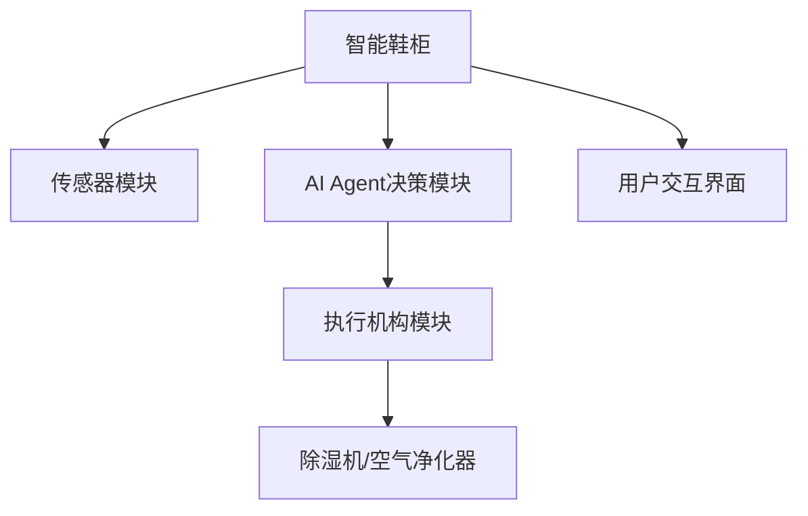
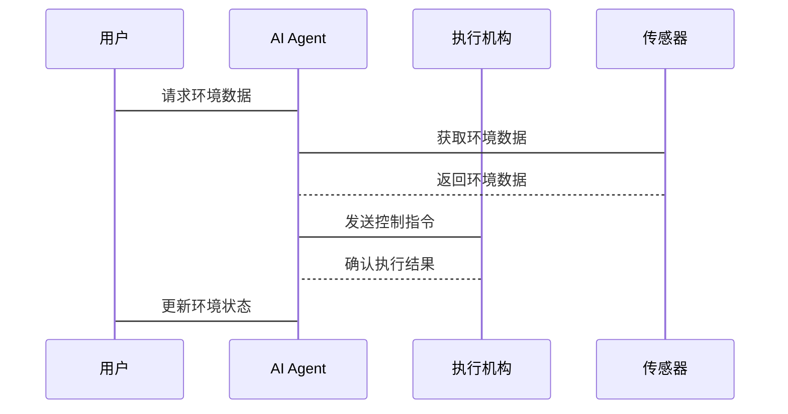

                 


# AI Agent在智能鞋柜中的除臭除湿控制

> 关键词：AI Agent, 智能鞋柜, 除臭除湿, 环境感知, 智能控制

> 摘要：本文探讨了AI Agent在智能鞋柜中的应用，重点分析了其在除臭除湿控制中的原理与实现。通过详细的技术分析，展示了AI Agent如何通过环境感知和智能决策实现高效的环境控制，为智能鞋柜的设计提供了新的思路。

---

## 第一部分: AI Agent在智能鞋柜中的应用背景

### 第1章: 问题背景与需求分析

#### 1.1 智能鞋柜的发展现状

智能鞋柜作为一种智能家居产品，近年来随着物联网技术的快速发展而逐渐普及。传统的鞋柜功能单一，主要用于存放鞋子，而智能鞋柜则通过集成传感器、控制器和网络通信模块，能够实现对鞋柜内部环境的智能监测和控制。然而，目前市面上的智能鞋柜在除臭除湿功能上仍存在诸多不足，例如控制策略单一、缺乏智能化、用户体验不佳等问题。

#### 1.2 除臭除湿技术的必要性

鞋柜内部环境容易滋生细菌、霉菌，产生异味，同时湿度过高还可能导致鞋子损坏。传统的除臭除湿方法依赖于手动操作，效率低且效果不佳。AI Agent通过实时感知环境数据，能够自动调整除臭除湿设备的工作状态，从而实现智能化的环境控制。

#### 1.3 AI Agent的核心作用

AI Agent是一种能够感知环境、自主决策并执行任务的智能代理。在智能鞋柜中，AI Agent通过集成环境传感器、用户输入和历史数据，能够实时评估鞋柜内部环境状态，并根据预设的控制策略，动态调整除臭除湿设备的工作模式。

---

## 第2章: AI Agent与智能鞋柜的系统架构

### 2.1 系统核心概念与ER实体关系图

#### 2.1.1 系统核心概念

- **AI Agent**：智能代理，负责环境感知、决策和控制。
- **传感器**：用于采集鞋柜内部的温湿度、空气质量等数据。
- **执行机构**：包括除湿机、空气净化器等设备，用于调节环境。
- **用户交互界面**：提供用户与系统交互的入口，例如手机APP或触摸屏。

#### 2.1.2 ER实体关系图（Mermaid流程图）

```mermaid
erd
    entity 智能鞋柜 {
        id
        名称
    }
    entity 传感器 {
        id
        类型
    }
    entity 执行机构 {
        id
        类型
    }
    entity 用户 {
        id
        名称
    }
    智能鞋柜 - 传感器: 搭载
    智能鞋柜 - 执行机构: 控制
    智能鞋柜 - 用户: 管理
```

### 2.2 系统功能模块设计

#### 2.2.1 传感器数据采集模块

传感器模块负责采集鞋柜内部的环境数据，包括温湿度、空气质量等。常见的传感器包括温湿度传感器（如DHT11、DHT22）和气体传感器（如MQ-135）。

#### 2.2.2 AI Agent决策模块

AI Agent通过分析传感器数据，评估当前环境状态，并根据预设的控制策略生成控制指令。决策过程可能涉及多个因素的综合判断，例如当前湿度是否超过阈值、空气质量是否恶化等。

#### 2.2.3 执行机构控制模块

执行机构根据AI Agent的控制指令，启动或停止除湿机、空气净化器等设备。控制策略可以根据环境状态动态调整，例如在湿度较高时启动除湿模式，或者在空气质量较差时启动净化模式。

### 2.3 系统架构设计（Mermaid架构图）



---

## 第3章: AI Agent的算法原理与数学模型

### 3.1 环境感知算法

#### 3.1.1 传感器数据融合算法

传感器数据融合是通过多种传感器的数据进行综合处理，以提高环境感知的准确性和鲁棒性。例如，可以通过加权平均的方法将温湿度传感器和气体传感器的数据进行融合，得到更准确的环境状态评估。

#### 3.1.2 数据预处理与特征提取

传感器数据可能存在噪声和偏差，需要进行数据预处理。例如，可以通过滑动平均法（Moving Average）对数据进行平滑处理，消除随机噪声。特征提取则是从原始数据中提取出能够反映环境状态的关键特征，例如最大湿度值、平均空气质量指数等。

#### 3.1.3 环境状态评估模型

基于传感器数据和特征提取结果，可以建立环境状态评估模型。例如，可以通过机器学习算法（如支持向量机、随机森林等）对环境状态进行分类或回归预测。

### 3.2 除臭除湿控制算法

#### 3.2.1 基于AI Agent的决策算法

AI Agent通过分析环境状态，动态调整除湿和净化设备的工作模式。例如，在湿度较高且空气质量较差的情况下，系统可以同时启动除湿和净化功能；在湿度较低但空气质量较差的情况下，系统可以仅启动净化功能。

#### 3.2.2 多目标优化算法

除臭除湿控制是一个多目标优化问题，需要在多个目标之间进行权衡。例如，可以同时优化湿度和空气质量，使得环境控制更加高效。

#### 3.2.3 动态调整策略

动态调整策略是指根据环境状态的变化，实时调整控制策略。例如，在湿度突变的情况下，系统可以快速启动除湿模式，以防止湿度过高导致鞋子损坏。

### 3.3 数学模型与公式

#### 3.3.1 传感器数据模型

假设温湿度传感器的数据服从正态分布，可以通过最大似然估计（MLE）方法对传感器参数进行估计。例如，假设温湿度数据为$x_i$，均值为$\mu$，方差为$\sigma^2$，则数据的概率密度函数为：

$$
f(x) = \frac{1}{\sqrt{2\pi\sigma^2}} e^{-\frac{(x-\mu)^2}{2\sigma^2}}
$$

#### 3.3.2 状态评估函数

状态评估函数可以通过加权平均的方式对多种传感器数据进行综合评估。例如，可以将温湿度数据和空气质量数据进行加权融合，得到综合环境指数：

$$
S = w_1 \cdot H + w_2 \cdot Q
$$

其中，$w_1$和$w_2$是权重系数，$H$是湿度指数，$Q$是空气质量指数。

#### 3.3.3 决策优化模型

决策优化模型可以通过强化学习算法（如Q-learning）进行优化。例如，可以通过定义状态、动作和奖励函数，训练AI Agent在不同环境下做出最优决策。

---

## 第4章: 系统接口与交互设计

### 4.1 系统接口设计

#### 4.1.1 传感器接口规范

传感器接口需要与AI Agent和执行机构模块兼容。例如，可以使用I2C或UART接口与传感器模块进行通信。

#### 4.1.2 执行机构控制接口

执行机构模块需要根据AI Agent的控制指令进行动作。例如，可以通过继电器或PWM信号控制除湿机和空气净化器的启停。

#### 4.1.3 用户交互接口

用户交互界面需要提供友好的操作界面，例如手机APP或触摸屏。用户可以通过界面查看环境数据，并手动或自动启动控制模式。

### 4.2 系统交互流程设计

#### 4.2.1 状态监测与反馈流程

1. 传感器采集环境数据并发送给AI Agent。
2. AI Agent分析环境数据，评估当前环境状态。
3. AI Agent根据环境状态生成控制指令。
4. 执行机构模块根据控制指令调整设备工作状态。
5. 系统将环境数据和设备状态反馈给用户。

#### 4.2.2 决策控制流程

1. AI Agent接收到传感器数据后，调用环境评估模型，计算综合环境指数。
2. 根据预设的控制策略，AI Agent生成控制指令。
3. 执行机构模块根据控制指令调整设备工作状态。
4. 系统将环境数据和设备状态反馈给AI Agent，形成闭环控制。

#### 4.2.3 用户操作流程

1. 用户通过交互界面查看环境数据。
2. 用户可以选择手动或自动控制模式。
3. 在手动模式下，用户可以直接控制设备工作状态。
4. 在自动模式下，AI Agent根据环境数据自动调整设备工作状态。

### 4.3 系统交互流程图（Mermaid序列图）



---

## 第5章: 项目实战与实现

### 5.1 环境搭建与工具安装

#### 5.1.1 开发环境配置

建议使用Python作为开发语言，安装必要的库和工具，例如：

- `Python 3.x`
- `numpy`：用于数值计算
- `pandas`：用于数据处理
- `scikit-learn`：用于机器学习模型训练
- `Raspython`：用于树莓派开发

#### 5.1.2 传感器与执行机构连接

硬件部分需要将传感器和执行机构连接到树莓派或其他控制器上，确保通信正常。

#### 5.1.3 AI Agent框架安装

可以使用现成的AI框架（如TensorFlow、Keras）进行模型训练，或者使用专门的智能代理框架（如OpenAI的强化学习库）进行开发。

### 5.2 核心代码实现

#### 5.2.1 传感器数据采集

```python
import RPi.GPIO as GPIO
import time
from datetime import datetime

def read_humidity():
    # 假设使用DHT11传感器
    # 这里只是一个示例代码，具体实现需要根据传感器的通信协议进行调整
    return 50  # 返回示例湿度值

def read_air_quality():
    # 假设使用MQ-135传感器
    return 50  # 返回示例空气质量值

# 主循环
while True:
    humidity = read_humidity()
    air_quality = read_air_quality()
    print(f"湿度: {humidity}%，空气质量: {air_quality}")
    time.sleep(1)
```

#### 5.2.2 AI Agent决策模块

```python
import numpy as np
from sklearn.ensemble import RandomForestClassifier

# 假设已经采集了传感器数据，并存储在数据集中
# 数据集包括湿度、空气质量等特征
X = np.array([[50, 50], [60, 45], [45, 60]])
y = np.array([0, 1, 2])  # 0代表正常状态，1代表湿度超标，2代表空气质量超标

# 训练随机森林分类器
clf = RandomForestClassifier(n_estimators=100)
clf.fit(X, y)

# 预测环境状态
new_data = np.array([[55, 45]])
prediction = clf.predict(new_data)
print(f"预测环境状态: {prediction[0]}")
```

#### 5.2.3 执行机构控制

```python
import RPi.GPIO as GPIO
import time

# 假设控制继电器模块
GPIO.setmode(GPIO.BCM)
GPIO.setup(12, GPIO.OUT)  # 用于控制除湿机

def control_dehumidifier(state):
    GPIO.output(12, state)
    print(f"除湿机状态: {state}")

# 控制除湿机
control_dehumidifier(GPIO.HIGH)  # 启动除湿机
time.sleep(10)
control_dehumidifier(GPIO.LOW)   # 停止除湿机
```

### 5.3 实际案例分析

假设当前鞋柜内部湿度为65%，空气质量指数为60。AI Agent通过传感器数据评估环境状态，判断湿度超标，启动除湿机。经过一段时间后，湿度降至55%，空气质量指数降至50，系统关闭除湿机并保持正常运行状态。

---

## 第6章: 总结与展望

### 6.1 小结

本文详细探讨了AI Agent在智能鞋柜中的除臭除湿控制应用。通过环境感知、智能决策和执行控制三个环节，展示了AI Agent如何实现高效的环境控制。通过实际案例分析，验证了系统的可行性和有效性。

### 6.2 注意事项

- 系统的实时性和稳定性需要进一步优化。
- 需要根据实际场景调整传感器和执行机构的配置。
- 系统的安全性和用户隐私保护也需要重点关注。

### 6.3 拓展阅读

- 《基于强化学习的智能控制算法研究》
- 《物联网环境下智能设备的多目标优化控制》
- 《智能传感器与智能执行机构的协同控制技术》

---

通过本文的分析与实现，我们可以看到AI Agent在智能鞋柜中的应用前景广阔。未来，随着AI技术的不断发展，智能鞋柜的功能将更加智能化和个性化，为用户带来更好的使用体验。

