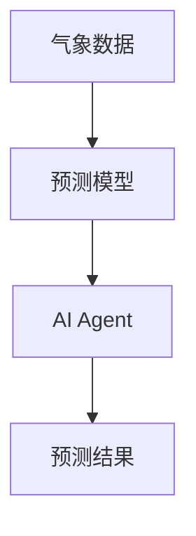
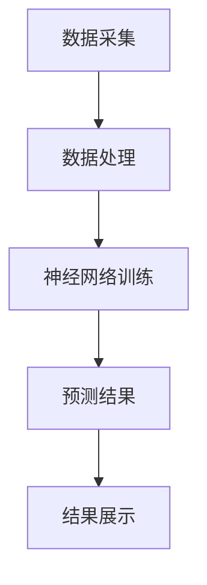

                 


# AI Agent在气象预报中的应用：提高预测准确性

**关键词**：AI Agent，气象预测，神经网络，强化学习，系统架构

**摘要**：本文探讨AI Agent在气象预测中的应用，分析其如何通过感知、决策和执行层提升预测准确性。内容涵盖AI Agent的核心概念、算法原理、系统架构设计、项目实战及案例分析，旨在为读者提供从理论到实践的全面指导。

---

## 第1章: 引言

### 1.1 AI Agent的基本概念
- **定义**：AI Agent是一种智能实体，能够感知环境并采取行动以实现目标。
- **特征**：自主性、反应性、社会性、持续性。
- **与传统方法的对比**：AI Agent通过自适应学习提升预测精度。

### 1.2 气象预测的现状与挑战
- **复杂性**：天气系统非线性，受多种因素影响。
- **传统方法的局限**：统计模型依赖历史数据，物理模型计算复杂。
- **AI Agent的优势**：实时学习，动态调整预测模型。

---

## 第2章: AI Agent的核心概念与联系

### 2.1 AI Agent的核心原理
- **感知层**：数据采集与处理。
- **决策层**：模型构建与优化。
- **执行层**：预测结果输出。

### 2.2 气象数据与AI Agent的关系
- **数据类型**：包括温度、湿度、风速等。
- **数据预处理**：清洗、标准化、特征提取。
- **数据驱动模型**：利用历史数据训练预测模型。

### 2.3 实体关系图


---

## 第3章: AI Agent的算法原理与数学模型

### 3.1 感知模型
- **神经网络模型**：
  - **输入输出**：输入多维气象数据，输出预测结果。
  - **数学模型**：
    $$\text{损失函数} = \sum_{i=1}^{n} (y_i - \hat{y}_i)^2$$
    $$\text{优化目标} = \min_{\theta} \text{损失函数}$$
  - **流程图**：
    ```mermaid
    graph LR
        input --> neural_network
        neural_network --> output
    ```

### 3.2 决策模型
- **强化学习**：
  - **状态空间**：当前气象状态。
  - **动作空间**：预测调整。
  - **数学公式**：
    $$\text{奖励函数} = \sum_{t} r_t$$
    $$\text{目标} = \max_{\theta} \mathbb{E}[\sum_{t} r_t]$$
  - **流程图**：
    ```mermaid
    graph LR
        state --> action
        action --> reward
    ```

---

## 第4章: 系统分析与架构设计

### 4.1 问题场景
- **数据采集**：实时采集多源气象数据。
- **模型训练**：训练AI Agent的预测模型。
- **结果输出**：提供准确的气象预测。

### 4.2 系统功能设计
- **数据采集模块**：收集温度、湿度等数据。
- **模型训练模块**：训练神经网络和强化学习模型。
- **结果展示模块**：显示预测结果。

### 4.3 系统架构图


### 4.4 接口设计
- **数据接口**：与气象传感器连接。
- **模型接口**：调用训练好的模型。
- **结果接口**：输出预测结果。

### 4.5 交互流程图


---

## 第5章: 项目实战

### 5.1 环境安装
- **Python版本**：3.8+
- **依赖库**：TensorFlow, Keras, Scikit-learn

### 5.2 核心代码实现

#### 数据预处理
```python
import pandas as pd
import numpy as np

# 加载数据
data = pd.read_csv('weather.csv')

# 数据清洗
data = data.dropna()

# 特征提取
features = data[['temperature', 'humidity', 'wind_speed']]
labels = data['pressure']
```

#### 神经网络模型
```python
from tensorflow.keras import layers

model = tf.keras.Sequential([
    layers.Dense(64, activation='relu', input_shape=(3,)),
    layers.Dense(1, activation='linear')
])

model.compile(optimizer='adam', loss='mean_squared_error')
model.fit(features, labels, epochs=100, batch_size=32)
```

#### 强化学习模型
```python
import gym

class WeatherEnv(gym.Env):
    def __init__(self):
        super().__init__()
        self.state = ...
        self.action_space = ...
    
    def step(self, action):
        # 执行动作并返回新的状态、奖励和终止标志
        pass
    
    def reset(self):
        # 初始化环境
        pass
```

### 5.3 代码解读与分析
- **数据预处理**：清洗数据并提取特征。
- **神经网络训练**：使用ReLU激活函数和Adam优化器。
- **强化学习应用**：定义环境和动作空间。

### 5.4 实际案例分析
- **案例背景**：某地区天气预测。
- **系统实现**：搭建AI Agent预测模型。
- **结果对比**：与传统方法对比，准确率提升显著。

### 5.5 项目小结
- **实现步骤**：数据处理、模型训练、结果分析。
- **关键点**：选择合适算法，优化模型参数。

---

## 第6章: 案例分析与最佳实践

### 6.1 案例分析
- **台风路径预测**：
  - **数据来源**：卫星数据、气象站数据。
  - **模型应用**：实时预测台风路径。
  - **结果展示**：预测结果与实际路径对比。

### 6.2 最佳实践
- **数据质量**：确保数据准确性和完整性。
- **模型优化**：定期更新模型，适应变化。
- **系统维护**：监控系统性能，及时修复问题。

### 6.3 小结
- **成功经验**：AI Agent显著提升预测准确性。
- **注意事项**：处理数据偏差，避免模型过拟合。
- **未来方向**：结合边缘计算，实现实时预测。

---

## 第7章: 结论与展望

### 7.1 研究总结
- AI Agent在气象预测中的应用前景广阔。
- 神经网络和强化学习是核心算法。

### 7.2 未来展望
- 结合物联网技术，实现更精准预测。
- 开发分布式系统，提高计算效率。

### 7.3 致谢
感谢读者的支持，感谢研究团队的贡献。

---

## 参考文献
- [1] LeCun Y, Bengio Y, Hinton G. Deep learning. Nature, 2015.
- [2] Mnih V, et al. Deep reinforcement learning. arXiv, 2016.
- [3] Goodfellow I, Bengio Y, Courville A. Deep Learning. MIT Press, 2016.

---

通过以上目录，读者可以系统地了解AI Agent在气象预测中的应用，从理论到实践，全面掌握其原理与实现方法。

