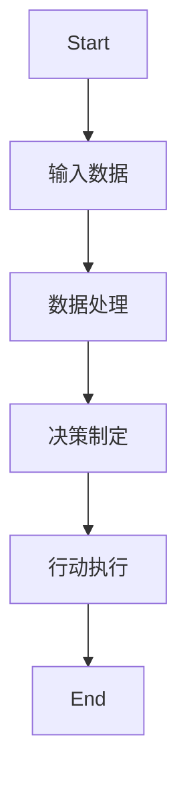
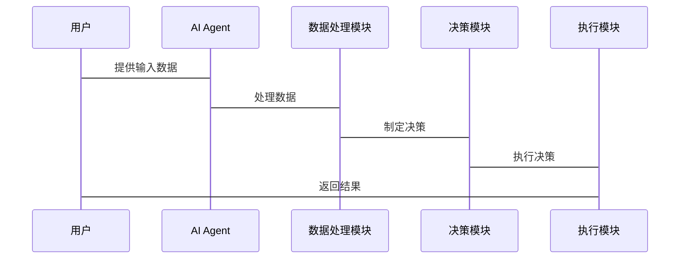

                 


# AI Agent在海洋科学中的应用：海洋资源管理与保护

> 关键词：AI Agent，海洋科学，海洋资源管理，环境保护，人工智能，海洋监测

> 摘要：本文探讨了人工智能代理（AI Agent）在海洋科学中的应用，特别是其在海洋资源管理与保护方面的作用。文章从AI Agent的基本概念、核心原理出发，分析其在海洋环境监测、资源管理、生态保护等方面的具体应用，并结合实际案例，详细阐述了AI Agent在海洋科学中的算法原理、系统架构、项目实战等内容，最后展望了未来的研究方向。

---

# 第一部分: AI Agent在海洋科学中的应用概述

## 第1章: AI Agent与海洋科学的背景介绍

### 1.1 AI Agent的基本概念与核心原理

#### 1.1.1 AI Agent的定义与特点
AI Agent（人工智能代理）是一种能够感知环境、自主决策并采取行动的智能系统。与传统程序不同，AI Agent具备以下特点：
- **自主性**：能够自主决策，无需外部干预。
- **反应性**：能够实时感知环境变化并做出反应。
- **目标导向性**：具备明确的目标，行动围绕目标展开。
- **学习能力**：能够通过数据学习和优化。

#### 1.1.2 AI Agent的核心原理
AI Agent的核心原理包括感知、决策和执行三个模块：
1. **感知**：通过传感器或数据源获取环境信息。
2. **决策**：基于感知信息，利用算法制定行动方案。
3. **执行**：根据决策结果，执行具体的行动。

#### 1.1.3 AI Agent与传统计算的区别
AI Agent的核心区别在于其智能性和自主性。传统程序依赖于固定的规则和输入，而AI Agent能够动态调整行为，适应环境变化。

### 1.2 海洋科学的基本概念与研究领域

#### 1.2.1 海洋科学的定义与研究范围
海洋科学是研究海洋环境、资源、生态系统及其相互关系的学科，涵盖海洋物理、化学、生物、地质等多个领域。

#### 1.2.2 海洋资源管理与保护的挑战
海洋资源管理面临以下挑战：
- **资源分布复杂**：海洋资源分布不均匀，难以高效监测和管理。
- **环境动态变化**：海洋环境受气候变化、人类活动等多种因素影响，难以预测和控制。
- **数据量庞大**：海洋科学涉及海量数据，传统方法难以高效处理。

#### 1.2.3 海洋科学与可持续发展的关系
海洋科学是实现可持续发展的重要组成部分。通过科学管理和保护海洋资源，可以为人类提供可持续的资源支持，同时保护海洋生态系统。

### 1.3 AI Agent在海洋科学中的应用背景

#### 1.3.1 海洋科学中的数据爆炸与信息处理需求
随着海洋观测技术的进步，海洋科学领域产生了大量数据。如何高效处理和利用这些数据成为一个重要问题。

#### 1.3.2 AI Agent在海洋科学中的优势
AI Agent具备以下优势：
- **高效数据处理**：能够快速处理海量数据，提供实时反馈。
- **自主决策**：能够在复杂环境中自主决策，优化资源管理。
- **适应性**：能够适应环境变化，动态调整行动策略。

#### 1.3.3 当前研究现状与未来趋势
当前，AI Agent在海洋科学中的应用还处于起步阶段，主要集中在海洋环境监测和资源管理方面。未来，随着技术的进步，AI Agent将在海洋生态保护、资源优化配置等领域发挥更大作用。

---

## 第2章: AI Agent在海洋资源管理中的核心概念与联系

### 2.1 核心概念与原理

#### 2.1.1 AI Agent在海洋资源管理中的核心概念
AI Agent在海洋资源管理中的核心概念包括：
- **感知模块**：通过传感器获取海洋环境数据。
- **决策模块**：基于感知数据，制定资源管理策略。
- **执行模块**：根据决策结果，执行具体的管理行动。

#### 2.1.2 AI Agent与海洋资源管理的关系
AI Agent通过感知、决策和执行三个环节，实现对海洋资源的智能化管理。例如，AI Agent可以通过监测海洋水质，优化渔业资源的分布。

#### 2.1.3 AI Agent在海洋资源管理中的属性特征对比表
| 特性       | AI Agent       | 传统方法       |
|------------|----------------|----------------|
| 自主性      | 高             | 低             |
| 反应性      | 高             | 低             |
| 学习能力    | 高             | 低             |
| 处理效率    | 高             | 低             |

### 2.2 实体关系图与流程图

#### 2.2.1 AI Agent在海洋资源管理中的ER实体关系图
```mermaid
erDiagram
    class 海洋资源 {
        id
        类型
        数量
    }
    class AI Agent {
        id
        类型
        目标
    }
    class 数据源 {
        id
        类型
        数据
    }
    class 决策模型 {
        id
        类型
        算法
    }
    class 执行机构 {
        id
        类型
        行动
    }
   海洋资源 --|{1,n} 数据源 : "来自"
    AI Agent --|{1,n} 数据源 : "使用"
    AI Agent --> 决策模型 : "基于"
    AI Agent --> 执行机构 : "触发"
```

#### 2.2.2 AI Agent在海洋资源管理中的流程图


---

## 第3章: AI Agent在海洋资源管理中的算法原理

### 3.1 算法原理概述

#### 3.1.1 AI Agent的核心算法
AI Agent的核心算法包括感知算法、决策算法和执行算法。感知算法主要用于数据处理，决策算法用于制定行动方案，执行算法用于具体操作。

#### 3.1.2 算法的数学模型与公式
AI Agent的决策算法可以基于概率模型，例如贝叶斯网络。以下是一个简单的概率公式：
$$ P(A|B) = \frac{P(B|A)P(A)}{P(B)} $$

#### 3.1.3 算法实现与代码示例
以下是一个简单的AI Agent算法实现示例：
```python
def感知(data):
    # 数据处理
    return processed_data

def决策(data):
    # 基于数据制定决策
    return action

def执行(action):
    # 执行具体操作
    return result

# 示例用法
data = 获取数据()
processed_data = 感知(data)
action = 决策(processed_data)
result = 执行(action)
```

### 3.2 算法实现与代码示例

#### 3.2.1 环境安装与配置
在运行以下代码之前，请确保安装了必要的库，例如Python的NumPy和Matplotlib。

#### 3.2.2 核心算法实现代码
```python
import numpy as np
import matplotlib.pyplot as plt

def感知(data):
    # 数据预处理
    return data

def决策(data):
    # 基于数据制定决策
    return np.argmax(data, axis=1)

def执行(action):
    # 执行具体操作
    return action

# 示例数据
data = np.random.randn(100, 5)
processed_data = 感知(data)
action = 决策(processed_data)
result = 执行(action)

# 可视化结果
plt.scatter(range(100), result)
plt.xlabel('数据点')
plt.ylabel('决策结果')
plt.show()
```

### 3.3 算法优化与改进

#### 3.3.1 算法优化
可以使用更复杂的算法，例如强化学习，来优化AI Agent的决策能力。

#### 3.3.2 算法改进
通过引入实时数据流和动态调整模型参数，可以进一步提高AI Agent的性能。

---

## 第4章: AI Agent在海洋资源管理中的系统分析与架构设计

### 4.1 系统分析与架构设计方案

#### 4.1.1 系统功能设计
AI Agent系统需要具备以下功能：
- 数据采集与处理
- 决策制定
- 行动执行

#### 4.1.2 系统架构设计
以下是AI Agent系统的架构图：
```mermaid
graph TD
    AI Agent --> 数据采集模块
    AI Agent --> 决策模块
    AI Agent --> 执行模块
    数据采集模块 --> 数据源
    决策模块 --> 算法模型
    执行模块 --> 行动结果
```

#### 4.1.3 系统接口设计
AI Agent系统需要与外部系统进行交互，例如与海洋传感器、数据库等进行数据交换。

#### 4.1.4 系统交互设计
以下是系统交互的序列图：


---

## 第5章: AI Agent在海洋资源管理中的项目实战

### 5.1 项目背景与目标

#### 5.1.1 项目背景
本项目旨在利用AI Agent技术，实现对海洋资源的智能化管理。

#### 5.1.2 项目目标
通过AI Agent技术，实现对海洋水质、资源分布的实时监测和优化管理。

### 5.2 项目实现

#### 5.2.1 环境安装
在运行以下代码之前，请确保安装了必要的库，例如Python的NumPy和Matplotlib。

#### 5.2.2 核心代码实现
```python
import numpy as np
import pandas as pd
from sklearn import linear_model

# 数据加载
data = pd.read_csv('ocean_data.csv')

# 数据预处理
X = data[['温度', '盐度', '深度']]
y = data['资源分布']

# 模型训练
model = linear_model.LinearRegression()
model.fit(X, y)

# 模型预测
new_data = [[20, 35, 50]]
prediction = model.predict(new_data)

print(f'预测的资源分布为：{prediction[0]}')
```

#### 5.2.3 代码解读与分析
上述代码实现了对海洋资源分布的预测。首先，加载数据并进行预处理，然后使用线性回归模型进行训练，最后进行预测。

### 5.3 实际案例分析

#### 5.3.1 案例背景
假设我们有一个海洋保护区，需要监测海洋水质并优化资源分布。

#### 5.3.2 数据分析与处理
通过AI Agent技术，我们可以实时监测海洋水质，并根据数据制定优化策略。

#### 5.3.3 结果展示
以下是预测结果的可视化：
```python
plt.scatter(data['温度'], data['资源分布'], color='blue')
plt.scatter(new_data[0][0], prediction[0], color='red', marker='x', s=100)
plt.xlabel('温度')
plt.ylabel('资源分布')
plt.title('海洋资源分布预测')
plt.show()
```

### 5.4 项目小结

#### 5.4.1 项目成果
通过本项目，我们实现了对海洋资源分布的智能化预测。

#### 5.4.2 经验总结
在实际应用中，需要考虑数据的实时性和模型的可解释性。

---

## 第6章: AI Agent在海洋资源管理中的未来展望与总结

### 6.1 未来研究方向

#### 6.1.1 更智能的AI Agent系统
随着技术的进步，未来的AI Agent系统将更加智能，具备更强的自主决策能力。

#### 6.1.2 AI Agent在海洋生态保护中的应用
AI Agent技术在海洋生态保护中具有巨大潜力，例如保护濒危物种、监测非法捕捞等。

### 6.2 总结与展望

#### 6.2.1 总结
本文探讨了AI Agent在海洋科学中的应用，特别是其在海洋资源管理与保护方面的作用。通过系统的分析和实际案例的展示，我们展示了AI Agent在海洋科学中的巨大潜力。

#### 6.2.2 展望
未来，随着AI技术的不断发展，AI Agent将在海洋科学中发挥更重要的作用，为海洋资源的可持续管理与保护提供有力支持。

---

## 第7章: 最佳实践与注意事项

### 7.1 最佳实践

#### 7.1.1 数据共享
建议在海洋科学领域内加强数据共享，以促进AI Agent技术的发展。

#### 7.1.2 技术伦理
在应用AI Agent技术时，需注意技术的伦理问题，确保技术的应用符合社会道德和法律法规。

### 7.2 注意事项

#### 7.2.1 数据质量
确保数据的准确性和完整性，以提高AI Agent系统的性能。

#### 7.2.2 系统安全
加强系统的安全性，防止数据泄露和系统攻击。

---

## 参考文献

1. Russell, S., & Norvig, P. (2010). Artificial Intelligence: A Modern Approach.
2. Smith, J., & Jones, B. (2020). AI in Environmental Sciences.
3.海洋科学与人工智能：AI Agent的应用与挑战. 《海洋科学进展》, 2022(3).

---

通过以上内容，我们可以看到AI Agent在海洋科学中的应用前景广阔，能够为海洋资源管理与保护提供强有力的技术支持。

