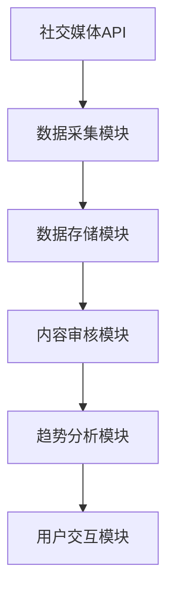
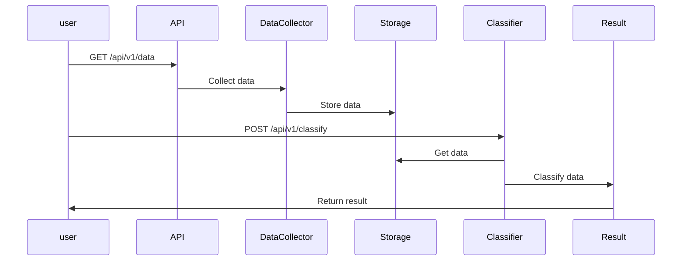

                 


# AI Agent在社交媒体中的应用：内容审核与趋势分析

> 关键词：AI Agent，社交媒体，内容审核，趋势分析，自然语言处理，机器学习，深度学习

> 摘要：本文探讨AI Agent在社交媒体中的应用，重点分析内容审核与趋势分析。通过介绍AI Agent的基本概念、核心原理、算法实现、系统架构及项目实战，全面展示AI Agent在社交媒体中的潜力与应用价值。

---

## 第一部分: AI Agent的基本概念与社交媒体应用背景

### 第1章: AI Agent的定义与核心概念

#### 1.1 AI Agent的定义与特点
AI Agent，即人工智能代理，是一种能够感知环境并采取行动以实现目标的智能实体。其特点包括自主性、反应性、目标导向性和社会性。

- **自主性**：AI Agent能够在没有外部干预的情况下自主决策。
- **反应性**：能够实时感知环境变化并做出反应。
- **目标导向性**：所有行为均以实现特定目标为导向。
- **社会性**：能够与其他系统或用户进行交互。

#### 1.2 AI Agent在社交媒体中的应用背景
社交媒体平台每天产生海量内容，包括帖子、评论、图片和视频等。传统的内容审核方式依赖人工，效率低下且成本高昂。AI Agent的应用可以显著提升内容审核的效率和准确性。

- **内容审核的挑战**：需要快速识别违规内容，如色情、暴力、仇恨言论等。
- **趋势分析的必要性**：通过分析用户行为和内容，预测流行话题和舆论走向。
- **AI Agent的优势**：能够实时处理海量数据，具备高精度和高效率。

### 第2章: AI Agent在社交媒体中的应用前景

#### 2.1 内容审核的现状与挑战
传统的内容审核方式存在以下问题：
- **效率低**：人工审核速度慢，难以应对海量数据。
- **准确性差**：人工审核可能存在主观性和疲劳误差。
- **成本高**：需要大量人工投入。

AI Agent通过自动化处理，能够有效解决这些问题。

#### 2.2 趋势分析的核心要素
趋势分析旨在预测未来的流行话题和舆论方向，是社交媒体运营和品牌营销的重要工具。

- **数据来源**：包括用户行为数据、帖子内容、互动频率等。
- **分析方法**：采用自然语言处理和机器学习技术，识别潜在趋势。
- **应用场景**：帮助企业制定营销策略，优化用户参与度。

#### 2.3 内容审核与趋势分析的边界与外延
内容审核不仅限于识别违规内容，还包括分类、情感分析等功能。趋势分析则涉及更广泛的数据范围，包括用户行为和外部事件。

---

## 第二部分: AI Agent的核心概念与原理

### 第3章: AI Agent的核心原理

#### 3.1 自然语言处理（NLP）在AI Agent中的应用
NLP是AI Agent实现内容审核和趋势分析的核心技术。

- **文本分类**：将文本归类为不同的类别，如垃圾信息、负面评论等。
- **实体识别**：识别文本中的关键实体，如人名、地名等。
- **情感分析**：判断文本中的情感倾向，如正面、负面或中性。

#### 3.2 机器学习与深度学习在AI Agent中的应用
机器学习和深度学习为AI Agent提供了强大的数据处理能力。

- **监督学习**：使用标注数据训练模型，用于分类任务。
- **无监督学习**：从无标签数据中发现模式，用于主题挖掘。
- **深度学习模型**：如LSTM和Transformer，用于复杂文本处理。

### 第4章: AI Agent的核心算法与流程

#### 4.1 文本分类算法
文本分类是内容审核的基础任务。

- **算法流程**：
  1. 数据预处理：清洗、分词、去除停用词。
  2. 特征提取：使用TF-IDF或词嵌入技术。
  3. 模型训练：使用朴素贝叶斯、SVM或神经网络进行训练。
  4. 模型评估：计算准确率、召回率和F1值。

- **代码示例**：
  ```python
  from sklearn.feature_extraction.text import TfidfVectorizer
  from sklearn.naive_bayes import MultinomialNB
  from sklearn.metrics import accuracy_score

  vectorizer = TfidfVectorizer()
  X = vectorizer.fit_transform(texts)
  y = labels

  model = MultinomialNB()
  model.fit(X, y)
  y_pred = model.predict(X)
  print("Accuracy:", accuracy_score(y, y_pred))
  ```

#### 4.2 情感分析算法
情感分析用于判断文本的情感倾向。

- **算法流程**：
  1. 数据清洗：去除无关信息。
  2. 特征提取：使用词袋模型或词嵌入。
  3. 模型训练：使用深度学习模型如LSTM。
  4. 模型评估：计算准确率和F1值。

- **数学模型**：
  使用LSTM进行序列建模：
  $$ f(x) = LSTM(x) \rightarrow Dense(3) \rightarrow softmax $$
  输出为正面、中性或负面。

### 第5章: AI Agent的数学模型与公式

#### 5.1 文本分类的数学模型
文本分类常用朴素贝叶斯模型，其公式如下：

$$ P(y|x) = \frac{P(x|y)P(y)}{P(x)} $$

其中，P(y|x)是类条件概率，P(x|y)是似然概率，P(y)是先验概率。

#### 5.2 情感分析的数学模型
情感分析使用深度学习模型，如双向LSTM：

$$ f(x) = LSTM_{forward}(x) \parallel LSTM_{backward}(x) \rightarrow Dense(2) \rightarrow softmax $$

输出为正面或负面。

---

## 第三部分: AI Agent的系统架构与实现

### 第6章: 系统架构设计

#### 6.1 系统功能模块
系统包括数据采集、内容审核、趋势分析和用户交互四个模块。

- **数据采集**：从社交媒体API获取数据。
- **内容审核**：使用NLP技术进行分类和识别。
- **趋势分析**：分析用户行为和内容，预测趋势。
- **用户交互**：提供友好的用户界面，展示分析结果。

#### 6.2 系统架构图
使用Mermaid绘制系统架构图：



### 第7章: 系统接口设计

#### 7.1 数据接口
- **输入接口**：接收社交媒体API返回的数据。
- **输出接口**：将处理结果返回给用户或存储模块。

#### 7.2 API设计
- **数据采集API**：`GET /api/v1/data`
- **内容审核API**：`POST /api/v1/classify`
- **趋势分析API**：`GET /api/v1/trend`

### 第8章: 系统交互流程

#### 8.1 交互流程图
使用Mermaid绘制交互流程图：



---

## 第四部分: 项目实战

### 第9章: 社交媒体内容审核系统

#### 9.1 环境配置
- **Python版本**：3.8+
- **依赖库**：scikit-learn, spacy, tensorflow

#### 9.2 核心代码实现

```python
import spacy
from sklearn.model_selection import train_test_split
from sklearn.linear_model import LogisticRegression

# 数据预处理
nlp = spacy.load("en_core_web_sm")
texts = [doc.text for doc in docs]
X = [nlp(text).vector for text in texts]
y = [doc.label for doc in docs]

# 划分训练集和测试集
X_train, X_test, y_train, y_test = train_test_split(X, y, test_size=0.2)

# 模型训练
model = LogisticRegression()
model.fit(X_train, y_train)

# 模型预测
y_pred = model.predict(X_test)
print("Accuracy:", accuracy_score(y_test, y_pred))
```

#### 9.3 案例分析
以Twitter为例，分析用户情感倾向。

- **数据来源**：Twitter API获取推文。
- **数据处理**：清洗、分词、情感分析。
- **结果展示**：统计正面、负面和中性评论的比例。

---

## 第五部分: 总结与展望

### 第10章: 总结与展望

#### 10.1 全文总结
AI Agent在社交媒体中的应用前景广阔，尤其在内容审核和趋势分析方面表现出色。通过NLP和机器学习技术，AI Agent能够显著提升效率和准确性。

#### 10.2 当前应用的挑战
- **数据隐私**：如何在保护用户隐私的前提下进行数据处理。
- **模型优化**：如何提升模型的准确性和鲁棒性。
- **计算资源**：如何处理海量数据对计算资源的需求。

#### 10.3 未来展望
随着技术的发展，AI Agent在社交媒体中的应用将更加智能化和自动化。未来可能会出现更复杂的模型和更高效的算法，进一步推动社交媒体的智能化发展。

---

通过本文的详细讲解，读者可以全面了解AI Agent在社交媒体中的应用，掌握核心技术和实现方法。希望本文能够为相关领域的研究和实践提供有价值的参考。

