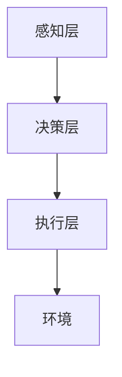
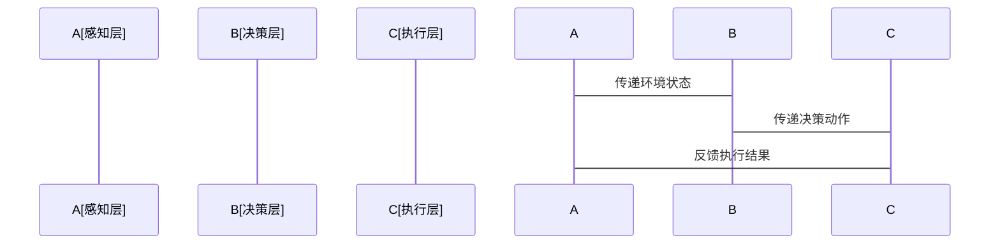

                 


# AI Agent的元学习与快速适应能力开发

> **关键词**：AI Agent, 元学习, 快速适应, 系统架构, 算法原理, 项目实战  
> 
> **摘要**：  
> 本文深入探讨AI Agent的元学习与快速适应能力开发，结合理论与实践，从元学习的基本概念、算法原理、系统架构到项目实战，全面解析如何构建具备快速适应能力的AI Agent。文章通过详细的技术分析和案例解读，帮助读者理解AI Agent在复杂动态环境中的适应机制，并提供实际开发中的最佳实践。

---

# 第1章: AI Agent与元学习概述

## 1.1 AI Agent的基本概念

### 1.1.1 AI Agent的定义与特点
AI Agent（人工智能代理）是指能够感知环境、自主决策并执行任务的智能体。它具备以下特点：
- **自主性**：无需外部干预，自主完成任务。
- **反应性**：能够实时感知环境变化并做出响应。
- **学习能力**：通过学习提升任务执行效率和准确性。
- **适应性**：能够在动态环境中调整策略以适应变化。

### 1.1.2 元学习的基本概念
元学习（Meta-Learning）是一种学习方法，旨在通过少量样本快速适应新任务。其核心思想是“学会如何学习”，即通过元学习，模型能够快速掌握新任务的规律，而无需大量数据。

### 1.1.3 元学习的核心思想与应用场景
元学习的核心思想是通过元任务（Meta-Tasks）训练模型，使其具备快速适应新任务的能力。应用场景包括：
- **多任务学习**：在一个任务上训练后，快速适应其他相关任务。
- **动态环境适应**：在环境变化时，快速调整策略以保持高效性能。
- **零样本学习**：在新任务上仅有少量样本时，仍能准确完成任务。

### 1.1.4 元学习的边界与外延
元学习的边界在于其“快速适应”的能力，但其局限性也在于对新任务的适应可能依赖于元任务的相似性。外延则包括与迁移学习、自适应学习等其他学习方法的结合。

## 1.2 AI Agent的快速适应能力
### 1.2.1 快速适应能力的定义
快速适应能力是指AI Agent在面对新任务或环境变化时，能够迅速调整自身策略以适应变化的能力。

### 1.2.2 元学习在快速适应中的作用
元学习通过在多个任务上训练，使得AI Agent具备快速迁移知识的能力，从而实现快速适应。

### 1.2.3 快速适应能力的实现路径
- **元学习算法**：通过元学习算法（如MAML、Reptile）实现快速适应。
- **知识迁移**：将已知任务的知识迁移到新任务中。
- **动态调整策略**：根据环境反馈动态调整策略。

---

## 1.3 本章小结
本章介绍了AI Agent和元学习的基本概念，分析了元学习的核心思想及其在AI Agent快速适应能力中的作用，并讨论了其边界与实现路径。

---

# 第2章: 元学习的核心概念与数学模型

## 2.1 元学习的核心概念

### 2.1.1 元学习的基本框架
元学习的基本框架包括：
1. **元任务**：一组用于训练的相似任务。
2. **目标任务**：需要快速适应的新任务。
3. **元学习模型**：通过元任务训练，具备快速适应目标任务的能力。

### 2.1.2 元学习的数学模型
元学习的目标是通过元任务训练，使得模型在目标任务上仅需少量样本即可达到良好性能。数学模型如下：
$$ \mathcal{L}_{\text{meta}} = \sum_{i=1}^{N} \mathcal{L}_i(f_\theta), $$
其中，$f_\theta$是元学习模型，$\mathcal{L}_i$是目标任务的损失函数。

## 2.2 元学习与迁移学习的对比

### 2.2.1 迁移学习的特点
- **目标任务**：专注于单个目标任务。
- **数据依赖性**：通常需要目标任务的大量数据。

### 2.2.2 元学习的独特优势
- **快速适应**：通过元任务训练，能够在目标任务上快速调整。
- **少样本学习**：适用于目标任务数据量较少的情况。

## 2.3 元学习的核心算法

### 2.3.1 MAML算法
MAML（Meta-Algorithm for Meta-Learning）是一种基于梯度的元学习算法，其核心思想是通过在元任务上优化模型的参数更新规则。

### 2.3.2 Reptile算法
Reptile算法通过在多个任务上交替优化全局参数和局部参数，实现快速适应目标任务。

### 2.3.3 其他元学习算法
- **ANIL**：通过参数共享实现元学习。
- **Meta-SGD**：基于随机梯度下降的元学习方法。

---

## 2.4 本章小结
本章详细介绍了元学习的核心概念、数学模型以及与迁移学习的对比，并探讨了几种主流的元学习算法。

---

# 第3章: AI Agent的快速适应能力开发

## 3.1 快速适应能力的实现原理

### 3.1.1 快速适应的核心思想
快速适应的核心思想是通过元学习算法，使得AI Agent能够在新任务上快速调整参数，以适应环境变化。

### 3.1.2 快速适应的实现步骤
1. **训练元任务**：在多个元任务上训练元学习模型。
2. **适应目标任务**：在目标任务上快速调整模型参数。

---

## 3.2 元学习在AI Agent中的应用

### 3.2.1 元学习在任务切换中的应用
在多任务环境中，AI Agent通过元学习能够在任务切换时快速调整策略。

### 3.2.2 元学习在动态环境中的应用
在动态环境中，AI Agent通过元学习能够快速适应环境的变化。

### 3.2.3 元学习在多任务学习中的应用
在多任务学习中，AI Agent通过元学习能够同时掌握多个任务的知识。

---

## 3.3 快速适应能力的评估指标

### 3.3.1 适应速度的评估
通过完成目标任务所需的时间来评估适应速度。

### 3.3.2 适应效果的评估
通过目标任务的准确率、F1值等指标来评估适应效果。

### 3.3.3 适应稳定性的评估
通过多次实验的平均表现来评估适应稳定性。

---

## 3.4 本章小结
本章探讨了AI Agent快速适应能力的实现原理及其在不同场景中的应用，并介绍了适应能力的评估指标。

---

# 第4章: 基于元学习的AI Agent系统架构设计

## 4.1 系统架构概述

### 4.1.1 系统整体架构
系统架构包括感知层、决策层和执行层。

---

## 4.2 系统功能设计

### 4.2.1 领域模型（Domain Model）
- **输入**：环境状态。
- **输出**：决策动作。

---

## 4.3 系统架构设计

### 4.3.1 系统架构图


---

## 4.4 系统接口设计

### 4.4.1 系统接口
- **输入接口**：接收环境状态。
- **输出接口**：输出决策动作。

---

## 4.5 系统交互设计

### 4.5.1 系统交互图


---

## 4.6 本章小结
本章详细介绍了基于元学习的AI Agent系统架构设计，包括系统整体架构、功能设计、接口设计和交互设计。

---

# 第5章: 元学习算法实现与项目实战

## 5.1 项目实战：智能助手开发

### 5.1.1 项目背景
开发一个具备快速适应能力的智能助手，使其能够在不同场景下快速切换任务。

---

## 5.2 环境安装

### 5.2.1 安装Python
```bash
python --version
pip install --upgrade pip
```

### 5.2.2 安装深度学习框架
```bash
pip install tensorflow
pip install numpy
pip install scikit-learn
```

---

## 5.3 系统核心实现

### 5.3.1 元学习模型实现
```python
import tensorflow as tf

class MetaLearningModel:
    def __init__(self):
        self.model = self.build_model()
    
    def build_model(self):
        # 定义模型架构
        pass
    
    def meta_train(self, tasks):
        # 元任务训练
        pass
    
    def adapt(self, task):
        # 快速适应目标任务
        pass
```

### 5.3.2 快速适应实现
```python
def adapt_task(meta_model, new_task):
    # 调用元学习模型进行快速适应
    meta_model.adapt(new_task)
```

---

## 5.4 项目小结
本章通过一个智能助手开发案例，详细介绍了元学习算法的实现过程，并展示了如何将元学习应用于实际项目中。

---

# 第6章: 元学习的挑战与未来方向

## 6.1 元学习的挑战

### 6.1.1 算法复杂度
元学习算法通常较为复杂，计算成本较高。

### 6.1.2 数据依赖性
部分元学习算法对元任务数据的依赖性较强。

---

## 6.2 未来发展方向

### 6.2.1 算法优化
研究更高效的元学习算法，降低计算成本。

### 6.2.2 应用场景拓展
探索元学习在更多领域的应用，如医疗、教育等。

---

## 6.3 本章小结
本章分析了元学习面临的挑战，并展望了未来的发展方向。

---

# 第7章: 结论与展望

## 7.1 结论
本文系统地探讨了AI Agent的元学习与快速适应能力开发，从理论到实践，全面解析了如何构建具备快速适应能力的AI Agent。

---

## 7.2 展望
未来，随着元学习技术的不断进步，AI Agent的快速适应能力将更加智能化和高效化。

---

# 附录

## 附录A: 元学习算法代码示例
```python
import tensorflow as tf

class MAML(tf.keras.Model):
    def __init__(self):
        super(MAML, self).__init__()
        self.shared_weights = tf.Variable(tf.random.normal([10, 5]))
        self.task_specific_weights = tf.Variable(tf.random.normal([5, 1]))
    
    def call(self, inputs, is_meta=False):
        if is_meta:
            # 元任务训练
            pass
        else:
            # 目标任务适应
            pass
```

---

## 附录B: 元学习数学公式
元学习的优化目标可以表示为：
$$ \min_{\theta} \sum_{i=1}^{N} \mathcal{L}_i(f_\theta), $$
其中，$\theta$是模型参数，$\mathcal{L}_i$是目标任务的损失函数。

---

# 结束语

感谢您的阅读！希望本文能为您提供关于AI Agent的元学习与快速适应能力开发的深入洞察。如果需要进一步探讨或获取代码示例，请随时联系。

---

