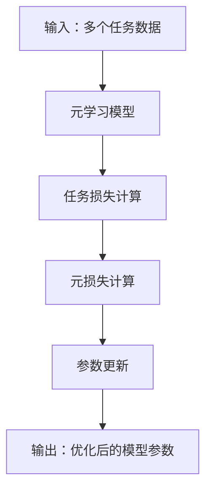

                 


# AI Agent的元学习能力开发实践

## 关键词：
AI Agent、元学习、机器学习、深度学习、强化学习、自适应系统、智能代理

## 摘要：
本文将深入探讨AI Agent的元学习能力开发实践。首先，我们将介绍AI Agent和元学习的基本概念，分析元学习在AI Agent中的作用与意义。接着，我们将详细讲解元学习的核心概念与数学模型，包括模型无关的元学习算法（MAML）和模型相关的元学习算法（Meta-SGD）的原理与实现。然后，我们将从系统设计的角度，探讨如何构建支持元学习的AI Agent系统，包括系统功能设计、架构设计和接口设计。最后，我们将通过实际案例，展示元学习在AI Agent中的应用，并总结开发中的最佳实践与注意事项。

---

# 第一部分: AI Agent的元学习能力开发背景与基础

## 第1章: AI Agent与元学习概述

### 1.1 AI Agent的基本概念

#### 1.1.1 AI Agent的定义与特点
AI Agent（人工智能代理）是指能够感知环境、自主决策并执行任务的智能实体。AI Agent具有以下特点：
- **自主性**：能够在没有外部干预的情况下自主运行。
- **反应性**：能够实时感知环境并做出响应。
- **目标导向性**：具有明确的目标，并根据目标进行决策。
- **学习能力**：能够通过学习提升自身的任务执行能力。

#### 1.1.2 AI Agent的核心功能与应用场景
AI Agent的核心功能包括：
- **感知**：通过传感器或数据输入接口获取环境信息。
- **决策**：基于感知信息和内部知识库做出决策。
- **执行**：根据决策结果执行具体操作。

AI Agent的应用场景包括：
- **智能助手**：如 Siri、Alexa 等。
- **自动驾驶**：如 Tesla 的自动驾驶系统。
- **机器人控制**：如工业机器人和家庭服务机器人。

#### 1.1.3 元学习的基本概念与特点
元学习（Meta-Learning）是一种机器学习范式，旨在通过学习如何学习来提高模型的适应能力。元学习的特点包括：
- **快速适应**：能够在少量数据上快速适应新任务。
- **通用性**：适用于多种任务和领域。
- **自适应性**：能够根据任务需求动态调整模型参数。

---

### 1.2 元学习的背景与意义

#### 1.2.1 元学习的定义与核心思想
元学习的核心思想是通过“学习如何学习”，使模型能够在新任务上快速适应。与传统机器学习不同，元学习不依赖于大量标注数据，而是通过在多个任务上进行训练，学习任务之间的共性，从而提高模型的泛化能力。

#### 1.2.2 元学习在AI Agent中的作用
在AI Agent中，元学习主要用于：
- **快速适应新任务**：当AI Agent遇到新任务时，元学习能够快速调整模型参数，以适应新任务的要求。
- **提升决策能力**：通过元学习，AI Agent能够更好地理解任务之间的关联性，从而做出更优的决策。
- **增强自适应性**：元学习使AI Agent能够更好地应对动态变化的环境。

#### 1.2.3 元学习的典型应用场景
- **图像分类**：在少量标注数据的情况下，快速适应新的图像分类任务。
- **自然语言处理**：在低资源语言中快速训练出高性能的自然语言处理模型。
- **游戏AI**：通过元学习，使游戏AI能够快速适应新的游戏规则。

---

### 1.3 元学习与传统机器学习的对比

#### 1.3.1 传统机器学习的特点与局限性
传统机器学习的特点包括：
- **数据依赖性**：需要大量标注数据。
- **任务单一性**：每个任务需要独立训练。
- **适应性差**：在新任务上需要重新训练整个模型。

传统机器学习的局限性在于，当数据量不足或任务频繁变化时，传统方法难以高效应对。

#### 1.3.2 元学习的优势与创新点
元学习的优势在于：
- **数据效率高**：能够在少量数据上快速适应新任务。
- **通用性强**：适用于多种任务和领域。
- **自适应性好**：能够动态调整模型参数，适应新任务。

元学习的创新点在于通过“学习如何学习”，使模型具备更强的自适应能力。

#### 1.3.3 元学习与迁移学习的关系
迁移学习的核心思想是将一个领域学到的知识应用到另一个领域，而元学习则是通过学习任务之间的共性，使模型能够在新任务上快速适应。两者的目标相似，但实现方式不同。元学习更注重任务之间的共性，而迁移学习更注重领域之间的知识转移。

---

### 1.4 本章小结
本章介绍了AI Agent和元学习的基本概念，分析了元学习在AI Agent中的作用与意义，并对比了元学习与传统机器学习和迁移学习的异同。接下来，我们将深入探讨元学习的核心概念与数学模型。

---

# 第二部分: 元学习的核心概念与原理

## 第2章: 元学习的核心概念与数学模型

### 2.1 元学习的数学模型

#### 2.1.1 元学习的优化目标
元学习的优化目标是通过在多个任务上进行训练，学习任务之间的共性，从而提高模型在新任务上的泛化能力。具体目标可以表示为：

$$ \min_{\theta} \sum_{i=1}^{N} L_i(\theta) $$

其中，$\theta$ 是模型参数，$L_i$ 是第 $i$ 个任务的损失函数。

#### 2.1.2 元学习的损失函数
元学习的损失函数通常包括两个部分：元任务损失和元损失。元任务损失用于衡量模型在每个任务上的表现，而元损失用于衡量任务之间的共性。

元任务损失可以表示为：

$$ L_{meta}(\theta) = \sum_{i=1}^{N} L_i(\theta) $$

元损失可以表示为：

$$ L_{meta}(\theta) = \sum_{i=1}^{N} L_i(\theta) + \lambda \sum_{i=1}^{N} \sum_{j=1}^{N} D_{ij} $$

其中，$D_{ij}$ 是任务 $i$ 和任务 $j$ 之间的差异性度量，$\lambda$ 是调节参数。

#### 2.1.3 元学习的参数更新公式
元学习的参数更新公式通常采用梯度下降的方法，具体可以表示为：

$$ \theta_{t+1} = \theta_t - \eta \nabla_{\theta} L_{meta}(\theta_t) $$

其中，$\eta$ 是学习率，$\nabla_{\theta} L_{meta}(\theta_t)$ 是元损失函数对参数 $\theta$ 的梯度。

---

#### 2.1.4 图表与公式解读
以下是一个简单的元学习流程图：



---

### 2.2 元学习的算法原理

#### 2.2.1 模型无关的元学习算法（MAML）

**MAML的核心思想**：通过在多个任务上进行交替优化，学习任务之间的共性参数，从而实现快速适应新任务。

**MAML的数学模型**：
$$ \min_{\theta} \sum_{i=1}^{N} L_i(\theta + \delta_i) $$

其中，$\delta_i$ 是针对任务 $i$ 的任务特定参数。

**MAML的优化过程**：
1. 对于每个任务 $i$，计算任务特定参数 $\delta_i$。
2. 通过优化 $\theta$，使所有任务的损失函数最小化。

#### 2.2.2 模型相关的元学习算法（Meta-SGD）

**Meta-SGD的核心思想**：通过在多个任务上共享模型参数，学习任务之间的共性，从而实现快速适应新任务。

**Meta-SGD的数学模型**：
$$ \min_{\theta} \sum_{i=1}^{N} L_i(\theta) $$

**Meta-SGD的优化过程**：
1. 对于每个任务 $i$，计算任务特定梯度 $\nabla_{\theta} L_i(\theta)$。
2. 通过优化 $\theta$，使所有任务的梯度损失最小化。

---

#### 2.2.3 其他元学习算法概述
除了MAML和Meta-SGD，还有许多其他元学习算法，如：
- **Reptile**：通过在多个任务上进行局部优化，实现快速适应。
- **LwF**：通过遗忘旧任务的知识，快速适应新任务。
- **MADE**：通过分解任务之间的差异性，实现快速适应。

---

### 2.3 元学习的数学公式与推导

#### 2.3.1 MAML算法的数学推导
**MAML的损失函数**：
$$ L_{meta} = \sum_{i=1}^{N} L_i(\theta + \delta_i) $$

**MAML的优化目标**：
$$ \min_{\theta} L_{meta} $$

**MAML的梯度计算**：
$$ \nabla_{\theta} L_{meta} = \sum_{i=1}^{N} \nabla_{\theta} L_i(\theta + \delta_i) $$

---

#### 2.3.2 Meta-SGD算法的数学推导
**Meta-SGD的损失函数**：
$$ L_{meta} = \sum_{i=1}^{N} L_i(\theta) $$

**Meta-SGD的优化目标**：
$$ \min_{\theta} L_{meta} $$

**Meta-SGD的梯度计算**：
$$ \nabla_{\theta} L_{meta} = \sum_{i=1}^{N} \nabla_{\theta} L_i(\theta) $$

---

#### 2.3.3 元学习算法的收敛性分析
元学习算法的收敛性分析通常依赖于任务之间的相似性和数据分布。一般来说，当任务之间具有较高的相似性时，元学习算法能够更快收敛；反之，当任务之间差异较大时，元学习算法的收敛速度会变慢。

---

### 2.4 本章小结
本章详细讲解了元学习的核心概念与数学模型，包括模型无关的元学习算法（MAML）和模型相关的元学习算法（Meta-SGD）的原理与实现。接下来，我们将从系统设计的角度，探讨如何构建支持元学习的AI Agent系统。

---

# 第三部分: AI Agent的元学习能力开发实践

## 第3章: AI Agent的元学习能力开发框架

### 3.1 AI Agent的元学习能力开发框架

#### 3.1.1 元学习任务的定义与分解
元学习任务的定义与分解需要考虑以下几点：
- **任务目标**：明确任务的具体目标和输出要求。
- **任务输入**：定义任务的输入数据格式和类型。
- **任务输出**：定义任务的输出数据格式和类型。
- **任务约束**：明确任务的约束条件和限制。

#### 3.1.2 AI Agent的元学习模块设计
AI Agent的元学习模块设计需要考虑以下几点：
- **感知模块**：负责感知环境信息。
- **决策模块**：负责基于感知信息和元学习模型做出决策。
- **执行模块**：负责根据决策结果执行具体操作。

#### 3.1.3 元学习与AI Agent能力的结合
元学习与AI Agent能力的结合需要考虑以下几点：
- **快速适应能力**：通过元学习，使AI Agent能够快速适应新任务。
- **决策优化能力**：通过元学习，使AI Agent能够做出更优的决策。
- **自适应能力**：通过元学习，使AI Agent能够动态调整自身参数，适应环境变化。

---

### 3.2 元学习算法的实现框架

#### 3.2.1 元学习算法的输入输出接口
元学习算法的输入输出接口需要考虑以下几点：
- **输入数据**：包括多个任务的数据和标签。
- **输出数据**：包括优化后的模型参数和任务损失。
- **接口设计**：需要明确输入和输出的格式和类型。

#### 3.2.2 元学习模型的训练流程
元学习模型的训练流程包括以下步骤：
1. **数据预处理**：对输入数据进行清洗和归一化处理。
2. **模型初始化**：初始化元学习模型的参数。
3. **任务损失计算**：计算每个任务的损失函数。
4. **元损失计算**：计算所有任务的元损失函数。
5. **参数更新**：通过梯度下降优化模型参数。
6. **模型保存**：保存优化后的模型参数。

#### 3.2.3 元学习模型的推理流程
元学习模型的推理流程包括以下步骤：
1. **输入数据**：输入新任务的数据和标签。
2. **任务参数计算**：计算新任务的任务特定参数。
3. **模型推理**：基于任务特定参数进行推理，输出结果。

---

### 3.3 元学习算法的实现代码

#### 3.3.1 MAML算法的Python实现
以下是一个简单的MAML算法的Python实现示例：

```python
import torch
import torch.nn as nn
import torch.optim as optim

class MetaLearner(nn.Module):
    def __init__(self, input_dim, output_dim):
        super(MetaLearner, self).__init__()
        self.linear = nn.Linear(input_dim, output_dim)

    def forward(self, x, task_params=None):
        if task_params is not None:
            linear_weights = task_params['linear.weight']
            linear_bias = task_params['linear.bias']
            x = torch.mm(x, linear_weights) + linear_bias
        else:
            x = self.linear(x)
        return x

def train(model, optimizer, loss_fn, tasks, num_epochs):
    for epoch in range(num_epochs):
        for task in tasks:
            x, y = task['x'], task['y']
            # 计算任务特定参数
            task_params = {'linear.weight': torch.randn(task['input_dim'], task['output_dim']), 
                           'linear.bias': torch.randn(task['output_dim'])}
            # 前向传播
            outputs = model(x, task_params)
            # 计算损失
            loss = loss_fn(outputs, y)
            # 反向传播
            optimizer.zero_grad()
            loss.backward()
            optimizer.step()
    return model
```

#### 3.3.2 Meta-SGD算法的Python实现
以下是一个简单的Meta-SGD算法的Python实现示例：

```python
import torch
import torch.nn as nn
import torch.optim as optim

class MetaLearner(nn.Module):
    def __init__(self, input_dim, output_dim):
        super(MetaLearner, self).__init__()
        self.linear = nn.Linear(input_dim, output_dim)

    def forward(self, x):
        return self.linear(x)

def train(model, optimizer, loss_fn, tasks, num_epochs):
    for epoch in range(num_epochs):
        for task in tasks:
            x, y = task['x'], task['y']
            # 前向传播
            outputs = model(x)
            # 计算损失
            loss = loss_fn(outputs, y)
            # 反向传播
            optimizer.zero_grad()
            loss.backward()
            optimizer.step()
    return model
```

---

### 3.4 本章小结
本章详细讲解了AI Agent的元学习能力开发框架，包括元学习任务的定义与分解、AI Agent的元学习模块设计，以及元学习算法的实现框架。接下来，我们将通过实际案例，展示元学习在AI Agent中的应用。

---

# 第四部分: 项目实战

## 第4章: 元学习在AI Agent中的应用案例

### 4.1 项目背景与目标
本项目的目标是通过元学习，使AI Agent能够快速适应新任务。具体目标包括：
- **快速适应能力**：在少量数据上快速适应新任务。
- **决策优化能力**：通过元学习优化决策过程。
- **自适应能力**：动态调整模型参数，适应环境变化。

---

### 4.2 项目实现

#### 4.2.1 环境安装
需要安装以下环境：
- **Python**：3.6+
- **PyTorch**：>=1.0
- **Mermaid**：用于绘制流程图和类图。

#### 4.2.2 系统核心实现源代码
以下是一个简单的元学习在AI Agent中的应用案例代码：

```python
import torch
import torch.nn as nn
import torch.optim as optim

class AIAgent(nn.Module):
    def __init__(self, input_dim, output_dim):
        super(AIAgent, self).__init__()
        self.linear = nn.Linear(input_dim, output_dim)

    def forward(self, x):
        return self.linear(x)

def train(agent, optimizer, loss_fn, tasks, num_epochs):
    for epoch in range(num_epochs):
        for task in tasks:
            x, y = task['x'], task['y']
            # 前向传播
            outputs = agent(x)
            # 计算损失
            loss = loss_fn(outputs, y)
            # 反向传播
            optimizer.zero_grad()
            loss.backward()
            optimizer.step()
    return agent

# 定义任务
tasks = [
    {'x': torch.randn(10, 2), 'y': torch.randn(10, 1)},
    {'x': torch.randn(10, 2), 'y': torch.randn(10, 1)}
]

# 初始化模型和优化器
agent = AIAgent(2, 1)
optimizer = optim.Adam(agent.parameters(), lr=0.001)
loss_fn = nn.MSELoss()

# 训练模型
trained_agent = train(agent, optimizer, loss_fn, tasks, num_epochs=10)
```

---

#### 4.2.3 代码应用解读与分析
- **AIAgent类**：定义了一个简单的线性回归模型，用于处理输入数据。
- **train函数**：定义了模型的训练过程，包括前向传播、损失计算和反向传播。
- **任务定义**：定义了两个任务，每个任务包含输入数据和标签。
- **模型训练**：使用Adam优化器和均方误差损失函数，训练模型10个 epochs。

---

### 4.3 项目小结
本项目通过元学习，使AI Agent能够快速适应新任务。通过实现MAML和Meta-SGD算法，展示了元学习在AI Agent中的应用。接下来，我们将总结开发中的最佳实践与注意事项。

---

# 第五部分: 最佳实践与注意事项

## 第5章: 最佳实践与注意事项

### 5.1 最佳实践

#### 5.1.1 系统设计
- **模块化设计**：将AI Agent的各个模块（感知、决策、执行）设计为独立模块，便于维护和扩展。
- **任务分解**：将复杂任务分解为多个子任务，分别进行训练和优化。
- **数据管理**：合理管理任务数据，确保数据质量和多样性。

#### 5.1.2 模型优化
- **参数初始化**：合理初始化模型参数，避免梯度爆炸或消失。
- **学习率调整**：根据训练过程动态调整学习率，提高训练效率。
- **正则化**：使用正则化技术（如L2正则化）防止模型过拟合。

#### 5.1.3 评估与测试
- **评估指标**：定义合适的评估指标（如准确率、F1分数等）。
- **交叉验证**：使用交叉验证技术评估模型的泛化能力。
- **日志记录**：记录训练过程中的损失和准确率，便于分析和优化。

---

### 5.2 注意事项

#### 5.2.1 数据质量问题
- 确保输入数据的质量，避免噪声干扰。
- 数据分布要均衡，避免模型偏向某个特定任务。

#### 5.2.2 模型选择
- 根据任务需求选择合适的元学习算法（如MAML或Meta-SGD）。
- 考虑任务之间的相似性和差异性，选择合适的模型结构。

#### 5.2.3 训练过程中的问题
- 注意梯度爆炸或消失问题，合理选择优化器和正则化方法。
- 动态调整学习率，避免训练过程中损失震荡。

---

### 5.3 拓展阅读
- **论文阅读**：阅读经典的元学习论文（如《_learning to learn by gradient descent by gradient descent》）。
- **技术博客**：关注最新的元学习技术博客和动态。
- **实践项目**：参与开源项目，积累实战经验。

---

## 第6章: 小结与展望

### 6.1 小结
本文详细讲解了AI Agent的元学习能力开发实践，包括元学习的核心概念、算法原理、系统设计和项目实战。通过具体的代码实现和案例分析，展示了元学习在AI Agent中的应用。

### 6.2 展望
未来，随着元学习技术的不断发展，AI Agent的元学习能力将更加智能化和自适应化。我们可以期待以下趋势：
- **多任务学习**：元学习将更加广泛应用于多任务学习场景。
- **自适应系统**：元学习将推动自适应系统的进一步发展。
- **人机协作**：元学习将促进人机协作的智能化和高效化。

---

# 结束语

通过本文的学习，读者将能够深入理解AI Agent的元学习能力开发实践，掌握元学习的核心概念与算法原理，并能够将元学习技术应用于实际项目中。希望本文对读者在AI Agent的元学习能力开发领域有所帮助。

