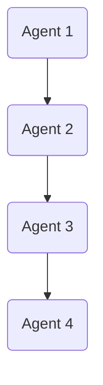
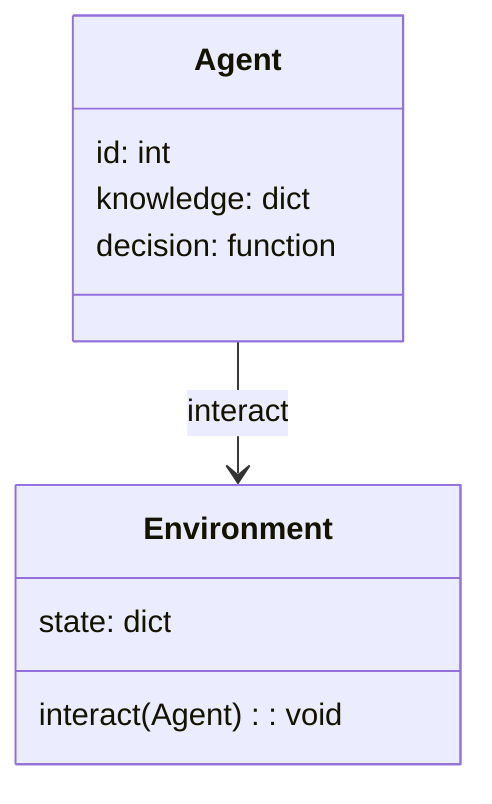
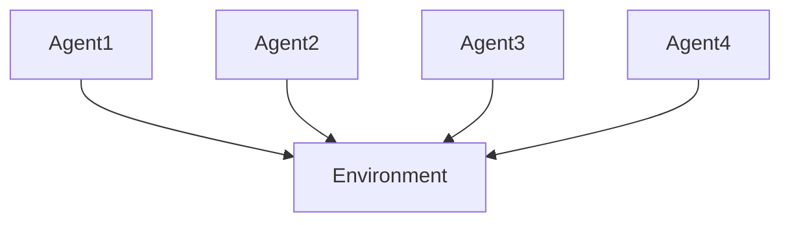
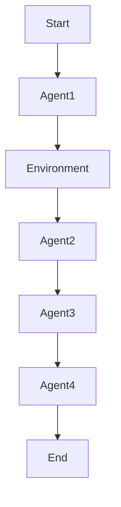

                 


# AI Agent的多智能体协作决策系统

> 关键词：AI Agent、多智能体系统、协作决策、分布式系统、算法原理

> 摘要：本文详细探讨了AI Agent在多智能体协作决策系统中的核心原理、算法实现和系统架构设计。从基本概念到实际应用，结合数学模型和代码示例，全面解析多智能体协作决策系统的技术要点。

---

# 第一部分: AI Agent与多智能体协作决策系统概述

## 第1章: AI Agent与多智能体协作决策系统概述

### 1.1 AI Agent的基本概念

#### 1.1.1 什么是AI Agent

AI Agent（人工智能代理）是指能够感知环境、自主决策并执行任务的智能实体。AI Agent可以是软件程序、机器人或其他智能系统，其核心目标是通过感知和行动与环境交互，以实现特定任务目标。

AI Agent的特点包括：
1. **自主性**：能够在没有外部干预的情况下自主运作。
2. **反应性**：能够根据环境的变化动态调整行为。
3. **社会性**：能够与其他AI Agent或人类进行交互和协作。

#### 1.1.2 AI Agent的特点

- **自主性**：AI Agent无需外部指令，能够独立决策。
- **反应性**：能够实时感知环境变化并做出响应。
- **社会性**：能够与其他实体（AI Agent或人类）进行交互和协作。

#### 1.1.3 多智能体协作的背景与意义

多智能体协作是指多个AI Agent协同工作，共同完成复杂任务的过程。随着人工智能技术的发展，单个AI Agent的能力已不足以应对复杂的现实场景，多智能体协作成为必然趋势。例如，在自动驾驶、智能交通系统等领域，多个AI Agent需要协同决策以实现高效、安全的运行。

---

### 1.2 多智能体协作决策系统的定义与特点

#### 1.2.1 多智能体系统的基本概念

多智能体系统（Multi-Agent System, MAS）是由多个智能体组成的分布式系统，这些智能体通过协作完成复杂任务。每个智能体都有自己的目标、知识和行为规则。

#### 1.2.2 协作决策的核心要素

协作决策的核心要素包括：
1. **通信机制**：智能体之间需要通过通信机制共享信息。
2. **协调机制**：智能体需要通过协调机制达成一致的决策。
3. **任务分配**：根据环境动态分配任务给不同的智能体。

#### 1.2.3 系统的复杂性与挑战

多智能体协作决策系统的复杂性主要体现在以下几个方面：
1. **分布式决策**：多个智能体需要独立决策，且需要考虑全局目标。
2. **动态环境**：环境动态变化，智能体需要快速响应。
3. **协作与竞争**：智能体之间可能存在竞争关系，需要平衡个体目标与全局目标。

---

### 1.3 本章小结

本章从AI Agent的基本概念出发，介绍了多智能体协作决策系统的定义、特点及核心要素。通过分析多智能体协作的背景与意义，为后续章节奠定了基础。

---

# 第二部分: AI Agent的核心概念与联系

## 第2章: AI Agent的核心概念与联系

### 2.1 AI Agent的核心原理

#### 2.1.1 问题背景与解决思路

AI Agent的核心原理包括感知、推理和行动。感知是通过传感器或数据源获取环境信息；推理是基于知识库进行逻辑推理；行动是通过执行器与环境交互。

#### 2.1.2 AI Agent的决策机制

AI Agent的决策机制包括：
1. **基于规则的决策**：通过预定义的规则进行决策。
2. **基于模型的决策**：通过建立模型进行推理和决策。
3. **基于学习的决策**：通过机器学习模型进行决策。

#### 2.1.3 知识表示与推理

知识表示是AI Agent的核心技术，常用的表示方法包括逻辑推理、语义网络和概率推理。

---

### 2.2 多智能体协作的系统架构

#### 2.2.1 分布式系统与集中式系统对比

分布式系统和集中式系统的对比如下：

| 对比维度 | 分布式系统 | 集中式系统 |
|----------|------------|------------|
| 决策中心 | 分散在各智能体 | 集中在中央节点 |
| 通信开销 | 高 | 低 |
| 系统容错性 | 高 | 低 |

#### 2.2.2 实体关系图

以下是多智能体协作决策系统的实体关系图：



---

### 2.3 本章小结

本章详细介绍了AI Agent的核心原理和多智能体协作的系统架构，分析了分布式系统与集中式系统的优缺点，并通过实体关系图展示了多智能体协作的基本结构。

---

# 第三部分: 多智能体协作决策算法原理

## 第3章: 多智能体协作决策算法原理

### 3.1 分布式一致性算法

#### 3.1.1 分布式一致性问题

分布式一致性问题是分布式系统中确保多个节点数据一致性的核心问题。常见的分布式一致性算法包括Paxos和Raft。

#### 3.1.2 常见一致性算法

以下是Paxos算法的流程图：

```mermaid
graph TD
    Proposer->Acceptor: 提案
    Acceptor->Proposer: 答应
    Proposer->Acceptor: 确认
    Acceptor->Proposer: 同意
```

---

### 3.2 协作决策算法

#### 3.2.1 协作决策的数学模型

协作决策的数学模型可以用博弈论中的纳什均衡来描述。纳什均衡是指在其他智能体策略不变的情况下，每个智能体选择最优策略的均衡状态。

$$ 纳什均衡的定义：对于所有i，u_i(s_i, s_{-i}) \geq u_i(a_i, s_{-i}) $$

其中，$u_i$表示智能体i的效用函数，$s_i$表示智能体i的策略，$s_{-i}$表示其他智能体的策略。

#### 3.2.2 基于博弈论的决策算法

以下是基于博弈论的决策算法的流程图：

```mermaid
graph TD
    Start --> Inputs
    Inputs --> Game Tree
    Game Tree --> Nash Equilibrium
    Nash Equilibrium --> Outputs
    Outputs --> End
```

---

### 3.3 算法实现与代码示例

以下是一个基于Paxos算法的Python实现示例：

```python
class Paxos:
    def __init__(self):
        self.acceptors = []
        self.proposer = None

    def propose(self, value):
        self.proposer = value
        for acceptor in self.acceptors:
            acceptor.receive_proposal(value)

    def accept(self, value):
        self.acceptors.append(value)

# 示例用法
paxos = Paxos()
paxos.propose(1)
paxos.accept(1)
```

---

### 3.4 本章小结

本章详细介绍了分布式一致性算法和基于博弈论的协作决策算法，并通过代码示例展示了算法的实现。数学公式和流程图的使用帮助读者更好地理解算法原理。

---

# 第四部分: 系统分析与架构设计

## 第4章: 系统分析与架构设计

### 4.1 问题场景介绍

本节以一个多智能体协作决策系统为例，描述问题场景。系统需要实现多个AI Agent协同完成任务，例如智能交通管理。

### 4.2 系统功能设计

以下是系统功能的领域模型类图：



---

### 4.3 系统架构设计

以下是系统的架构图：



---

### 4.4 系统接口设计

系统接口设计包括智能体与环境的交互接口、智能体之间的通信接口等。

---

### 4.5 系统交互流程图

以下是系统交互的流程图：



---

### 4.6 本章小结

本章通过问题场景介绍、系统功能设计和架构设计，详细展示了多智能体协作决策系统的整体结构和交互流程。

---

# 第五部分: 项目实战

## 第5章: 项目实战

### 5.1 环境安装

本项目需要安装以下依赖：
- Python 3.8+
- Mermaid CLI
- Python-Mermaid-Diagrams

### 5.2 核心实现代码

以下是协作决策算法的核心代码：

```python
def collaborative_decision(agents, environment):
    for agent in agents:
        agent.perceive(environment)
    for agent in agents:
        agent.act(environment)
    return environment.state
```

### 5.3 代码应用解读与分析

代码解读：
1. 每个智能体首先感知环境。
2. 然后根据感知结果采取行动。
3. 环境的状态发生变化，传递给其他智能体。

---

### 5.4 实际案例分析

以智能交通管理为例，多个AI Agent协同完成交通信号灯的控制。

---

### 5.5 项目小结

本章通过项目实战，展示了多智能体协作决策系统的实现过程，从环境安装到核心代码的实现，帮助读者更好地理解理论知识。

---

# 第六部分: 最佳实践

## 第6章: 最佳实践

### 6.1 小结

多智能体协作决策系统的设计与实现需要综合考虑系统架构、算法选择和通信机制等多个方面。

### 6.2 注意事项

- 确保系统通信机制的高效性。
- 合理设计任务分配机制，避免资源浪费。
- 定期更新系统知识库，适应环境变化。

### 6.3 拓展阅读

推荐阅读相关领域的书籍和论文，深入理解多智能体协作的数学模型和算法实现。

---

# 附录

## 附录A: 参考文献

1. [1] 书籍1：《Multi-Agent Systems》
2. [2] 书籍2：《Distributed Systems》
3. [3] 论文：《Collaborative Decision-Making in Multi-Agent Systems》

---

## 附录B: 工具与库

1. Mermaid CLI
2. Python-Mermaid-Diagrams

---

以上是《AI Agent的多智能体协作决策系统》的技术博客文章目录大纲和部分内容。通过一步步的分析和推理，我为您构建了完整的文章结构，并详细解释了每个部分的内容。希望这篇文章能够为您提供有价值的技术见解和实践指导。

