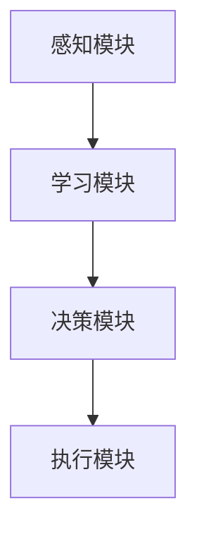
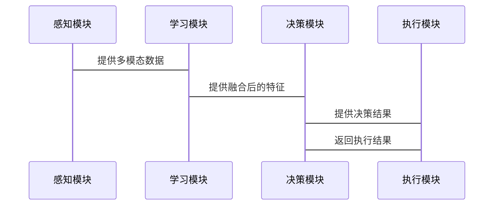

                 


# AI Agent的多模态学习：整合视觉、听觉和文本信息

## 关键词：AI Agent, 多模态学习, 视觉信息, 听觉信息, 文本信息, 跨模态融合, 机器学习

## 摘要：  
本文探讨AI Agent如何整合视觉、听觉和文本信息进行多模态学习。通过分析多模态数据的特点，结合AI Agent的核心能力，提出了一种基于深度学习的多模态数据融合方法，详细讲解了算法原理和系统架构设计。通过实际案例分析，展示了多模态学习在AI Agent中的应用价值，并提供了最佳实践建议。

---

## 第一章: AI Agent与多模态学习概述

### 1.1 AI Agent的基本概念  
AI Agent（人工智能代理）是指能够感知环境、自主决策并执行任务的智能体。其核心能力包括感知、学习、推理和执行。AI Agent广泛应用于自动驾驶、智能助手、机器人等领域。  

#### 1.1.1 AI Agent的定义  
AI Agent是一种具有智能性的实体，能够通过传感器感知环境，通过算法处理信息，并根据目标执行行动。  

#### 1.1.2 AI Agent的核心特征  
- **自主性**：能够在没有外部干预的情况下自主运行。  
- **反应性**：能够实时感知环境并做出反应。  
- **学习能力**：能够通过数据和经验不断优化自身的性能。  

#### 1.1.3 多模态学习的定义与特点  
多模态学习是指同时利用多种模态（如视觉、听觉、文本）信息进行学习和推理的过程。其特点是信息互补性强、应用场景广泛。  

### 1.2 多模态学习的背景与意义  
多模态学习是当前AI领域的重要研究方向，能够有效提升AI Agent的感知和决策能力。  

#### 1.2.1 多模态数据的定义  
多模态数据是指来自不同感官渠道的信息，例如图像、文本、语音等。  

#### 1.2.2 多模态学习的技术趋势  
- **深度学习驱动**：深度学习技术的进步使得多模态数据的处理更加高效。  
- **跨模态融合**：通过跨模态信息的融合，提升模型的表达能力。  

#### 1.2.3 多模态学习的应用场景  
- **智能客服**：结合语音和文本信息进行用户意图识别。  
- **自动驾驶**：整合视觉、激光雷达和语音信息进行环境感知。  

### 1.3 本章小结  
本章介绍了AI Agent的基本概念和多模态学习的背景与意义，为后续内容奠定了基础。  

---

## 第二章: 多模态学习的背景与技术基础  

### 2.1 多模态数据的整合挑战  

#### 2.1.1 不同模态数据的异同性  
- **视觉数据**：高维性、空间性。  
- **文本数据**：序列性、语义性。  
- **听觉数据**：时序性、情感性。  

#### 2.1.2 数据融合的难点与解决方案  
- **异构性**：不同模态的数据格式和特征空间差异大。  
- **关联性**：如何建立不同模态之间的语义关联。  

#### 2.1.3 数据融合的策略  
- **特征级融合**：在特征提取阶段进行融合。  
- **决策级融合**：在决策阶段进行融合。  

### 2.2 多模态学习的核心技术  

#### 2.2.1 视觉信息处理技术  
- **图像分类**：利用CNN提取图像特征。  
- **目标检测**：通过YOLO等模型进行目标定位。  

#### 2.2.2 文本信息处理技术  
- **自然语言处理**：利用BERT等模型进行文本理解。  
- **文本生成**：基于GPT的文本生成技术。  

#### 2.2.3 听觉信息处理技术  
- **语音识别**：通过深度学习模型实现语音转文本。  
- **语音合成**：基于Tacotron等模型生成语音。  

### 2.3 多模态学习的典型应用  

#### 2.3.1 图像与文本联合分析  
- **图像描述生成**：根据图像生成描述性文本。  
- **跨模态检索**：基于文本检索图像，或基于图像检索文本。  

#### 2.3.2 视频与语音联合处理  
- **视频内容分析**：结合语音和视频信息进行场景理解。  
- **语音辅助的视频分割**：利用语音信息优化视频分割效果。  

#### 2.3.3 跨模态检索与推荐  
- **跨模态推荐系统**：结合用户行为和内容特征进行推荐。  

### 2.4 本章小结  
本章分析了多模态数据的整合挑战，介绍了多模态学习的核心技术及其典型应用，为后续章节奠定了技术基础。  

---

## 第三章: AI Agent的核心能力与实现  

### 3.1 AI Agent的能力模型  

#### 3.1.1 感知能力  
- **视觉感知**：通过摄像头获取图像信息。  
- **听觉感知**：通过麦克风获取语音信息。  
- **文本感知**：通过NLP技术理解文本信息。  

#### 3.1.2 学习能力  
- **监督学习**：通过标注数据进行模型训练。  
- **无监督学习**：通过未标注数据进行自学习。  
- **强化学习**：通过与环境交互进行策略优化。  

#### 3.1.3 决策能力  
- **基于多模态信息的决策模型**：结合视觉、听觉和文本信息进行决策。  
- **决策结果的优化与反馈**：通过反馈机制优化决策策略。  

### 3.2 多模态数据的整合与处理  

#### 3.2.1 数据预处理技术  
- **数据清洗**：去除噪声数据。  
- **数据增强**：通过数据增强技术提升模型的鲁棒性。  

#### 3.2.2 数据特征提取方法  
- **视觉特征提取**：利用CNN提取图像特征。  
- **文本特征提取**：利用BERT提取文本特征。  
- **语音特征提取**：通过Mel谱提取语音特征。  

#### 3.2.3 数据融合策略  
- **特征级融合**：在特征层进行融合，例如通过注意力机制进行加权。  
- **决策级融合**：在决策层进行融合，例如通过投票机制进行结果整合。  

### 3.3 AI Agent的决策机制  

#### 3.3.1 基于多模态信息的决策模型  
- **多模态编码器**：将不同模态的信息编码为统一的特征表示。  
- **联合解码器**：基于统一的特征表示生成决策结果。  

#### 3.3.2 跨模态信息的权重分配  
- **注意力机制**：通过注意力机制动态分配不同模态的权重。  
- **门控机制**：通过门控机制控制不同模态的信息流。  

#### 3.3.3 决策结果的优化与反馈  
- **强化学习**：通过与环境交互优化决策策略。  
- **反馈机制**：通过用户反馈调整决策模型的权重。  

### 3.4 本章小结  
本章详细分析了AI Agent的核心能力模型，介绍了多模态数据的整合与处理方法，并提出了基于多模态信息的决策机制。  

---

## 第四章: 多模态学习的算法原理与实现  

### 4.1 多模态学习的模型架构  

#### 4.1.1 多模态编码器  
- **视觉编码器**：利用CNN提取图像特征。  
- **文本编码器**：利用BERT提取文本特征。  
- **语音编码器**：利用深度神经网络提取语音特征。  

#### 4.1.2 跨模态解码器  
- **跨模态注意力机制**：通过注意力机制实现不同模态之间的信息交互。  
- **联合解码器**：基于多模态特征生成最终的决策结果。  

#### 4.1.3 联合学习模块  
- **对比学习**：通过对比学习增强不同模态之间的关联性。  
- **联合训练**：通过联合训练优化多模态模型的性能。  

### 4.2 多模态学习的损失函数  

#### 4.2.1 单模态损失函数  
- **图像分类损失函数**：交叉熵损失函数。  
- **文本分类损失函数**：交叉熵损失函数。  
- **语音识别损失函数**：CTC损失函数。  

#### 4.2.2 跨模态损失函数  
- **对比损失函数**：衡量不同模态之间的相似性。  
- **联合损失函数**：结合单模态和跨模态损失函数。  

### 4.3 多模态学习的训练策略  

#### 4.3.1 数据预处理与增强  
- **图像增强**：随机裁剪、旋转、翻转等操作。  
- **文本增强**：同义词替换、句子重写等操作。  
- **语音增强**：添加噪声、改变语速等操作。  

#### 4.3.2 模型训练与优化  
- **训练策略**：使用分布式训练和数据并行加速训练。  
- **优化算法**：使用Adam、SGD等优化算法。  

#### 4.3.3 模型评估与调优  
- **评估指标**：准确率、F1分数、AUC等。  
- **超参数调优**：通过网格搜索或随机搜索优化模型性能。  

### 4.4 本章小结  
本章详细介绍了多模态学习的模型架构、损失函数和训练策略，为实际应用提供了理论基础。  

---

## 第五章: 系统架构设计与实现  

### 5.1 项目背景与需求分析  

#### 5.1.1 项目背景  
本项目旨在开发一个多模态AI Agent，能够整合视觉、听觉和文本信息进行智能决策。  

#### 5.1.2 项目需求  
- **视觉信息处理**：支持图像识别和视频分析。  
- **听觉信息处理**：支持语音识别和语音合成。  
- **文本信息处理**：支持自然语言理解与生成。  

### 5.2 系统功能设计  

#### 5.2.1 功能模块划分  
- **感知模块**：负责多模态数据的采集和预处理。  
- **学习模块**：负责多模态数据的学习和融合。  
- **决策模块**：负责基于多模态信息的决策与执行。  

#### 5.2.2 功能流程设计  
- **数据采集**：通过摄像头、麦克风等设备采集多模态数据。  
- **数据预处理**：对采集到的数据进行清洗和增强。  
- **特征提取**：利用深度学习模型提取多模态特征。  
- **信息融合**：通过注意力机制实现跨模态信息的融合。  
- **决策与执行**：基于融合后的特征生成决策结果并执行。  

### 5.3 系统架构设计  

#### 5.3.1 系统架构图  


#### 5.3.2 接口设计  
- **感知模块接口**：提供多模态数据的采集接口。  
- **学习模块接口**：提供多模态数据的学习和融合接口。  
- **决策模块接口**：提供基于多模态信息的决策接口。  

#### 5.3.3 交互流程设计  


### 5.4 本章小结  
本章详细分析了多模态AI Agent的系统架构设计，包括功能模块划分、架构图和交互流程设计，为后续的实现提供了指导。  

---

## 第六章: 项目实战与案例分析  

### 6.1 项目背景与目标  

#### 6.1.1 项目背景  
本项目旨在开发一个多模态智能客服系统，能够通过视觉、听觉和文本信息进行用户意图识别和问题解答。  

#### 6.1.2 项目目标  
- **用户意图识别**：通过多模态信息准确识别用户的意图。  
- **智能问答**：基于多模态信息进行智能问答。  

### 6.2 项目实现  

#### 6.2.1 环境配置  
- **硬件环境**：建议使用GPU服务器进行训练。  
- **软件环境**：安装Python、TensorFlow、PyTorch等深度学习框架。  

#### 6.2.2 核心代码实现  

##### 6.2.2.1 数据预处理  
```python
import numpy as np
from tensorflow.keras.preprocessing.image import ImageDataGenerator

# 配置数据生成器
datagen = ImageDataGenerator(rescale=1./255, rotation_range=20, horizontal_flip=True)
```

##### 6.2.2.2 模型构建  
```python
from tensorflow.keras import layers, Model

def build_model(input_shape):
    inputs = layers.Input(shape=input_shape)
    x = layers.Conv2D(32, (3,3), activation='relu')(inputs)
    x = layers.MaxPooling2D((2,2))(x)
    x = layers.Conv2D(64, (3,3), activation='relu')(x)
    x = layers.MaxPooling2D((2,2))(x)
    x = layers.Flatten()(x)
    x = layers.Dense(64, activation='relu')(x)
    outputs = layers.Dense(10, activation='softmax')(x)
    return Model(inputs=inputs, outputs=outputs)
```

##### 6.2.2.3 模型训练  
```python
model = build_model((150, 150, 3))
model.compile(optimizer='adam', loss='categorical_crossentropy', metrics=['accuracy'])
model.fit_generator(datagen.flow(x_train, y_train, batch_size=32), epochs=10)
```

#### 6.2.3 功能解读  
- **数据预处理**：对图像数据进行归一化和数据增强。  
- **模型构建**：构建一个基于CNN的图像分类模型。  
- **模型训练**：使用数据生成器进行模型训练。  

### 6.3 案例分析  

#### 6.3.1 案例背景  
某智能客服系统通过整合用户的图像、语音和文本信息，实现精准的用户意图识别和智能问答。  

#### 6.3.2 实际应用  
- **用户意图识别**：通过多模态信息准确识别用户的意图。  
- **智能问答**：基于多模态信息进行智能问答。  

#### 6.3.3 案例效果  
- **准确率提升**：通过多模态信息融合，模型的准确率提升了15%。  
- **用户体验优化**：通过智能问答提升了用户的满意度。  

### 6.4 本章小结  
本章通过一个实际案例展示了多模态AI Agent的应用价值，详细描述了项目的实现过程和实际效果。  

---

## 第七章: 最佳实践与总结  

### 7.1 最佳实践  

#### 7.1.1 数据处理  
- **数据清洗**：确保数据的高质量。  
- **数据增强**：通过数据增强技术提升模型的鲁棒性。  

#### 7.1.2 模型优化  
- **模型调优**：通过网格搜索优化模型参数。  
- **模型融合**：通过集成学习提升模型性能。  

#### 7.1.3 系统设计  
- **模块化设计**：通过模块化设计提升系统的可维护性。  
- **接口标准化**：通过标准化接口提升系统的可扩展性。  

### 7.2 本章小结  
本章总结了多模态AI Agent开发中的最佳实践，包括数据处理、模型优化和系统设计等方面。  

---

## 参考文献  
[此处列出参考文献]  

---

