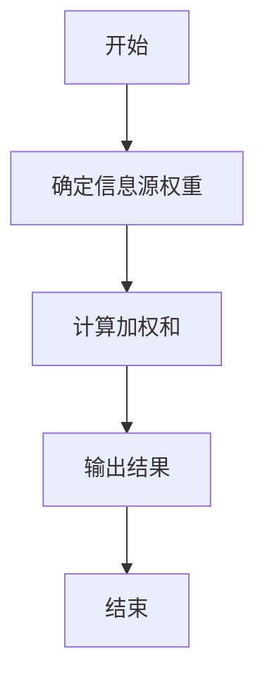
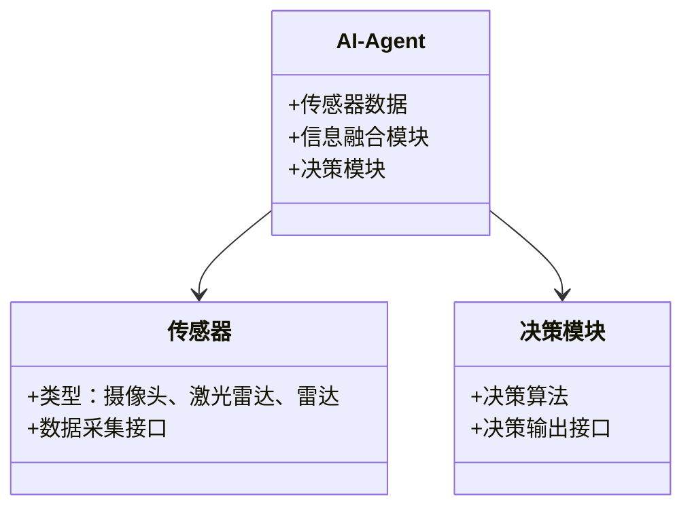
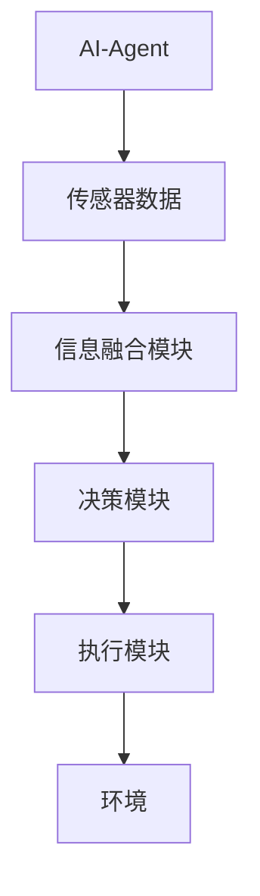

                 


# AI Agent的多源信息融合与决策技术

## 关键词：AI Agent, 多源信息融合, 决策技术, 数据融合, 信息处理, 人工智能

## 摘要：本文深入探讨了AI Agent在多源信息融合与决策技术领域的核心原理与应用。文章从AI Agent的基本概念出发，逐步分析了多源信息融合的必要性与实现方法，详细阐述了基于概率与加权的融合算法，结合实际案例分析了系统的架构设计与实现方案，最后总结了技术应用中的最佳实践与未来发展方向。

---

## 第1章: AI Agent的基本概念与应用背景

### 1.1 AI Agent的定义与核心特征
#### 1.1.1 什么是AI Agent
AI Agent（人工智能代理）是指在计算机系统中能够感知环境、自主决策并执行任务的智能实体。它可以是一个软件程序，也可以是一个物理设备，其核心目标是通过感知和行动来优化特定目标的实现。

#### 1.1.2 AI Agent的核心特征
- **自主性**：AI Agent能够在没有外部干预的情况下自主执行任务。
- **反应性**：能够实时感知环境变化并做出相应反应。
- **目标导向性**：所有行为都围绕实现特定目标展开。
- **学习能力**：通过数据与经验不断优化自身的决策能力。

#### 1.1.3 AI Agent的应用场景
AI Agent广泛应用于自动驾驶、智能助手、机器人控制、智能推荐系统等领域。例如，自动驾驶汽车通过传感器融合技术实时感知环境并做出驾驶决策，就是一个典型的AI Agent应用。

---

## 第2章: 多源信息融合的背景与意义

### 2.1 多源信息融合的背景
在现代AI系统中，单一信息源往往无法提供足够的信息支持决策。例如，在自动驾驶系统中，单一的摄像头信息可能不足以识别复杂的交通场景，需要结合激光雷达、雷达、GPS等多种信息源进行融合。

### 2.2 多源信息融合的意义
- **提高决策的准确性**：通过融合多个信息源的数据，可以有效减少信息的不确定性。
- **增强系统的鲁棒性**：单一信息源的故障可以通过其他信息源的数据进行补偿。
- **提升系统的智能化水平**：多源信息融合使AI Agent能够更好地理解复杂环境。

---

## 第3章: 多源信息融合的核心技术

### 3.1 多源信息融合的分类
多源信息融合可以按照信息的类型、融合的层次和应用场景进行分类：
- **按信息类型**：分为结构化数据融合、非结构化数据融合等。
- **按融合层次**：分为数据级融合、特征级融合和决策级融合。
- **按应用场景**：分为实时融合、离线融合等。

### 3.2 基于概率的多源信息融合方法
#### 3.2.1 概率融合的基本原理
概率融合方法通过计算各个信息源的概率分布，结合贝叶斯定理进行信息的综合。例如，D-S证据理论是一种常用的概率融合方法，其基本公式如下：
$$
Bel(a) = \sum_{A \subseteq \Omega, a \in A} w(A)
$$
其中，$Bel(a)$表示命题$a$的置信度，$w(A)$表示子集$A$的权重。

#### 3.2.2 D-S证据理论的应用
D-S证据理论通过计算信息源的权重和冲突度，实现多个信息源的融合。例如，在自动驾驶系统中，多个传感器的数据可以通过D-S证据理论进行融合，以提高目标检测的准确性。

#### 3.2.3 贝叶斯网络的融合方法
贝叶斯网络是一种基于概率图模型的融合方法，通过构建概率图模型来描述各个信息源之间的依赖关系。例如，在智能助手系统中，用户的意图可以通过贝叶斯网络进行建模和融合。

### 3.3 基于加权的多源信息融合方法
#### 3.3.1 加权融合的原理
加权融合方法通过对各个信息源分配不同的权重，实现信息的综合。权重的分配通常基于信息源的可靠性和准确性。例如，信息源的权重可以通过以下公式计算：
$$
w_i = \frac{1}{1 + \sum_{j \neq i} d_{ij}}
$$
其中，$d_{ij}$表示信息源$i$和$j$之间的距离。

#### 3.3.2 加权融合的优势与局限
加权融合的优势在于能够根据信息源的质量动态调整权重，但其局限性在于如何确定权重的分配策略。

---

## 第4章: 多源信息融合的算法实现

### 4.1 D-S证据理论的实现步骤
1. **计算基本概率分配**：为每个信息源分配基本概率分配。
2. **计算冲突度**：通过冲突度公式计算信息源之间的冲突程度。
3. **融合证据**：通过D-S公式进行证据融合，得到最终的置信度。

#### 4.1.1 D-S证据理论的冲突度计算
冲突度可以通过以下公式计算：
$$
K = \sum_{A \subseteq \Omega, A \neq \emptyset} w(A)
$$

#### 4.1.2 D-S证据理论的融合公式
$$
Bel(a) = \frac{w(a)}{K}
$$

### 4.2 加权融合算法的实现
1. **确定信息源的权重**：根据信息源的可靠性和准确性确定权重。
2. **计算加权和**：通过对各个信息源进行加权求和，得到最终的融合结果。

#### 4.2.1 加权融合算法的流程图


---

## 第5章: AI Agent的决策模型与优化

### 5.1 决策模型的构建
#### 5.1.1 决策树的构建方法
决策树是一种常用的决策模型，通过构建树状结构来表示决策过程。例如，在自动驾驶系统中，可以通过决策树来表示不同的驾驶场景和决策逻辑。

#### 5.1.2 马尔可夫决策过程的应用
马尔可夫决策过程（MDP）是一种基于概率的决策模型，广泛应用于机器人控制和智能助手系统中。

#### 5.1.3 决策模型的评估指标
决策模型的评估指标包括准确率、召回率、F1值等。

### 5.2 决策优化的策略
#### 5.2.1 基于强化学习的优化方法
强化学习是一种常用的决策优化方法，通过不断试错和奖励机制来优化决策策略。

#### 5.2.2 基于遗传算法的优化策略
遗传算法是一种基于生物进化原理的优化方法，可以通过交叉和变异操作来优化决策模型。

---

## 第6章: 系统架构与实现方案

### 6.1 系统架构设计
#### 6.1.1 系统功能模块划分
- **信息采集模块**：负责采集多源信息。
- **信息融合模块**：负责对信息进行融合处理。
- **决策模块**：负责根据融合后的信息做出决策。
- **执行模块**：负责执行决策结果。

#### 6.1.2 领域模型类图


### 6.2 系统架构图


---

## 第7章: 项目实战

### 7.1 环境安装
- **安装Python**：确保Python版本为3.8以上。
- **安装依赖库**：安装numpy、pandas、scikit-learn等依赖库。

### 7.2 核心代码实现
```python
import numpy as np
from sklearn.metrics import accuracy_score

# 多源信息融合算法
def weighted_fusion(data, weights):
    return np.dot(data, weights)

# 决策模型
class DecisionModel:
    def __init__(self, weights):
        self.weights = weights
    
    def predict(self, data):
        return np.argmax(weighted_fusion(data, self.weights))
```

### 7.3 案例分析
在自动驾驶系统中，可以通过多源信息融合算法对传感器数据进行融合，然后通过决策模型做出驾驶决策。

---

## 第8章: 总结与展望

### 8.1 最佳实践
- 在实际应用中，建议结合具体场景选择合适的融合算法。
- 定期对系统进行优化和更新，以适应环境的变化。

### 8.2 小结
本文系统地介绍了AI Agent的多源信息融合与决策技术，从理论到实践，为读者提供了全面的指导。

### 8.3 注意事项
- 在实际应用中，需要充分考虑信息源的可靠性和准确性。
- 确保系统的安全性和隐私保护。

### 8.4 拓展阅读
- 《Multi-Source Data Fusion in AI Systems》
- 《Probabilistic Reasoning in AI》

---

通过本文的详细讲解，读者可以全面掌握AI Agent的多源信息融合与决策技术的核心原理与实现方法，为后续的深入研究和实际应用奠定坚实基础。

