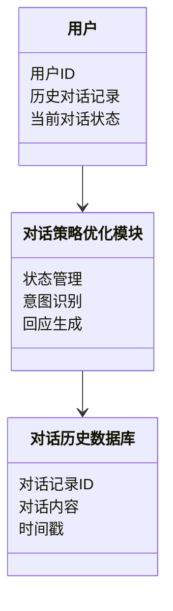
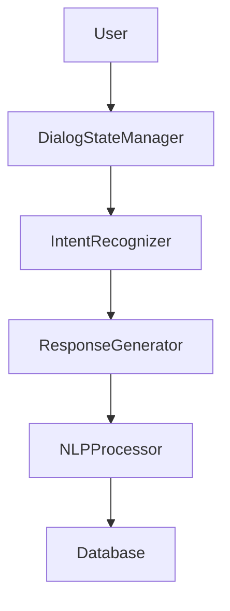
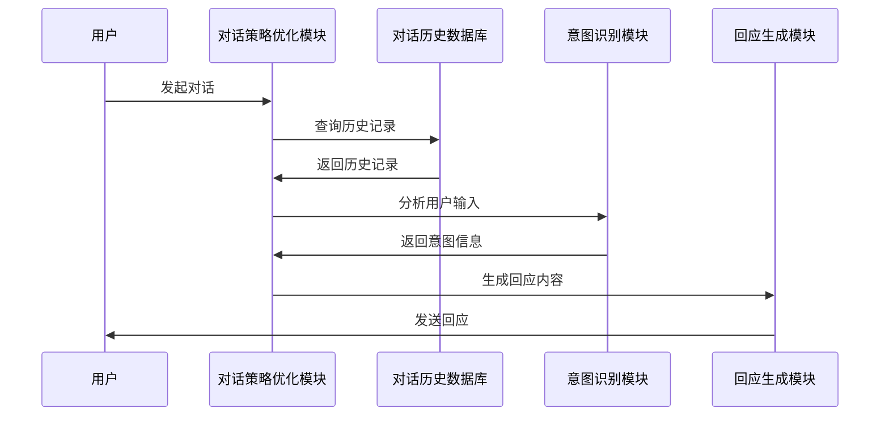

                 


# AI Agent的对话策略优化：提升用户体验

> **关键词**：AI Agent、对话策略优化、用户体验、自然语言处理、强化学习

> **摘要**：  
本文深入探讨了AI Agent的对话策略优化方法，分析了如何通过优化对话策略提升用户体验。文章从对话策略优化的背景、核心概念、算法原理、系统架构设计、项目实战等多个维度展开，结合实际案例和代码实现，详细阐述了如何通过强化学习、统计模型等方法实现对话策略的优化，最终帮助AI Agent在实际应用中提供更流畅、更智能的对话体验。

---

## 第一部分: AI Agent与对话策略优化概述

### 第1章: AI Agent与对话策略优化概述

#### 1.1 AI Agent的基本概念
AI Agent（人工智能代理）是指能够感知环境、自主决策并执行任务的智能实体。在对话场景中，AI Agent通常以自然语言处理技术为基础，通过理解和生成人类语言来与用户进行交互。

- **1.1.1 什么是AI Agent**  
AI Agent是一种能够执行特定任务的智能系统，它能够通过感知环境信息做出决策，并通过执行动作来实现目标。在对话系统中，AI Agent的核心功能是理解用户意图、生成自然的对话内容，并根据对话上下文调整交互策略。

- **1.1.2 AI Agent的应用场景**  
AI Agent广泛应用于智能客服、语音助手、智能聊天机器人等领域。例如，用户通过语音指令控制智能音箱播放音乐，或者通过文字与智能客服进行问题咨询。

- **1.1.3 对话策略在AI Agent中的重要性**  
对话策略是AI Agent实现高效交互的核心，它决定了系统在对话过程中如何选择下一步的回应内容和方式。一个优秀的对话策略能够显著提升用户体验，降低对话失败率。

---

#### 1.2 对话策略优化的目标
对话策略优化的目标是通过改进AI Agent的交互能力，使其能够更自然、更高效地与用户进行对话。具体目标包括：

- **1.2.1 提升用户体验的核心要素**  
用户体验是对话策略优化的核心目标。通过优化对话策略，可以提升对话的流畅性、准确性和个性化。

- **1.2.2 对话流畅性与准确性**  
流畅性指对话过程中的自然程度，准确性指系统对用户意图的理解和回应的正确性。这两者共同决定了用户对AI Agent的满意度。

- **1.2.3 个性化与情境适应性**  
个性化是指根据用户的偏好和历史行为调整对话策略，情境适应性则是指根据对话场景的变化动态调整策略。

---

#### 1.3 本章小结
本章通过介绍AI Agent的基本概念和对话策略优化的重要性，为后续的优化方法奠定了基础。接下来，我们将深入探讨对话策略优化的核心理论和算法原理。

---

## 第二部分: 对话策略优化的核心概念与理论基础

### 第2章: 对话策略优化的理论基础

#### 2.1 对话管理理论
对话管理是对话策略优化的核心理论之一。它研究如何在对话过程中协调和控制对话的进展。

- **2.1.1 对话管理的基本概念**  
对话管理是指系统在对话过程中，根据当前对话状态和用户输入，选择合适的回应内容和方式的过程。

- **2.1.2 基于状态的对话管理**  
基于状态的对话管理通过维护对话状态（如当前话题、用户意图等），根据状态的变化选择下一步的对话动作。

- **2.1.3 基于规则的对话管理**  
基于规则的对话管理通过预定义的规则来指导对话的进行。例如，当用户提到“天气”，系统会自动切换到天气相关的对话模块。

#### 2.2 自然语言处理与对话策略
自然语言处理（NLP）技术是对话策略优化的重要工具，它帮助系统理解用户意图并生成自然的回应。

- **2.2.1 NLP在对话中的应用**  
NLP技术包括分词、句法分析、意图识别、情感分析等，这些技术为对话策略优化提供了技术支持。

- **2.2.2 基于意图的理解策略**  
意图理解是对话策略优化的关键环节。通过分析用户的输入内容，系统能够准确识别用户的意图，并根据意图选择合适的回应策略。

- **2.2.3 对话上下文的构建与维护**  
对话上下文是指对话过程中积累的信息，如用户的历史输入、当前对话状态等。通过对上下文的维护，系统能够更好地理解用户的需求，并提供更精准的回应。

#### 2.3 对话策略优化的评价指标
为了衡量对话策略优化的效果，我们需要引入一些评价指标。

- **2.3.1 对话准确率**  
对话准确率是指系统对用户意图识别的正确率。准确率越高，对话策略优化的效果越好。

- **2.3.2 对话流畅性**  
对话流畅性指对话过程中的自然程度。流畅的对话能够显著提升用户体验。

- **2.3.3 用户满意度**  
用户满意度是对话策略优化的最终目标。通过优化对话策略，可以显著提高用户的满意度。

#### 2.4 本章小结
本章从对话管理理论和自然语言处理技术两个方面，探讨了对话策略优化的理论基础。接下来，我们将深入探讨对话策略优化的算法原理。

---

## 第三部分: 对话策略优化的算法原理

### 第3章: 对话策略优化的算法原理

#### 3.1 基于规则的对话策略
基于规则的对话策略是一种简单但有效的优化方法。

- **3.1.1 规则的制定与优化**  
基于规则的策略通过预定义规则来指导对话的进行。例如，当用户提到“天气”，系统会自动切换到天气相关的对话模块。

- **3.1.2 规则的局限性与改进方向**  
基于规则的策略虽然简单，但其灵活性较低。在面对复杂对话场景时，规则可能会显得力不从心。为了克服这一问题，可以通过引入强化学习等方法对规则进行动态优化。

#### 3.2 基于统计的对话策略
基于统计的对话策略通过分析历史对话数据，找到最优的回应策略。

- **3.2.1 统计模型的基本原理**  
基于统计的对话策略通常采用概率模型，通过分析用户输入的概率分布，选择最可能的回应。

- **3.2.2 基于概率的对话选择**  
通过计算每个可能回应的概率值，系统会选择概率最高的回应。

- **3.2.3 统计模型的优缺点**  
统计模型的优点是灵活性高，能够适应复杂的对话场景。缺点是需要大量的训练数据，且模型的解释性较差。

#### 3.3 基于强化学习的对话策略
基于强化学习的对话策略是一种更高级的优化方法，能够通过与环境的交互不断改进策略。

- **3.3.1 强化学习的基本概念**  
强化学习是一种通过试错方式优化策略的机器学习方法。在对话场景中，强化学习通过与用户的交互，不断优化对话策略。

- **3.3.2 在对话策略优化中的应用**  
通过定义合适的奖励函数，强化学习可以有效优化对话策略。例如，当用户对某个回应表示满意时，系统会获得正向奖励；反之则获得负向奖励。

- **3.3.3 算法实现的数学模型**  
强化学习的核心是马尔可夫决策过程（MDP）。以下是马尔可夫决策过程的数学模型：

$$
\begin{aligned}
&\text{状态空间：} S \\
&\text{动作空间：} A \\
&\text{转移概率：} P(s' | s, a) \\
&\text{奖励函数：} R(s, a) \\
\end{aligned}
$$

---

#### 3.4 对话策略优化算法对比
为了更好地理解不同对话策略的优缺点，我们可以将基于规则、基于统计和基于强化学习的策略进行对比。

**对比表格：**

| 对比维度 | 基于规则 | 基于统计 | 基于强化学习 |
|----------|----------|----------|--------------|
| 灵活性    | 低       | 高       | 高            |
| 需要数据  | 无       | 需要大量 | 需要少量     |
| 解释性    | 高       | 低       | 低            |

---

#### 3.5 本章小结
本章详细探讨了对话策略优化的三种主要算法：基于规则的策略、基于统计的策略和基于强化学习的策略。每种策略都有其优缺点，实际应用中需要根据具体场景选择合适的策略。

---

## 第四部分: 对话策略优化的系统分析与架构设计

### 第4章: 对话策略优化的系统架构设计

#### 4.1 问题场景介绍
在实际应用中，对话策略优化需要考虑以下问题：

- 用户需求多样，对话场景复杂。
- 对话数据量大，需要高效的处理能力。
- 对话策略需要动态调整，以适应用户反馈。

#### 4.2 系统功能设计
以下是对话策略优化系统的功能模块设计：

**领域模型类图（Mermaid）：**



---

#### 4.3 系统架构设计
以下是系统的整体架构设计：

**系统架构图（Mermaid）：**



---

#### 4.4 系统交互设计
以下是系统交互的序列图：

**系统交互序列图（Mermaid）：**



---

#### 4.5 本章小结
本章通过系统架构设计和交互设计，展示了如何将对话策略优化算法应用于实际系统中。接下来，我们将通过一个具体的项目实战，进一步验证这些设计的可行性和效果。

---

## 第五部分: 对话策略优化的项目实战

### 第5章: 对话策略优化的项目实战

#### 5.1 项目介绍
我们选择一个智能客服优化项目作为实战案例。通过优化对话策略，提升客服机器人的用户体验。

#### 5.2 环境搭建
以下是项目所需的环境和工具：

- **编程语言**：Python 3.8+
- **框架**：TensorFlow 2.0+
- **NLP库**：spaCy 3.0+
- **数据库**：MySQL 8.0+

#### 5.3 系统核心实现源代码
以下是对话策略优化模块的核心代码：

```python
class DialogStrategyOptimizer:
    def __init__(self):
        self.state = "init"
        self.response_map = {
            "init": "欢迎光临，请问您需要什么帮助？",
            "weather": "请问您想了解哪个城市的天气？",
            "intent_not_understood": "抱歉，我未能理解您的意图，请重新描述您的需求。",
        }

    def optimize_strategy(self, user_input):
        # 分析用户输入
        intent = self.intentRecognizer(user_input)
        # 根据意图选择回应策略
        if intent == "weather":
            self.state = "weather"
            return self.response_map["weather"]
        elif intent == "other":
            self.state = "intent_not_understood"
            return self.response_map["intent_not_understood"]
        else:
            return self.response_map["init"]

    def intentRecognizer(self, user_input):
        # 简单的意图识别逻辑
        if "天气" in user_input:
            return "weather"
        else:
            return "other"
```

---

#### 5.4 代码应用解读与分析
上述代码实现了一个简单的对话策略优化模块。当用户输入与“天气”相关的内容时，系统会切换到“weather”状态，并生成相应的回应。

---

#### 5.5 实际案例分析
通过实际案例分析，我们可以看到对话策略优化的效果。例如，当用户输入“北京天气怎么样？”时，系统会识别出用户的意图是查询天气，并生成“请问您想了解哪个城市的天气？”的回应。

---

#### 5.6 项目小结
本章通过一个具体的项目实战，展示了如何将对话策略优化算法应用于实际系统中。通过代码实现和案例分析，我们验证了优化策略的有效性。

---

## 第六部分: 对话策略优化的最佳实践与扩展阅读

### 第6章: 最佳实践与注意事项

#### 6.1 最佳实践
- **持续优化**：对话策略需要根据用户反馈和数据不断优化。
- **结合多种算法**：在实际应用中，可以结合基于规则和强化学习等多种算法，以提升策略的灵活性和准确性。
- **注重用户体验**：对话策略优化的核心目标是提升用户体验，因此在设计策略时需要充分考虑用户的需求和感受。

#### 6.2 注意事项
- **数据质量**：对话策略优化依赖于高质量的数据，因此需要确保训练数据的多样性和代表性。
- **模型解释性**：复杂的模型可能难以解释，因此在实际应用中需要注意模型的可解释性。
- **安全性**：对话系统需要保护用户隐私，确保数据的安全性。

#### 6.3 扩展阅读
- **推荐书籍**：《自然语言处理实战：基于Python的机器学习和深度学习》
- **推荐论文**：《End-to-End Neural Networks for Dialogue Systems》
- **推荐工具库**：Hugging Face的Transformers库

---

## 第七部分: 总结

### 7.1 总结与展望
通过对AI Agent对话策略优化的深入探讨，我们了解了对话策略优化的核心概念、算法原理和系统设计方法。对话策略优化是提升用户体验的关键技术，随着NLP和强化学习技术的不断发展，对话策略优化将变得更加智能化和个性化。

---

通过本文的系统讲解和实战案例，读者可以全面掌握AI Agent对话策略优化的核心技术，并在实际项目中灵活应用这些方法，不断提升用户体验。

