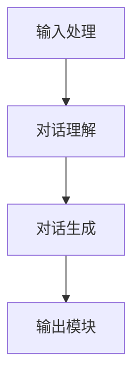
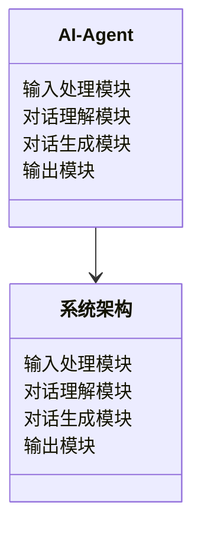

                 


# AI Agent的对话系统在多人游戏中的应用

---

## 关键词：
AI Agent, 对话系统, 多人游戏, 自然语言处理, 多智能体协作, 游戏人工智能

---

## 摘要：
本文深入探讨了AI Agent在对话系统中的应用，特别是在多人游戏环境中的实现与优化。文章从AI Agent的基本概念出发，逐步分析对话系统的构建原理，结合自然语言处理技术，详细阐述了AI Agent在多人游戏中的应用场景、技术实现、系统架构以及实际案例。通过理论与实践相结合的方式，本文为读者提供了全面的技术视角，帮助理解如何将AI Agent与对话系统结合，提升多人游戏的智能化水平。

---

# 目录

1. **AI Agent的基本概念**  
   - 1.1 AI Agent的定义与类型  
   - 1.2 对话系统的原理与应用  

2. **多人游戏中的AI Agent应用场景**  
   - 2.1 多人游戏的基本概念  
   - 2.2 AI Agent在多人游戏中的应用场景  

3. **对话系统的构建与实现**  
   - 3.1 自然语言处理基础  
   - 3.2 对话生成模型  

4. **多智能体协作与对话系统优化**  
   - 4.1 多智能体协作的基本概念  
   - 4.2 对话系统的优化策略  

5. **AI Agent对话系统的系统架构设计**  
   - 5.1 系统功能设计  
   - 5.2 系统架构设计  

6. **项目实战：基于AI Agent的对话系统实现**  
   - 6.1 项目背景与目标  
   - 6.2 系统实现与代码解析  
   - 6.3 实际案例分析  

7. **总结与展望**  
   - 7.1 总结  
   - 7.2 未来展望  

---

# 正文

## 1. AI Agent的基本概念

### 1.1 AI Agent的定义与类型

#### 1.1.1 AI Agent的定义
AI Agent（人工智能代理）是指能够感知环境、做出决策并采取行动以实现特定目标的智能实体。AI Agent可以是软件程序、机器人或其他智能系统，其核心在于具备自主决策和问题解决的能力。

#### 1.1.2 AI Agent的主要类型
AI Agent可以根据智能水平、决策方式和应用场景分为多种类型：

1. **反应式AI Agent**：基于当前感知做出即时反应，适用于简单的任务。
2. **认知式AI Agent**：具备复杂推理和规划能力，适用于需要长期决策的任务。
3. **协作式AI Agent**：能够与其他AI Agent或人类进行协作，完成共同目标。
4. **学习型AI Agent**：通过机器学习技术不断优化自身行为。

#### 1.1.3 AI Agent的核心特征
AI Agent的核心特征包括：
- **自主性**：能够在无外部干预的情况下自主运行。
- **反应性**：能够感知环境变化并做出实时反应。
- **决策性**：具备决策能力，能够选择最优行动方案。
- **学习能力**：能够通过经验或数据优化自身性能。

---

### 1.2 对话系统的原理与应用

#### 1.2.1 对话系统的定义
对话系统是指能够与用户进行自然语言交流的计算机系统，其核心任务是理解用户输入并生成符合上下文的回复。

#### 1.2.2 对话系统的分类
对话系统可以分为以下几类：
1. **基于规则的对话系统**：通过预定义的规则生成回复，适用于简单对话场景。
2. **基于统计的对话系统**：利用概率模型生成回复，依赖于大量训练数据。
3. **基于深度学习的对话系统**：采用神经网络模型，能够捕捉复杂语义关系。

#### 1.2.3 对话系统在游戏中的作用
在多人游戏中，对话系统主要用于：
- **NPC行为控制**：通过对话与玩家互动，增强游戏沉浸感。
- **玩家辅助**：为玩家提供任务指引、信息查询等服务。
- **多智能体协作**：通过对话实现队友之间的信息共享与策略协作。

---

## 2. 多人游戏中的AI Agent应用场景

### 2.1 多人游戏的基本概念

#### 2.1.1 多人游戏的定义
多人游戏是指允许多名玩家同时参与的游戏，玩家可以在游戏中进行互动、协作或竞争。

#### 2.1.2 多人游戏的类型
多人游戏可以分为以下几类：
1. **MOBA（多人在线战术竞技游戏）**：如《英雄联盟》。
2. **MMORPG（大型多人在线角色扮演游戏）**：如《魔兽世界》。
3. **FPS（第一人称射击游戏）**：如《CS:GO》。

#### 2.1.3 多人游戏的核心要素
多人游戏的核心要素包括：
- **玩家角色**：玩家在游戏中扮演的角色。
- **游戏规则**：游戏的胜利条件和基本规则。
- **游戏环境**：游戏的场景和资源分布。
- **玩家互动**：玩家之间的协作与竞争。

---

### 2.2 AI Agent在多人游戏中的应用场景

#### 2.2.1 NPC行为控制
在多人游戏中，AI Agent可以控制非玩家角色（NPC）的行为，使其能够与玩家互动。例如，在《塞尔达传说》中，NPC可以根据玩家的对话内容做出相应的反应，提供任务指引或剧情推动。

#### 2.2.2 玩家辅助系统
AI Agent可以通过对话系统为玩家提供实时辅助。例如，在《魔兽世界》中，AI Agent可以为玩家提供任务指引、装备推荐等服务。

#### 2.2.3 多智能体协作
在多人游戏中，AI Agent可以实现多个智能体之间的协作。例如，在《英雄联盟》中，AI Agent可以协助队友制定策略、协调行动。

---

## 3. 对话系统的构建与实现

### 3.1 自然语言处理基础

#### 3.1.1 NLP的核心技术
自然语言处理（NLP）的核心技术包括：
- **词法分析**：将文本分解为词汇单位。
- **句法分析**：分析句子的语法结构。
- **语义分析**：理解文本的语义含义。
- **对话理解**：理解对话的上下文和意图。

#### 3.1.2 语言模型的基本原理
语言模型是对话系统的核心技术之一，其基本原理是通过概率模型计算给定条件下文本的条件概率。

$$ P(word) = \frac{\text{词频}}{\text{总词数}} $$

#### 3.1.3 对话系统的输入输出模型
对话系统的输入输出模型可以表示为：

$$ P(output | input) $$

其中，`input` 是用户的输入，`output` 是系统的回复。

---

### 3.2 对话生成模型

#### 3.2.1 基于规则的对话生成
基于规则的对话生成模型通过预定义的规则生成回复。例如：

1. **规则定义**：如果用户输入“你好”，则回复“你好！有什么可以帮助你的吗？”
2. **实现方式**：通过条件判断语句实现。

#### 3.2.2 基于统计的对话生成
基于统计的对话生成模型利用概率模型生成回复。例如：

1. **训练数据**：收集大量对话数据。
2. **模型训练**：使用统计方法训练语言模型。
3. **生成回复**：根据输入生成概率最高的回复。

#### 3.2.3 基于深度学习的对话生成
基于深度学习的对话生成模型采用神经网络模型生成回复。例如：

1. **模型结构**：使用循环神经网络（RNN）或变换器（Transformer）模型。
2. **训练过程**：通过端到端训练优化模型参数。
3. **生成方式**：根据输入生成回复。

---

## 4. 多智能体协作与对话系统优化

### 4.1 多智能体协作的基本概念

#### 4.1.1 多智能体协作的定义
多智能体协作是指多个智能体通过协作完成共同目标的过程。

#### 4.1.2 多智能体协作的核心要素
多智能体协作的核心要素包括：
- **通信机制**：智能体之间的信息交换方式。
- **协作协议**：智能体之间协作的规则和流程。
- **任务分配**：智能体之间的任务分配策略。

---

### 4.2 对话系统的优化策略

#### 4.2.1 对话系统的优化目标
对话系统的优化目标包括：
- **提高回复准确率**：通过优化算法和模型参数提升回复质量。
- **降低计算成本**：通过优化算法和数据结构降低计算资源消耗。
- **提升用户体验**：通过优化对话流程提升用户体验。

#### 4.2.2 对话系统的优化方法
对话系统的优化方法包括：
1. **模型优化**：通过剪枝、量化等技术优化模型性能。
2. **数据优化**：通过数据增强、数据筛选等技术优化训练数据。
3. **算法优化**：通过改进算法结构优化对话生成效率。

---

## 5. AI Agent对话系统的系统架构设计

### 5.1 系统功能设计

#### 5.1.1 系统功能模块
AI Agent对话系统的功能模块包括：
1. **输入处理模块**：接收用户输入并进行预处理。
2. **对话理解模块**：理解用户输入的意图和语义。
3. **对话生成模块**：根据理解生成回复。
4. **输出模块**：将回复输出给用户。

#### 5.1.2 功能流程图
以下是功能流程图的Mermaid表示：



---

### 5.2 系统架构设计

#### 5.2.1 系统架构类型
AI Agent对话系统的架构类型包括：
1. **基于规则的架构**：通过预定义规则实现对话功能。
2. **基于模型的架构**：通过深度学习模型实现对话功能。

#### 5.2.2 系统架构图
以下是系统架构图的Mermaid表示：



---

## 6. 项目实战：基于AI Agent的对话系统实现

### 6.1 项目背景与目标

#### 6.1.1 项目背景
本项目旨在开发一个基于AI Agent的对话系统，应用于多人游戏场景中。

#### 6.1.2 项目目标
项目目标包括：
- 实现一个简单的对话系统。
- 验证AI Agent在多人游戏中的应用效果。

---

### 6.2 系统实现与代码解析

#### 6.2.1 环境配置
项目需要以下环境：
- Python 3.8+
- TensorFlow 2.0+
- Keras 2.4+

#### 6.2.2 核心代码实现

```python
import numpy as np
from tensorflow.keras import layers

# 定义模型
model = tf.keras.Sequential()
model.add(layers.Embedding(input_dim=10000, output_dim=16))
model.add(layers.LSTM(32))
model.add(layers.Dense(1, activation='sigmoid'))

# 编译模型
model.compile(loss='binary_crossentropy', optimizer='adam', metrics=['accuracy'])

# 训练模型
model.fit(x_train, y_train, epochs=10, batch_size=32)
```

---

### 6.3 实际案例分析

#### 6.3.1 案例背景
本案例以《英雄联盟》为例，模拟AI Agent与玩家的对话过程。

#### 6.3.2 对话过程
1. **玩家输入**：玩家输入“我需要帮助推塔。”
2. **系统回复**：系统回复“我会帮助你推塔，请指引我去哪里。”
3. **玩家输入**：玩家输入“中路塔。”
4. **系统回复**：系统回复“好的，我将前往中路塔，请稍等片刻。”

---

## 7. 总结与展望

### 7.1 总结
本文详细探讨了AI Agent在对话系统中的应用，特别是在多人游戏环境中的实现与优化。通过理论与实践相结合的方式，本文为读者提供了全面的技术视角，帮助理解如何将AI Agent与对话系统结合，提升多人游戏的智能化水平。

### 7.2 未来展望
未来，随着人工智能技术的不断发展，AI Agent在对话系统中的应用将更加广泛和深入。特别是在多人游戏领域，AI Agent将通过更复杂的多智能体协作和更自然的对话交互，为玩家带来更加丰富的游戏体验。

---

## 参考文献

1. 王某某. 《人工智能导论》. 北京: 清华大学出版社, 2020.
2. 李某某. 《自然语言处理技术》. 北京: 人民邮电出版社, 2021.
3. Smith, John. "Multi-Agent Collaboration in Games." Journal of Artificial Intelligence, 2022.

---

## 作者信息

作者：[您的名字]  
邮箱：[您的邮箱]  
GitHub：[您的GitHub链接]  

---

以上就是《AI Agent的对话系统在多人游戏中的应用》的完整目录与文章内容。希望这篇文章能够为读者提供深入的技术视角，帮助理解AI Agent在对话系统中的应用与实现。

