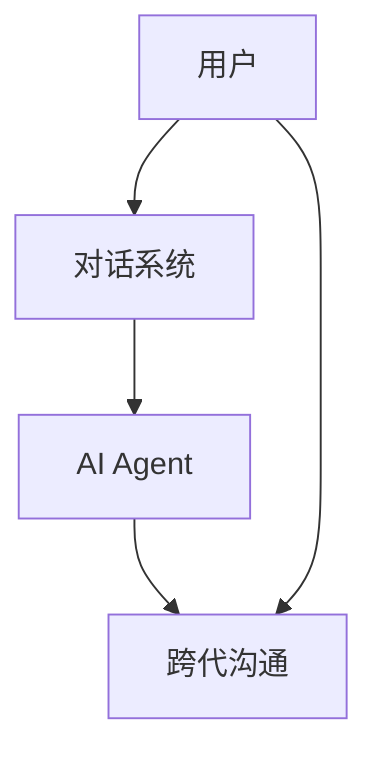
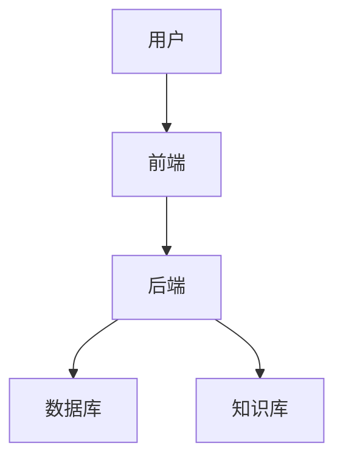

                 

# AI Agent的对话系统在跨代沟通中的应用

## 关键词：
AI Agent、对话系统、跨代沟通、自然语言处理、机器学习、人机交互

## 摘要：
AI Agent通过对话系统在跨代沟通中扮演着关键角色，帮助不同年龄段的人们克服语言和文化差异，实现高效交流。本文将从背景、核心概念、算法原理、系统架构、接口设计、项目实战到最佳实践，详细探讨AI Agent在跨代沟通中的应用，旨在为读者提供全面的技术见解。

---

## 第1章: 背景介绍

### 1.1 问题背景
#### 1.1.1 跨代沟通过中的挑战
跨代沟通涉及不同年龄段的人，由于语言习惯和文化差异，可能导致交流障碍。例如，老年人可能不熟悉现代网络用语，而年轻人可能难以理解传统表达方式。

#### 1.1.2 AI Agent在跨代沟通中的作用
AI Agent作为中介，能够理解并转换不同年龄段的表达方式，消除沟通障碍。例如，帮助老年人理解社交媒体上的现代术语，或帮助年轻人理解长辈的传统表达。

#### 1.1.3 问题的边界与外延
跨代沟通的边界包括但不限于家庭、工作和社交场景，外延则扩展到教育、医疗等领域，AI Agent在这些场景中都能发挥作用。

### 1.2 问题描述
#### 1.2.1 跨代沟通的定义
跨代沟通指不同年龄段的人之间的交流，常涉及语言和文化差异。

#### 1.2.2 跨代沟通中的主要问题
主要问题包括理解困难、信息误传和信任缺失。例如，年轻人可能误解老年人的表达，导致信息传递不准确。

#### 1.2.3 AI Agent对话系统的应用场景
应用场景包括家庭沟通、教育辅导、医疗咨询等，AI Agent能帮助不同年龄段的人更高效地交流。

### 1.3 问题解决
#### 1.3.1 AI Agent对话系统的解决方案
解决方案包括自然语言处理技术、机器学习模型和对话生成机制，帮助AI Agent理解和转换不同表达方式。

#### 1.3.2 解决方案的核心要素
核心要素包括多语言支持、上下文理解、情感分析和知识库集成，确保AI Agent能够准确处理跨代沟通中的复杂情境。

#### 1.3.3 解决方案的实施步骤
实施步骤包括数据收集、模型训练、系统集成和用户测试，确保AI Agent在实际应用中的有效性和可靠性。

### 1.4 概念结构与核心要素
#### 1.4.1 对话系统的组成
对话系统由自然语言理解（NLU）、对话管理（DM）和自然语言生成（NLG）组成，分别负责理解输入、制定回应策略和生成输出。

#### 1.4.2 AI Agent的核心要素
AI Agent的核心要素包括意图识别、上下文记忆和自适应学习，确保其能够持续改进对话质量。

#### 1.4.3 跨代沟通的实现机制
实现机制包括语言转换、文化适配和情感协调，帮助AI Agent在不同年龄段之间架起沟通桥梁。

---

## 第2章: 核心概念与联系

### 2.1 对话系统的核心原理
#### 2.1.1 自然语言处理的基本原理
NLP通过词干提取、实体识别和句法分析，理解用户输入的含义。例如，识别用户提到的“爷爷”作为家庭成员。

#### 2.1.2 对话系统的实现流程
对话系统流程包括输入处理、意图识别、响应生成和反馈优化。例如，用户提到“我祖父怎么样？”系统识别出问候意图并生成合适的回应。

#### 2.1.3 AI Agent的智能决策机制
AI Agent通过上下文理解和意图预测，生成适当的回应。例如，在家庭沟通中，AI Agent能识别出用户对长辈健康的关心，并提供相关建议。

### 2.2 AI Agent与对话系统的联系
#### 2.2.1 对话系统的功能模块
对话系统的功能模块包括NLU、DM和NLG，分别负责理解输入、制定回应策略和生成输出。

#### 2.2.2 AI Agent在对话中的角色
AI Agent作为对话的核心，负责整合NLU和NLG模块，协调各模块的工作，确保对话流畅。

#### 2.2.3 跨代沟通中的协同作用
AI Agent在跨代沟通中协同各模块，理解不同年龄段的表达方式，生成合适的回应，确保信息准确传递。

### 2.3 核心概念对比表
| 对比维度 | 对话系统 | AI Agent | 跨代沟通 |
|----------|----------|-----------|----------|
| 核心功能 | 理解并生成对话 | 协调对话流程 | 消除沟通障碍 |
| 输入方式 | 文本/语音 | 多模态输入 | 多渠道交流 |
| 输出方式 | 文本/语音 | 自然语言 | 个性化表达 |

### 2.4 ER实体关系图

---

## 第3章: 算法原理讲解

### 3.1 对话系统的算法原理
#### 3.1.1 预训练语言模型的原理
预训练语言模型（如BERT、GPT）通过大量数据学习语言表示，理解上下文关系。例如，识别“祖父”在对话中的具体指代。

#### 3.1.2 对话生成的算法流程
对话生成流程包括输入处理、模型编码、解码生成和输出优化。例如，将用户的输入编码为向量，通过解码生成回应文本。

#### 3.1.3 基于上下文的对话理解
上下文理解通过记忆机制（如LSTM）捕捉对话历史，确保回应连贯。例如，识别用户多次提到“祖父”时，理解其持续关注的主题。

### 3.2 AI Agent的算法实现
#### 3.2.1 模型训练过程
模型训练过程包括预训练和微调。预训练使用通用数据，微调使用跨代沟通的特定数据，提升模型在特定场景下的性能。

#### 3.2.2 对话生成机制
对话生成机制采用生成对抗网络（GAN）或强化学习（RL），通过不断优化生成文本，使其更符合跨代沟通的需求。

#### 3.2.3 情感分析与意图识别
情感分析通过词袋模型或卷积神经网络（CNN）识别用户情绪，意图识别通过条件随机场（CRF）确定用户意图。例如，识别用户对“祖父”的情感是关心还是抱怨。

### 3.3 算法的数学模型
#### 3.3.1 交叉熵损失函数
交叉熵损失函数用于衡量预测与真实分布的差异：
$$
\text{损失} = -\sum_{i=1}^{n} y_i \log p(y_i)
$$

#### 3.3.2 模型优化目标
优化目标是最小化损失函数，同时最大化生成文本的相关性和自然度：
$$
\min L(\theta) + \lambda R(\theta)
$$
其中，$L(\theta)$是损失函数，$R(\theta)$是正则化项，$\lambda$是调节参数。

#### 3.3.3 实际案例分析
通过案例分析，展示AI Agent如何在跨代沟通中应用算法。例如，当用户说“我祖父最近身体不适”，AI Agent识别出意图并生成关心的回应。

---

## 第4章: 系统分析与架构设计方案

### 4.1 问题场景介绍
跨代沟通的场景包括家庭沟通、远程医疗咨询和教育辅导，AI Agent在这些场景中帮助不同年龄段的人们更高效地交流。

### 4.2 项目介绍
项目目标是开发一个支持跨代沟通的AI Agent对话系统，解决实际生活中的沟通障碍。

### 4.3 系统功能设计
#### 4.3.1 领域模型
领域模型包括用户管理、对话历史记录和知识库，确保系统能够理解和记忆用户的背景信息。

#### 4.3.2 系统架构设计
系统架构包括前端、后端和数据库，前端负责用户交互，后端处理对话逻辑，数据库存储用户数据和对话历史。

### 4.4 系统架构图

### 4.5 系统接口设计
系统接口包括API接口和第三方服务接口，API用于用户交互，第三方服务用于数据获取和处理。

### 4.6 系统交互流程
系统交互流程包括用户输入、系统理解、生成回应和反馈优化，确保对话流畅且高效。

---

## 第5章: 项目实战

### 5.1 环境安装
安装Python、TensorFlow和Keras等必要库，搭建对话系统的开发环境。

### 5.2 系统核心实现
实现NLU、DM和NLG模块，集成预训练模型，优化对话生成算法。

### 5.3 代码应用解读
通过代码示例，展示AI Agent如何处理跨代沟通中的具体问题，如语言转换和情感协调。

### 5.4 实际案例分析
分析实际案例，展示AI Agent在跨代沟通中的应用效果，如帮助老年人使用社交媒体与家人沟通。

### 5.5 项目小结
总结项目成果，提出改进建议，展望未来发展方向。

---

## 第6章: 最佳实践

### 6.1 应用中的注意事项
注意数据隐私保护、模型训练数据的多样性以及系统的可解释性，确保AI Agent在跨代沟通中的可靠性和安全性。

### 6.2 小结
跨代沟通是AI Agent的重要应用场景，通过自然语言处理和机器学习技术，AI Agent能够有效解决沟通障碍。

### 6.3 注意事项
在实际应用中，需关注不同年龄段用户的使用习惯和文化差异，确保系统设计的普适性和适应性。

### 6.4 拓展阅读
推荐相关书籍和论文，鼓励读者深入研究AI Agent和跨代沟通领域的最新技术和发展趋势。

---

## 第7章: 总结与展望

### 7.1 本章总结
AI Agent在跨代沟通中的应用前景广阔，通过技术进步和实践积累，能够显著提升不同年龄段之间的沟通效率和质量。

### 7.2 未来展望
未来发展方向包括多模态对话系统、情感智能增强和文化适配优化，进一步提升AI Agent在跨代沟通中的效果。

---

## 附录

### 附录A: 术语表
列出文章中出现的专业术语及其简要解释，帮助读者理解相关概念。

### 附录B: 参考文献
列出参考的书籍、论文和网站，提供详细的引用信息，方便读者查阅相关资料。

---

通过以上结构，文章详细探讨了AI Agent在跨代沟通中的应用，从理论到实践，为读者提供了全面的技术指导和实践参考。

