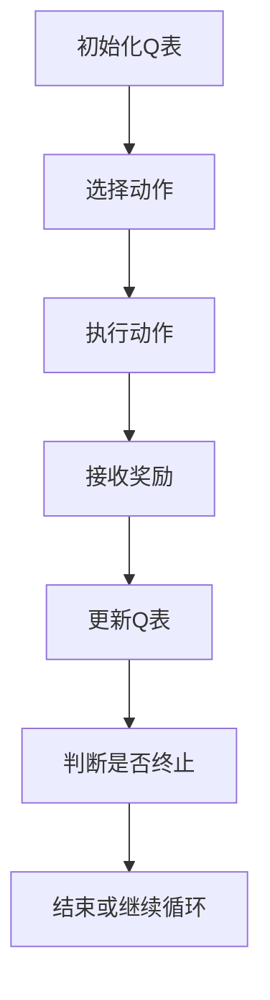

                 


# AI Agent的强化学习在智能调度中的应用

## 关键词
AI Agent, 强化学习, 智能调度, 算法原理, 系统架构, 项目实战

## 摘要
本文系统地探讨了AI Agent结合强化学习在智能调度中的应用。首先，介绍了AI Agent和强化学习的基本概念及其在智能调度中的重要性。接着，详细分析了强化学习的核心算法原理，并通过数学公式和图表展示了这些算法的实现过程。然后，结合实际调度问题，讨论了AI Agent在智能调度中的任务分解与优化方法。最后，通过项目实战部分，指导读者如何实现AI Agent的强化学习模型，并通过具体案例分析展示了其在智能调度中的应用效果。本文旨在为读者提供从理论到实践的全面指导，帮助他们深入理解并掌握AI Agent的强化学习技术在智能调度中的应用。

---

# 目录大纲：《AI Agent的强化学习在智能调度中的应用》

---

## 第一部分：AI Agent与强化学习基础

### 第1章：AI Agent与强化学习概述

#### 1.1 AI Agent的基本概念
- 1.1.1 AI Agent的定义与特点
  - AI Agent是具有感知环境、自主决策和执行任务能力的智能体。
  - 其特点包括自主性、反应性、目标导向和社会性。
- 1.1.2 强化学习的基本概念
  - 强化学习是一种通过与环境交互来学习最优策略的机器学习方法。
  - 核心要素包括状态（State）、动作（Action）、奖励（Reward）和策略（Policy）。
- 1.1.3 AI Agent与强化学习的关系
  - AI Agent提供决策主体，强化学习提供优化策略。

#### 1.2 智能调度的背景与应用
- 1.2.1 智能调度的定义与范围
  - 智能调度是利用AI技术优化资源分配和任务执行的过程。
  - 其范围涵盖电力调度、交通调度、生产调度等多个领域。
- 1.2.2 智能调度的核心问题
  - 包括资源分配的最优化、任务优先级排序和多目标平衡。
- 1.2.3 AI Agent在智能调度中的作用
  - AI Agent通过强化学习实现动态决策和自适应优化。

#### 1.3 本章小结
- 本章介绍了AI Agent和强化学习的基本概念，并分析了智能调度的核心问题及其应用。

---

## 第二部分：强化学习的核心概念与算法原理

### 第2章：强化学习的原理与算法

#### 2.1 强化学习的基本原理
- 2.1.1 状态、动作、奖励的定义
  - 状态（State）：环境的当前情况。
  - 动作（Action）：AI Agent采取的行动。
  - 奖励（Reward）：对动作的反馈，用于指导学习。
- 2.1.2 Q-learning算法的数学模型
  - Q-learning的目标是学习状态-动作对的最优价值。
  - 算法通过迭代更新Q表，公式为：
    $$ Q(s, a) = Q(s, a) + \alpha [r + \gamma \max Q(s', a') - Q(s, a)] $$
- 2.1.3 策略与价值函数的对比
  - 策略直接决定动作，价值函数评估状态的价值。

#### 2.2 基于强化学习的AI Agent设计
- 2.2.1 状态空间与动作空间的构建
  - 状态空间：调度任务的当前状态。
  - 动作空间：可执行的调度动作。
- 2.2.2 奖励函数的设计原则
  - 奖励函数应明确指导优化目标。
- 2.2.3 探索与利用的平衡策略
  - 探索：尝试新动作以发现更好的策略。
  - 利用：根据已知策略采取最优动作。

#### 2.3 算法原理的数学公式
- Q-learning算法的数学推导：
  $$ Q(s, a) = Q(s, a) + \alpha (r + \gamma \max Q(s', a') - Q(s, a)) $$
- Deep Q-Networks的网络结构：
  - 输入层：接收状态信息。
  - 隐藏层：进行特征提取。
  - 输出层：输出每个动作的Q值。

#### 2.4 算法流程图（Mermaid）


---

## 第三部分：AI Agent在智能调度中的应用

### 第3章：智能调度的核心问题分析

#### 3.1 调度问题的建模与优化
- 3.1.1 调度问题的数学模型
  - 建立状态空间、动作空间和目标函数。
- 3.1.2 基于强化学习的调度优化方法
  - 使用强化学习算法优化调度策略。
- 3.1.3 调度问题的边界与外延
  - 考虑资源限制、时间约束和任务依赖。

#### 3.2 AI Agent在智能调度中的任务分解
- 3.2.1 任务分解的基本原则
  - 明确任务目标，合理分配资源。
- 3.2.2 基于强化学习的任务优先级排序
  - 使用强化学习算法动态调整任务优先级。
- 3.2.3 多目标优化的实现方法
  - 使用加权和或 Pareto 优化方法平衡多个目标。

#### 3.3 本章小结
- 本章分析了智能调度的核心问题，并探讨了AI Agent在其中的任务分解与优化方法。

---

## 第四部分：系统架构与实现

### 第4章：智能调度系统的架构设计

#### 4.1 系统功能设计
- 4.1.1 系统功能模块划分
  - 包括状态感知、决策控制、执行反馈等功能模块。
- 4.1.2 各模块之间的交互关系
  - 状态感知模块提供环境信息，决策控制模块基于强化学习算法做出决策，执行反馈模块收集结果并更新Q表。
- 4.1.3 系统功能的实现流程
  - 接收状态信息，选择动作，执行动作，获取奖励，更新Q表。

#### 4.2 系统架构设计
- 4.2.1 分层架构设计
  - 包括感知层、决策层和执行层。
- 4.2.2 模块间的依赖关系
  - 决策层依赖于感知层的状态信息和执行层的反馈信息。
- 4.2.3 系统架构的优化建议
  - 通过异步更新和分布式计算提高效率。

#### 4.3 本章小结
- 本章详细设计了智能调度系统的架构，并分析了各模块的交互关系。

---

## 第五部分：项目实战

### 第5章：AI Agent的强化学习实现

#### 5.1 环境安装与配置
- 安装Python、TensorFlow、OpenAI Gym等依赖库。
  ```bash
  pip install gym numpy tensorflow
  ```

#### 5.2 核心代码实现
- 实现Q-learning算法的Python代码：
  ```python
  import numpy as np
  import gym

  class AI_Agent:
      def __init__(self, env):
          self.env = env
          self.gamma = 0.99
          self.alpha = 0.1
          self.states = env.observation_space.shape[0]
          self.actions = env.action_space.n
          self.Q = np.zeros((self.states, self.actions))

      def choose_action(self, state):
          if np.random.random() < 0.9:  # 探索与利用策略
              return np.argmax(self.Q[state])
          else:
              return np.random.randint(self.actions)

      def update_Q(self, state, action, reward, next_state):
          self.Q[state][action] = self.Q[state][action] + self.alpha * (
              reward + self.gamma * np.max(self.Q[next_state]) - self.Q[state][action]
          )

  # 初始化环境和AI Agent
  env = gym.make('MountainCar-v0')
  agent = AI_Agent(env)
  ```

#### 5.3 代码解读与分析
- `choose_action`方法实现探索与利用策略。
- `update_Q`方法更新Q表，实现强化学习的核心算法。

#### 5.4 实际案例分析
- 使用OpenAI Gym的MountainCar环境进行测试，展示AI Agent如何优化调度策略。

#### 5.5 项目小结
- 本章通过实际项目展示了AI Agent的强化学习实现过程，并分析了其在智能调度中的应用效果。

---

## 第六部分：扩展内容

### 第6章：最佳实践与拓展阅读

#### 6.1 最佳实践 tips
- 合理设计状态和动作空间，优化奖励函数。
- 使用分布式计算和并行训练提高效率。
- 定期更新模型参数，保持模型的适应性。

#### 6.2 小结
- 总结全文内容，强调AI Agent的强化学习在智能调度中的重要性。

#### 6.3 注意事项
- 注意模型的收敛性问题。
- 避免过拟合，保持模型的泛化能力。

#### 6.4 拓展阅读
- 推荐相关书籍和论文，供读者进一步学习。

---

## 附录：AI Agent的强化学习在智能调度中的应用示例代码

```python
import gym
import numpy as np

class AI_Agent:
    def __init__(self, env, gamma=0.99, alpha=0.1):
        self.env = env
        self.gamma = gamma
        self.alpha = alpha
        self.states = env.observation_space.shape[0]
        self.actions = env.action_space.n
        self.Q = np.zeros((self.states, self.actions))

    def choose_action(self, state, epsilon=0.1):
        if np.random.random() < epsilon:
            return np.random.randint(self.actions)
        else:
            return np.argmax(self.Q[state])

    def update_Q(self, state, action, reward, next_state):
        self.Q[state][action] += self.alpha * (
            reward + self.gamma * np.max(self.Q[next_state]) - self.Q[state][action]
        )

# 初始化环境和AI Agent
env = gym.make('CartPole-v1')
agent = AI_Agent(env)

# 训练过程
for episode in range(1000):
    state = env.reset()
    total_reward = 0
    while True:
        action = agent.choose_action(state)
        next_state, reward, done, info = env.step(action)
        agent.update_Q(state, action, reward, next_state)
        total_reward += reward
        state = next_state
        if done:
            break
    print(f"Episode {episode}: Total Reward = {total_reward}")

env.close()
```

---

## 结语

本文系统地探讨了AI Agent的强化学习在智能调度中的应用，从理论到实践，为读者提供了全面的指导。通过详细的算法分析和实际项目实现，帮助读者深入理解并掌握这一技术的核心内容。希望本文能为智能调度领域的研究和应用提供有价值的参考。

