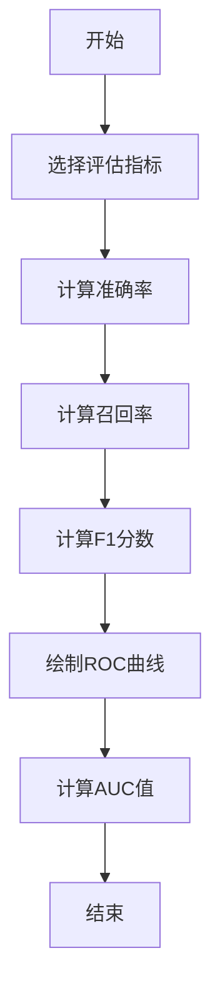
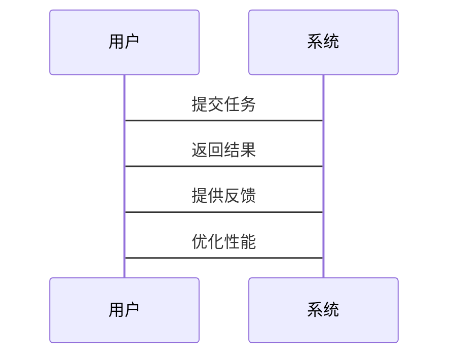

                 


# AI Agent的性能评估指标与方法

> 关键词：AI Agent，性能评估，指标体系，算法原理，系统架构

> 摘要：本文将探讨AI Agent的性能评估方法，涵盖准确性、响应时间、资源消耗等核心指标，并结合实际案例分析，深入解析AI Agent性能评估的数学模型与系统架构设计。

---

## 第1章: AI Agent的背景与基本概念

### 1.1 AI Agent的基本概念
AI Agent（人工智能代理）是指能够感知环境、自主决策并执行任务的智能实体。它结合了感知、推理、学习和行动的能力，广泛应用于智能助手、推荐系统、自动驾驶等领域。

### 1.2 AI Agent的核心特征
AI Agent的核心特征包括自主性、反应性、目标导向和学习能力。这些特征使其能够适应动态环境并完成复杂任务。

### 1.3 AI Agent的应用场景
AI Agent的应用场景涵盖智能助手、推荐系统、自动驾驶、智能客服等领域。例如，智能助手如Siri和Alexa通过自然语言处理技术帮助用户完成日常任务。

---

## 第2章: AI Agent性能评估的核心指标

### 2.1 准确率与召回率
准确率衡量AI Agent输出结果的正确比例，召回率则衡量其识别所有相关结果的能力。两者的结合使用F1分数来平衡准确性和召回率。

公式：
- 准确率 = (TP + TN) / (TP + TN + FP + FN)
- 召回率 = TP / (TP + FN)
- F1分数 = 2 * (准确率 * 召回率) / (准确率 + 召回率)

### 2.2 响应时间与延迟
响应时间是指AI Agent完成任务所需的时间，延迟则影响用户体验。优化算法和架构设计可以降低响应时间和延迟。

### 2.3 资源消耗与效率
资源消耗包括计算资源和存储资源，效率则衡量AI Agent在有限资源下的表现。通过优化算法和架构，可以降低资源消耗并提高效率。

### 2.4 用户满意度与反馈
用户满意度是基于用户反馈的主观指标，反映了AI Agent的实际使用体验。通过收集和分析用户反馈，可以改进AI Agent的设计和性能。

---

## 第3章: AI Agent性能评估的算法与数学模型

### 3.1 ROC曲线与AUC值
ROC曲线展示AI Agent在不同阈值下的性能，AUC值量化了曲线下的面积，反映了模型的区分能力。

公式：
- AUC = ∫ ROC(x) dx

### 3.2 算法流程图（Mermaid）


### 3.3 Python代码实现
```python
from sklearn.metrics import accuracy_score, recall_score, f1_score, roc_auc_score
import numpy as np

# 示例数据
y_true = np.array([0, 1, 2, 3, 4, 5])
y_pred = np.array([0, 1, 2, 3, 4, 5])

accuracy = accuracy_score(y_true, y_pred)
recall = recall_score(y_true, y_pred, average='macro')
f1 = f1_score(y_true, y_pred, average='macro')
auc = roc_auc_score(y_true, y_pred, multi_class='ovo')

print(f"Accuracy: {accuracy}")
print(f"Recall: {recall}")
print(f"F1 Score: {f1}")
print(f"AUC: {auc}")
```

---

## 第4章: AI Agent性能评估的系统架构设计

### 4.1 系统功能设计
系统功能包括数据采集、指标计算、结果分析和反馈优化。

### 4.2 系统架构设计（Mermaid）


### 4.3 系统接口设计
系统接口包括数据输入接口、指标计算接口和结果输出接口。

### 4.4 系统交互流程（Mermaid）


---

## 第5章: AI Agent性能评估的实战案例

### 5.1 案例背景
设计一个智能客服AI Agent，评估其准确性、响应时间和用户满意度。

### 5.2 核心代码实现
```python
def evaluate_agent(agent, test_cases):
    accuracy = 0
    recall = 0
    for case in test_cases:
        result = agent.execute(case)
        if result == case.expected:
            accuracy += 1
        if result in case.expected_related:
            recall += 1
    accuracy /= len(test_cases)
    recall /= len(test_cases)
    f1 = 2 * accuracy * recall / (accuracy + recall)
    return accuracy, recall, f1
```

### 5.3 案例分析
通过实际测试用例分析，优化AI Agent的算法和参数设置，提升其性能。

---

## 第6章: 最佳实践与总结

### 6.1 最佳实践
- 定期更新模型和数据
- 优化算法和架构设计
- 收集和分析用户反馈

### 6.2 总结
AI Agent的性能评估是确保其高效和准确的关键，通过科学的指标体系和系统的架构设计，可以显著提升AI Agent的性能。

---

## 第7章: 注意事项与拓展阅读

### 7.1 注意事项
- 确保数据质量和多样性
- 避免过拟合和欠拟合
- 定期监控和维护系统

### 7.2 拓展阅读
- 《机器学习实战》
- 《深度学习》
- 《自然语言处理入门》

---

通过以上章节的详细讲解，读者可以全面理解AI Agent的性能评估方法，并能够实际应用这些方法来优化AI Agent的表现。

