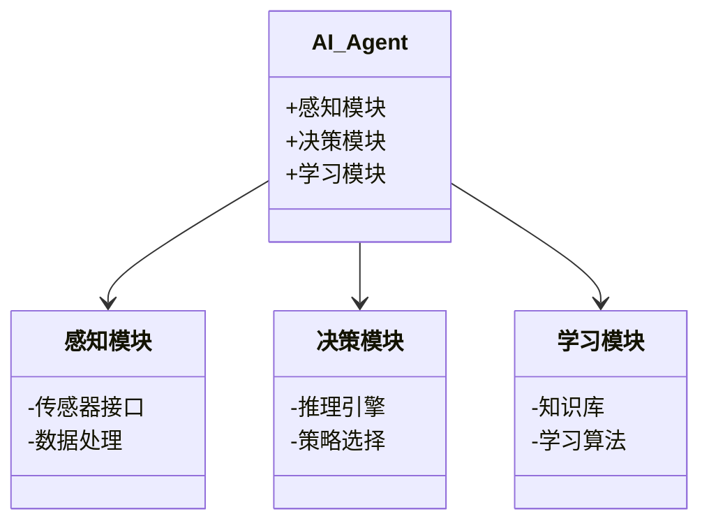

                 


# AI Agent的持续学习与知识更新策略

---

## 关键词
AI Agent, 持续学习, 知识更新, 神经网络, 知识表示, 系统架构

---

## 摘要
AI Agent的持续学习与知识更新是实现智能系统动态适应环境的核心能力。本文从AI Agent的基本概念出发，详细探讨了持续学习与知识更新的背景、核心概念、算法原理、系统架构设计、项目实战及最佳实践。通过对比记忆机制、知识蒸馏等技术，分析了AI Agent在动态环境中的学习策略，并结合实际案例，提供了系统化的解决方案。文章最后总结了AI Agent持续学习与知识更新的关键点，并展望了未来的发展方向。

---

## 第一部分: AI Agent的持续学习与知识更新背景

## 第1章: AI Agent的基本概念与问题背景

### 1.1 AI Agent的定义与核心功能

#### 1.1.1 AI Agent的定义
AI Agent（人工智能代理）是指能够感知环境、自主决策并执行任务的智能实体。它可以是一个软件程序、机器人或其他智能系统，具备以下核心功能：
- **感知能力**：通过传感器或数据输入接口获取环境信息。
- **决策能力**：基于感知信息，利用算法进行推理和决策。
- **执行能力**：根据决策结果，执行具体操作或输出结果。

#### 1.1.2 AI Agent的核心功能
1. **自主性**：能够在没有外部干预的情况下独立运行。
2. **反应性**：能够实时感知环境变化并做出响应。
3. **学习能力**：通过持续学习和知识更新，适应环境的变化。

#### 1.1.3 AI Agent的应用场景
- 智能助手（如Siri、Alexa）
- 自动驾驶系统
- 智能推荐系统
- 工业自动化机器人

### 1.2 持续学习与知识更新的背景

#### 1.2.1 AI Agent的动态环境挑战
AI Agent需要在动态变化的环境中运行，例如：
- 用户需求的变化
- 环境条件的改变
- 数据分布的偏移

#### 1.2.2 知识更新的必要性
- **知识过时**：随着环境的变化，旧知识可能不再适用。
- **数据稀疏性**：新任务可能缺乏足够的训练数据。
- **任务复杂性**：复杂任务需要动态调整知识库。

#### 1.2.3 持续学习的研究现状
目前，持续学习的研究主要集中在以下方面：
- **增量学习**：逐步学习新数据。
- **联结学习**：将新知识与旧知识联系起来。
- **知识蒸馏**：通过小样本数据快速学习新知识。

---

## 第2章: AI Agent持续学习与知识更新的问题描述

### 2.1 持续学习的核心问题

#### 2.1.1 知识遗忘问题
在持续学习过程中，模型可能会遗忘之前学习的知识，导致性能下降。例如：
- **灾难性遗忘**：模型在学习新任务时，忘记旧任务的知识。
- **渐进遗忘**：模型在长时间运行后，知识逐渐遗忘。

#### 2.1.2 知识迁移问题
新任务与旧任务之间可能存在差异，导致知识迁移困难。例如：
- **领域迁移**：从医疗领域迁移到金融领域。
- **任务迁移**：从分类任务迁移到回归任务。

#### 2.1.3 动态知识更新的挑战
- **实时性要求**：需要快速更新知识以应对突发情况。
- **资源限制**：在资源受限的环境中，如何高效更新知识。

### 2.2 知识更新的边界与外延

#### 2.2.1 知识更新的边界
- **知识的有效性**：知识是否仍然有效。
- **知识的适用性**：知识是否适用于当前任务。
- **知识的可更新性**：知识是否可以被更新。

#### 2.2.2 知识更新的外延
- **知识融合**：将新知识与旧知识结合起来。
- **知识扩展**：在已有知识基础上扩展新知识。
- **知识优化**：优化知识表示，提高学习效率。

### 2.3 问题解决的思路

#### 2.3.1 知识表示方法
- **符号表示**：使用符号逻辑表示知识。
- **向量表示**：使用向量空间模型表示知识。
- **图结构表示**：使用图结构表示知识，例如知识图谱。

#### 2.3.2 知识存储策略
- **分布式存储**：将知识分散存储在多个节点中。
- **集中式存储**：将知识集中存储在一个节点中。
- **混合存储**：结合分布式和集中式存储的优点。

#### 2.3.3 知识更新机制
- **在线更新**：实时更新知识。
- **离线更新**：定期批量更新知识。
- **增量更新**：逐步更新知识。

---

## 第3章: 核心概念与联系

### 3.1 持续学习与知识更新的核心概念

#### 3.1.1 持续学习的定义
持续学习是指模型在不断接收新数据时，能够逐步更新自身的知识和能力，以适应环境的变化。

#### 3.1.2 知识更新的定义
知识更新是指模型在新数据或新任务的驱动下，调整和优化自身的知识库，以提高性能。

#### 3.1.3 两者的联系与区别
- **联系**：持续学习是实现知识更新的核心手段。
- **区别**：知识更新是持续学习的目标。

### 3.2 核心概念的属性特征对比

#### 3.2.1 持续学习与知识更新的对比
| 概念 | 属性 | 特征 |
|------|------|------|
| 持续学习 | 数据流 | 连续性、动态性 |
| 知识更新 | 知识库 | 可更新性、可扩展性 |

#### 3.2.2 记忆机制对比

| 记忆机制 | 原理 | 优缺点 |
|---------|------|--------|
| episodic memory | 基于事件的记忆 | 好于语义记忆 |
| semantic memory | 基于概念的记忆 | 好于 episodic memory |

---

## 第4章: 算法原理讲解

### 4.1 持续学习的算法原理

#### 4.1.1 模型结构
- **神经网络**：使用深度神经网络（DNN）或卷积神经网络（CNN）进行持续学习。
- **记忆网络**：使用记忆网络（MemNN）进行持续学习。

#### 4.1.2 训练策略
- **增量训练**：逐步训练模型，每次只更新部分参数。
- **联合训练**：同时训练旧任务和新任务。

#### 4.1.3 知识蒸馏
- **教师模型**：使用教师模型指导学生模型进行学习。
- **知识蒸馏**：通过蒸馏技术，将教师模型的知识传递给学生模型。

---

## 第5章: 系统分析与架构设计

### 5.1 问题场景介绍

#### 5.1.1 问题场景
AI Agent需要在动态环境中运行，实时感知环境变化，并根据新任务进行知识更新。

### 5.2 项目介绍

#### 5.2.1 项目目标
- 实现AI Agent的持续学习能力。
- 实现知识更新机制。

#### 5.2.2 项目需求
- 支持多种知识表示方法。
- 支持在线和离线知识更新。

### 5.3 系统功能设计

#### 5.3.1 功能模块
- **感知模块**：负责感知环境信息。
- **决策模块**：负责根据感知信息进行决策。
- **学习模块**：负责持续学习和知识更新。

#### 5.3.2 系统功能模型（Mermaid 类图）


### 5.4 系统架构设计

#### 5.4.1 系统架构图（Mermaid 架构图）
```mermaid
archiitecture
    title AI Agent 系统架构
    client --> Perception: 感知模块
    Perception --> Decision: 决策模块
    Decision --> Learning: 学习模块
    Learning --> Knowledge_Base: 知识库
    Knowledge_Base --> 决策模块
```

---

## 第6章: 项目实战

### 6.1 环境安装

#### 6.1.1 安装依赖
- Python 3.8+
- TensorFlow 2.0+
- Mermaid 图表工具

### 6.2 核心代码实现

#### 6.2.1 感知模块实现
```python
class PerceptionModule:
    def __init__(self):
        self.sensors = []
    
    def add_sensor(self, sensor):
        self.sensors.append(sensor)
    
    def get_input(self):
        # 返回传感器输入
        return [s感知模块感知模块感知模块感知模块感知模块感知模块感知模块感知模块感知模块感知模块
```

#### 6.2.2 决策模块实现
```python
class DecisionModule:
    def __init__(self):
        self.policy = None
    
    def update_policy(self, new_policy):
        self.policy = new_policy
    
    def make_decision(self, input):
        # 根据策略进行决策
        return self.policy(input)
```

#### 6.2.3 学习模块实现
```python
class LearningModule:
    def __init__(self):
        self.model = None
        self.optimizer = None
    
    def train(self, data, labels):
        # 训练模型
        pass
    
    def update_model(self, new_model):
        self.model = new_model
```

### 6.3 代码解读与分析

#### 6.3.1 感知模块解读
- `PerceptionModule`类负责管理传感器和获取输入数据。
- `add_sensor`方法用于添加传感器。
- `get_input`方法返回传感器输入。

#### 6.3.2 决策模块解读
- `DecisionModule`类负责管理决策策略和进行决策。
- `update_policy`方法用于更新策略。
- `make_decision`方法根据输入进行决策。

#### 6.3.3 学习模块解读
- `LearningModule`类负责管理模型和优化器。
- `train`方法用于训练模型。
- `update_model`方法用于更新模型。

### 6.4 实际案例分析

#### 6.4.1 案例介绍
假设我们开发一个智能助手AI Agent，需要实现持续学习和知识更新能力。

#### 6.4.2 案例实现
- 感知模块：通过 microphone 和摄像头获取用户的语音和图像输入。
- 决策模块：根据输入生成回复。
- 学习模块：根据用户反馈更新模型。

### 6.5 项目小结

#### 6.5.1 核心代码总结
- 感知模块：负责数据输入。
- 决策模块：负责决策制定。
- 学习模块：负责模型训练和更新。

#### 6.5.2 项目实现的关键点
- 知识表示方法的选择。
- 知识更新机制的设计。
- 模型训练和更新的效率。

---

## 第7章: 最佳实践、小结、注意事项和拓展阅读

### 7.1 最佳实践

#### 7.1.1 知识表示方法
- 使用图结构表示知识，便于知识的更新和查询。

#### 7.1.2 知识更新策略
- 在线更新和离线更新结合使用。

### 7.2 小结

#### 7.2.1 AI Agent持续学习的核心
- 知识表示方法。
- 知识更新机制。

#### 7.2.2 知识更新的关键点
- 知识的有效性。
- 知识的适用性。
- 知识的可更新性。

### 7.3 注意事项

#### 7.3.1 知识更新的实时性
- 在资源受限的环境中，需要权衡实时性和资源消耗。

#### 7.3.2 知识更新的稳定性
- 避免知识更新过程中出现不稳定的情况。

### 7.4 拓展阅读

#### 7.4.1 推荐书籍
- 《持续学习与知识更新》
- 《AI Agent的设计与实现》

#### 7.4.2 推荐论文
- " continual learning in neural networks"
- "knowledge representation and updating in AI Agent"

---

## 总结
本文详细探讨了AI Agent的持续学习与知识更新策略，从背景介绍到算法实现，再到系统架构设计和项目实战，全面覆盖了相关技术的核心内容。通过对比记忆机制、知识蒸馏等技术，分析了AI Agent在动态环境中的学习策略，并结合实际案例，提供了系统化的解决方案。未来的研究可以进一步探索更高效的知识更新方法，以及如何在资源受限的环境中实现持续学习。

