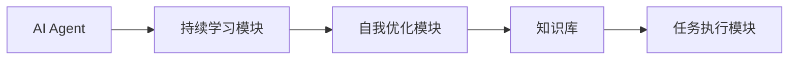
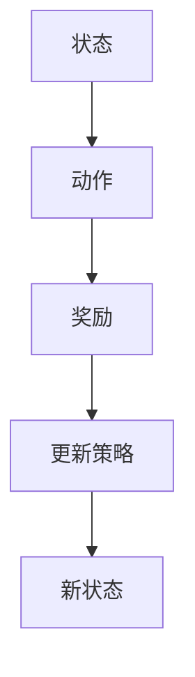
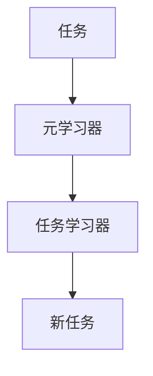
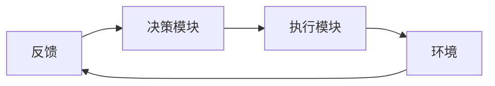
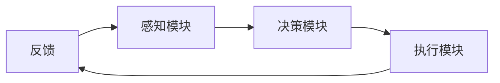

                 


# AI Agent的持续学习与自我优化机制

> 关键词：AI Agent, 持续学习, 自我优化, 强化学习, 知识蒸馏, 系统架构

> 摘要：本文系统地探讨了AI Agent的持续学习与自我优化机制，从背景介绍、核心概念、算法原理、系统架构到项目实战，全面分析了AI Agent如何通过持续学习实现自我优化，并通过具体案例展示了其实现与应用。

---

# 第1章: AI Agent的背景与核心概念

## 1.1 AI Agent的基本概念
### 1.1.1 什么是AI Agent
AI Agent（人工智能代理）是指能够感知环境、做出决策并采取行动的智能实体。它可以是一个软件程序、机器人或其他具备智能行为的系统，旨在通过自主或协作的方式完成特定任务。

### 1.1.2 AI Agent的类型与特点
AI Agent可以根据智能水平、任务类型和应用场景进行分类：
1. **基于规则的Agent**：通过预定义的规则进行简单决策。
2. **基于模型的Agent**：利用模型表示环境和目标，进行复杂推理。
3. **强化学习Agent**：通过与环境互动，学习最优策略。
4. **人机协作Agent**：与人类协作完成任务，注重人机交互。

### 1.1.3 AI Agent的应用场景
AI Agent广泛应用于自动驾驶、智能助手、机器人、游戏AI等领域。例如，自动驾驶汽车通过感知环境、做出决策并控制车辆，就是一个复杂的AI Agent系统。

## 1.2 持续学习与自我优化的背景
### 1.2.1 传统机器学习的局限性
传统机器学习模型通常在训练阶段一次性完成，无法适应新数据或变化的环境。例如，图像分类模型在训练完成后，无法自动更新以识别新的物体。

### 1.2.2 持续学习的定义与特点
持续学习是指模型能够在线接收数据并逐步更新，以适应新任务或数据的变化。其特点包括在线性、累积性和自适应性。

### 1.2.3 自我优化的必要性
自我优化是指AI Agent能够自动调整其行为策略或参数，以提高性能或适应变化。例如，在动态环境中，AI Agent需要实时调整策略以应对新挑战。

## 1.3 问题背景与目标
### 1.3.1 问题背景分析
在动态和复杂的环境中，AI Agent需要能够持续学习和优化，以保持高性能。传统机器学习模型无法满足这一需求。

### 1.3.2 问题描述与解决思路
问题：如何设计一种AI Agent，使其能够在动态环境中持续学习并自我优化。

解决思路：
1. **持续学习机制**：允许模型在线更新。
2. **自我优化算法**：设计自适应策略调整方法。
3. **知识表示与复用**：有效利用已有知识。

### 1.3.3 边界与外延
- **边界**：仅关注持续学习和自我优化机制。
- **外延**：不涉及AI Agent的具体应用场景。

### 1.3.4 核心要素与概念结构
- 核心要素：持续学习模块、自我优化模块、知识库。
- 概念结构：AI Agent通过持续学习模块接收新数据，更新知识库，通过自我优化模块调整策略。

## 1.4 核心概念对比
### 1.4.1 持续学习与传统学习的对比
| 对比维度 | 持续学习 | 传统学习 |
|----------|----------|----------|
| 数据来源 | 在线数据流 | 离线数据集 |
| 更新方式 | 逐步更新 | 一次性训练 |
| 适应性 | 高 | 低 |

### 1.4.2 自我优化与外部优化的对比
| 对比维度 | 自我优化 | 外部优化 |
|----------|----------|----------|
| 决策主体 | AI Agent自身 | 外部系统或人类 |
| 调整频率 | 实时 | 定期或离线 |
| 独立性 | 高 | 依赖外部输入 |

### 1.4.3 知识蒸馏与模型压缩的对比
| 对比维度 | 知识蒸馏 | 模型压缩 |
|----------|----------|----------|
| 目标 | 知识提取与复用 | 模型轻量化 |
| 方法 | 使用教师模型指导学生模型 | 压缩模型参数 |
| 应用场景 | 多任务学习 | 部署在资源受限的环境中 |

## 1.5 本章小结
本章介绍了AI Agent的基本概念、持续学习与自我优化的背景，分析了核心概念及其对比，为后续章节奠定了基础。

---

# 第2章: 持续学习与自我优化的核心机制

## 2.1 持续学习的原理
### 2.1.1 在线学习与离线学习的对比
- **在线学习**：实时接收数据，逐步更新模型。
- **离线学习**：一次性处理所有数据，适用于静态任务。

### 2.1.2 任务持续性与任务多样性
- **任务持续性**：任务目标不变，但输入数据变化。
- **任务多样性**：模型需要处理多种任务，逐步扩展知识库。

### 2.1.3 知识表示与更新机制
- **知识表示**：使用神经网络或其他表示方法。
- **更新机制**：通过反向传播或其他优化算法更新参数。

## 2.2 自我优化的实现方式
### 2.2.1 增量学习与模型更新
- **增量学习**：模型在新数据上逐步更新。
- **模型更新**：使用优化算法（如SGD、Adam）调整参数。

### 2.2.2 知识蒸馏与经验复用
- **知识蒸馏**：通过教师模型指导学生模型，提取知识。
- **经验复用**：将之前的经验应用到新任务中，减少探索成本。

### 2.2.3 自适应参数调整
- **自适应学习率**：根据梯度情况动态调整学习率。
- **动态网络结构**：根据任务需求调整网络结构。

## 2.3 持续学习与自我优化的结合
### 2.3.1 持续学习框架的设计
- **在线学习框架**：实时接收数据，逐步更新模型。
- **自我优化框架**：动态调整策略，适应变化。

### 2.3.2 自我优化模块的实现
- **策略评估**：评估当前策略的有效性。
- **策略优化**：根据评估结果调整策略。

### 2.3.3 系统整体架构
- **输入模块**：接收新数据或环境反馈。
- **处理模块**：执行持续学习和自我优化。
- **输出模块**：输出优化后的策略或行为。

## 2.4 核心概念关系图


## 2.5 本章小结
本章详细讲解了持续学习和自我优化的核心机制，分析了其在AI Agent中的实现方式，并通过关系图展示了各模块的交互。

---

# 第3章: 持续学习的算法原理

## 3.1 基于强化学习的持续学习
### 3.1.1 强化学习的基本原理
- **环境**：AI Agent所处的环境。
- **动作**：AI Agent采取的行动。
- **奖励**：环境对动作的反馈，用于指导学习。

### 3.1.2 在持续学习中的应用
- **实时反馈**：AI Agent根据环境反馈逐步优化策略。
- **策略更新**：通过强化学习算法（如Q-Learning、DQN）更新策略。

### 3.1.3 算法流程图


## 3.2 基于元学习的持续学习
### 3.2.1 元学习的定义与特点
- **元学习**：学习如何学习，适用于多种任务。
- **特点**：快速适应新任务，减少训练数据需求。

### 3.2.2 在持续学习中的应用
- **任务切换**：快速适应新任务。
- **知识复用**：复用已有知识，减少探索成本。

### 3.2.3 算法流程图


## 3.3 持续学习的数学模型
### 3.3.1 策略梯度公式
$$ J = \mathbb{E}_{\tau \sim \pi}[\sum_{t} r_t] $$
其中，$\pi$ 是策略，$\tau$ 是轨迹，$r_t$ 是奖励。

### 3.3.2 损失函数
$$ L = \mathbb{E}_{(x,y)}[(y - f(x))^2] $$
其中，$f(x)$ 是模型预测值，$y$ 是真实值。

## 3.4 本章小结
本章分析了基于强化学习和元学习的持续学习算法，详细讲解了其数学模型，并通过流程图展示了算法流程。

---

# 第4章: AI Agent的系统架构设计

## 4.1 问题场景介绍
- **场景描述**：AI Agent在动态环境中需要持续学习和优化。
- **需求分析**：实时更新模型、自适应调整策略。

## 4.2 项目介绍
- **项目目标**：设计一个具备持续学习和自我优化能力的AI Agent。
- **项目范围**：涵盖算法实现、系统架构、接口设计。

## 4.3 系统功能设计
- **领域模型**：定义AI Agent的感知、决策和执行模块。
- **功能模块**：
  - 感知模块：接收环境反馈。
  - 决策模块：基于持续学习和自我优化做出决策。
  - 执行模块：输出行为。

## 4.4 系统架构设计


## 4.5 系统接口设计
- **输入接口**：接收环境反馈和新任务。
- **输出接口**：输出优化后的策略或行为。
- **内部接口**：模块间通信接口。

## 4.6 系统交互设计


## 4.7 本章小结
本章通过系统架构设计，展示了AI Agent的模块组成和交互过程，为后续实现奠定了基础。

---

# 第5章: 项目实战

## 5.1 环境配置
- **工具安装**：安装Python、深度学习框架（如TensorFlow、PyTorch）。
- **环境搭建**：配置开发环境，确保所有依赖项安装完成。

## 5.2 核心代码实现
### 5.2.1 持续学习模块
```python
class Continual_Learning_Module:
    def __init__(self, model):
        self.model = model
        self.optimizer = Adam(model.parameters(), lr=0.001)
    
    def update(self, x, y):
        # 前向传播
        outputs = self.model(x)
        # 计算损失
        loss = criterion(outputs, y)
        # 反向传播
        self.optimizer.zero_grad()
        loss.backward()
        self.optimizer.step()
```

### 5.2.2 自我优化模块
```python
class Self_Optimization_Module:
    def __init__(self, policy):
        self.policy = policy
        self.current_strategy = policy
    
    def optimize(self, feedback):
        # 评估当前策略
        performance = evaluate(self.current_strategy, feedback)
        # 根据反馈调整策略
        self.current_strategy = update_strategy(self.current_strategy, performance)
```

## 5.3 代码应用解读与分析
- **持续学习模块**：通过反向传播更新模型参数。
- **自我优化模块**：根据反馈调整策略，优化性能。

## 5.4 实际案例分析
- **案例描述**：设计一个AI Agent在动态环境中执行任务。
- **实现细节**：具体实现持续学习和自我优化模块。
- **结果分析**：分析模型性能，验证算法有效性。

## 5.5 本章小结
本章通过具体案例展示了AI Agent的实现过程，详细解读了核心代码，并分析了实验结果。

---

# 第6章: 最佳实践与注意事项

## 6.1 最佳实践
### 6.1.1 知识蒸馏的应用
- 使用教师模型指导学生模型，减少知识损失。
### 6.1.2 模型压缩的技巧
- 通过剪枝、量化等方法压缩模型，降低计算成本。
### 6.1.3 动态参数调整
- 根据任务需求动态调整学习率等参数，提高训练效率。

## 6.2 注意事项
### 6.2.1 模型遗忘问题
- 注意防止模型遗忘旧知识，采用知识蒸馏等方法。
### 6.2.2 系统稳定性
- 确保系统在持续学习过程中保持稳定，避免过快调整导致性能下降。
### 6.2.3 资源限制
- 考虑计算资源限制，优化模型规模和训练时间。

## 6.3 拓展阅读
- 推荐相关书籍和论文，供读者深入学习。

## 6.4 本章小结
本章总结了实现AI Agent的持续学习与自我优化机制的最佳实践，并提出了注意事项和未来的研究方向。

---

# 第7章: 总结与展望

## 7.1 核心内容回顾
- 介绍了AI Agent的基本概念和持续学习、自我优化的机制。
- 分析了相关算法和系统架构。
- 展示了具体项目的实现过程。

## 7.2 未来研究方向
- **算法优化**：探索更高效的持续学习和自我优化算法。
- **系统扩展**：设计更复杂的系统架构，支持更多任务。
- **应用场景拓展**：将AI Agent应用于更多领域，如医疗、教育等。

## 7.3 本章小结
本章总结了全文内容，并展望了未来的研究方向，为读者提供了进一步探索的空间。

---

# 参考文献
（此处列出相关书籍和论文）

---

# 致谢
感谢读者的耐心阅读，感谢所有为本书提供支持和帮助的人。

---

通过以上目录，您可以逐步深入地了解AI Agent的持续学习与自我优化机制，从基础理论到实际应用，全面掌握其核心内容。

