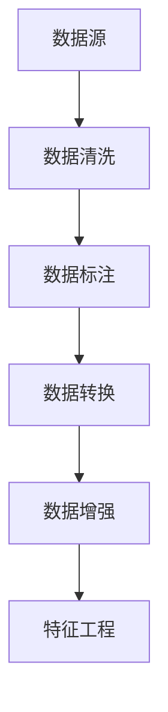

                 


# AI Agent的数据准备和预处理技巧

> 关键词：AI Agent, 数据准备, 数据预处理, 数据清洗, 数据标注, 数据转换

> 摘要：本文详细探讨了AI Agent在数据准备和预处理过程中的关键技巧，包括数据清洗、数据标注、数据转换、特征工程和数据增强等步骤，结合实际案例分析，帮助读者掌握如何高效处理数据以提升AI Agent性能。

---

## 引言

AI Agent（人工智能代理）是一种能够感知环境并采取行动以实现特定目标的智能实体。在实现AI Agent的过程中，数据准备和预处理是关键的第一步。高质量的数据是AI Agent准确决策的基础，而数据准备和预处理则是确保数据质量、一致性和有效性的必要步骤。

本文将从数据准备的基本概念入手，逐步分析数据预处理的关键技巧，包括数据清洗、数据标注、数据转换、特征工程和数据增强等，结合实际案例，帮助读者系统地掌握AI Agent的数据准备和预处理技巧。

---

## 第一部分：数据准备的基础

### 第1章：AI Agent与数据准备概述

#### 1.1 AI Agent的背景与概念

- **1.1.1 AI Agent的基本概念**
  - AI Agent是一种智能实体，能够感知环境并采取行动以实现目标。
  - AI Agent可以是软件程序、机器人或其他智能系统，广泛应用于自动驾驶、智能助手、推荐系统等领域。

- **1.1.2 数据在AI Agent中的核心作用**
  - 数据是AI Agent进行决策和行动的基础。
  - 数据的质量和数量直接影响AI Agent的性能和准确性。

- **1.1.3 数据准备的重要性**
  - 数据准备是AI Agent开发过程中的第一步，决定了后续模型的训练效果。
  - 数据准备包括数据收集、清洗、标注、转换等步骤。

#### 1.2 数据准备的背景与问题背景

- **1.2.1 数据准备的背景介绍**
  - 随着AI技术的发展，数据准备的需求日益增长。
  - 数据准备的目的是确保数据的准确性和一致性，为后续分析和建模提供高质量的数据。

- **1.2.2 数据准备的核心问题**
  - 数据缺失、噪声、重复和异常值等问题会影响数据质量。
  - 数据格式和结构的不一致可能导致模型训练困难。

- **1.2.3 数据准备的目标与边界**
  - 数据准备的目标是将原始数据转化为适合模型训练的形式。
  - 数据准备的边界包括数据采集、清洗、标注和转换，但不包括模型训练和部署。

#### 1.3 数据准备的关键要素

- **1.3.1 数据质量的核心要素**
  - 完整性：数据是否完整，是否存在缺失值。
  - 准确性：数据是否准确，是否存在错误或噪声。
  - 一致性：数据是否格式统一，是否存在重复或不一致。

- **1.3.2 数据格式与结构**
  - 数据格式：文本、图像、音频、视频等。
  - 数据结构：关系型数据、非结构化数据、半结构化数据。

- **1.3.3 数据来源与类型**
  - 数据来源：数据库、API接口、日志文件、爬取数据等。
  - 数据类型：结构化数据、非结构化数据。

---

### 第2章：数据预处理的核心概念与联系

#### 2.1 数据预处理的原理

- **2.1.1 数据预处理的基本原理**
  - 数据预处理是将原始数据转化为适合模型训练的形式。
  - 数据预处理包括数据清洗、数据标注、数据转换和数据增强等步骤。

- **2.1.2 数据预处理的流程与阶段**
  - 数据清洗：处理缺失值、重复值和异常值。
  - 数据标注：为数据打上标签，使其适合模型训练。
  - 数据转换：标准化、归一化、特征工程等。
  - 数据增强：增加数据的多样性和丰富性。

- **2.1.3 数据预处理的关键目标**
  - 提高数据质量：确保数据准确、完整和一致。
  - 降低数据噪声：减少数据中的干扰信息。
  - 增强数据多样性：扩展数据集，提高模型的泛化能力。

#### 2.2 数据预处理的核心概念对比

- **2.2.1 数据清洗与数据增强的对比**
  - 数据清洗：处理数据中的问题，如缺失值、异常值。
  - 数据增强：增加数据的多样性和丰富性，如图像旋转、裁剪等。

- **2.2.2 数据标注与数据转换的联系**
  - 数据标注是为数据打上标签，数据转换是对数据进行格式化处理。
  - 数据标注为模型提供监督信号，数据转换为模型提供更友好的输入格式。

- **2.2.3 数据特征工程的关键属性**
  - 特征工程是通过提取和创建新特征来提高模型性能。
  - 关键属性包括特征的相关性、重要性、稀疏性和分布。

#### 2.3 数据预处理的ER实体关系图



---

### 第3章：数据预处理的算法原理

#### 3.1 数据清洗算法

- **3.1.1 缺失值处理算法**
  - 删除含有缺失值的记录：适用于缺失值比例较小的情况。
  - 均值填充：适用于数值型数据，尤其是正态分布的数据。
  - 中位数填充：适用于偏态分布的数据。
  - 众数填充：适用于分类数据。

  例如：使用Python的Pandas库处理缺失值：
  ```python
  import pandas as pd
  df = pd.DataFrame({'A': [1, 2, np.nan, 4]})
  df['A'].fillna(df['A'].mean(), inplace=True)
  ```

- **3.1.2 重复值处理算法**
  - 删除重复值：直接删除重复的记录。
  - 保留唯一值：仅保留唯一的值。

  例如：处理重复值：
  ```python
  df.drop_duplicates(subset=['A'], keep='first')
  ```

- **3.1.3 异常值处理算法**
  - 基于统计的方法：如Z-score、IQR（四分位数）。
  - 基于模型的方法：如Isolation Forest、One-Class SVM。

  例如：使用Z-score方法检测异常值：
  ```python
  from scipy import stats
  z = stats.zscore(df['A'])
  outliers = np.where(np.abs(z) > 3)
  ```

#### 3.2 数据标注算法

- **3.2.1 分类标注算法**
  - 使用监督学习模型进行分类标注。
  - 例如：使用随机森林对客户数据进行分类标注。

  代码示例：
  ```python
  from sklearn.ensemble import RandomForestClassifier
  model = RandomForestClassifier()
  model.fit(X_train, y_train)
  y_pred = model.predict(X_test)
  ```

- **3.2.2 回归标注算法**
  - 使用回归模型对数据进行数值预测。
  - 例如：使用线性回归预测房价。

  代码示例：
  ```python
  from sklearn.linear_model import LinearRegression
  model = LinearRegression()
  model.fit(X_train, y_train)
  y_pred = model.predict(X_test)
  ```

- **3.2.3 解析标注算法**
  - 使用自然语言处理（NLP）技术对文本数据进行解析标注。
  - 例如：使用Spacy对文本进行实体识别。

  代码示例：
  ```python
  import spacy
  nlp = spacy.load("en_core_web_sm")
  doc = nlp("John is a data scientist.")
  for ent in doc.ents:
      print(ent.text, ent.label_)
  ```

#### 3.3 数据转换算法

- **3.3.1 数据标准化与归一化**
  - 数据标准化：将数据按比例缩放到同一范围内，通常使用Z-score标准化。
  - 数据归一化：将数据缩放到0-1范围，通常使用Min-Max归一化。

  代码示例：
  ```python
  from sklearn.preprocessing import StandardScaler, MinMaxScaler
  scaler_standard = StandardScaler().fit_transform(X)
  scaler_minmax = MinMaxScaler().fit_transform(X)
  ```

- **3.3.2 数据格式转换**
  - 将文本数据转换为数值向量：使用词袋模型（Bag-of-Words）或TF-IDF。
  - 例如：使用TfidfVectorizer处理文本数据。

  代码示例：
  ```python
  from sklearn.feature_extraction.text import TfidfVectorizer
  vectorizer = TfidfVectorizer()
  X = vectorizer.fit_transform(documents)
  ```

- **3.3.3 数据降维算法**
  - 使用主成分分析（PCA）对数据进行降维。
  - 代码示例：
  ```python
  from sklearn.decomposition import PCA
  pca = PCA(n_components=2)
  pca.fit_transform(X)
  ```

---

### 第4章：数据预处理的系统架构与设计

#### 4.1 系统功能设计

- **4.1.1 数据采集**
  - 数据采集：从各种数据源（数据库、API接口、文件等）采集数据。
  - 数据预处理：清洗、标注、转换数据。
  - 数据存储：将处理后的数据存储到数据库或文件中。

- **4.1.2 数据清洗**
  - 缺失值处理：删除或填充缺失值。
  - 重复值处理：删除重复记录。
  - 异常值处理：检测并处理异常值。

- **4.1.3 数据标注**
  - 分类标注：为数据打上类别标签。
  - 回归标注：为数据打上数值标签。
  - 解析标注：对文本数据进行实体识别或情感分析。

- **4.1.4 数据转换**
  - 标准化和归一化：调整数据格式。
  - 特征工程：提取和创建新特征。
  - 数据增强：扩展数据集。

#### 4.2 系统架构设计

- **4.2.1 系统架构图**
  ```mermaid
  graph TD
      A[数据源] --> B[数据清洗]
      B --> C[数据标注]
      C --> D[数据转换]
      D --> E[数据增强]
      E --> F[特征工程]
      F --> G[模型训练]
  ```

- **4.2.2 系统接口设计**
  - 数据输入接口：接收原始数据。
  - 数据处理接口：执行数据清洗、标注、转换等操作。
  - 数据输出接口：输出处理后的数据，供模型训练使用。

- **4.2.3 系统交互设计**
  ```mermaid
  sequenceDiagram
      actor 用户
      participant 数据采集模块
      participant 数据处理模块
      participant 数据存储模块
      用户 -> 数据采集模块: 请求数据
      数据采集模块 -> 数据处理模块: 提供原始数据
      数据处理模块 -> 数据存储模块: 输出处理后的数据
      数据存储模块 -> 用户: 返回处理后的数据
  ```

---

### 第5章：数据预处理的项目实战

#### 5.1 项目背景

- **项目目标**：以电商客服对话数据为例，准备数据以训练一个情感分析模型。
- **数据来源**：电商客服对话记录，包含客户和客服的对话内容。
- **数据类型**：文本数据。

#### 5.2 数据准备过程

- **数据采集**
  - 从数据库中提取客服对话记录。
  - 数据格式：文本文件，每行一条对话记录。

- **数据清洗**
  - 处理缺失值：删除空值。
  - 去除重复值：检查并删除重复的对话记录。
  - 处理异常值：删除长度过短的对话记录。

- **数据标注**
  - 情感分类：将对话内容分为正面、负面、中性三类。
  - 使用监督学习模型（如SVM、随机森林）进行分类标注。

- **数据转换**
  - 特征提取：使用TF-IDF对文本进行特征提取。
  - 标准化：将特征向量标准化。

- **数据增强**
  - 对文本数据进行数据增强，例如同义词替换、句式变换。

#### 5.3 代码实现

```python
# 数据清洗
import pandas as pd

df = pd.read_csv('dialogs.csv')
df.dropna(inplace=True)
df.drop_duplicates(inplace=True)

# 数据标注
from sklearn.model_selection import train_test_split
from sklearn.svm import SVC

X_train, X_test, y_train, y_test = train_test_split(df['text'], df['label'], test_size=0.2)
model = SVC()
model.fit(X_train, y_train)

# 数据转换
from sklearn.feature_extraction.text import TfidfVectorizer

vectorizer = TfidfVectorizer()
X = vectorizer.fit_transform(df['text'])
```

#### 5.4 实际案例分析

- **案例分析**：在电商客服对话数据中，发现部分对话内容缺失情感标签。
- **解决方案**：使用模型预测缺失标签，或手动标注关键数据。
- **效果评估**：评估数据清洗和标注后的数据质量，确保数据适合模型训练。

---

### 第6章：数据预处理的最佳实践与小结

#### 6.1 最佳实践

- **数据质量优先**：确保数据的准确性和完整性，避免数据偏差。
- **工具选择**：根据数据类型和规模选择合适的数据处理工具，如Pandas、NumPy、Scikit-learn等。
- **数据安全与隐私**：在处理敏感数据时，确保数据的安全性和隐私性。

#### 6.2 注意事项

- **避免过度清洗**：不要过度处理数据，以免失去数据的原始信息。
- **数据多样性**：在数据增强时，保持数据的多样性和真实性，避免生成不合理的数据。
- **模型反馈**：根据模型的反馈调整数据处理策略，优化数据质量。

#### 6.3 拓展阅读

- 《Hands-On Machine Learning with Scikit-Learn, Keras, and TensorFlow》
- 《Data Cleaning with Python: A Step-by-Step Guide》
- 《Feature Engineering for Machine Learning: Principles and Techniques》

---

## 结语

数据准备和预处理是AI Agent开发过程中至关重要的一环。通过系统的数据清洗、标注、转换和增强，可以为AI Agent提供高质量的数据，从而提高模型的性能和准确性。希望本文的详细分析和实际案例能够帮助读者掌握AI Agent的数据准备和预处理技巧，并在实际项目中取得成功。

