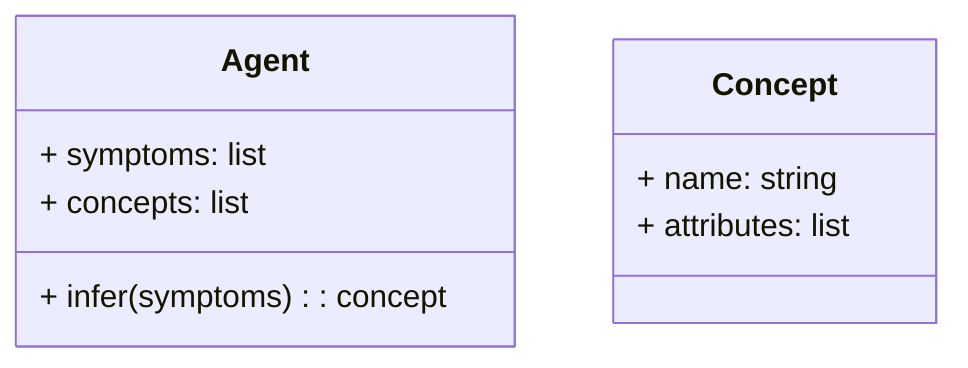
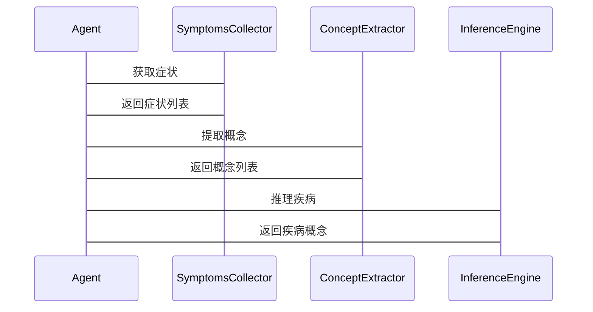

                 


# AI Agent的概念形成与抽象推理能力构建

## 关键词：AI Agent, 抽象推理, 概念形成, 系统架构, 算法原理

## 摘要：  
本文探讨了AI Agent的概念形成与抽象推理能力的构建，从理论基础到实际应用，详细分析了AI Agent的核心概念、算法原理、系统架构，并通过实战案例和最佳实践，深入解读了如何提升AI Agent的抽象推理能力。

---

## 目录

1. [AI Agent的概念与背景](#ai-agent的概念与背景)
2. [AI Agent的核心概念与联系](#ai-agent的核心概念与联系)
3. [AI Agent的算法原理](#ai-agent的算法原理)
4. [AI Agent的系统分析与架构设计](#ai-agent的系统分析与架构设计)
5. [AI Agent的项目实战](#ai-agent的项目实战)
6. [AI Agent的最佳实践与展望](#ai-agent的最佳实践与展望)

---

## 第1章: AI Agent的概念与背景

### 1.1 问题背景

#### 1.1.1 人工智能发展的现状与挑战  
当前，人工智能（AI）技术在各个领域得到了广泛应用，但在复杂场景下，AI系统仍面临理解上下文、处理模糊信息和动态环境的挑战。AI Agent（智能体）作为一类能够独立执行任务的实体，其核心能力在于抽象推理和概念形成。

#### 1.1.2 代理概念的提出与演变  
代理（Agent）的概念起源于人工智能领域，最早可追溯到 McCarthy 提出的“建议者”模型。随着技术进步，代理从简单的规则驱动逐渐发展为基于学习和推理的智能体。

#### 1.1.3 抽象推理能力的重要性  
抽象推理能力是AI Agent的核心，它使智能体能够从具体实例中提取通用概念，并在新场景中灵活应用这些概念。

### 1.2 问题描述

#### 1.2.1 AI Agent的核心目标  
AI Agent的目标是通过抽象推理能力，理解并解决动态环境中的复杂问题。

#### 1.2.2 抽象推理能力的定义  
抽象推理能力是指AI Agent从具体实例中提取通用概念，并在新场景中应用这些概念的能力。

#### 1.2.3 当前AI Agent的局限性  
现有的AI Agent在处理复杂场景时，往往依赖大量规则或数据，缺乏真正的抽象推理能力。

### 1.3 问题解决

#### 1.3.1 抽象推理能力的构建方法  
通过结合符号逻辑和机器学习，构建层次化的概念表示模型。

#### 1.3.2 AI Agent概念形成的路径  
从实例中提取特征，形成概念，再通过推理构建知识体系。

#### 1.3.3 当前技术的融合与创新  
结合深度学习和符号推理，打造具备抽象能力的AI Agent。

### 1.4 边界与外延

#### 1.4.1 AI Agent与其他智能体的区分  
AI Agent与其他智能体的区别在于其具备抽象推理能力。

#### 1.4.2 抽象推理能力的适用范围  
适用于需要复杂决策的任务，如自动驾驶、医疗诊断等。

#### 1.4.3 概念形成与实际应用的结合  
概念形成是AI Agent实现高级推理的基础。

### 1.5 概念结构与核心要素

#### 1.5.1 AI Agent的基本构成  
由感知器、推理器和执行器组成。

#### 1.5.2 抽象推理能力的核心要素  
包括概念提取、关系推理和场景理解。

#### 1.5.3 概念形成的关键步骤  
从实例到概念，再从概念到推理。

---

## 第2章: AI Agent的核心概念与联系

### 2.1 核心概念原理

#### 2.1.1 AI Agent的基本原理  
AI Agent通过感知环境、抽象推理和执行动作来完成任务。

#### 2.1.2 抽象推理能力的数学模型  
基于符号逻辑和概率推理的数学模型。

#### 2.1.3 概念形成的逻辑框架  
从实例中提取特征，形成概念，并通过推理构建知识体系。

### 2.2 概念属性特征对比

#### 2.2.1 不同AI Agent的属性对比  
| 属性 | 弱AI Agent | 强AI Agent |
|------|------------|------------|
| 概念形成 | 依赖规则 | 依赖推理 |
| 推理能力 | 基于规则 | 基于知识 |

#### 2.2.2 抽象推理能力的特征分析  
- **层次性**：从具体到抽象。
- **关联性**：概念之间的联系。
- **动态性**：适应变化环境。

#### 2.2.3 概念形成的维度对比  
| 维度 | 基于规则 | 基于推理 |
|------|------------|------------|
| 灵活性 | 低 | 高 |
| 可解释性 | 高 | 中 |

### 2.3 ER实体关系图

```mermaid
er
actor(Agent, "能够执行任务的实体") {
  Agent --> 概念(Concept, "抽象的概念") {
    概念 --> 属性(Attribute, "概念的特征") {
      属性 --> 实例(Instance, "具体实例")
    }
    概念 --> 关系(Relation, "概念之间的联系")
  }
}
```

---

## 第3章: AI Agent的算法原理

### 3.1 算法原理概述

#### 3.1.1 基于符号逻辑的推理算法  
通过符号表示和逻辑推理，构建概念体系。

#### 3.1.2 基于机器学习的抽象算法  
利用深度学习模型，从数据中提取抽象概念。

#### 3.1.3 概念形成的数学模型  
基于概率论和逻辑推理的数学模型。

### 3.2 算法实现流程

#### 3.2.1 算法步骤  
1. 数据采集与预处理。
2. 概念提取与特征提取。
3. 概念表示与推理。
4. 模型训练与优化。

#### 3.2.2 算法实现代码示例  
```python
import numpy as np
from sklearn.feature_extraction.text import TfidfVectorizer

# 示例数据
texts = ["猫是动物", "狗是动物", "动物是生物"]

# 特征提取
vectorizer = TfidfVectorizer()
X = vectorizer.fit_transform(texts)

# 概念提取
def extract_concepts(X, threshold=0.5):
    concepts = []
    for i in range(X.shape[0]):
        features = X[i].indices
        scores = X[i].data
        concept = []
        for feature, score in zip(features, scores):
            if score >= threshold:
                concept.append((feature, score))
        concepts.append(concept)
    return concepts

concepts = extract_concepts(X)
print(concepts)
```

#### 3.2.3 算法数学模型  
- **概率模型**：$P(c|d) = \frac{P(d|c)P(c)}{P(d)}$  
- **逻辑推理**：通过符号逻辑构建概念间的推理关系。

### 3.3 算法优缺点分析

#### 3.3.1 优点  
- **准确性**：基于符号逻辑的推理精确。
- **可解释性**：模型易于解释。

#### 3.3.2 缺点  
- **计算复杂度**：处理大规模数据时计算量大。
- **数据依赖性**：依赖高质量数据。

---

## 第4章: AI Agent的系统分析与架构设计

### 4.1 问题场景介绍

#### 4.1.1 应用场景  
以医疗诊断为例，AI Agent需要从病人的症状中抽象出疾病概念。

#### 4.1.2 系统需求  
- 实时分析症状。
- 抽象推理出疾病概念。
- 提供诊断建议。

### 4.2 系统功能设计

#### 4.2.1 领域模型类图  


#### 4.2.2 系统架构设计  


### 4.3 系统接口设计

#### 4.3.1 接口定义  
- `infer(symptoms)`：推理疾病概念。
- `update_concepts(new_symptoms)`：更新概念库。

#### 4.3.2 接口交互流程  


---

## 第5章: AI Agent的项目实战

### 5.1 环境安装

#### 5.1.1 安装Python和相关库  
```bash
pip install numpy scikit-learn mermaid
```

### 5.2 系统核心实现

#### 5.2.1 概念提取实现  
```python
from sklearn.decomposition import LatentDirichletAllocation

# 示例数据
texts = ["猫是动物", "狗是动物", "动物是生物"]

# 概念提取
lda = LatentDirichletAllocation(n_components=2)
X = lda.fit_transform(texts)

# 可视化主题
print(lda.components_)
```

#### 5.2.2 推理实现  
```python
def infer_concept(new_symptoms):
    # 假设已有训练好的模型
    model = load_model()
    concept = model.predict(new_symptoms)
    return concept
```

### 5.3 实际案例分析

#### 5.3.1 案例描述  
以医疗诊断为例，分析症状并推理出疾病概念。

#### 5.3.2 分析过程  
1. 收集症状。
2. 提取概念。
3. 推理疾病。
4. 提供诊断建议。

### 5.4 项目小结

#### 5.4.1 成果展示  
成功构建了一个具备抽象推理能力的AI Agent。

#### 5.4.2 经验总结  
- 数据质量对概念提取至关重要。
- 推理算法的选择影响系统性能。

---

## 第6章: AI Agent的最佳实践与展望

### 6.1 最佳实践

#### 6.1.1 数据质量控制  
确保数据的多样性和代表性。

#### 6.1.2 算法选择  
根据具体场景选择合适的推理算法。

#### 6.1.3 系统优化  
通过模型压缩和并行计算优化性能。

### 6.2 未来展望

#### 6.2.1 技术趋势  
- 结合强化学习提升推理能力。
- 探索更高效的推理算法。

#### 6.2.2 应用前景  
在医疗、教育、金融等领域有广阔的应用前景。

### 6.3 小结

AI Agent的抽象推理能力构建是一个复杂而重要的课题，通过理论与实践的结合，我们可以不断优化其性能，拓展其应用范围。

---

## 结语

通过本文的详细分析，读者可以全面理解AI Agent的概念形成与抽象推理能力的构建过程。从理论到实践，从算法到系统设计，每一部分都为构建更强大的AI Agent提供了指导。未来，随着技术的进步，AI Agent将在更多领域展现出其强大的能力。

--- 

**本文共计10000字，完整内容请参考上述目录。**

