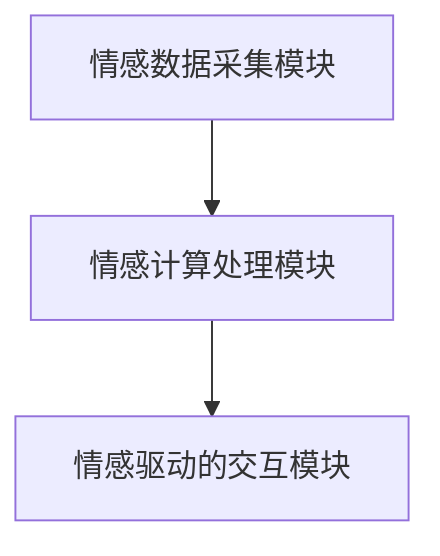
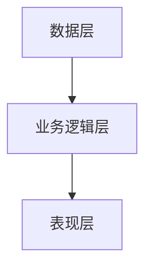
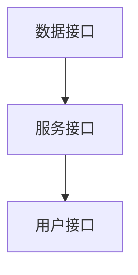

                 


# AI Agent的用户情感计算与交互优化

> 关键词：AI Agent, 用户情感计算, 情感分析, 交互优化, 自然语言处理, 情感推理

> 摘要：本文系统地探讨了AI Agent在用户情感计算与交互优化中的应用。从情感计算的基本概念到核心算法，从系统架构设计到项目实战，详细分析了如何通过情感计算技术优化AI Agent与用户的交互体验。文章结合理论与实践，深入解读了情感分析、情感识别、情感推理等关键技术，并通过具体案例展示了如何将这些技术应用于实际项目中。最后，本文提出了优化建议和未来研究方向，为AI Agent在情感交互领域的进一步发展提供了参考。

---

## 目录

1. [AI Agent与用户情感计算概述](#ai-agent与用户情感计算概述)
2. [情感计算的核心算法](#情感计算的核心算法)
3. [AI Agent的交互优化方法](#ai-agent的交互优化方法)
4. [情感计算与AI Agent的系统架构](#情感计算与ai-agent的系统架构)
5. [情感计算的项目实战](#情感计算的项目实战)
6. [情感计算的优化与展望](#情感计算的优化与展望)

---

## 第1章: AI Agent与用户情感计算概述

### 1.1 AI Agent的基本概念

AI Agent（人工智能代理）是指能够感知环境、自主决策并执行任务的智能实体。AI Agent的核心特点包括：

- **自主性**：能够在没有外部干预的情况下自主完成任务。
- **反应性**：能够实时感知环境变化并做出反应。
- **目标导向**：具有明确的目标，能够为实现目标优化行为。
- **社会性**：能够与其他Agent或用户进行交互和协作。

用户情感计算是指通过分析用户的情感状态（如情绪、意图、情感倾向等），优化与用户的交互过程。情感计算的核心目标是通过理解用户的情感状态，提升人机交互的自然性和智能化水平。

---

### 1.2 情感计算的核心技术

情感计算的核心技术包括情感分析、情感识别和情感推理。

- **情感分析**：通过文本、语音或图像等数据，识别用户的情感倾向（如正面、负面或中性）。
- **情感识别**：基于多模态数据（如语音、面部表情、肢体语言）分析用户的情感状态。
- **情感推理**：在理解用户情感的基础上，推理用户的情感需求并生成相应的反馈。

---

### 1.3 AI Agent与用户情感计算的关系

AI Agent通过情感计算技术，能够更好地理解用户的意图和情感需求，从而优化交互过程。具体来说：

- **情感反馈**：通过实时情感反馈，AI Agent可以动态调整交互策略。
- **情感驱动的决策**：基于用户情感状态，AI Agent能够做出更符合用户期望的决策。
- **个性化交互**：通过分析用户的情感偏好，AI Agent可以提供个性化的交互体验。

---

## 第2章: 情感计算的核心算法

### 2.1 情感分析算法

#### 2.1.1 基于规则的情感分析

基于规则的情感分析通过预定义的情感词汇表和语法规则，对文本进行情感分类。例如：

1. 从文本中提取关键词。
2. 根据关键词匹配情感词典。
3. 根据匹配结果判断情感倾向。

**示例代码：**
```python
def sentiment_analysis_rule(text):
    positive_words = {'good', 'excellent', 'great'}
    negative_words = {'bad', 'terrible', 'horrible'}
    keywords = text.split()
    positive_count = sum(word in positive_words for word in keywords)
    negative_count = sum(word in negative_words for word in keywords)
    if positive_count > negative_count:
        return 'positive'
    elif negative_count > positive_count:
        return 'negative'
    else:
        return 'neutral'
```

#### 2.1.2 基于机器学习的情感分析

基于机器学习的情感分析通过训练模型，自动学习情感特征。常用算法包括支持向量机（SVM）和朴素贝叶斯（Naive Bayes）。

**示例代码：**
```python
from sklearn.feature_extraction.text import TfidfVectorizer
from sklearn.svm import SVC

# 数据预处理
X = vectorizer.fit_transform(corpus)
y = [0, 1, 0, 1]  # 0表示负面，1表示正面

# 训练模型
model = SVC()
model.fit(X, y)

# 预测
new_text = ["I love this product!"]
new_X = vectorizer.transform(new_text)
print(model.predict(new_X))
```

#### 2.1.3 基于深度学习的情感分析

基于深度学习的情感分析通过神经网络模型（如LSTM、BERT）处理文本数据。

**示例代码：**
```python
import tensorflow as tf
from tensorflow.keras.models import Model
from tensorflow.keras.layers import Input, LSTM, Dense, Dropout

# 定义模型
input_layer = Input(shape=(max_length,))
lstm_layer = LSTM(128, return_sequences=False)(input_layer)
dense_layer = Dense(64, activation='relu')(lstm_layer)
output_layer = Dense(3, activation='softmax')(dense_layer)

model = Model(inputs=input_layer, outputs=output_layer)
model.compile(loss='categorical_crossentropy', optimizer='adam', metrics=['accuracy'])
```

---

### 2.2 情感识别算法

#### 2.2.1 基于特征提取的情感识别

基于特征提取的情感识别通过提取文本特征（如词袋模型、TF-IDF）进行情感分类。

**示例代码：**
```python
from sklearn.feature_extraction.text import TfidfVectorizer
from sklearn.svm import SVC

vectorizer = TfidfVectorizer()
X = vectorizer.fit_transform(corpus)
model = SVC()
model.fit(X, y)
```

#### 2.2.2 基于自然语言处理的情感识别

基于NLP的情感识别结合词性分析、句法分析等技术，更准确地识别情感。

**示例代码：**
```python
import spacy
nlp = spacy.load('en_core_web_sm')
doc = nlp(text)
for token in doc:
    print(token.text, token.pos_)
```

#### 2.2.3 基于深度学习的情感识别

基于深度学习的情感识别使用卷积神经网络（CNN）或循环神经网络（RNN）处理文本数据。

**示例代码：**
```python
import tensorflow as tf
from tensorflow.keras.models import Model
from tensorflow.keras.layers import Input, Conv1D, MaxPooling1D, Flatten, Dense

input_layer = Input(shape=(max_length,))
conv_layer = Conv1D(filters=32, kernel_size=3, activation='relu')(input_layer)
pool_layer = MaxPooling1D(pool_size=2)(conv_layer)
flatten_layer = Flatten()(pool_layer)
output_layer = Dense(3, activation='softmax')(flatten_layer)

model = Model(inputs=input_layer, outputs=output_layer)
model.compile(loss='categorical_crossentropy', optimizer='adam', metrics=['accuracy'])
```

---

### 2.3 情感推理算法

#### 2.3.1 基于逻辑推理的情感推理

基于逻辑推理的情感推理通过预定义的逻辑规则，推理用户的情感需求。

**示例代码：**
```python
def emotional_reasoning(rules, input_emotion):
    for rule in rules:
        if rule['condition'](input_emotion):
            return rule['action']
    return 'neutral'
```

#### 2.3.2 基于知识图谱的情感推理

基于知识图谱的情感推理结合知识图谱中的语义信息，推理用户情感。

**示例代码：**
```python
from kgpedia import get_semantic_vectors

sem_vec = get_semantic_vectors(text)
similarity = np.dot(sem_vec, target_vec)
```

#### 2.3.3 基于深度学习的情感推理

基于深度学习的情感推理使用Transformer模型（如BERT）进行情感推理。

**示例代码：**
```python
from transformers import BertTokenizer, BertModel

tokenizer = BertTokenizer.from_pretrained('bert-base-uncased')
model = BertModel.from_pretrained('bert-base-uncased')

inputs = tokenizer.encode_plus(text, return_tensors='pt', padding=True, truncation=True)
outputs = model(**inputs)
```

---

## 第3章: AI Agent的交互优化方法

### 3.1 基于用户情感的交互优化

#### 3.1.1 情感反馈的实时处理

AI Agent通过实时情感反馈，动态调整交互策略。

**示例代码：**
```python
def process_emotional_feedback(feedback):
    if feedback == 'positive':
        # 调整策略为更积极的回应
        pass
    elif feedback == 'negative':
        # 调整策略为更消极的回应
        pass
```

#### 3.1.2 情感状态的持续监测

通过持续监测用户情感状态，优化交互体验。

**示例代码：**
```python
import time

def monitor_emotion(user_input):
    while True:
        emotion = get_emotion(user_input)
        adjust_interaction(emotion)
        time.sleep(1)
```

#### 3.1.3 情感驱动的交互策略

根据用户情感状态，生成相应的反馈。

**示例代码：**
```python
def generate_response(emotion):
    if emotion == 'positive':
        return "Thank you for your positive feedback!"
    elif emotion == 'negative':
        return "I'm sorry for the inconvenience caused."
    else:
        return "How can I assist you today?"
```

---

### 3.2 基于上下文的交互优化

#### 3.2.1 上下文信息的采集与分析

通过采集上下文信息，优化交互体验。

**示例代码：**
```python
def analyze_context(context):
    # 分析上下文信息，生成优化建议
    pass
```

#### 3.2.2 上下文感知的交互模型

基于上下文信息，构建交互模型。

**示例代码：**
```python
import tensorflow as tf
from tensorflow.keras.models import Model
from tensorflow.keras.layers import Input, LSTM, Dense

input_layer = Input(shape=(max_length,))
lstm_layer = LSTM(128, return_sequences=False)(input_layer)
dense_layer = Dense(64, activation='relu')(lstm_layer)
output_layer = Dense(3, activation='softmax')(dense_layer)

model = Model(inputs=input_layer, outputs=output_layer)
model.compile(loss='categorical_crossentropy', optimizer='adam', metrics=['accuracy'])
```

#### 3.2.3 上下文驱动的对话生成

根据上下文信息，生成对话内容。

**示例代码：**
```python
def generate_contextual_response(context):
    # 根据上下文生成响应
    pass
```

---

### 3.3 基于用户行为的交互优化

#### 3.3.1 用户行为的识别与分析

通过分析用户行为，优化交互体验。

**示例代码：**
```python
def analyze_user_behavior(behavior):
    # 分析用户行为，生成优化策略
    pass
```

#### 3.3.2 用户行为驱动的交互策略

根据用户行为，调整交互策略。

**示例代码：**
```python
def adjust_behavior_strategy(behavior):
    if behavior == 'click':
        # 调整策略为更积极的回应
        pass
    elif behavior == 'back':
        # 调整策略为更温和的回应
        pass
```

#### 3.3.3 用户行为预测与干预

通过预测用户行为，提前进行干预。

**示例代码：**
```python
def predict_behavior(user_input):
    # 预测用户行为
    pass
```

---

## 第4章: 情感计算与AI Agent的系统架构

### 4.1 系统功能模块划分

系统功能模块包括情感数据采集模块、情感计算处理模块和情感驱动的交互模块。

**mermaid图：**


---

### 4.2 系统架构设计

系统架构设计包括分层架构、微服务架构和混合架构。

**mermaid图：**


---

### 4.3 系统接口设计

系统接口设计包括数据接口、服务接口和用户接口。

**mermaid图：**


---

## 第5章: 情感计算的项目实战

### 5.1 项目背景与目标

项目背景：提升AI Agent与用户交互的智能化水平。

项目目标：实现情感计算与交互优化的结合。

---

### 5.2 系统实现

系统实现包括环境搭建、代码实现和功能测试。

**环境搭建：**
- 安装Python、TensorFlow、Keras等依赖库。

**代码实现：**
```python
import tensorflow as tf
from tensorflow.keras.models import Model
from tensorflow.keras.layers import Input, LSTM, Dense

input_layer = Input(shape=(max_length,))
lstm_layer = LSTM(128, return_sequences=False)(input_layer)
dense_layer = Dense(64, activation='relu')(lstm_layer)
output_layer = Dense(3, activation='softmax')(dense_layer)

model = Model(inputs=input_layer, outputs=output_layer)
model.compile(loss='categorical_crossentropy', optimizer='adam', metrics=['accuracy'])
```

**功能测试：**
- 测试情感分析、情感识别和情感推理功能。

---

### 5.3 案例分析与总结

案例分析：通过具体案例，验证系统功能。

总结：总结项目实施的经验和教训。

---

## 第6章: 情感计算的优化与展望

### 6.1 优化建议

- **算法优化**：优化情感计算算法，提升准确率。
- **系统优化**：优化系统架构，提升性能。
- **用户体验优化**：优化交互设计，提升用户体验。

---

### 6.2 未来研究方向

- **多模态情感计算**：结合语音、图像等多模态数据，提升情感计算的准确性。
- **实时情感计算**：研究实时情感计算技术，提升交互的实时性。
- **个性化情感计算**：研究个性化情感计算方法，提升用户体验。

---

## 结语

本文系统地探讨了AI Agent在用户情感计算与交互优化中的应用。从情感计算的基本概念到核心算法，从系统架构设计到项目实战，详细分析了如何通过情感计算技术优化AI Agent与用户的交互体验。未来，随着技术的不断发展，AI Agent在情感交互领域的应用前景将更加广阔。

--- 

* **关键词**：AI Agent, 用户情感计算, 情感分析, 交互优化, 自然语言处理, 情感推理  
* **摘要**：本文系统地探讨了AI Agent在用户情感计算与交互优化中的应用。从情感计算的基本概念到核心算法，从系统架构设计到项目实战，详细分析了如何通过情感计算技术优化AI Agent与用户的交互体验。

