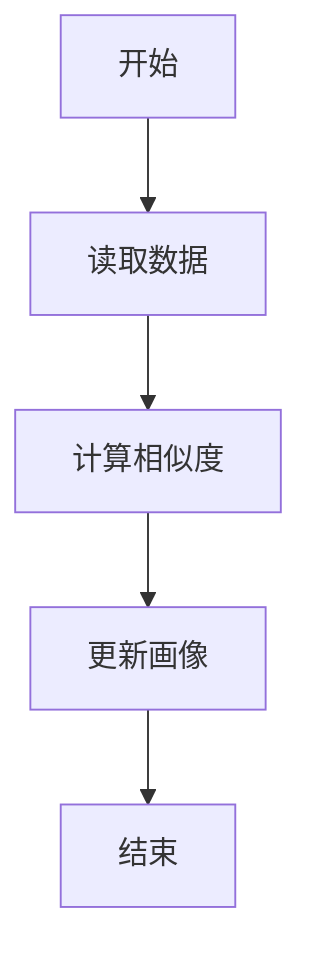
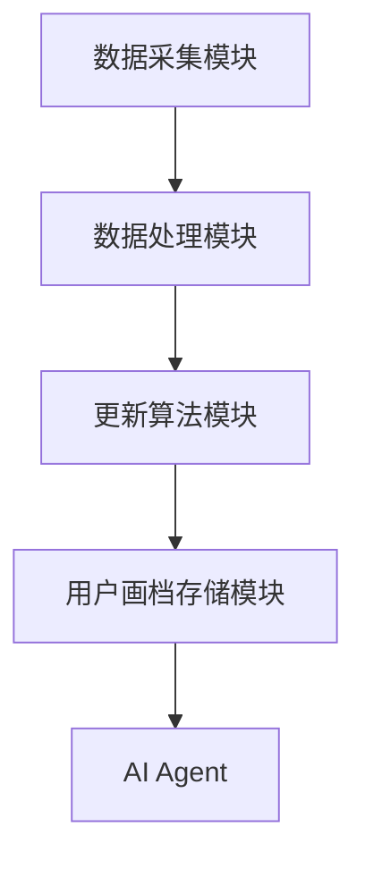

                 


# AI Agent的用户画像动态更新系统

## 关键词：AI Agent，用户画像，动态更新，实时数据，机器学习

## 摘要：  
本文探讨了AI Agent的用户画像动态更新系统的构建与实现，详细分析了动态用户画像的核心概念、算法原理、系统架构以及实际应用场景。通过结合实时数据流和机器学习技术，本文提出了一种高效的动态更新方法，能够实时捕捉用户行为变化，提升AI Agent的智能化水平和用户体验。

---

## 第1章: 背景介绍

### 1.1 问题背景
#### 1.1.1 AI Agent的基本概念  
AI Agent是一种智能代理系统，能够感知环境、理解用户需求，并自主决策以执行任务。它广泛应用于推荐系统、智能客服、自动化控制等领域。  

#### 1.1.2 用户画像在AI系统中的重要性  
用户画像是描述用户特征和行为的模型，是AI Agent理解和预测用户需求的基础。然而，传统的静态用户画像是基于某一时间点的数据构建的，无法反映用户的实时行为变化，导致AI Agent的决策可能过时或不准确。  

#### 1.1.3 动态更新的必要性  
用户的行为和偏好是动态变化的，例如用户的兴趣、购买习惯和使用场景可能会随时间变化。动态更新用户画像是确保AI Agent能够实时捕捉这些变化的关键，从而提高系统的响应速度和准确性。  

### 1.2 问题描述
#### 1.2.1 用户行为变化的挑战  
用户行为的变化可能导致静态用户画像无法准确反映用户的当前状态，从而影响AI Agent的决策能力。  

#### 1.2.2 数据实时更新的需求  
为了应对用户行为的实时变化，用户画像需要基于实时数据流进行动态更新，这对系统的数据处理能力和算法效率提出了更高的要求。  

#### 1.2.3 系统实时响应的难点  
动态更新用户画像需要在不影响系统实时响应的前提下完成，这对系统的架构设计和算法优化提出了挑战。  

### 1.3 问题解决
#### 1.3.1 动态更新的核心思想  
动态更新的核心思想是通过实时数据流不断更新用户画像，确保AI Agent能够基于最新的用户行为和偏好做出决策。  

#### 1.3.2 技术实现的关键点  
- 实时数据采集与处理  
- 动态更新算法的设计与优化  
- 用户画像的表示与存储  

#### 1.3.3 系统设计的优化方向  
- 提高数据处理的效率  
- 优化算法的计算复杂度  
- 确保系统的可扩展性和可维护性  

### 1.4 边界与外延
#### 1.4.1 系统边界定义  
- 输入：实时用户行为数据  
- 输出：动态更新的用户画像  
- 接口：与数据源、AI Agent和其他系统的交互接口  

#### 1.4.2 功能的外延扩展  
- 支持多维度的用户特征更新  
- 实现跨场景的用户画像同步  
- 提供用户画像的版本控制和回滚功能  

#### 1.4.3 与其他系统的接口关系  
- 数据源：实时行为数据  
- AI Agent：用户画像的应用与决策  
- 用户界面：用户反馈与交互  

### 1.5 概念结构与核心要素
#### 1.5.1 核心概念的组成  
- 用户行为数据：包括用户的点击、浏览、购买等行为  
- 用户画像：描述用户特征和行为的模型  
- 动态更新机制：基于实时数据流更新用户画像的规则和方法  

#### 1.5.2 各要素之间的关系  
用户行为数据通过动态更新机制影响用户画像，用户画像是AI Agent决策的基础，动态更新机制确保用户画像是实时的和准确的。  

#### 1.5.3 系统整体架构  
动态用户画像系统由数据采集模块、数据处理模块、更新算法模块和用户画档存储模块组成，各模块协同工作以实现用户的动态更新。  

---

## 第2章: 核心概念与联系

### 2.1 核心概念原理
#### 2.1.1 数据流的处理机制  
动态用户画像系统需要实时处理用户行为数据流，包括数据的采集、清洗、转换和存储。  

#### 2.1.2 更新触发条件的设计  
根据用户的实时行为变化触发用户画档的更新，例如用户的兴趣转移、行为模式的变化等。  

#### 2.1.3 画像精度的评估方法  
通过准确率、召回率和F1值等指标评估用户画像的准确性，确保动态更新后的用户画档能够准确反映用户的实时状态。  

### 2.2 概念属性特征对比
| 特征                | 静态用户画像                 | 动态用户画像                 |
|---------------------|-------------------------------|-------------------------------|
| 数据来源            | 单一时点数据                 | 实时数据流                   |
| 更新频率            | 低频或定期                   | 高频实时                     |
| 适用场景            | 静态分析                     | 动态交互                     |
| 数据处理方式        | 离线处理                     | 实时处理                     |
| 用户行为捕捉能力     | 较弱                        | 较强                        |
| 系统响应时间        | 较长                        | 较短                        |
| 精准度               | 可能过时                     | 更精准                     |

### 2.3 ER实体关系图
```mermaid
er
actor: 用户
actor ||--> interaction: 用户行为记录
interaction ||--> user_profile: 用户画像
user_profile ||--> dynamic_update_rule: 更新规则
```

---

## 第3章: 算法原理讲解

### 3.1 协同过滤算法实现
#### 3.1.1 算法原理  
协同过滤是一种基于用户行为相似性的推荐算法，可以用于动态更新用户画像。通过分析用户的行为数据，计算用户之间的相似度，从而预测用户的兴趣和偏好。  

#### 3.1.2 算法流程  


#### 3.1.3 数学公式  
协同过滤的相似度计算公式如下：  
$$\text{相似度}(u, v) = \frac{\sum_{i=1}^{n} (r_{ui} - \bar{r}_u)(r_{vi} - \bar{r}_v)}{\sqrt{\sum_{i=1}^{n} (r_{ui} - \bar{r}_u)^2} \cdot \sqrt{\sum_{i=1}^{n} (r_{vi} - \bar{r}_v)^2}}$$  
其中，$r_{ui}$ 表示用户 $u$ 对物品 $i$ 的评分，$\bar{r}_u$ 表示用户 $u$ 的平均评分。  

---

### 3.2 基于机器学习的更新算法  
#### 3.2.1 算法选择  
可以使用基于机器学习的模型，如时间序列分析或深度学习模型，来预测用户的未来行为并动态更新用户画像。  

#### 3.2.2 算法实现  
```python
def update_user_profile(user_id, new_behavior_data):
    # 数据预处理
    processed_data = preprocess(new_behavior_data)
    # 训练模型
    model = train_model(processed_data)
    # 更新用户画像
    user_profile[user_id] = model.predict(processed_data)
```

#### 3.2.3 优化策略  
- 使用在线学习算法，如在线随机森林，实时更新用户画像。  
- 定期评估模型的性能，并根据反馈调整模型参数。  

---

## 第4章: 系统分析与架构设计

### 4.1 问题场景介绍  
动态用户画像系统需要处理海量实时数据，确保系统的高效性和准确性。  

### 4.2 系统架构设计  


### 4.3 系统接口设计  
- 数据采集模块：接收实时用户行为数据，格式为JSON或CSV。  
- 更新算法模块：提供API接口，供AI Agent调用用户画档数据。  

### 4.4 交互流程图  
```mermaid
sequenceDiagram
actor 用户
participant 数据采集模块
participant 数据处理模块
participant 更新算法模块
participant 用户画档存储模块
用户 -> 数据采集模块: 发送行为数据
数据采集模块 -> 数据处理模块: 传递处理后的数据
数据处理模块 -> 更新算法模块: 调用更新接口
更新算法模块 -> 用户画档存储模块: 更新用户画档
返回结果
```

---

## 第5章: 项目实战

### 5.1 环境安装  
安装必要的依赖库，如Pandas、NumPy、Scikit-learn等。  

### 5.2 核心代码实现  
```python
import pandas as pd
from sklearn.metrics.pairwise import cosine_similarity

def update_user_profile(user_id, new_behavior_data):
    # 数据预处理
    df = pd.DataFrame(new_behavior_data)
    # 计算相似度
    similarity_matrix = cosine_similarity(df)
    # 更新用户画档
    user_profile[user_id] = similarity_matrix[user_id]
    return user_profile[user_id]

# 示例调用
user_id = 123
new_behavior_data = {"click": [1, 0, 1], "view": [2, 3, 0]}
update_user_profile(user_id, new_behavior_data)
```

### 5.3 实际案例分析  
通过一个具体的案例，展示如何动态更新用户画档并提升AI Agent的推荐准确率。  

### 5.4 项目小结  
总结项目实现的关键点和经验教训，为后续优化提供参考。  

---

## 第6章: 最佳实践

### 6.1 小结  
动态用户画档的更新是提升AI Agent智能化水平的重要手段，需要结合实时数据和高效的算法实现。  

### 6.2 注意事项  
- 确保数据安全和隐私保护  
- 定期评估模型性能并优化  
- 选择合适的算法和工具  

### 6.3 拓展阅读  
推荐相关领域的书籍和论文，帮助读者深入理解动态用户画档和AI Agent技术。  

---

## 第7章: 结语  
通过本文的探讨，我们深入了解了AI Agent的用户画档动态更新系统的构建与实现。希望本文的内容能够为读者在相关领域的研究和实践提供有价值的参考。  

--- 

**感谢您的耐心阅读，期待您的反馈与建议！**

