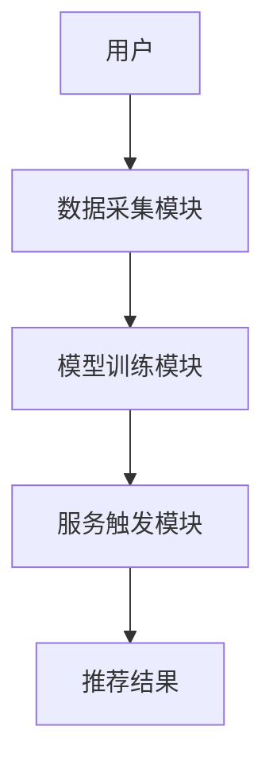
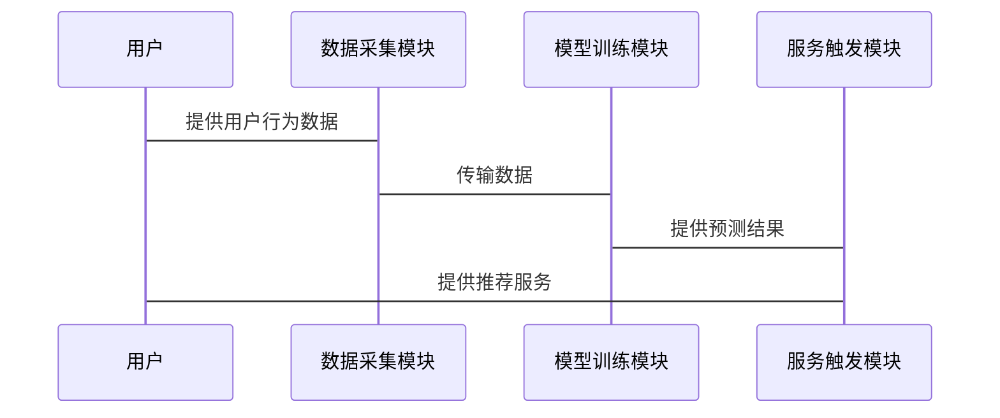

                 


# AI Agent的用户需求预测与主动服务

> 关键词：AI Agent, 用户需求预测, 主动服务, 机器学习, 系统架构, 用户行为分析

> 摘要：本文详细探讨了AI Agent在用户需求预测与主动服务中的应用，从基本概念到技术原理，再到系统架构和项目实战，全面解析了如何通过AI技术实现智能化服务。

---

## 第一部分: AI Agent的背景与概念

### 第1章: AI Agent的定义与背景

#### 1.1 AI Agent的基本概念
##### 1.1.1 AI Agent的定义
AI Agent（人工智能代理）是指能够感知环境、自主决策并执行任务的智能实体。它能够通过传感器获取信息，利用算法进行分析，并通过执行器与环境互动。

##### 1.1.2 AI Agent的核心特征
- **自主性**：能够在没有外部干预的情况下独立运行。
- **反应性**：能够实时感知环境变化并做出响应。
- **主动性**：能够主动预测用户需求并提供服务。
- **学习能力**：能够通过数据和经验不断优化自身行为。

##### 1.1.3 AI Agent的应用场景
- **电子商务**：推荐商品、个性化服务。
- **智能助手**：如Siri、Alexa，提供语音交互和任务管理。
- **工业自动化**：智能机器人在生产线上的应用。

#### 1.2 AI Agent的发展历程
AI Agent的概念起源于专家系统，随着机器学习和自然语言处理技术的进步，AI Agent逐渐从简单规则驱动的系统发展为基于深度学习的智能实体。

---

### 第2章: 用户需求预测与主动服务的背景

#### 2.1 用户需求预测的重要性
##### 2.1.1 用户需求预测的定义
用户需求预测是指通过分析用户的行为、偏好和历史数据，预测用户未来可能的需求或行为。

##### 2.1.2 用户需求预测的挑战
- 数据获取难度：用户行为数据的隐私保护和采集成本。
- 模型准确性：如何提高预测模型的准确性和实时性。

#### 2.2 主动服务的核心理念
##### 2.2.1 主动服务的定义
主动服务是指系统在用户提出请求之前，主动提供用户可能需要的服务或信息。

##### 2.2.2 主动服务的优势
- **提升用户体验**：用户无需主动搜索，服务主动推送。
- **提高服务效率**：通过预测和主动服务，减少用户等待时间。

---

### 第3章: AI Agent与用户需求预测的关系

#### 3.1 AI Agent在需求预测中的作用
##### 3.1.1 数据采集与分析
- **用户行为数据**：包括点击、浏览、购买记录等。
- **数据预处理**：去重、归一化、特征提取。

##### 3.1.2 模型训练与优化
- **协同过滤**：基于用户行为的相似性推荐。
- **聚类分析**：将用户分为不同的群体，进行针对性推荐。

#### 3.2 AI Agent主动服务的实现路径
##### 3.2.1 需求预测的算法实现
- **协同过滤算法**：基于用户的相似性推荐。
- **深度学习模型**：如神经网络推荐模型。

##### 3.2.2 服务触发机制
- **阈值触发**：当预测置信度超过一定阈值时触发服务。
- **实时反馈触发**：根据用户的实时行为调整服务策略。

---

## 第二部分: AI Agent的核心概念与技术原理

### 第4章: AI Agent的核心概念与技术原理

#### 4.1 AI Agent的核心概念
##### 4.1.1 数据流分析
- **输入数据**：用户行为数据、环境信息。
- **处理过程**：数据预处理、特征提取、模型训练。
- **输出结果**：预测结果、服务触发信号。

##### 4.1.2 核心算法
- **协同过滤算法**：基于用户行为的相似性推荐。
- **深度学习模型**：如神经网络、LSTM等。

#### 4.2 用户需求预测的数学模型
##### 4.2.1 协同过滤模型
- **基于用户的协同过滤**：通过用户相似性进行推荐。
- **基于物品的协同过滤**：通过物品相似性进行推荐。

##### 4.2.2 深度学习模型
- **神经网络推荐模型**：利用神经网络进行特征提取和预测。
- **LSTM模型**：用于时间序列数据的预测。

#### 4.3 系统架构设计
##### 4.3.1 系统功能模块
- **数据采集模块**：采集用户行为数据。
- **模型训练模块**：训练预测模型。
- **服务触发模块**：根据预测结果触发服务。

##### 4.3.2 系统交互流程
- **用户输入**：用户行为数据。
- **数据处理**：数据预处理和特征提取。
- **模型预测**：预测用户需求。
- **服务触发**：根据预测结果提供服务。

---

### 第5章: 算法原理与实现

#### 5.1 协同过滤算法
##### 5.1.1 协同过滤的实现步骤
1. 数据预处理：清洗数据、填充缺失值。
2. 特征提取：提取用户行为特征。
3. 模型训练：计算用户相似度或物品相似度。
4. 预测与推荐：基于相似度进行推荐。

##### 5.1.2 协同过滤的代码实现
```python
import numpy as np
from sklearn.metrics.pairwise import cosine_similarity

# 示例数据：用户-物品评分矩阵
user_item_matrix = np.array([[4, 3, 0], [2, 0, 4], [5, 1, 0]])

# 计算余弦相似度
similarity = cosine_similarity(user_item_matrix)
```

#### 5.2 深度学习模型
##### 5.2.1 神经网络推荐模型
- **输入层**：用户行为特征。
- **隐层**：进行特征提取和变换。
- **输出层**：预测用户需求的概率。

##### 5.2.2 模型训练代码
```python
import tensorflow as tf
from tensorflow.keras import layers

model = tf.keras.Sequential([
    layers.Dense(64, activation='relu'),
    layers.Dense(1, activation='sigmoid')
])

model.compile(optimizer='adam', loss='binary_crossentropy', metrics=['accuracy'])
model.fit(x_train, y_train, epochs=10, batch_size=32)
```

---

## 第三部分: 系统分析与架构设计

### 第6章: 系统分析与架构设计

#### 6.1 问题场景介绍
##### 6.1.1 需求预测场景
- 用户行为分析：用户在电商平台上的浏览、点击、购买行为。
- 预测目标：预测用户可能感兴趣的商品。

#### 6.1.2 系统功能设计
- **数据采集模块**：采集用户行为数据。
- **模型训练模块**：训练需求预测模型。
- **服务触发模块**：根据预测结果触发推荐服务。

#### 6.2 系统架构设计
##### 6.2.1 系统架构图


##### 6.2.2 系统交互流程


---

## 第四部分: 项目实战

### 第7章: 项目实战

#### 7.1 环境安装与配置
##### 7.1.1 安装依赖
- Python 3.8+
- TensorFlow 2.0+
- scikit-learn 0.24+

##### 7.1.2 环境配置
```bash
pip install numpy scikit-learn tensorflow
```

#### 7.2 系统核心实现
##### 7.2.1 数据采集模块
```python
import pandas as pd

# 示例数据：用户行为数据
data = {
    'user_id': [1, 2, 3],
    'item_id': [101, 102, 103],
    'behavior': ['click', 'click', 'purchase']
}

df = pd.DataFrame(data)
```

##### 7.2.2 模型训练模块
```python
from sklearn.model_selection import train_test_split
from sklearn.neighbors import NearestNeighbors

# 数据分割
X_train, X_test = train_test_split(df, test_size=0.2)

# 协同过滤模型训练
model = NearestNeighbors(n_neighbors=5)
model.fit(X_train)
```

##### 7.2.3 服务触发模块
```python
# 根据模型预测结果触发服务
def trigger_service(predicted_items):
    for item in predicted_items:
        print(f"推荐商品：{item}")

# 示例调用
trigger_service([104, 105])
```

#### 7.3 项目小结
通过项目实战，我们实现了从数据采集、模型训练到服务触发的完整流程。协同过滤算法在推荐系统中表现良好，但仍需进一步优化模型以提高预测准确性。

---

## 第五部分: 最佳实践与总结

### 第8章: 最佳实践

#### 8.1 小结
本文详细介绍了AI Agent在用户需求预测与主动服务中的应用，从基本概念到技术原理，再到系统架构和项目实战，全面解析了如何通过AI技术实现智能化服务。

#### 8.2 注意事项
- 数据隐私保护：在采集和使用用户数据时，需遵守相关法律法规。
- 模型优化：持续优化模型以提高预测准确性和实时性。

#### 8.3 拓展阅读
- 《推荐系统实战》：深入讲解推荐系统的实现与优化。
- 《深度学习实战》：学习深度学习在需求预测中的应用。

---

通过本文的学习，读者可以全面理解AI Agent在用户需求预测与主动服务中的应用，掌握相关技术的核心原理和实现方法。

