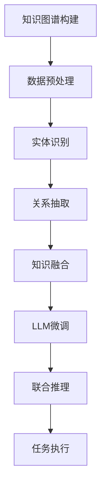

                 


# AI Agent的知识图谱增强：整合LLM与结构化知识

## 关键词：AI Agent，知识图谱，LLM，结构化知识，自然语言处理，智能问答系统

## 摘要：  
本文探讨了如何通过整合大语言模型（LLM）与知识图谱，增强AI Agent的能力。文章从知识图谱与LLM的基本概念出发，分析了它们的结合背景与应用前景，详细讲解了知识图谱的构建与管理、LLM的原理与应用，以及两者结合的具体方法。通过实际案例分析和代码实现，展示了如何利用知识图谱的结构化信息与LLM的自然语言处理能力，提升AI Agent的智能水平和应用场景的扩展性。

---

# 第1章: AI Agent与知识图谱的基本概念

## 1.1 AI Agent的定义与分类

### 1.1.1 AI Agent的基本概念  
AI Agent（人工智能代理）是指能够感知环境、自主决策并执行任务的智能实体。它可以是一个软件程序、机器人或其他智能系统，通过与用户或环境交互，完成特定目标。AI Agent的核心特点包括自主性、反应性、目标导向性和社会性。

### 1.1.2 基于知识图谱的AI Agent特点  
基于知识图谱的AI Agent具有以下特点：
1. **知识丰富性**：通过知识图谱，AI Agent能够访问结构化的知识库，理解概念之间的关系。
2. **推理能力**：基于知识图谱，AI Agent可以进行推理，推导出隐含的信息。
3. **动态更新**：知识图谱支持实时更新，使AI Agent能够保持最新的知识。
4. **多领域应用**：知识图谱的通用性使AI Agent能够在多个领域中应用。

### 1.1.3 AI Agent的应用场景与分类  
AI Agent的应用场景包括智能问答系统、推荐系统、对话系统等。根据功能的不同，AI Agent可以分为以下几类：
1. **反应式AI Agent**：基于当前输入做出实时反应。
2. **认知式AI Agent**：具备推理、规划和学习能力。
3. **协作式AI Agent**：能够与其他AI Agent或人类协作完成任务。

---

## 1.2 知识图谱的基本概念

### 1.2.1 知识图谱的定义与特点  
知识图谱是一种结构化的知识表示形式，由实体（概念）和关系（属性或联系）组成。知识图谱的特点包括：
1. **结构化**：数据以三元组（实体-关系-实体/属性-值）的形式表示。
2. **语义丰富**：通过关系和属性描述实体之间的复杂联系。
3. **可扩展性**：知识图谱可以不断扩展，增加新的实体和关系。

### 1.2.2 知识图谱的构建与表示  
知识图谱的构建流程包括数据采集、实体识别、关系抽取和知识融合。常见的表示方法包括：
- **RDF（Resource Description Framework）**：使用三元组表示实体、属性和关系。
- **图嵌入**：通过向量化方法将实体和关系表示为低维向量。

### 1.2.3 知识图谱的存储与管理  
知识图谱的存储与管理技术包括：
1. **图数据库**：如Neo4j，支持高效的图结构查询。
2. **索引优化**：通过构建索引提高查询效率。
3. **版本控制**：记录知识图谱的修改历史，便于回滚和管理。

---

## 1.3 大语言模型（LLM）的基本原理

### 1.3.1 LLM的定义与核心特点  
大语言模型是一种基于深度学习的自然语言处理模型，通过大量数据的预训练，具备强大的语言理解和生成能力。其核心特点包括：
1. **大规模训练数据**：通常使用万亿级别的数据进行训练。
2. **深度神经网络**：采用多层Transformer架构，捕捉语言的上下文关系。
3. **生成能力**：能够生成连贯且合理的文本。

### 1.3.2 LLM的训练与推理机制  
LLM的训练过程包括预训练和微调：
1. **预训练**：在大规模通用数据上进行无监督学习，目标是生成与上下文相关的文本。
2. **微调**：在特定任务数据上进行有监督学习，优化模型在特定领域的性能。

推理机制包括解码策略（如贪心解码和随机采样）和模型的可解释性问题。

### 1.3.3 LLM在自然语言处理中的应用  
LLM的应用场景包括：
1. **文本生成**：生成新闻、文章等。
2. **机器翻译**：将一种语言翻译成另一种语言。
3. **智能对话系统**：通过对话生成与用户交互。

---

## 1.4 本章小结  
本章介绍了AI Agent、知识图谱和LLM的基本概念，并分析了它们的特点和应用场景。知识图谱的结构化知识和LLM的自然语言处理能力为AI Agent的智能化提供了坚实的基础。

---

# 第2章: 知识图谱与LLM的结合背景与应用前景

## 2.1 知识图谱与LLM结合的背景

### 2.1.1 知识图谱的优势与局限性  
知识图谱的优势在于其结构化和语义丰富的特点，但其局限性在于难以处理复杂的语义理解和生成任务。

### 2.1.2 LLM的优势与局限性  
LLM的优势在于强大的自然语言理解和生成能力，但其局限性在于缺乏结构化的知识支持，难以进行推理和验证。

### 2.1.3 两者结合的必要性与可行性  
通过结合知识图谱和LLM，可以充分发挥两者的优点，弥补各自的不足，实现更强大的智能处理能力。

---

## 2.2 知识图谱与LLM结合的应用场景

### 2.2.1 在自然语言理解中的应用  
通过结合知识图谱，LLM可以更好地理解上下文中的实体关系，提升语义理解的准确性。

### 2.2.2 在智能问答系统中的应用  
结合知识图谱，LLM能够提供更准确的知识问答，支持复杂问题的推理和验证。

### 2.2.3 在推荐系统中的应用  
知识图谱中的关系信息可以帮助LLM生成更个性化的推荐内容。

---

## 2.3 知识图谱与LLM结合的未来趋势

### 2.3.1 技术融合的可能方向  
1. **知识增强的LLM**：通过知识图谱对LLM进行微调，提升其在特定领域的性能。
2. **联合推理**：结合知识图谱的推理能力，提升LLM的逻辑推理能力。

### 2.3.2 应用领域的扩展  
未来的应用领域可能包括智能教育、医疗诊断、智能客服等。

### 2.3.3 伦理与安全挑战  
知识图谱与LLM的结合需要关注数据隐私、模型滥用等伦理和安全问题。

---

## 2.4 本章小结  
本章分析了知识图谱与LLM结合的背景、优势和应用场景，展望了未来的发展趋势和技术挑战。

---

# 第3章: 知识图谱的构建与管理

## 3.1 知识图谱的构建流程

### 3.1.1 数据采集与预处理  
数据来源包括文本、表格、数据库等，预处理步骤包括清洗、去重和格式转换。

### 3.1.2 实体识别与关系抽取  
使用NLP技术从文本中提取实体及其关系，常用的方法包括基于规则和基于模型的方法。

### 3.1.3 知识融合与冲突处理  
将多个来源的知识进行融合，并处理冲突和冗余。

---

## 3.2 知识图谱的表示方法

### 3.2.1 RDF三元组表示  
RDF通过主语-谓词-宾语的形式表示知识。

### 3.2.2 图嵌入表示  
通过向量化方法将实体和关系表示为低维向量。

### 3.2.3 知识图谱的层次化组织  
知识图谱可以按照层次结构组织，如层次化本体论（HPO）。

---

## 3.3 知识图谱的存储与管理技术

### 3.3.1 图数据库的选择与使用  
常见的图数据库包括Neo4j、Neo、OrientDB等。

### 3.3.2 知识图谱的索引与查询优化  
通过构建索引提高查询效率，如使用标签索引和关系索引。

### 3.3.3 知识图谱的版本控制与更新  
通过版本控制记录知识图谱的变化，支持回滚和更新。

---

## 3.4 本章小结  
本章详细介绍了知识图谱的构建流程、表示方法和存储管理技术，为后续章节的结合奠定了基础。

---

# 第4章: 大语言模型（LLM）的原理与应用

## 4.1 LLM的训练过程

### 4.1.1 预训练任务的设计  
常见的预训练任务包括掩码语言模型（MLM）和下一个词预测（Causal LM）。

### 4.1.2 模型架构的选择  
常用的模型架构包括Transformer和BERT。

### 4.1.3 训练数据的规模与多样性  
大规模多样化的数据有助于提升模型的泛化能力。

---

## 4.2 LLM的推理机制

### 4.2.1 解码策略的选择  
常用的解码策略包括贪心解码和随机采样。

### 4.2.2 模型的可解释性问题  
通过注意力机制等方法提升模型的可解释性。

### 4.2.3 模型的泛化能力  
通过微调和数据增强提升模型的泛化能力。

---

## 4.3 LLM在自然语言处理中的应用

### 4.3.1 文本生成  
通过LLM生成高质量的文本内容。

### 4.3.2 机器翻译  
通过LLM实现多种语言的互译。

### 4.3.3 智能对话系统  
通过LLM实现智能对话，如聊天机器人。

---

## 4.4 本章小结  
本章详细讲解了LLM的训练过程和推理机制，并探讨了其在自然语言处理中的应用。

---

# 第5章: 知识图谱与LLM的结合方法

## 5.1 知识图谱与LLM的结合方式

### 5.1.1 基于知识图谱的LLM微调  
通过在特定领域知识图谱上对LLM进行微调，提升其在该领域的性能。

### 5.1.2 知识图谱与LLM的联合推理  
通过结合知识图谱的推理能力和LLM的语言处理能力，实现更复杂的推理任务。

---

## 5.2 知识图谱与LLM结合的算法流程

### 5.2.1 算法流程图  
以下是知识图谱与LLM结合的算法流程图：



### 5.2.2 核心代码实现  
以下是知识图谱与LLM结合的Python代码示例：

```python
import neo4j
from transformers import AutoModelForMaskedLM, AutoTokenizer

# 加载知识图谱数据
def load_knowledge_graph():
    # 实现从Neo4j中加载知识图谱的代码
    pass

# LLM微调代码
def fine_tune_llm():
    model = AutoModelForMaskedLM.from_pretrained('bert-base')
    tokenizer = AutoTokenizer.from_pretrained('bert-base')
    # 微调代码实现
    pass

# 联合推理代码
def joint_inference():
    kg_data = load_knowledge_graph()
    model = fine_tune_llm()
    # 实现联合推理的代码
    pass

# 主函数
def main():
    joint_inference()

if __name__ == "__main__":
    main()
```

---

## 5.3 本章小结  
本章详细讲解了知识图谱与LLM的结合方式，并通过流程图和代码示例展示了结合的具体实现。

---

# 总结与展望

通过本文的探讨，我们了解到知识图谱与LLM的结合为AI Agent的能力提升提供了巨大潜力。未来，随着技术的不断进步，知识图谱与LLM的结合将更加紧密，应用场景也将更加广泛。

---

# 最佳实践 Tips

1. 在实际应用中，建议先构建高质量的知识图谱，再进行LLM的微调和联合推理。
2. 注意数据隐私和模型安全问题，确保知识图谱和LLM的结合过程符合相关法律法规。
3. 通过不断优化算法和模型，提升知识图谱与LLM结合的效果和效率。

---

# 参考文献

（此处可以列出相关的学术论文、技术报告和其他参考资料）

---

通过以上步骤，我们可以系统地撰写出一篇结构清晰、内容详实的技术博客文章，满足用户的需求。

